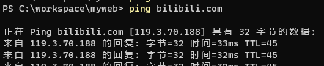

## 1. 概述

OpenVPN 是一个开源的 VPN（虚拟专用网络）实现，用于创建安全的点对点或站点对站点连接。它使用自定义安全协议，该协议基于 SSL/TLS 协议进行加密和身份验证。OpenVPN 允许参与建立 VPN 的计算机在共享网络或公共互联网等不安全的网络上通过加密隧道进行安全通信。

## 2. 基本架构

OpenVPN 采用客户端/服务器架构，主要由以下组件构成：

- **OpenVPN 服务器**：接受来自多个客户端的连接，负责管理 VPN 网络
- **OpenVPN 客户端**：连接到 OpenVPN 服务器，通过服务器访问资源
- **虚拟网卡**：TUN/TAP 设备，用于创建虚拟网络接口
  - **TUN**：在 OSI 第 3 层(网络层)操作，传输 IP 数据包
  - **TAP**：在 OSI 第 2 层(数据链路层)操作，传输以太网帧

## 3. 工作原理

### 3.1 隧道建立过程

1. **初始连接**：
   - 客户端发起连接请求到服务器的指定端口(默认为 UDP 1194)
   - 客户端和服务器建立控制通道

2. **TLS 握手**：
   - 使用 SSL/TLS 协议进行双向认证
   - 服务器向客户端提供证书，客户端验证服务器身份
   - 客户端向服务器提供证书，服务器验证客户端身份
   - 生成会话密钥用于数据加密

3. **密钥交换**：
   - 协商加密算法和参数
   - 生成用于加密数据通道的共享密钥

4. **建立数据通道**：
   - 创建虚拟网络接口(TUN/TAP)
   - 分配 VPN IP 地址
   - 设置路由表

5. **数据传输**：
   - 普通数据包通过虚拟接口发送
   - 数据被加密并封装到 UDP 或 TCP 数据包中
   - 数据通过公共网络传输
   - 接收方解密数据并传递到目标

### 3.2 数据封装

OpenVPN 数据封装过程如下：

1. 应用程序生成数据包
2. 数据包被路由到虚拟 TUN/TAP 接口
3. OpenVPN 对数据包进行加密
4. 加密后的数据被封装到 UDP 或 TCP 包中
5. 封装后的数据通过实际物理接口发送
6. 接收方解封装并解密数据
7. 解密后的数据从虚拟接口发送到内部网络


# 配置文件技巧
## 路由

在 OpenVPN 客户端配置文件中，可以插入以下路由规则以实现特定目标 IP 的流量通过默认网关转发：

```
# bilibili
route 119.3.70.188 255.255.255.255 net_gateway
# baidu
route 39.156.66.10 255.255.255.255 net_gateway
```

### 格式说明

```
route [目标IP] [子网掩码] [网关]
```


- **目标IP**：指定需要路由的目标地址。可通过ping 网址得到.
  


- **子网掩码**：定义目标地址的子网范围，通常为 `255.255.255.255` 表示单个 IP。
- **网关**：指定流量的出口网关，`net_gateway` 表示使用默认网关。

通过上述配置，可以确保特定流量绕过 VPN 隧道，直接通过本地网络访问目标地址。

## 多人登录一个账号
在我们搭建完 OpenVPN 后，登录验证方式分为证书验证、账户验证、证书+账户。无论哪种，一个证书或账户只能同时登录一个终端。

如果团队有很多人，为每个人创建个账户还可以接受，如果用证书，为每个人创建一个证书管理起来就很混乱了，所以有没有方法，多人用一个证书，有人员变动的时候，吊销证书换一个新的，这样只用维护一个证书就可以了。

**操作**

我这里不再阐述如何安装 OpenVPN，只讲与本文相关的重要配置。


修改 OpenVPN 配置文件 `server.conf`，内容如下：


```
port 1194
proto udp
dev tun
ca ca.crt
cert server.crt
key server.key  # This file should be kept secret
dh dh.pem
server 10.8.0.0 255.255.255.0
ifconfig-pool-persist ipp.txt
push "route 172.16.1.0 255.255.255.0"
keepalive 10 120
cipher AES-256-CBC
persist-key
persist-tun
status openvpn-status.log
verb 3
explicit-exit-notify 1
duplicate-cn
```

**`duplicate-cn`：** 这个字段就是开启一个证书或账户多人同时登录。

**解释：**

* **`duplicate-cn`**：这个配置项是实现单证书多人同时登录的关键。OpenVPN 默认情况下会阻止具有相同证书通用名称（CN）的多个客户端同时连接。启用此选项后，OpenVPN 允许具有相同 CN 的多个客户端同时连接。

**注意事项：**

* 安全性：使用单证书多人同时登录会降低安全性，因为所有用户共享同一个证书。如果证书泄露，所有用户的连接都可能受到威胁。因此，请务必妥善保管证书。
* 日志和监控：启用 `duplicate-cn` 后，监控和日志记录可能会变得更加复杂。您需要仔细考虑如何跟踪和管理多个使用相同证书的连接。
* 网络冲突：当多个客户端使用相同的虚拟 IP 地址时，可能会出现网络冲突。OpenVPN 的 `ifconfig-pool-persist` 选项可以帮助管理 IP 地址分配，但您仍然需要仔细规划您的 IP 地址空间。
* 证书吊销：当人员变动或者证书出现问题时，需要及时吊销证书，并重新生成新的证书，并分发给需要使用vpn的人员。


## OPENVPN 同时连接多个 VPN


**背景：** 当需要维护多个不同地点的网络的时候，经常需要频繁切换 VPN，效率极低。

**原因：** Windows 版 OpenVPN 客户端安装时默认只安装一个 TAP 虚拟网卡，如果需要同时连接多个，则需要为每个 VPN 配置文件配置一个 TAP 虚拟网卡。

**增加虚拟网卡：** 用管理员权限执行以下命令，即可增加一块 TAP 虚拟网卡，需要多块执行多次即可，然后在 ovpn 配置文件中增加 “nobind” 的配置项。

```bash
"C:\Program Files\TAP-Windows\bin\addtap.bat"
```
检查虚拟网卡：

```Bash
"C:\Program Files\OpenVPN\bin\openvpn" --show-adapters
```
当需要指定某个配置文件使用特定的虚拟网卡的时候可以将配置项设置如下：

dev tap
dev-node "以太网 3"

[妙妙屋](https://raw.githubusercontent.com/angristan/openvpn-install/master/openvpn-install.sh)