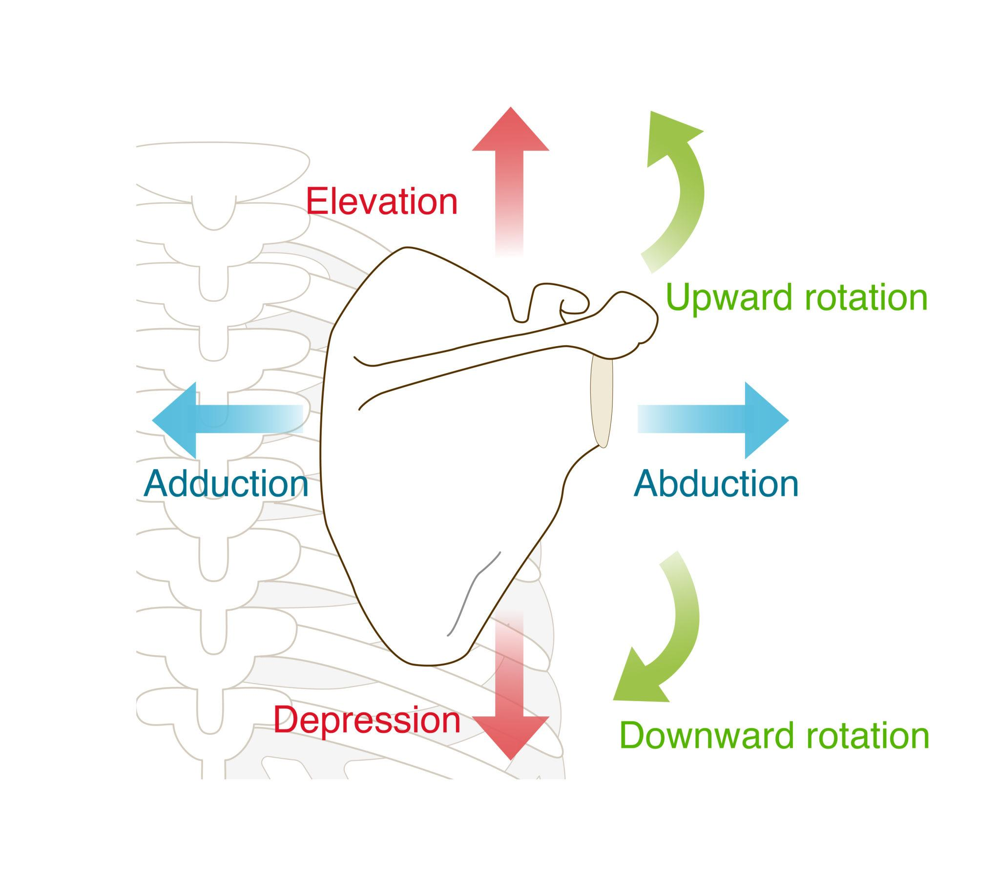
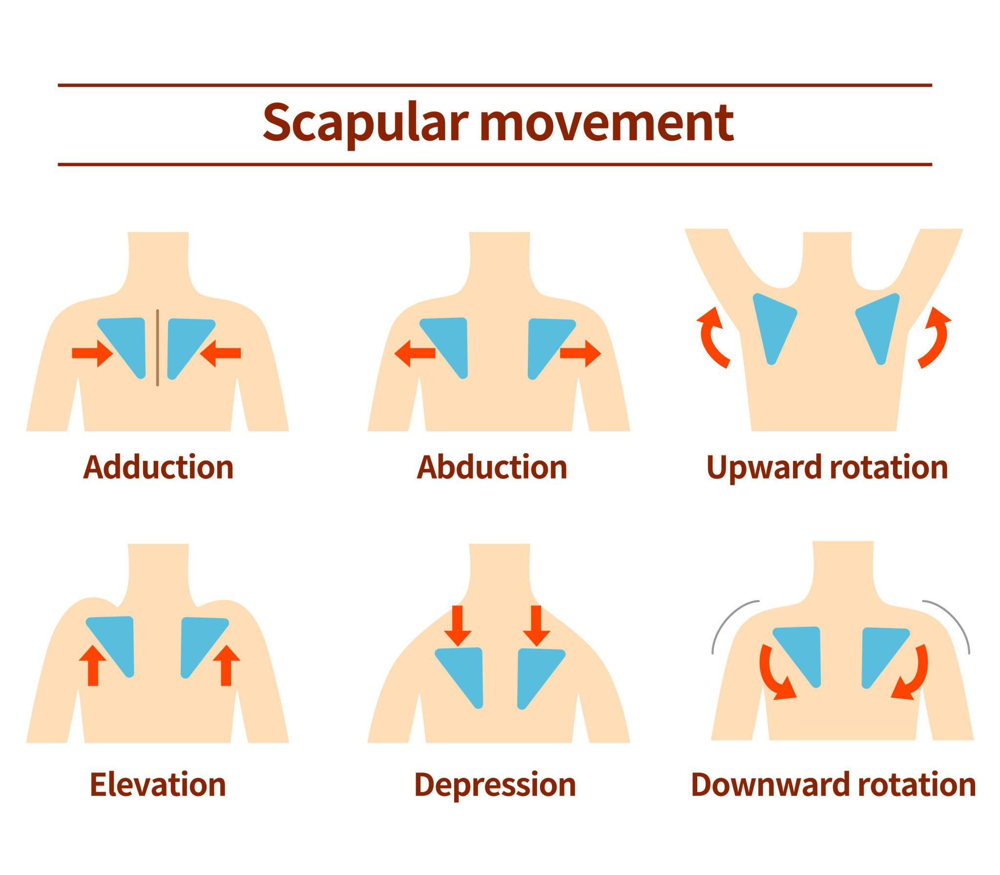
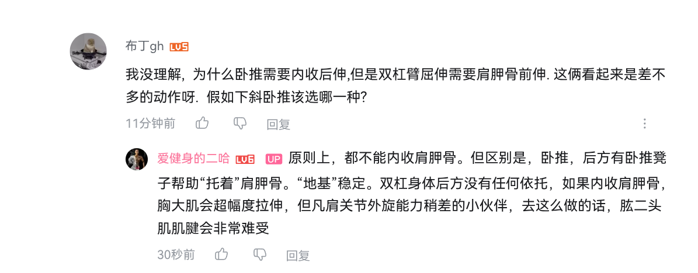

# 肩胛

## 肩胛功能

肩胛骨是连接上肢和躯干的重要骨骼结构，具有以下主要功能：
1. 支撑和连接：肩胛骨通过肩锁关节与锁骨连接，形成肩带，支撑上肢的重量并提供稳定的连接点。
2. 运动范围：肩胛骨允许肩关节进行广泛的运动，包括屈曲、伸展、内收、外展、旋转等，使得上肢能够进行各种复杂的动作。
3. 肌肉附着点：肩胛骨是多个重要肌肉的附着点，如斜方肌、菱形肌、肩胛提肌等，这些肌肉协同工作，控制肩胛骨的运动和稳定。
4. 保护作用：肩胛骨保护肩关节，防止外部伤害。

主要锻炼 上回旋, 下回旋, 内收, 外展, 提肩, 下沉, 前伸, 后伸等功能

肩胛-肱骨节律（Scapulohumeral rhythm）

简单讲：

抬手 180°
120° 来自肱骨
60° 来自肩胛上回旋

如果肩胛不动 → 肩袖爆炸。

## 肩胛锻炼

| 动作     | 主要肩胛功能   | 训练目的    |
| ------ | -------- | ------- |
| 泡沫轴开胸椎 | 改善后倾     | 解锁活动度   |
| 猫牛式    | 前倾/后倾切换  | 神经控制    |
| YTW    | 上回旋 + 后缩 | 中下斜方激活  |
| 肩胛俯卧撑  | 前伸（控制）   | 前锯肌     |
| 肩胛引体   | 下沉 + 后缩  | 下斜方     |
| 墙壁天使   | 上回旋 + 后倾 | 肩胛-肱骨节律 |
| 靠墙顶肘   | 上回旋控制    | 防止旋前    |

### 开胸椎

躺在泡沫轴上,伸展胸椎

### 猫牛式

### YTW

顺便拿杆子做下沉和下回旋

### 肩胛俯卧撑

冲肩, 肩胛外展多种模式

### 肩胛引体

### 墙壁天使

靠墙和面对墙两个版本

### 靠墙顶肘

脚离开墙壁半步,注意不要旋前. 

叶师傅 【跟练｜肩胛功能不好？感受不到肩胛骨？4min立马让你找回丢失的肩胛骨。】
 https://www.bilibili.com/video/BV134UDBmEEZ

## 疑惑

为什么卧推要内收肩胛骨, 而双杠臂屈伸需要前伸.

原则上，都不能内收肩胛骨。但区别是，卧推，后方有卧推凳子帮助“托着”肩胛骨。“地基”稳定。双杠身体后方没有任何依托，如果内收肩胛骨，胸大肌会超幅度拉伸，但凡肩关节外旋能力稍差的小伙伴，去这么做的话，肱二头肌肌腱会非常难受

