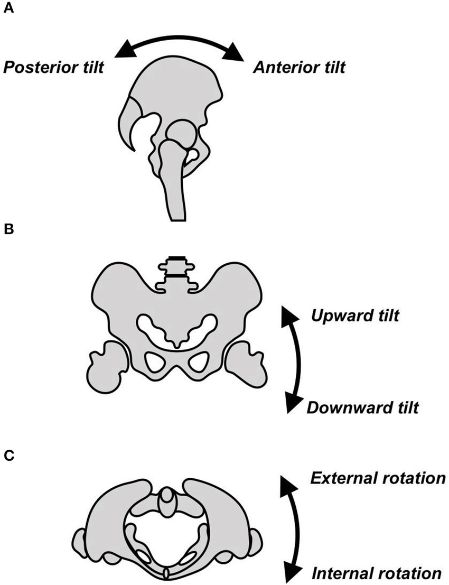

# 骨盆 Pelvis

骨盆是下肢与躯干之间的核心枢纽。
它的控制质量决定腰是否代偿、臀是否发力、核心是否稳定。

------------------------------------------------------------

# 一 骨盆功能

## 1 力量传导中心

- 连接脊柱与下肢
- 传递地面反作用力
- 是深蹲 硬拉 跑步的动力枢纽

## 2 腹压管理

骨盆与以下系统协同工作：

- 膈肌
- 腹横肌
- 多裂肌
- 骨盆底肌
- 臀肌群

本质是一个压力系统，而不是单块肌肉问题。

## 3 稳定与姿态控制

- 维持脊柱中立位
- 控制站姿与步态
- 防止腰椎代偿

------------------------------------------------------------

# 二 骨盆的基本运动

## 1 矢状面运动

- 前倾 anterior pelvic tilt
- 后倾 posterior pelvic tilt

## 2 冠状面运动

- 侧倾 lateral tilt

骨盆一高一低

## 3 水平面运动

- 旋转 pelvic rotation

骨盆一前一后

多数人只关注前倾，忽略侧倾与旋转失衡。

------------------------------------------------------------

# 三 骨盆相关肌群功能映射

髂腰肌
屈髋 加强骨盆前倾

股直肌
屈髋 加强前倾

竖脊肌
维持腰椎前凸 拉动前倾

腹直肌
拉动骨盆后倾

腹横肌
稳定骨盆和腹压

臀大肌
伸髋 参与骨盆后倾

臀中肌
抗侧倾 稳定单腿站立

内收肌
辅助骨盆稳定

------------------------------------------------------------

# 四 常见问题

## 1 骨盆前倾 下背紧张

形成链条

久坐
屈髋位时间过长
髂腰肌缩短
骨盆前倾
腰椎被动前凸
竖脊肌长期收缩
下背紧张

本质不是腰问题，而是髋与骨盆控制失衡。

## 2 骨盆侧倾

表现

- 单侧腰紧
- 单侧臀无力
- 站立重心偏移

常见原因

- 臀中肌弱
- 步态长期偏移

## 3 骨盆旋转

表现

- 一侧大腿前侧紧
- 深蹲左右感觉不同
- 长期单侧发力

------------------------------------------------------------

# 五 骨盆功能训练分类

## A 活动度恢复

- 髂腰肌拉伸 弓步位
- 股四头肌拉伸
- 猫牛式
- 90 90 髋旋转

目标是释放屈髋张力。

## B 后倾控制 抗前倾

仰卧骨盆后倾
要求下背贴地

臀桥
先做骨盆后倾 再抬髋
避免顶腰代偿

Dead bug
保持骨盆稳定不塌腰

Hollow hold
进阶核心稳定

## C 抗侧倾训练

- 侧桥
- 单腿臀桥
- 单腿罗马尼亚硬拉

目标是强化臀中肌。

## D 髋伸重建

- 罗马尼亚硬拉
- 臀推
- 壶铃摆动

目标是让臀主导发力，而不是腰代偿。

------------------------------------------------------------

# 六 骨盆 髋 脊柱节律

弯腰动作应以髋为主导，而不是腰椎主导。

正确模式

- 屁股向后坐
- 脊柱保持中立
- 不塌腰 不拱腰

------------------------------------------------------------

# 七 判断标准

正常骨盆不是完全后倾。

标准应是

- 能主动前倾
- 能主动后倾
- 能在运动中维持中立

问题不在于姿势，而在于控制能力。

------------------------------------------------------------

# 八 与肩胛的对应关系

上肢控制中心 肩胛
下肢控制中心 骨盆

肩胛前伸 对应 骨盆前倾
肩胛后缩 对应 骨盆后倾
肩胛上回旋 类似 髋屈
肩胛下沉 类似 髋伸

身体存在两个重要枢纽

肩胛控制上肢
骨盆控制下肢

------------------------------------------------------------

# 九 核心原则

不要只拉伸
必须重建主动控制
必须在负重中维持中立
久坐人群重点强化后倾与髋伸

------------------------------------------------------------

# 十 总结

骨盆不是一个角度问题。

它是压力管理 神经控制 力量传导的综合系统。

目标不是纠正姿势，而是恢复控制能力。
