<!-- markdownlint-disable -->

# 凯圣 髋部 

来源: <https://www.bilibili.com/opus/765415811475046404>

【功能性训练系列④】练完了等于换了个髋关节！蹲拉弹跳暴涨！20个技能包！髋关节功能性训练

一、髋关节功能不足的负面表现

1、足背屈受限

导致：弯腰（腰部前倾）代偿造成腰部压力，如深蹲时候过度前倾，下背压力增加

2、后侧链紧张/髂腰肌无力

导致： 屁股眨眼

01:48

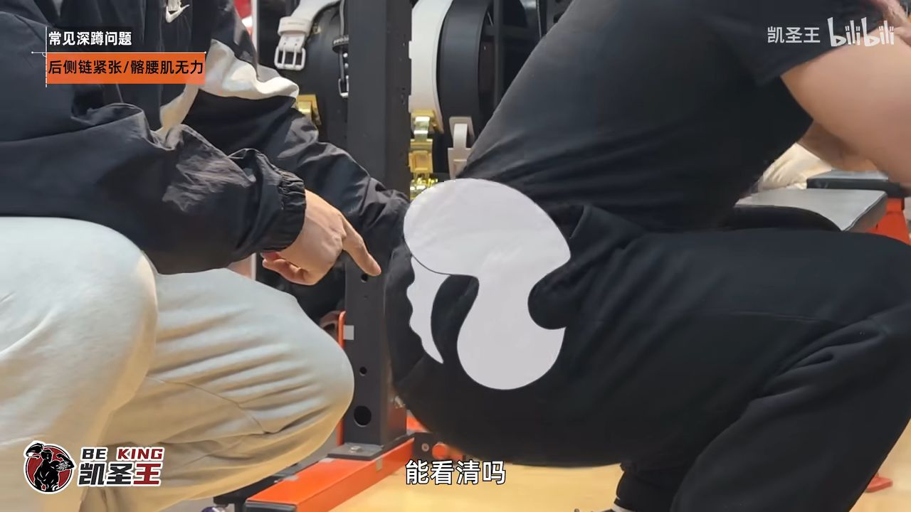

后侧柔韧性很差的情况下，会出现一个骨盆翻转

3、髋外展外旋受限

03:54

导致：膝内扣

髋部功能：前屈、后伸、外展、内收、外旋、内旋、环转

（1）髋部卡压：前屈受限

（2）腰椎代偿后伸幅度：后伸受限

（3）走路外八字：内旋受限

二、髋关节功能筛查

（一）后侧链紧张度测试

1、FMS直腿上抬

06:29

脸朝上平躺，手放两侧贴紧地面，双腿靠拢，双腿脚尖朝上微勾，然后拿个毛巾或者木棍垫在一侧腘窝下面，目的是让他这条腿始终贴紧毛巾或木棍不要让他抬起来，另一侧腿缓慢抬起，直到下侧腿有明显晃动，此时定住进行测量，拿根木棍从抬起腿的踝关节向下延伸测量，木棍在膝盖以上大腿中点以下为 2 分，在膝盖以下 1 分，大腿中点以上 3 分。

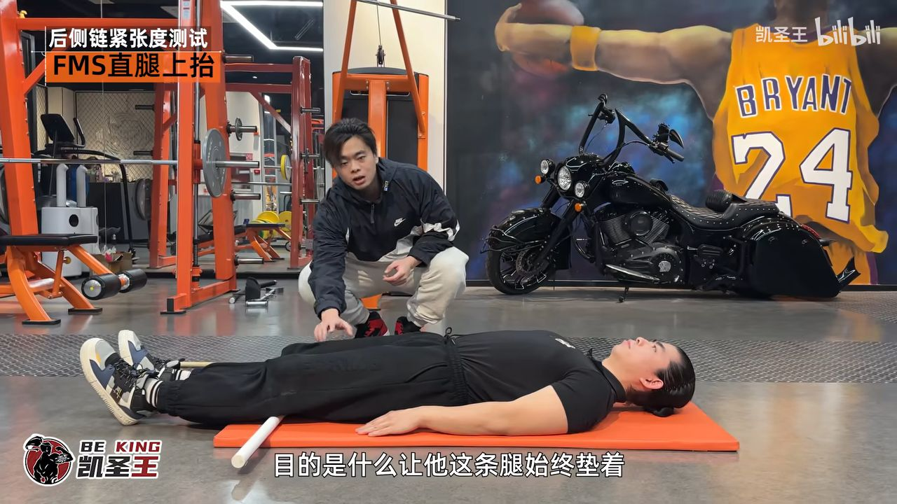

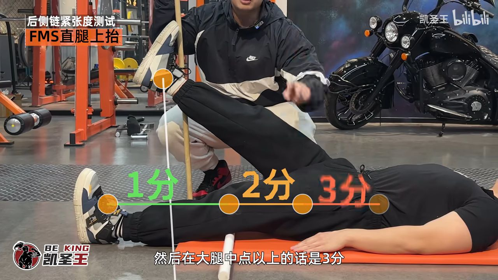

（二）前侧链紧张度测试

10:47

1、改良托马斯测试

屁股坐在凳子上，使劲将右腿紧抱胸前，再顺势躺下，大腿和小腿是一个自然弯曲角度证明股直肌不很紧张（反之就是紧张）；但是大腿下侧跟凳面有个明显悬空，侧说明他髂腰肌紧张（反之不紧张）

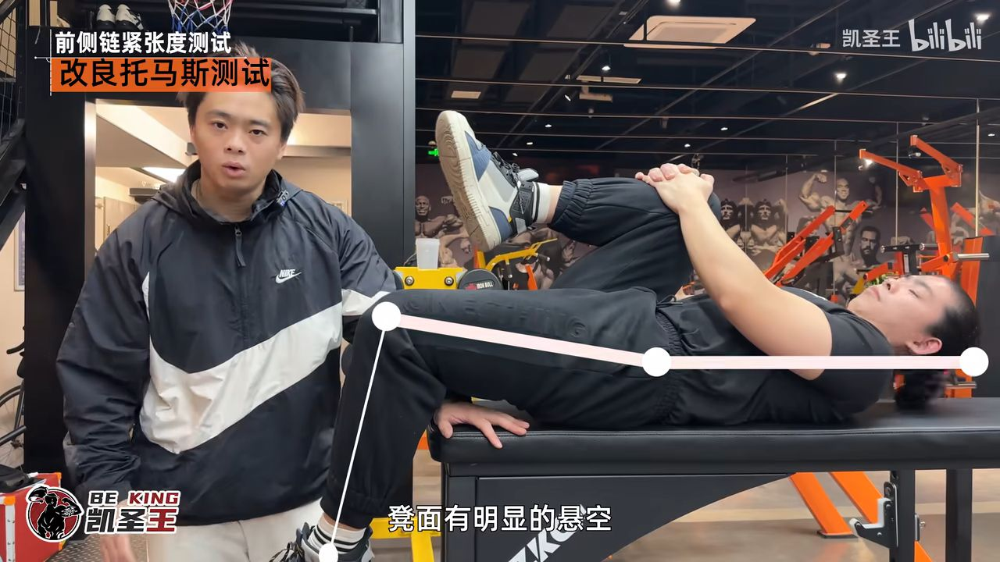

对比组：大腿和小腿处于紧绷状态

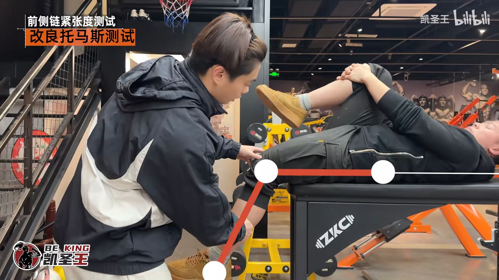

（三）髋内外旋功能测试

13:10

1、90-90

摆好姿势后，脊柱正直，臀部紧贴地面为髋部活动度好

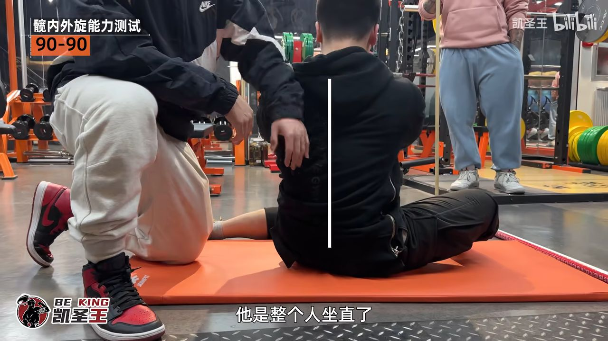

三、髋关节功能性训练

15:19

进阶方法：本章节不涉及进阶

训练方法：每天从以上（21）动作中选取3个动作每个动作3组。静态类：一组15S-30S

动态类：一组10次。

补充说明：静态拉伸应注意 保持呼吸 深呼深吸，静态拉伸让本体感受保持在3-4分疼痛（10分制），做动态拉伸类动作时，新手需要避免弹震式拉伸，如果是双侧动作，需要单侧完成10次，双侧完成20次为一组。

1、坐姿内旋夹球练习（动态）

15:32

动作细节：坐姿坐稳，使骨盆稳定，小腿悬空，大小腿夹角保持90°，将泡沫轴夹在大腿中间，髋关节附近，单侧腿固定住，对侧小腿向外翻转。 两边10次为一组

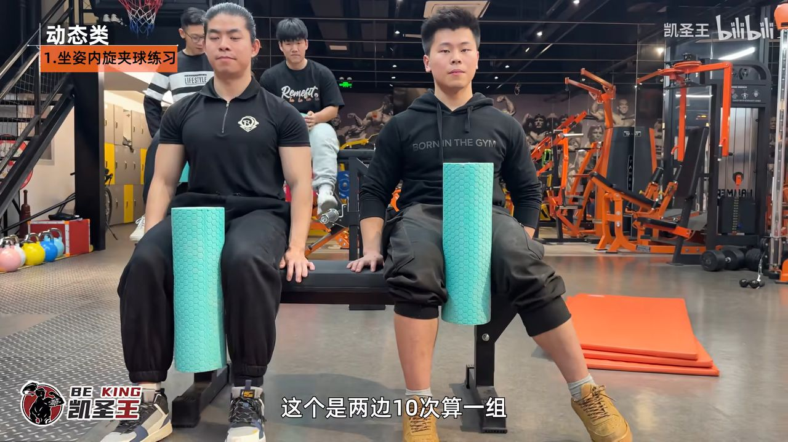

2、坐姿外旋练习（动态）

16:34

动作细节：在上个动作的基础上，对侧腿外展给目标腿留出空间。目标腿保证在躯干正前方，小腿向内翻转。运动过程中控制膝盖始终保持指向前方，不要出现外展动作。

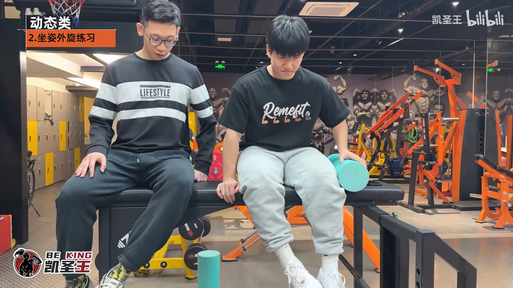

3、平躺髋外旋（静态）

17:30

动作细节：双腿屈曲平躺于地面，左腿脚踝搭于右腿膝盖上方，左手轻触膝盖内侧，缓慢进行大腿外旋（手掌施力方向旋转，旋转到位后压住静止30S），推到一个轻微拉伸感的程度

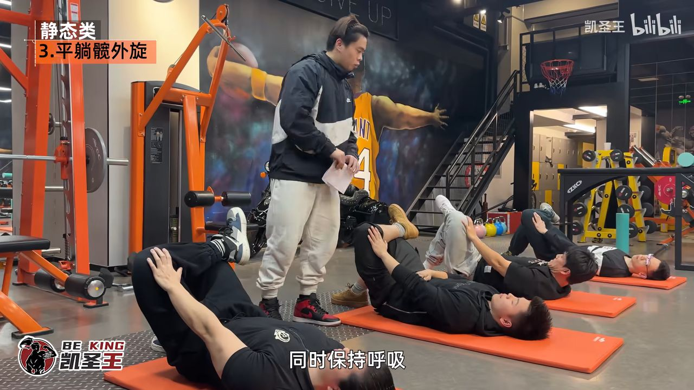

4、蝴蝶式（静/动）

19:19

动作细节：基础坐姿位蝴蝶式，双手抱住前脚掌脚背，核心收紧。进阶：当髋活动度足够时可以进阶到动态蝴蝶（缓慢打开拉伸3-4分紧绷感，切记不要弹震）

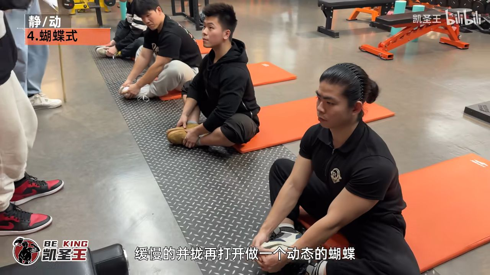

5、青蛙趴（静态）

21:05

动作细节：双足靠墙，脚后跟不要抬离地面。臀部向墙后发力盆底肌收紧（屁股微微向后坐直到有3-4分疼痛感），注意收紧核心不要塌腰，腰椎不能反弓

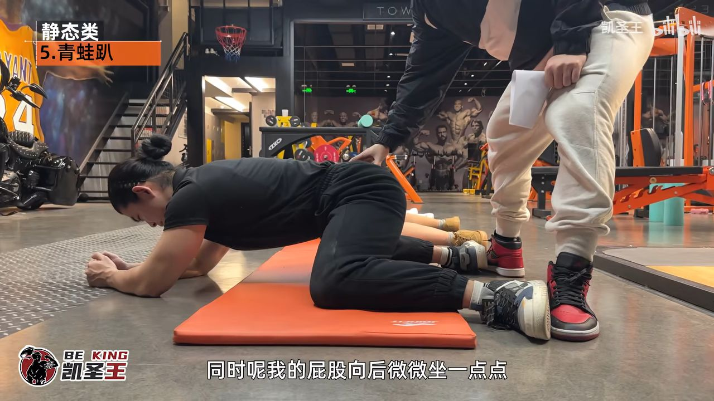

6、青蛙趴＋前后移动（动态）

25:05

动作细节：在上一个动作的基础上，双手做一个撑位，撑在头前面一点点，然后进行骨盆缓慢前后移动，时刻感受髋的状态位置，收紧腹部脊柱不能反弓，注意小腿与墙面夹角不要有变化

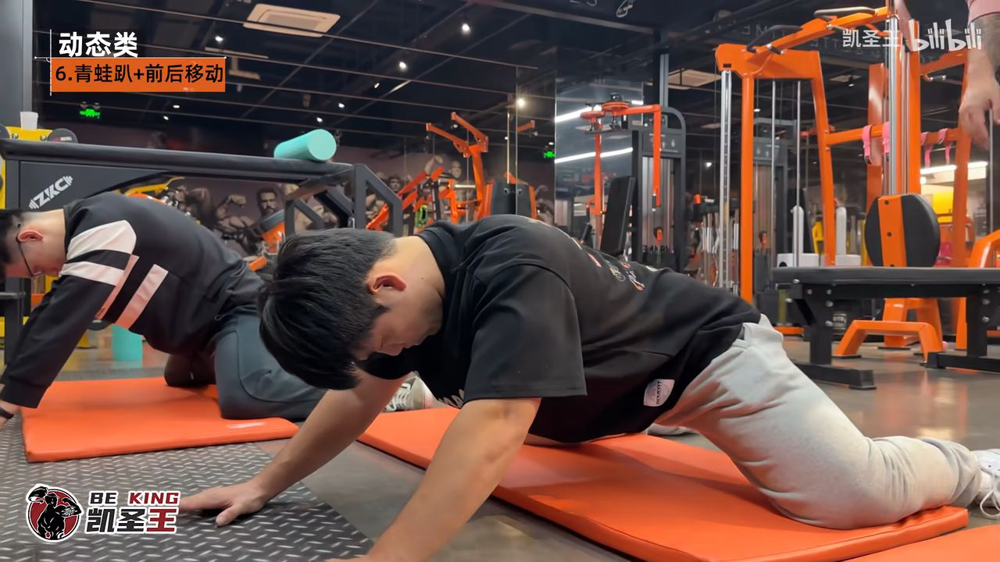

7、青蛙趴＋动态内旋（动态）

26:15

动作细节：以青蛙趴为基础动作（不是撑位），单侧膝盖为支点，做髋关节内旋

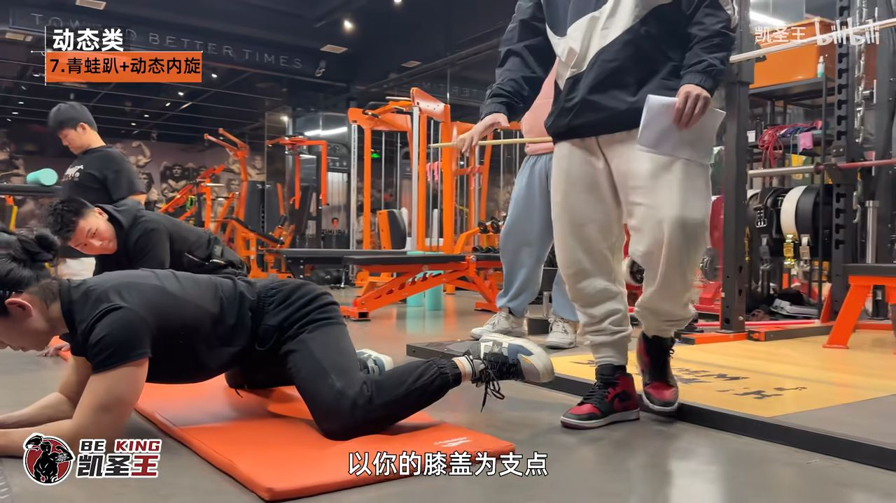

8、弓箭步三方向伸展（静态）

27:41

动作细节：（1）跪姿弓步，小腿与大腿保持90°，两脚尖朝前，髋部向前移动达到拉伸后腿屈髋肌群的目的；（2）髋关节外展45°，前脚掌外旋45°，髋部向脚尖方向移动，身体和后腿位置不变，躯干直立，小腿垂直地面；（3）髋关节外展90°，前脚掌外旋90°，髋部向脚尖方向移动。

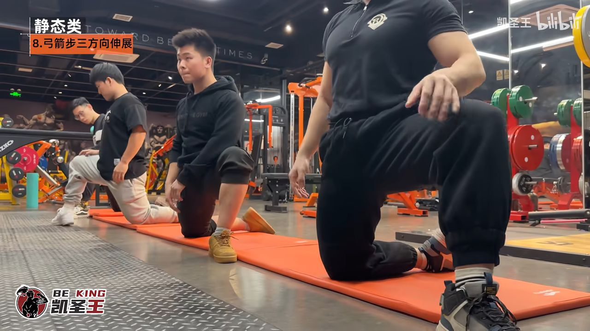

9、四点支撑髋部环转（动态）

30:27

动作细节：四点支撑不要塌腰，单侧腰部做前屈、外展、后伸（保持大小腿夹角90°同时 勾脚尖）然后再回到前屈位。环转一圈为一次

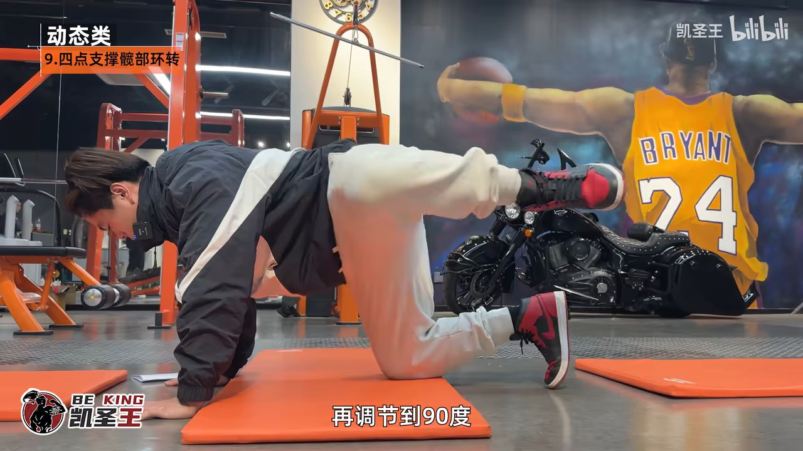

10、侧弓步（动态）

31:28

动作细节：侧弓步，提高髋部外展外旋活动度

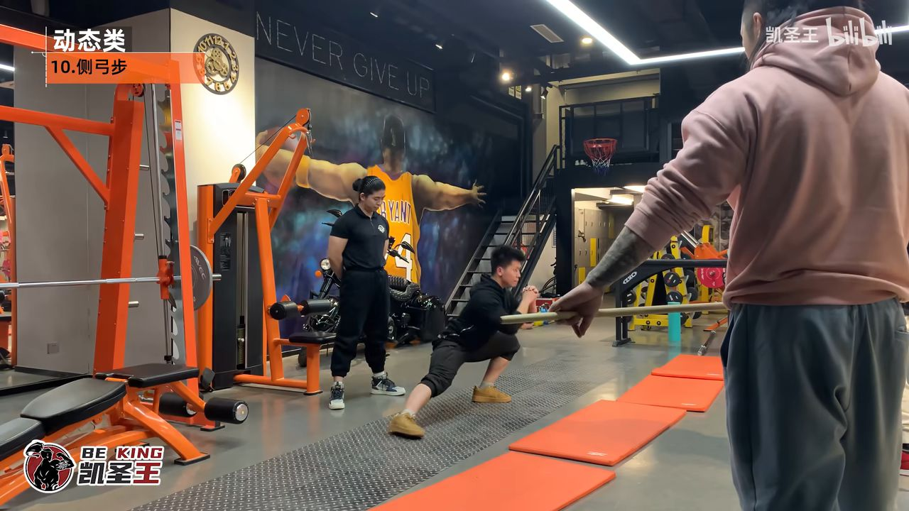

11、并行侧弓步（动态）

31:60

动作细节：动态侧弓步，重心从单侧腿移动到对侧腿，髋部没有明显上下移动的情况下，重心腿的脚后跟不可离地（所有弓箭步类动作的中心腿脚后跟一定要踩死，不然支撑力会放在膝盖上，伤膝盖）

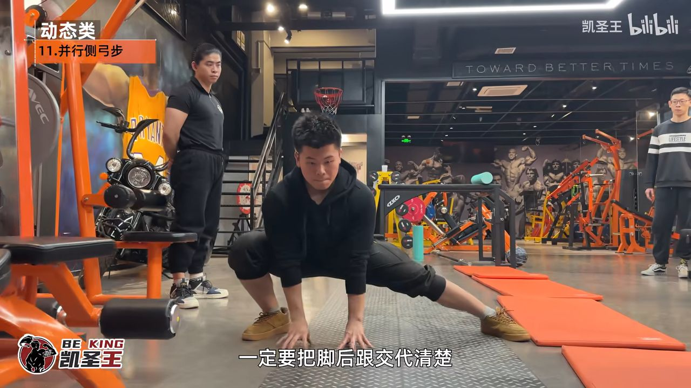

12、摸脚尖蹲起（动态）

33:20

动作细节：起始是站立位，双脚外展30°，下蹲到最低点，膝盖和脚尖同方向一条水平线，不要出现膝盖内扣。三个手指抓住脚尖，后背打直。如果出现过度弯腰，就不要蹲的过低，完成起始位后抓住脚尖蹲起，然后再下蹲。（能够感受到后臀拉伸感）

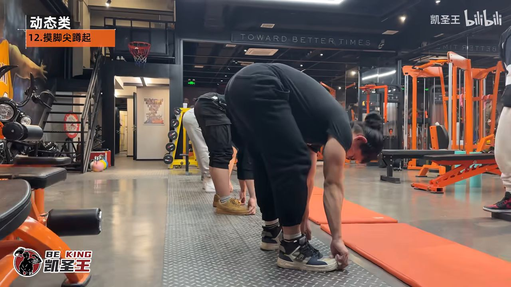

13、蹲式髋内旋（动态）

34:38

动作细节：窄站距下蹲，在下蹲位置下做内旋训练，旋转到膝盖跟地面相触（前面放个垫子），身体尽量保持正中位。左右算一次

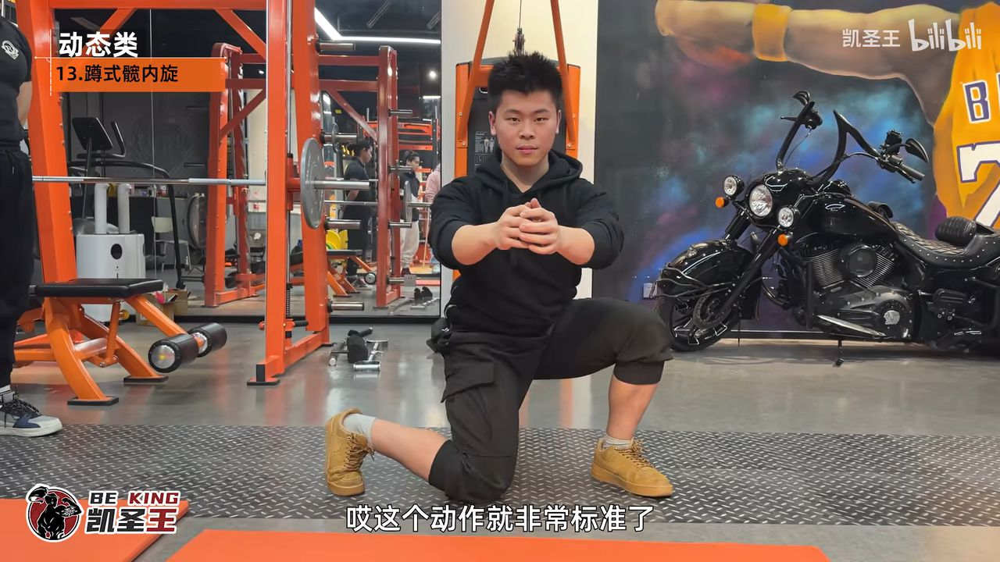

14、最伟大拉伸变式（动态）

36:30

动作细节：正弓步位，对侧手放置于前脚足弓延长线一肩宽的位置。另一侧大小臂夹角呈90°，小臂引领手肘接近足弓（小臂始终与地面平行）图1，伸展到最大幅度后手掌引领视线进行转体，直至手掌指向天空，眼睛盯着手尖，之后回位（图2）。同时，髋部向后移动、下沉，接触后脚脚跟，同时前腿打直，脚尖微勾，缓慢拉伸前腿后群，保持2-3秒后图3，回到弓步位，为一次动作。

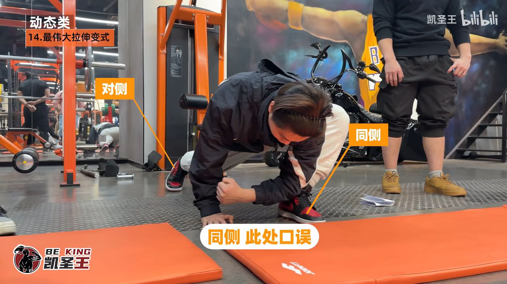

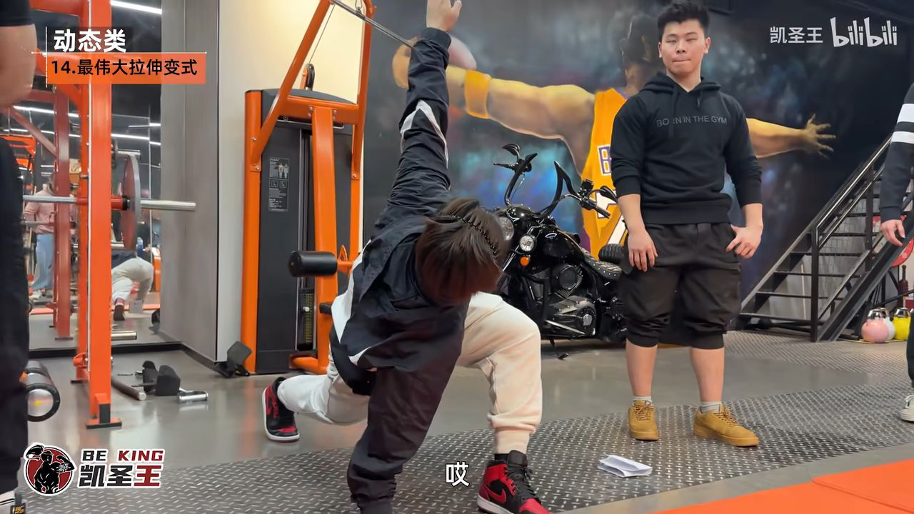

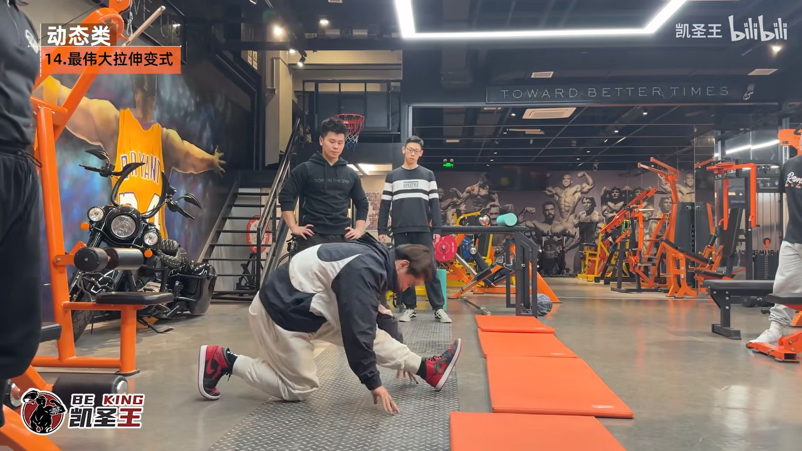

15、静态90-90（静态）

37:53

动作细节：一侧腿内旋，一侧腿外旋，两侧大腿小腿夹角90°，身体保持中立位，保持住10-30s一组

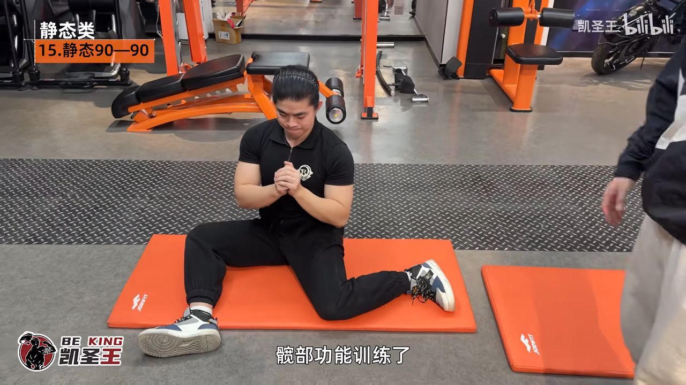

16、动态90-90（动态）

38:30

动作细节：在上一个动作的基础上，将左右两侧调换动作连贯起来。

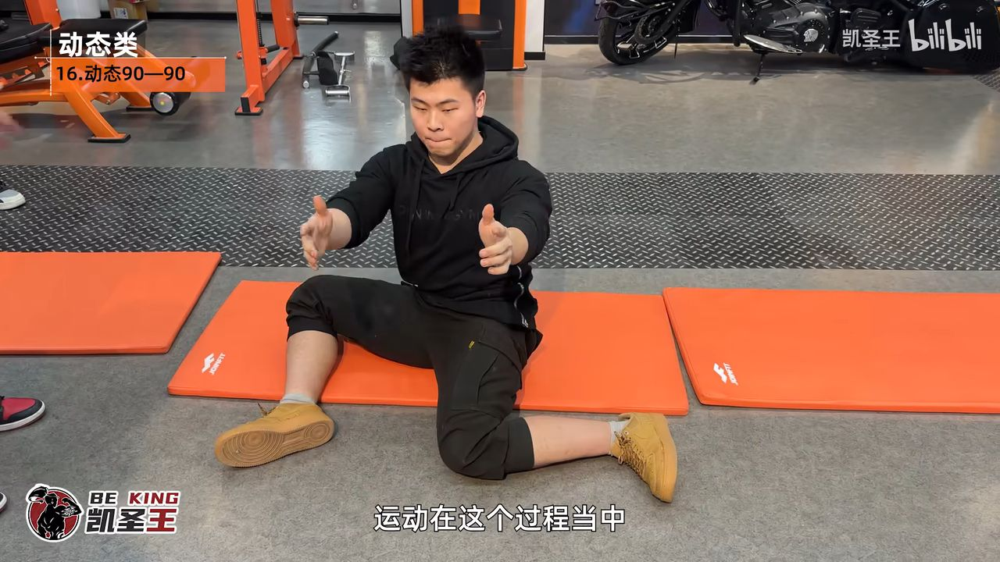

17、动态90-90＋伸髋（动态）

38:56

动作细节：在上一个动作的基础上，做一个伸髋起身动作

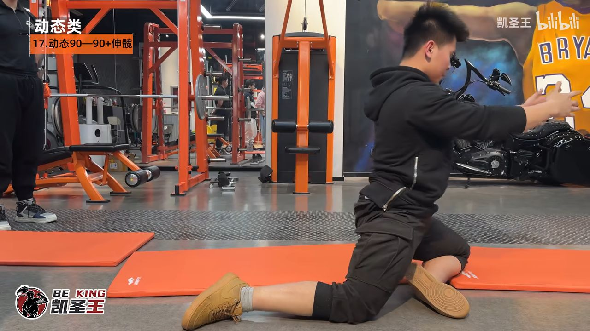

18、鸽子式（静态）

39:51

动作细节：正弓步为初始位，然后进行瑜伽鸽子式动作，大小腿夹角90°，后脚脚尖朝正下方，双手撑在前面，可以很好拉伸髋部，如果新手无法直接完成该动作，可以将前侧腿置于高位，减少柔韧性要求

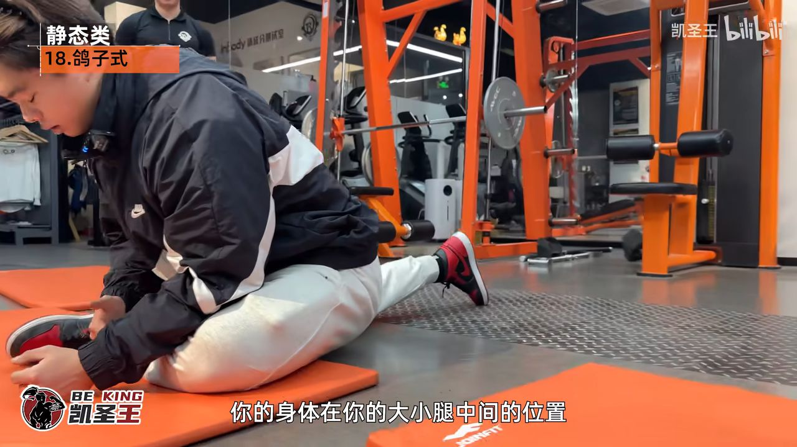

简化版：

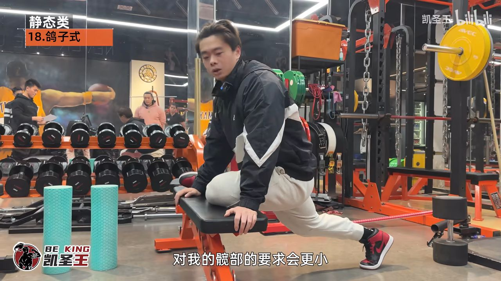

19、鸽子式＋侧屈（动态）

41:08

动作细节：进阶，在上一个动作的基础上，把手向前伸，尽量伸直，然后缓慢进行移动，分别向两侧做侧屈，不适感3-4分

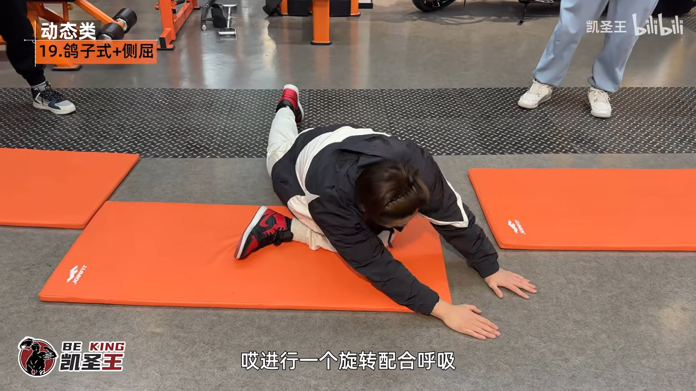

20、单侧支撑髋部内外旋（动）

42:00

动作细节：找一面墙，双手轻轻扶住墙面，右腿站立左腿向后抬高，左侧手在上，右侧手在下。躯干慢慢向左侧旋转到最大幅度，然后回到中立位。回到中立位后换方向，脚尖都是跟膝盖一条线上，右手在上左手在下，向右侧旋转，一左一右算一次，两条腿都要做，10次3组（所有动作都是）

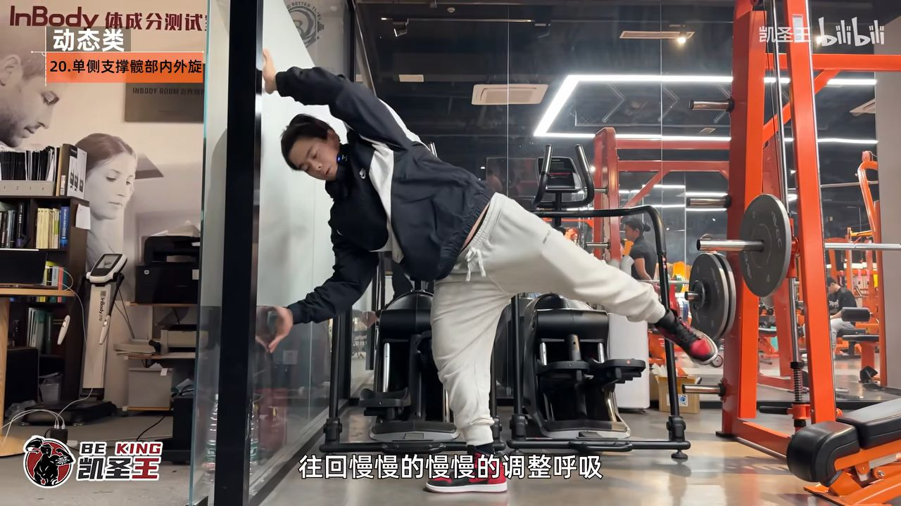
