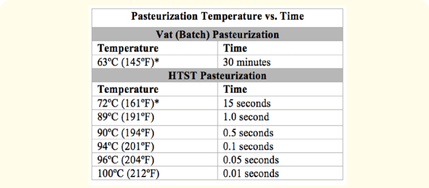

本文主要参考

[食物安全温度](https://www.foodauthority.nsw.gov.au/sites/default/files/_Documents/translationsfinal/chinese_simplified_4_hour_2_hour_rule.pdf)

[巴氏消毒](https://www.researchgate.net/publication/342750942_Thermal_and_Nonthermal_Food_Processing_Technologies_for_Food_Preservation_and_their_Effects_on_Food_Chemistry_and_Nutritional_Values)

[日本的规定](https://www.hokeniryo1.metro.tokyo.lg.jp/shokuhin/kan/kaisei/files/kan_kanrifile-eiseikanrikeikaku.pdf)

[食物热处理ppt](https://fs.duifene.com/res/r2/u2574756/%E9%A3%9F%E5%93%81%E5%B7%A5%E8%89%BA%E5%AD%A6-%E7%83%AD%E5%A4%84%E7%90%86%E5%92%8C%E6%9D%80%E8%8F%8C_352a9639c499ed211c18.pdf)

