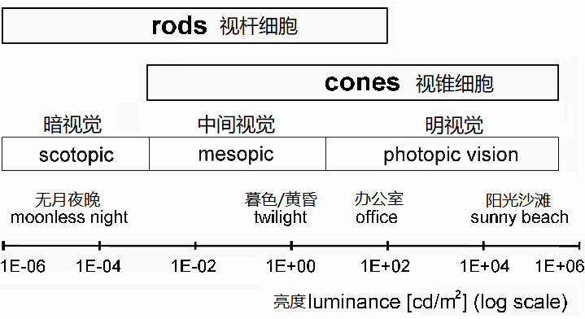
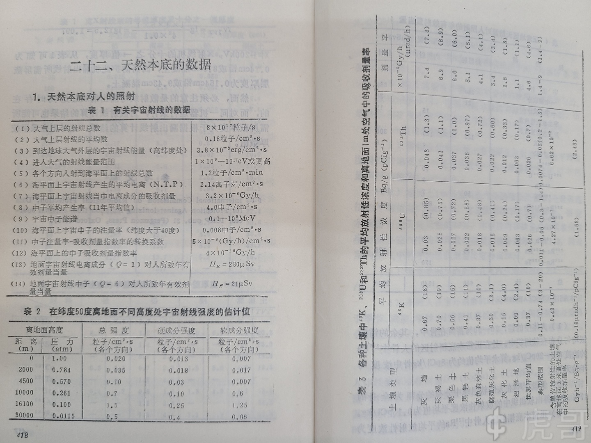

## 单位制换算

## 光通量，光强 ，光子数

这和能流这一个物理量非常相近物理量。能流是单位时间单位面积的能量。光强则是单位立体角单位时间人眼能感受到的亮度。

 物理表达式 

在给定方向上的发光强度的物理表达式为:

$$I = \frac{d\Phi}{d\Omega}$$

式中:

$\Phi$: 光通量
$\Omega$: 立体角

光通量或可见光亮度，可由下述公式计算:

$$\Phi = K \cdot \int_{0}^{\infty} \bar{y}(\lambda) J(\lambda) d\lambda$$

$K$为人眼对于彩色的感知能力，值 = 683.002 lm/W。

$K$值使光通量的单位与辐射功率的单位得到统一。

$\lambda$为波长。

$\bar{y}(\lambda)$，也写作$V(\lambda)$，为标准光度函数；

$J(\lambda)$为光谱分布的功率强度，单位瓦每纳米；

例如，一个灯泡的光通量是1000流明，平均向所有方向发出光，则发光强度是

$$I = \frac{1000}{4\pi} = 79.6 \, \text{cd}$$

我不理解为什么要用光强坎德拉如此愚蠢的定义。尤其是要和人眼这一人的主观感受联系起来。这个物理量不配作为七个基本物理量之一。光通量也非常丑陋。不如改成人眼反应强度，或者改成在某个标准瞳孔大小，焦距下视锥细胞的电信号大小。

### 人眼

人眼对亮度适应性非常强，人眼能分辨的最小亮度与最大亮度相差10亿倍。瞳孔的大小可以控制射入视网膜上光线的强度，成年人瞳孔直径的变化范围为2至8毫米，相当于四级光圈，射入光线的强度相差16倍。

在比较黑暗的地点，例如在亮度为 0.01 尼特的情况下，视锥细胞不再起作用，只能是分布广而相对稀疏的视杆细胞起作用，因此人眼的分辨能力大大下降，中心黄斑部分视力下降到 0.05，反而不如黄斑以外（因为中心黄斑几乎没有视杆细胞），非黄斑区域视力基本不变，最好视力在黄斑边缘附近，大约偏离中心 15 度左右，为 0.1。这时的视力，称为**暗视觉**。但由于视杆细胞只有一种，因此是分辨不出物体颜色的，因此我们观察星云时（其表面亮度大多在 0.01 尼特以下），看不出颜色。有关视力与亮度之间的关系，是逐渐变化的。

人眼对亮度的反应并非是线性的，比如在昏暗的房间内，我们看到的烛光是明亮的，而同样的烛光放在正午的阳光下，我们甚至连火苗都看不见，说明人眼对亮度变化的反应随着亮度的增加而减弱。人眼的这种特性近似于对数函数，如果用I表示亮度，人眼的反应用S表示，那么二者之间的关系为可以用对数公式表示为。

### 手机屏幕

亮度通常以尼特（nits，或称坎德拉每平方米，cd/m²）来衡量。现代智能手机的典型最大亮度在正常条件下约为 400 到 1000 尼特。

对于一个亮度为 500 尼特（500 cd/m²）的智能手机屏幕，假设平均波长在蓝绿色区域约为 500 nm（能量约为 2.48 eV 或 3.97 x 10⁻¹⁹ J），则光子数密度约为 1.26 x 10²¹ 个光子/(秒·平方米)，总数$1.26 * 10^{19}光子/秒$。进入眼睛大概10e17个光子每秒。

### 阳光

太阳辐射的光学频谱接近温度5800K的黑体辐射。这是因为太阳内部聚变产生的gamma，经过多次吸收辐射在表面已经是非常完美的黑体辐射谱了。 太阳半径是70万千米（$7*10^8m$）.

太阳到地球的距离是15000万千米（$1.5*10^{11}m$）。 八分钟光。（$8*60*3*10^8=1.4*10^{11}m$）

$\sigma=5.6*10^{-8}$

到达地球能流: $\sigma T^4 \frac{ R_{s}^4}{R_{es}^4} = 1400 W/m^2$

在晴朗的天气下，到达海平面的直射阳光的强度约为 1050 W/m² = $1000 J/m^2/s$。阳光的光谱分布非常广泛，从 100 nm 到 1 mm。

估计可见光400nm左右。 那么光子数的量级是：$1000 W/m^2/h\nu = 2*10 ^{21} 个/m^2/s$

### 室内照明

家用照明的灯，led的光功率是不到0.3。 LED功率从0.1W=0.1（J/S）到10W=10(J/S)不等。 光子总数为$10^{17} 个/s$

### 激光笔

通常低于 5 mW。
对于一个 5 mW 的绿色激光笔，每秒发射的光子数约为 (5 x 10⁻³ J/s) / (3.73 x 10⁻¹⁹ J/photon) ≈ 1.34 x 10¹⁶ 个光子/秒

### 发射源

例如，一个活度为 1 居里的放射源在 1 米处的伽马射线通量约为 3.7 x 10¹⁰ 个光子/(秒·平方米)。在核反应堆或核爆炸等极端情况下，伽马射线的通量可以达到非常高的水平。  
伽马射线的能量范围很广，从几十 keV 到几个 MeV 是核物理中常见的能量范围。例如，钴-60 衰变会发射能量为 1.17 MeV 和 1.33 MeV 的伽马射线。一些高能宇宙射线中也包含能量高达 GeV 甚至 TeV 的伽马射线。  

### 塑料闪烁体

塑料闪烁体的闪烁效率通常约为每 MeV 10,000 个光子（对于电子），但对于质子和 α 粒子，由于猝灭效应，光产额会显著降低。

闪烁体的发光强度通常用光产额来衡量，即单位能量的辐射在闪烁体中沉积时产生的可见光光子数。光产额因闪烁体材料而异，例如，NaI(Tl) 闪烁体的光产额约为每 MeV 沉积能量产生几万个光子。塑料闪烁体的光产额通常较低。  
闪烁体发出的光的光子能量通常在可见光或近紫外波段，能量约为几个 eV。例如，NaI(Tl) 闪烁体发出的光的波长主要在 415 nm 附近，对应的光子能量约为 3 eV。  
闪烁体发出的光的光子数取决于入射辐射的能量和闪烁体的光产额。例如，如果一个能量为 1 MeV 的伽马射线被 NaI(Tl) 闪烁体吸收，大约会产生几万个可见光光子。这些光子会被光探测器（如光电倍增管或硅光电倍增器）收集并转换为电信号进行分析。  

带电粒子在塑料闪烁体中的光产额通常在每 MeV 沉积能量下产生 3000 到 20000 个光子的范围内变化 。例如，一种使用苯乙烯开发的塑料闪烁体，其最大发射波长约为 427 nm，对于 1 MeV 的入射辐射，光产额为 6134 个光子。市售的塑料 。Tin 掺杂的塑料闪烁体通常具有约 10000 个光子/MeV 的光产额，并且闪烁衰减时间很快，约为 1 到 10 纳秒 。塑料闪烁体的一个显著优点是其极短的衰减时间，这使得它们对于需要精确飞行时间测量的实验至关重要。

#### 宇宙射线

一般都会大气簇射掉，到达地面一般是$\mu$子。μ 子作为主要的地面宇宙射线成分，能量范围为几个GeV，在 1 厘米厚的塑料中沉积的能量相对较小且稳定，约为 1.5-2 MeV。

塑料闪烁体的闪烁效率通常约为每 MeV 10,000 个光子（对于电子），但对于质子和 α 粒子，由于猝灭效应，光产额会显著降低。For equal energies, aproton will produce only 1/4 to 1/2 the light of anelectron, while alphas will produce only about 1/10 the light. [来源](https://luxiumsolutions.com/sites/default/files/2021-11/Charged-Particle-Detection-Application.pdf)

海平面水平探测器的 μ 子通量约为每平方厘米每分钟 1 个 .[来源](https://inspirehep.net/files/06a6dba17812c57f8195e0f46887250b)  [来源2](https://www.ictp-saifr.org/wp-content/uploads/2018/08/Lab_MuonLifetime_2018.pdf)

### 切伦科夫

一个能量为 GeV 的电子在水中产生的切伦科夫光的光子数密度可能在每秒每平方米几千到几万个光子的量级。  