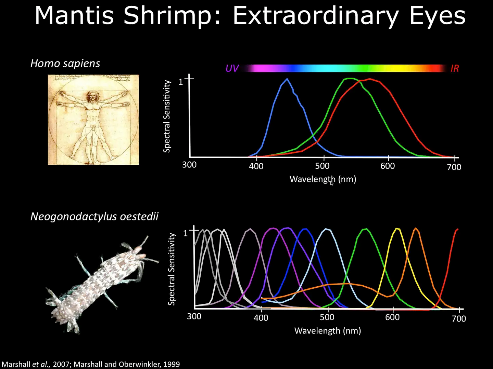

## Principles of Color Vision

The principles can be found in the content of Feynman's Lectures on Physics, Volume I.

In brief, visible light refers to the range of electromagnetic wavelengths that the human eye can perceive, approximately between 380nm and 750nm.

What we see is the superposition of the energy spectrum within the 380nm to 750nm range. Essentially, it is a vector in an infinite-dimensional Hilbert space.

However, the human eye, as a detector (cone cells), cannot distinguish such a vast number of vectors. Humans have three types of cone cells. Different wavelengths of light activate these three types of cells to varying degrees, resulting in the perception of different colors. Essentially, the human eye reduces the infinite-dimensional Hilbert space into a three-dimensional manifold through convolution (the efficiency of cone cells detecting different wavelengths).

The chromaticity diagram appears two-dimensional because it is a two-dimensional projection of a three-dimensional color space. This projection simplifies the three-dimensional CIE XYZ color space, allowing color information to be represented on a plane for easier observation and analysis.

> **CIE XYZ Color Space**: Defined by the International Commission on Illumination (CIE), this standard color space uses three dimensions (X, Y, Z) to represent colors. The X-axis represents red stimulus, the Y-axis represents green stimulus, and the Z-axis represents blue stimulus. However, these axes do not directly correspond to the red, green, and blue colors we commonly understand but are based on the human eye's response to different wavelengths of light.
>
> **Formation of the Chromaticity Diagram**: The chromaticity diagram is created by projecting the color data in the CIE XYZ space onto a two-dimensional plane. This plane typically uses x and y coordinates, where x = X/(X+Y+Z) and y = Y/(X+Y+Z). This approach highlights the chromaticity of colors, i.e., their hue and saturation, without considering brightness.
>
> **Characteristics of the Chromaticity Diagram**: The edges of the chromaticity diagram represent the colors of the monochromatic spectrum, forming a horseshoe-shaped outline from violet to red to yellow. Each point within this outline represents a mixed color. The chromaticity diagram does not display brightness information, making it two-dimensional and focused solely on the relative proportions of colors.
>
> **Importance**: Despite being two-dimensional, the chromaticity diagram effectively distinguishes hues and saturation levels of different colors. It is crucial for color management and research in color science. The diagram visually demonstrates the relationships between colors and the rules of color mixing.

Humans may experience color blindness or color deficiency due to genetic or health-related issues, which impair the functionality of certain cone cells.

In the natural world, there are animals with visual systems different from humans. For example, mantis shrimp have 16 types of cone cells (astonishingly complex) and can perceive a broader wavelength range, even detecting the polarization state of light.

## Color Schemes for Scientific Research

This section references [Coloring Chemistry](https://onlinelibrary.wiley.com/doi/10.1002/anie.202114910).

There are three main requirements: 1. Color schemes should be auxiliary. 2. They should align with brightness changes. 3. They should account for color blindness and deficiency.

In simple terms, the three-dimensional color manifold should maintain a consistent trend when reduced to lower dimensions. For instance, converting to grayscale should not result in brightness fluctuating inconsistently with increasing values.

### The Role of Color Should Be Auxiliary, Not Essential

Consider using different textures, symbols, layouts, or annotations.

### Fill Plots Should Use Perceptually Uniform Color Schemes

Perceptual uniformity means that the information conveyed by colors should align with the trend of brightness changes.

### Strategies for Color Blindness and Deficiency

Ensure that visualizations are accessible to individuals with color vision deficiencies by using colorblind-friendly palettes or alternative visual encodings.
