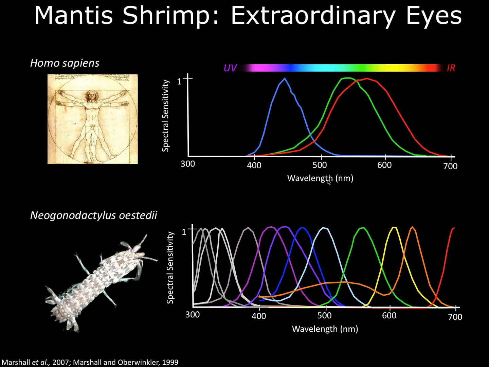

## 色视觉原理

原理部分可见费曼第一卷中的内容。

这里简述一下，可见光通常指人眼能够感知的电磁波波长范围，大约在 380nm 到 750nm 之间。

我们可见的就是在380nm 到 750nm的能谱的一个叠加。 实际上是一个无穷维希尔伯特空间的一个矢量。

而人眼这个探测器(视锥细胞)，是无法分清楚如此多的矢量的。人有3种视锥细胞。 不同波长的光对3种细胞的激活程度不同故而反应出来了不同的颜色。 实际上人眼这个探测器把一个无穷维的希尔伯特空间通过卷积（视锥细胞对不同波长的探测效率卷积）降维成了一个三维流形。

色品图之所以呈现为二维，是因为它是一个三维颜色空间的二维投影。这个投影简化了三维CIE XYZ色彩空间，使得颜色信息能在平面图上表示出来，便于观察和分析。

    > CIE XYZ色彩空间：这是由国际照明委员会（CIE）定义的一个标准色彩空间，它使用三个维度（X、Y、Z）来表示颜色。X轴代表红色的刺激，Y轴代表绿色的刺激，Z轴代表蓝色的刺激，但实际上这三个轴并不直接对应于我们通常理解的红、绿、蓝颜色，而是基于人眼对不同波长光线的响应。
    >
    > 色品图的形成：色品图是通过将CIE XYZ空间中的颜色数据投影到一个二维平面上得到的。这个二维平面通常使用x和y坐标，其中x = X/(X+Y+Z)和y = Y/(X+Y+Z)，这样做的目的是为了展示颜色的色度，即颜色的色调和饱和度，而不考虑亮度。
    >
    > 色品图的特性：色品图的边缘代表单色光谱的颜色，从紫色到红色再到黄色，形成一个马蹄形的轮廓。这个轮廓内的每一点代表一种混合颜色。色品图不显示亮度信息，因此它是二维的，只表示颜色的相对比例。
    >
    > 重要性：尽管色品图是二维的，但它能够有效地区分不同颜色的色调和饱和度，对于色彩管理和颜色科学的研究非常重要。通过这个二维图，可以直观地看到不同颜色之间的关系，以及颜色混合的规律。

人可能会因为基因和疾病的原因，导致其中几种视锥细胞无法正常工作。这便是色弱或者色盲。比如对

自然界种，也存在着和人不同的感光器官性能不同的动物。比如皮皮虾有16种视锥细胞（恐怖如斯），皮皮虾可见波长范围也比人类广，甚至可以探测到光的偏振状态。

## 科研配色

此部分参考了[Coloring Chemistry](https://onlinelibrary.wiley.com/doi/10.1002/anie.202114910)。

主要有三点要求：1. 配色是辅助. 2.与明度变化一致。3.色弱色盲对策。 

简单来说就是色彩这个三维流形。 不管你怎么降维都应该是有着颜色随着数值单方向变化的图。不能转成灰度图之后发现灰度随着数值增加一会变大一会变小。

###  配色的作用应该是辅助的而非必须的。

考虑使用不同的纹理、符号、排版或注释。

### 填色图应该选择感知一致的配色方案。

感知一致（perceptual uniform）指的是颜色所包含的信息要与明度的变化趋势一致。

### 色盲、色弱对策

