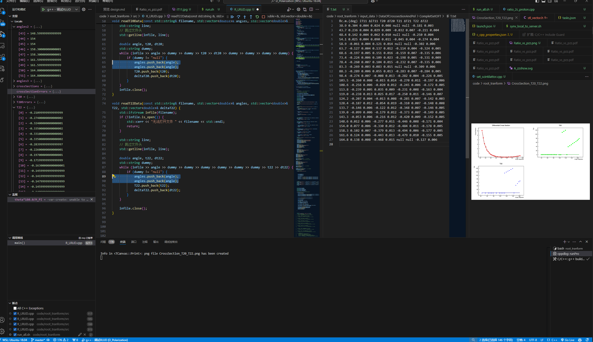
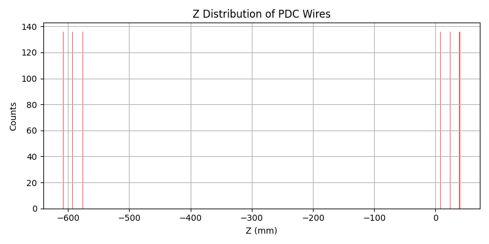
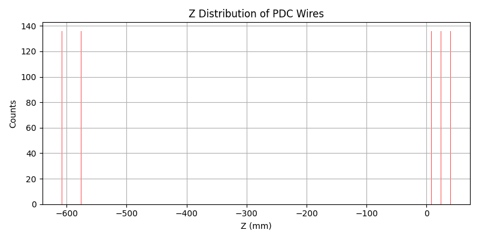

# to be solved

vscode关于pdf阅读有个神奇的特性。  我希望能够在光标聚焦在pdf上时使用ctrl+p依然是打开文件，而非一些pdf编辑器的打印功能。 且这个打印功能无法在vscode的快捷键绑定(ctrl + k, ctrl + s)里面找到。 很可能此功能是外链到了系统里。所以不太能修改。
于是换pdf的插件。 倒是找到一些ctrl+p可以正常打开文件的。 但是问题又来了， 打开某个pdf后无法在vscode侧边栏聚焦到该文件。 这导致我无法快速地从一个vscode窗口（写程序）复制到另外一个vscode窗口(写文档) 。 十分烦人。
现在的方案是画图的时候保存png 和pdf两种格式。 然后打开pnd文件，资源管理器就会聚焦于该png。然后pdf文件就在他下面。





```

plt.figure(figsize=(8, 4))
plt.hist(z_values, bins=600, color='r', alpha=0.7)
```

bins 从600改到1000. -592的数据在图上消失。

https://github.com/tianbaiting/Dpol_smsimulator/blob/main/sim_deuteron/forunderstanding/plot_pdc_wires.py



