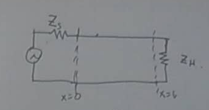

## Electromagnetic Wave Transmission Equation (Transmission Line Analogy)

### Maxwell's Equations

$$
\nabla \cdot E = \frac{\rho}{\varepsilon_0} = 0
$$

$$
\nabla \cdot B = 0
$$

$$
\nabla \times E = -\frac{\partial B}{\partial t}
$$

$$
\nabla \times B = \mu_0 \varepsilon_0 \frac{\partial E}{\partial t}
$$

Derivation:

$$
\nabla \times (\nabla \times E) = -\frac{\partial}{\partial t}(\nabla \times B)
= -\frac{\partial}{\partial t}(\mu_0 \varepsilon_0 \frac{\partial E}{\partial t})
= -\mu_0 \varepsilon_0 \frac{\partial^2 E}{\partial t^2}
$$

Tensor form:

$$
\nabla \times (\nabla \times E) = \varepsilon_{imn} \partial_m (\varepsilon_{njk} \partial_j E_k)
= (\varepsilon_{imn} \varepsilon_{njk}) \partial_m \partial_j E_k
= (\delta_{ij} \delta_{mk} - \delta_{ik} \delta_{mj}) \partial_m \partial_j E_k
= \partial_j \partial_m E_m - (\nabla \cdot \nabla) E
$$

Final wave equation:

$$
-(\nabla \cdot \nabla) E = -\mu_0 \varepsilon_0 \frac{\partial^2 E}{\partial t^2}
$$

$$
\left(\frac{\partial^2}{\partial x^2} + \frac{\partial^2}{\partial y^2} + \frac{\partial^2}{\partial z^2}\right) E = \mu_0 \varepsilon_0 \frac{\partial^2 E}{\partial t^2}
$$

Wave speed:

$$
c = \frac{1}{\sqrt{\mu_0 \varepsilon_0}}
$$

Plane wave solution:

$$
E = E_0 e^{i\omega t - i\frac{\omega}{c} z}
$$

$$
B = B_0 e^{i\omega t - i\frac{\omega}{c} z}
$$

$E, B$ are instantaneous quantities, $E_0, B_0$ are perpendicular to each other.

$$
-\frac{i\omega}{c} E_0 = -B_0 \cdot i\omega
$$

$$
E_0 = cB_0
$$

---

## Transmission Line

### Telegraph Equations (Transmission Line Equations)

#### Equation Derivation

$$
u(t,x) = u(t,x+\Delta x) + L\Delta x\frac{\partial i(t,x)}{\partial t} + R\Delta x \cdot i(t,x)
$$

$$
i(t,x) = i(t,x+\Delta x) + C\Delta x \frac{\partial u(t,x+\Delta x)}{\partial t} + G\Delta x \cdot u(t,x+\Delta x)
$$

$$
\begin{cases}
-\frac{\partial u}{\partial x} = Ri + L\frac{\partial i}{\partial t} \\
-\frac{\partial i}{\partial x} = Gu + C\frac{\partial u}{\partial t}
\end{cases}
$$

#### Lossless Line ($R=0, G=0$)

$$
\begin{cases}
-\frac{\partial u}{\partial x} = L\frac{\partial i}{\partial t} \\
-\frac{\partial i}{\partial x} = C\frac{\partial u}{\partial t}
\end{cases}
$$

$$
\frac{\partial^2 u}{\partial x^2} = LC\frac{\partial^2 u}{\partial t^2}
$$

Wave speed:

$$
v = \frac{1}{\sqrt{LC}}
$$

---

### Boundary Conditions

$$
\begin{cases}
u(t,x) - i(t,x)Z_s = 0 \\
u(t,L) = i(t,L)Z_L
\end{cases}
$$

Initial values:

$$
u(t=0,x) = 0, \quad i(t=0,x) = 0
$$

$$
\frac{\partial u}{\partial t}(t=0,x) = 0, \quad \frac{\partial i}{\partial t}(t=0,x) = 0
$$

---

### Laplace Transform

$$
\mathcal{L}[i(t,x)] = \tilde{I}(s,x)
$$

$$
\mathcal{L}[u(t,x)] = \tilde{U}(s,x)
$$

$$
\begin{cases}
-\frac{\partial \tilde{U}}{\partial x} = sL\tilde{I} \\
-\frac{\partial \tilde{I}}{\partial x} = sC\tilde{U}
\end{cases}
$$

$$
\frac{\partial^2 \tilde{U}}{\partial x^2} = s^2LC\tilde{U}
$$

Solution:

$$
\tilde{U}(s,x) = Ae^{-s\sqrt{LC}x} + Be^{+s\sqrt{LC}x}
$$

$$
\tilde{I}(s,x) = \frac{1}{Z_c}(Ae^{-s\sqrt{LC}x} - Be^{+s\sqrt{LC}x})
$$

Where:

$$
Z_c = \sqrt{\frac{L}{C}}
$$

$$
A_1 = \frac{Z_c}{Z_s+Z_c} \tilde{U}_0(s) + \frac{Z_s-Z_c}{Z_s+Z_c} B_1
$$

$$
B_1 = \frac{Z_L-Z_c}{Z_L+Z_c} A_1 e^{-2\gamma l}
$$

$$
\gamma = s\sqrt{LC}
$$

<!-- 
### If the source end is matched $Z_s = Z_c$

$A = \frac{Z_c}{Z_s+Z_c} \tilde{U}_0(s)$

$B = \frac{Z_c}{Z_s+Z_c} \frac{Z_L-Z_c}{Z_L+Z_c} e^{-2\gamma l} \tilde{U}_0(s)$

$\gamma = s\sqrt{LC}$
-->

---

### Laplace Inverse Transform

- $\tilde{U}_0(s) \rightarrow U_0(t)$
- $\tilde{U}_0(s)e^{-\gamma x} \rightarrow U_0(t-\sqrt{LC}x)$ (traveling wave)
- $\tilde{U}_0(s)e^{+\gamma x} \rightarrow U_0(t+\sqrt{LC}x)$ (reflected wave)

---

### Source End Matching

$$
\quad Z_s = Z_c
$$

$$
u(t,x) = \frac{1}{2} U_0(t-\frac{x}{v}) + \frac{1}{2}\rho U_0(t-(2l-x)/v)
$$

$$
\rho = \frac{Z_L-Z_c}{Z_L+Z_c}
$$

---

### Instantaneous Matching Example

$$
R_s = 100\Omega, \quad Z_c = 150\Omega, \quad Z_L = 1k\Omega, \quad
V_{s} = 75V
$$

Wire transmission to the terminal, reflection:

$$
I = \frac{V}{Z_c+Z_s}
$$

At $t=0$, input terminal, wave $V_i$:

$$
V_i = \frac{Z_c}{Z_c+Z_s}V_s = 6V
$$

$$
I_i = \frac{1}{Z_c+Z_s}V_s = 40mA
$$

| Time Interval | Source Voltage           | Source Current           | Time Interval | Terminal Voltage         | Terminal Current         |
| ------------- | ----------------------- | ------------------------| ------------- | ----------------------- | ----------------------- |
| 0 - 2τ        | $V_i = 6V$              | $I_i = 40mA$            | 0 - 2τ        | 0                       | 0                       |
| 2τ⁺ - 4τ      | $V_i + (V_{r1} + V_{r2}) = 9.5V$ | $I_i + (I_{r1} + I_{r2}) = 4mA$ | τ⁺ - 3τ    | $V_i + V_{r1} = 10.4V$ | $I_i + I_{r1} = 10mA$  |
| 4τ⁺ - 6τ      | $V_i + (V_{r1} + V_{r2}) + (V_{r3} + V_{r4}) = 8.9V$ | $I_i + (I_{r1} + I_{r2}) + (I_{r3} + I_{r4}) = 9.3mA$ | 3τ⁺ - 5τ    | $(V_i + V_{r1}) + (V_{r2} + V_{r3}) = 8.9V$ | $(I_i + I_{r1}) + (I_{r2} + I_{r3}) = 8.4mA$ |

$$
\rho_L = \frac{1000-150}{1000+150} = 0.74
$$

---

## Summary

As long as the characteristic impedance and load impedance are not matched, reflection will occur. If both the source and load ends are mismatched, multiple reflections will occur.

---

## Appendix

Original images:

