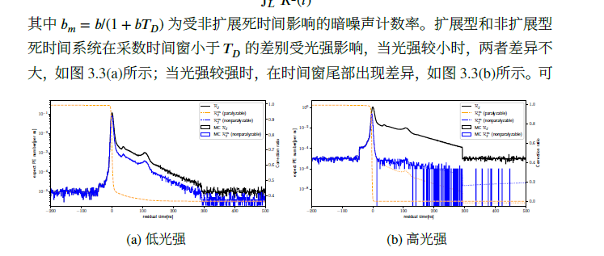

1.  理解探测器中“死时间”的基本概念及其两种主要类型。
2.  掌握死时间对不同类型泊ソン过程（齐次与非齐次）的影响。
3.  深入学习本章的核心创新点：针对非齐次泊ソン过程的死时间建模及其概率推导。
4.  了解如何运用该模型构建极大似然法，从受影响的数据中精确推断原始信号强度。

---

## 第一部分：引言与背景知识

### 1.1 问题的提出：为何要研究死时间建模？

在像超级神冈（SK）这样的水切伦科夫探测器中，当中微子发生相互作用后，会产生带电粒子，这些粒子在水中运动时发出切伦科夫光。光电倍增管（PMT）接收到的是一个短时间内光子数量急剧变化的“光脉冲”。这个过程，其事件（光子到达）的发生率是随时间变化的，在统计学上被称为**非齐次泊松过程 (inhomogeneous Poisson process)**。

然而，电子学系统在记录一个光子（hit）后，会有一段约900纳秒（ns）的时间内无法响应新的信号，这就是**死时间 (Dead Time)**。这个效应会严重扭曲我们观测到的光子时间和数量分布，尤其是在信号密集的区域（如探测器边界或高能事例中），导致能量重建不准确。

传统的死时间修正理论主要针对事件率恒定的**齐次泊松过程 (homogeneous Poisson process)**。直接套用于SK这样的非齐次过程会引入很大误差。因此，本章的核心任务就是从第一性原理出发，为非齐次泊松过程建立一个精确的死时间模型，并提出一种能够“解卷积”出真实信号强度的方法。

### 1.2 基础概念：死时间的两种类型

死时间主要分为两种，理解它们的区别至关重要。

* **非扩展型 (non-paralyzable)**：探测器记录一个事件后，进入一个固定长度 $T_D$ 的死时间。在此期间到达的任何新事件都会被**完全忽略**，且不会影响当前死时间窗口的结束时刻。
* **扩展型 (paralyzable)**：探测器记录一个事件后，启动一个死时间窗口。如果在这个窗口**内部**又有新事件到达，死时间会从这个新事件的时刻点**重新开始计算**。

这两种类型的区别可以参考论文中的图3.1。SK的电子学系统属于非扩展型死时间系统。

---

## 第二部分：核心理论 - 非齐次泊松过程的死时间修正

本章的第一个主要贡献是将在齐次泊松过程上已经很成熟的死时间理论，推广到了非齐次泊松过程。

### 2.1 真实事件率与观测事件率的关系

假设真实的事件发生率为 $\mathcal{R}(t)$，观测到的事件发生率为 $\mathcal{R}^m(t)$，死时间长度为 $T_D$。

* **对于扩展型死时间**：
    一个事件在时刻 $t$ 被观测到的条件是：1) 它在 $t$ 时刻真实发生；2) 在它之前的 $(t-T_D, t)$ 时间段内，**没有其他真实事件**发生。因此，观测率是真实率乘以一个存活概率。
    $$\mathcal{R}^{m,para}(t) = \mathcal{R}(t) e^{-\int_{t-T_{D}}^{t}\mathcal{R}(t')dt'}$$

* **对于非扩展型死时间**：
    一个事件在时刻 $t$ 被观测到的条件是：1) 它在 $t$ 时刻真实发生；2) 在它之前的 $(t-T_D, t)$ 时间段内，**没有其他事件被观测到**。这就导致了一个更复杂的关系：
    $$\mathcal{R}^{m,non}(t) = \mathcal{R}(t) \left( 1 - \int_{t-T_{D}}^{t}\mathcal{R}^{m,non}(t')dt' \right)$$
    这个公式是一个迭代关系，$\mathcal{R}^{m,non}$ 出现在了等式的两边，求解起来非常困难。

### 2.2 构建概率模型

基于上述关系，我们可以构建在一次观测中（假设时间窗足够短，最多只记录一个hit）的概率模型，这对于后续的极大似然分析至关重要。

| 采数类型 | 观测到1个hit的概率 | 观测到0个hit的概率 |
| :--- | :--- | :--- |
| **软件触发** | $\mathcal{R}(t_i) dt e^{-\int \mathcal{R}(t) dt}$ | $e^{-\int \mathcal{R}(t) dt}$ |
| **扩展型死时间** | $\mathcal{R}^m(t_i) dt = \mathcal{R}(t_i) dt e^{-\int_{t_i-T_D}^{t_i}\mathcal{R}(t)dt}$ | $1 - \int_{T_L}^{T_R}\mathcal{R}^m(t)dt$ |
| **非扩展型死时间** | $\mathcal{R}^m(t_i) dt = \mathcal{R}(t_i) dt (1 - \int_{t_i-T_D}^{t_i}\mathcal{R}^m(t)dt)$ | $1 - \int_{T_L}^{T_R}\mathcal{R}^m(t)dt$ |

*注：此表是对论文中表3.1的简化解释*。

---

## 第三部分：应用 - 信号强度推断

本章的第二个主要贡献是基于上述模型，开发了一套从受死时间影响的观测数据中推断真实信号强度 $\mu$ 的方法。

### 3.1 极大似然法 (Maximum Likelihood Method)

我们的模型是 $\mathcal{R}_{j}(t) = \mu_{j}\hat{R}(t) + b_{j}$，其中 $\mu_j$ 是我们想要求的信号强度，$\hat{R}(t)$ 是已知的信号时间分布形状（模板），$b_j$ 是已知的背景噪声率。

1.  **构造似然函数**：对于探测器上的每一个通道 $j$，根据它是否观测到hit以及观测到的时间，我们可以从上面的概率模型中写出其概率 $P_j$。将所有通道的概率相乘，就得到了总的似然函数：
    $$\mathcal{L}(\mu) = \prod_{j} P_j(\mu)$$
2.  **求解**：通过数值优化的方法，找到一个 $\mu$ 值，使得这个似然函数 $\mathcal{L}$ 最大化。这个 $\mu_{best}$ 就是我们对真实信号强度的最佳估计。

### 3.2 方法验证与结论

作者通过蒙特卡洛模拟生成了带有死时间效应的伪数据，然后用新提出的极大似然法进行强度推断，并将结果与真实值进行比较。

* **结果**：如图3.4所示，该方法能够非常准确地重构出真实的信号强度，即使在暗噪声率很高的情况下，其偏差（bias）也非常小。
* **对比**：相比于不考虑死时间效应的简化模型（软件触发模型），新方法的精度显著提高，尤其是在暗噪声不可忽略时，例如在10kHz时，软件触发模型偏移大约为7%。
* **近似**：模拟还表明，在信号强度较低时（$\mu < 10$）和暗噪声低于20kHz时，使用计算上更简单的“扩展型”模型来分析“非扩展型”系统的数据，其引入的偏差在1%以内，是一个可以接受的近似。

---

## 第四部分：本章总结与意义

本章的研究是连接理论与实验的关键一步。它不仅在理论上填补了**非齐次泊松过程死时间修正**这一领域的空白，更重要的是，它提供了一套**实用且精确的算法工具**。

这项工作直接解决了SK低能事例重建中长期存在的能量非均匀性问题。通过应用本章提出的修正方法，可以使得探测器边界处事例的能量重建与中心区域保持一致，这有望将**有效探测体积扩大约10%**，对于增加太阳中微子等低能物理分析的统计量具有重大意义。