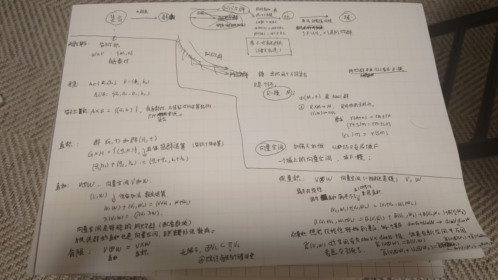

# 直积 / 直和 / 张量积 辨析

简述：在数学与物理文献中，“直积”（Direct Product）、“直和”（Direct Sum）与“张量积”（Tensor Product）常被混用。最可靠的区分方法是看它们对维度的处理：是“相加”还是“相乘”。

来源链接：

https://www.changhai.org/forum/collection_article_load.php?aid=1186358149

直积有时候称为“完全直积”，以区别于“离散直积”（就是直和）。

另外还有个叫做笛卡尔积的，这是对集合的操作。 集合上是不是线性空间，有没有算符都无所谓。

## 手写梳理图

这张图的主线是：先区分集合上的笛卡尔积与代数结构上的直积，再从群、环、模走到向量空间；有了线性结构以后，直和与张量积才成为两个不同的问题。

本文固定使用下面的记号：

- $A\times B$：集合的笛卡尔积；若 $A,B$ 带有代数结构，则运算按分量定义，称为直积。
- $V\oplus W$：向量空间或模的直和。
- $V\otimes W$：向量空间或模的张量积。

“direct product” 在不同物理教材中偶尔被用来指 tensor product，因此最终应以符号、定义和运算为准，而不能只看中文名称。

## 从集合到向量空间

### 集合：先有元素，再谈结构

设 $A,B$ 是集合。它们的笛卡尔积是

$$
A\times B=\{(a,b)\mid a\in A,\ b\in B\}.
$$

这里的元素只是有序对。仅凭这个定义，$A\times B$ 上没有加法、数乘或乘法。

笛卡尔积与并集不是一回事：$A\cup B$ 收集“来自 $A$ 或 $B$ 的元素”，而 $A\times B$ 收集“一个 $A$ 元素和一个 $B$ 元素组成的有序对”。如果还要保留元素来自哪一侧的信息，应使用不交并 $A\sqcup B$。

### 群：在笛卡尔积上按分量运算

设 $(G,\cdot)$ 与 $(H,\cdot)$ 是群。它们的直积群以 $G\times H$ 为底层集合，乘法定义为

$$
(g_1,h_1)(g_2,h_2)=(g_1g_2,h_1h_2).
$$

单位元是 $(e_G,e_H)$，逆元是 $(g,h)^{-1}=(g^{-1},h^{-1})$。因此“群的直积”并不是一种新的元素组合方式，而是给笛卡尔积配上逐分量群运算。

### 环、模与向量空间

环 $R$ 有加法和乘法；其中 $(R,+)$ 是 Abel 群，乘法满足结合律，并对加法满足分配律。乘法群通常只存在于可逆元集合 $R^\times$ 上，所以“环的乘法”本身不一定构成群。

一个左 $R$-模 $M$ 包含两部分结构：

1. $(M,+)$ 是 Abel 群；
2. 有标量作用 $R\times M\to M$，$(r,m)\mapsto rm$，满足

$$
\begin{aligned}
r(m+n)&=rm+rn,\\
(r+s)m&=rm+sm,\\
(rs)m&=r(sm).
\end{aligned}
$$

若 $R$ 有单位元，通常还要求 $1_Rm=m$。例如，每个 Abel 群都自然成为一个 $\mathbb Z$-模。

当标量环进一步是域 $\mathbb F$ 时，$\mathbb F$-模就是 $\mathbb F$ 上的向量空间。于是这条结构链可以概括为

$$
\text{集合}
\longrightarrow \text{群、环}
\longrightarrow \text{模}
\longrightarrow \text{向量空间}.
$$

直和与张量积都可以对模定义。下文先在同一域 $\mathbb F$ 上的向量空间中讨论，这样核心结构最清楚。

## 直和：把线性空间并列起来

### 外直和

对两个向量空间 $V,W$，定义

$$
V\oplus W=\{(v,w)\mid v\in V,\ w\in W\},
$$

并逐分量定义运算：

$$
\begin{aligned}
(v_1,w_1)+(v_2,w_2)&=(v_1+v_2,w_1+w_2),\\
a(v,w)&=(av,aw),\qquad a\in\mathbb F.
\end{aligned}
$$

对有限个向量空间，外直和与直积具有相同的底层集合和逐分量运算，因此 $V\oplus W$ 与 $V\times W$ 是典范同构的。写 $\oplus$ 是为了强调这里关心的是线性分解，而不只是有序对。

通过典范嵌入

$$
i_V(v)=(v,0),\qquad i_W(w)=(0,w),
$$

每个元素都有唯一分解

$$
(v,w)=(v,0)+(0,w).
$$

若 $V,W$ 有限维，则

$$
\dim(V\oplus W)=\dim V+\dim W.
$$

### 内直和

若 $U,W$ 是同一个向量空间 $X$ 的子空间，并且

$$
X=U+W,\qquad U\cap W=\{0\},
$$

则写作 $X=U\oplus W$。这两个条件等价于：每个 $x\in X$ 都能唯一写成

$$
x=u+w,\qquad u\in U,\ w\in W.
$$

外直和构造一个新空间；内直和描述一个已有空间的唯一分解。两者通过 $(u,w)\mapsto u+w$ 自然联系起来。

### 无限情形：直和与直积不再相同

对一族向量空间 $\{V_i\}_{i\in I}$，直积允许任意分量非零：

$$
\prod_{i\in I}V_i
=\{(v_i)_{i\in I}\mid v_i\in V_i\}.
$$

直和只允许有限个分量非零：

$$
\bigoplus_{i\in I}V_i
=\left\{(v_i)_{i\in I}\in\prod_{i\in I}V_i
\;\middle|\;
v_i=0\text{，除有限多个 }i\text{ 外}
\right\}.
$$

因此

$$
\bigoplus_{i\in I}V_i\subseteq\prod_{i\in I}V_i,
$$

且当指标集 $I$ 有限时二者才相等。例如，$\prod_{n=1}^{\infty}\mathbb F$ 包含所有无限序列，而 $\bigoplus_{n=1}^{\infty}\mathbb F$ 只包含最终为零的序列。

### 直和并不等于“只能二选一”

把直和记成 “OR” 是有用的物理直觉：它表示不同扇区、通道或子空间的并列。不过一般元素 $(v,w)$ 可以同时有两个非零分量；直和本身并没有要求只能选择其中一个。量子理论中的叠加态也可以跨越多个直和扇区，除非另有超选择规则。

若算符 $A:V\to V$ 与 $B:W\to W$ 分别作用于两个扇区，则

$$
(A\oplus B)(v,w)=(Av,Bw),
$$

其矩阵是块对角形式：

$$
A\oplus B=
\begin{pmatrix}
A&0\\
0&B
\end{pmatrix}.
$$

## 张量积：把双线性问题变成线性问题

### 为什么直和不够

设 $B:V\times W\to X$ 对两个变量分别线性，即

$$
\begin{aligned}
B(v_1+v_2,w)&=B(v_1,w)+B(v_2,w),\\
B(v,w_1+w_2)&=B(v,w_1)+B(v,w_2),\\
B(av,w)&=aB(v,w),\\
B(v,aw)&=aB(v,w).
\end{aligned}
$$

这叫作双线性映射。它通常不是直积向量空间 $V\times W$ 上的线性映射：因为 $a(v,w)=(av,aw)$，线性会要求

$$
B(av,aw)=aB(v,w),
$$

而双线性给出的却是

$$
B(av,aw)=a^2B(v,w).
$$

所以，有序对及其逐分量线性结构不能直接代表双线性关系。张量积正是为了解决这个问题。

### 泛性质：张量积的核心定义

张量积 $V\otimes W$ 是一个向量空间，并带有典范双线性映射

$$
\otimes:V\times W\longrightarrow V\otimes W,
\qquad (v,w)\longmapsto v\otimes w,
$$

满足以下泛性质：对任意向量空间 $X$ 和任意双线性映射 $B:V\times W\to X$，都存在唯一的线性映射

$$
\widetilde B:V\otimes W\to X
$$

使得

$$
B(v,w)=\widetilde B(v\otimes w).
$$

也就是说，每个双线性映射都唯一地经过 $V\otimes W$ 分解：

$$
V\times W
\xrightarrow{\ \otimes\ }
V\otimes W
\xrightarrow{\ \widetilde B\ }
X.
$$

这就是“把双线性映射线性化”的准确含义。

### 从有序对构造张量积

先取以 $V\times W$ 中所有有序对为基的自由向量空间 $\mathbb F^{(V\times W)}$。这里的 $[v,w]$ 只是一个形式符号。再对下列关系生成的子空间取商：

$$
\begin{aligned}
[v_1+v_2,w]&=[v_1,w]+[v_2,w],\\
[v,w_1+w_2]&=[v,w_1]+[v,w_2],\\
[av,w]&=a[v,w],\\
[v,aw]&=a[v,w].
\end{aligned}
$$

在商空间中，$[v,w]$ 的等价类记为 $v\otimes w$。于是

$$
(av)\otimes w
=a(v\otimes w)
=v\otimes(aw),
$$

并且

$$
(av)\otimes(bw)=ab(v\otimes w).
$$

要注意，$V\otimes W$ 不是只由形如 $v\otimes w$ 的纯张量组成；一般元素是有限和

$$
T=\sum_{k=1}^{r}v_k\otimes w_k,
$$

而且这个和通常不能压缩成一个纯张量。

### 基与维数

若 $\{e_i\}_{i=1}^{m}$ 是 $V$ 的基，$\{f_j\}_{j=1}^{n}$ 是 $W$ 的基，则

$$
\{e_i\otimes f_j\mid 1\le i\le m,\ 1\le j\le n\}
$$

是 $V\otimes W$ 的基。因此在有限维情形

$$
\dim(V\otimes W)=\dim V\,\dim W.
$$

一个张量可以唯一写成

$$
T=\sum_{i=1}^{m}\sum_{j=1}^{n}T^{ij}e_i\otimes f_j.
$$

“维数相乘”是识别张量积的好办法，但它是定义的结果；张量积真正的定义是上面的泛性质。

## 用同一个例子比较

令 $V=\mathbb F^2$、$W=\mathbb F^3$。

直和为

$$
V\oplus W\cong\mathbb F^5,
$$

一个元素是 $(v_1,v_2,w_1,w_2,w_3)$，它保留了“$V$ 分量”和“$W$ 分量”两个并列区块。

张量积为

$$
V\otimes W\cong\mathbb F^6,
$$

其六个基方向是 $e_i\otimes f_j$。一般元素的系数可以排成一个 $2\times3$ 矩阵 $(T^{ij})$；这六个坐标表示每个 $V$ 方向与每个 $W$ 方向的两两组合。

| 比较 | 直和 $V\oplus W$ | 张量积 $V\otimes W$ |
| --- | --- | --- |
| 目的 | 并列空间或分解扇区 | 表示双线性耦合或复合系统 |
| 典型元素 | $(v,w)$ | $\sum_k v_k\otimes w_k$ |
| 基的组织 | 两组基的并集（经嵌入） | 两组基的所有配对 |
| 有限维维数 | $\dim V+\dim W$ | $\dim V\,\dim W$ |
| 算符形式 | $A\oplus B$，块对角 | $A\otimes B$，Kronecker 结构 |
| 物理直觉 | 并列扇区、通道 | 同时存在的子系统、耦合 |

## 物理中的典型例子

### 直和：粒子数扇区与不变子空间

Fock 空间按粒子数分解为

$$
\mathcal F
=\mathcal H_0\oplus\mathcal H_1\oplus\mathcal H_2\oplus\cdots.
$$

若某个哈密顿量保持两个子空间不变，例如偶宇称与奇宇称子空间，则

$$
\mathcal H=\mathcal H_{\mathrm{even}}\oplus\mathcal H_{\mathrm{odd}},
\qquad
H=H_{\mathrm{even}}\oplus H_{\mathrm{odd}}.
$$

在几何中，乘积流形的切空间也表现为直和：

$$
T_{(p,q)}(M\times N)
\cong T_pM\oplus T_qN.
$$

所以 $\dim(M\times N)=\dim M+\dim N$。

### 张量积：复合量子系统

若系统 $A,B$ 的态空间分别为 $\mathcal H_A,\mathcal H_B$，复合系统的态空间是

$$
\mathcal H_{AB}=\mathcal H_A\otimes\mathcal H_B.
$$

纯张量 $|\psi\rangle_A\otimes|\phi\rangle_B$ 描述乘积态，而一般态

$$
|\Psi\rangle
=\sum_{i,j}c_{ij}|i\rangle_A\otimes|j\rangle_B
$$

可能无法写成单个纯张量，这正是纠缠出现的地方。只作用于子系统 $A$ 的算符写成

$$
A\otimes I_B.
$$

### 群的直积与表示空间的张量积是两层结构

若 $G,H$ 是群，$\rho:G\to\mathrm{GL}(V)$ 与 $\sigma:H\to\mathrm{GL}(W)$ 是表示，则可在 $V\otimes W$ 上定义 $G\times H$ 的表示：

$$
(g,h)\longmapsto \rho(g)\otimes\sigma(h).
$$

这里 $G\times H$ 是群的直积，$V\otimes W$ 是表示空间的张量积，右侧矩阵可用 Kronecker 积实现。三个概念同时出现，但不能因此把群的直积与张量积视为同一种运算。

## 最后判断方法

遇到含混的“直积”一词时，可以依次问：

1. 只是把两个集合的元素组成有序对吗？若是，就是笛卡尔积 $A\times B$。
2. 是让代数运算逐分量进行吗？若是，就是群、环或向量空间的直积；对有限个向量空间，它与直和典范同构。
3. 是把空间分成独立扇区，并要求元素具有唯一的分量分解吗？若是，使用直和 $\oplus$。
4. 是要表达双线性关系、所有基方向的两两组合或复合量子系统吗？若是，使用张量积 $\otimes$。

一句话概括：直和组织“并列的分量”，张量积组织“成对的方向”；有限维时前者维数相加，后者维数相乘。

参考链接：
- https://en.wikipedia.org/wiki/Tensor_product "Tensor product"
- https://cns.gatech.edu/~predrag/courses/PHYS-6124-12/StGoChap10.pdf "Vectors and Tensors (chapter)"
- https://quantum-abc.de/Tensor_products.pdf "Tensor products (intro)"
