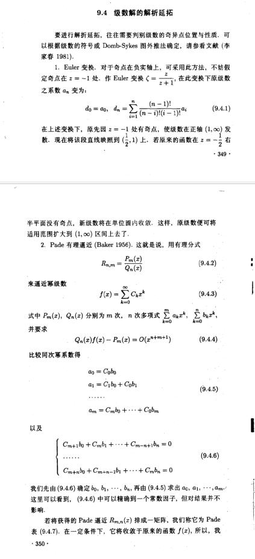

# 泛函分析 谱理论 预解resolvent算符

泛函分析 (Functional Analysis) 和谱理论 (Spectral Theory) 是研究无穷维线性空间及其线性算符性质的强大工具，在量子力学 (QM) 和量子场论 (QFT) 中具有核心地位。 其中resolvent算符是泛函分析和谱理论中最重要的概念之一。 它不仅编码了线性算符的全部谱信息，还作为格林函数和微扰理论的基础。

当然在经典物理里面这些盖概念也有很多应用， 因为人类几乎只能求解线性问题，非线性问题几乎只能微扰展开， 所以泛函分析和谱理论的工具无处不在。

而且我建议先了解经典物理里面的微扰，以免误认为发散之类的概念是量子理论特有的。 (我认为这里很多工具是为了求解流体力学，动力系统（一个偏微分，一个常微分方向）等经典物理问题而发明的， 量子力学和量子场论只是顺手拿来用了一下而已。)

推荐中文书籍, 数学物理中的渐进分析，为微扰展开打一点基础。 至于谱理论 推荐书籍？

## 泛函分析的核心思想

### 函数空间
泛函分析的核心洞见是将函数 $f(x)$ 视为一个具有无穷多个分量的向量，所有这些函数构成了一个无限维向量空间。例如，$L^2(\mathbb{R})$ 空间是所有平方可积函数的集合，也是量子力学中波函数 $\psi(x)$ 的“家园”。

### 希尔伯特空间
希尔伯特空间是泛函分析中最重要的函数空间，具有内积结构：
$$
\langle f | g \rangle = \int f^*(x) g(x) dx
$$
内积定义了几何概念，如范数、角度和正交性。量子力学的数学框架正是基于希尔伯特空间。

### 线性算符
线性算符是泛函分析中的“矩阵”，它将一个函数 $f$ 映射为另一个函数 $g = Af$。例如：
- 位置算符 $\hat{x}$：$(\hat{x}f)(x) = x \cdot f(x)$
- 动量算符 $\hat{p}$：$(\hat{p}f)(x) = -i\hbar \frac{d}{dx}f(x)$

这些算符将微分方程（如薛定谔方程 $H\psi = E\psi$）转化为无限维线性代数问题。

## 谱理论的核心内容

### 谱的分类
- **点谱 (Point Spectrum)**：对应于算符的本征值，描述束缚态（如氢原子的分立能级）。
- **连续谱 (Continuous Spectrum)**：描述散射态（如自由粒子的连续能量）。

### 预解算符
谱理论通过研究预解算符 $R(z; A) = (zI - A)^{-1}$ 来提取算符的谱信息。$R(z; A)$ 的奇点（如极点、分支切割）编码了点谱和连续谱的全部信息。

### 微扰理论工具
- **Resolvent 恒等式**：
    $$
    R = R_0 + R_0 V R
    $$
- **玻恩级数 (Born Series)**：
    $$
    R = R_0 + R_0 V R_0 + R_0 V R_0 V R_0 + \dots
    $$
- **Lippmann-Schwinger 方程**和 **Dyson 方程**：微扰理论的具体实现。
## Resolvent 的核心概念

“Resolvent” 是泛函分析（Functional Analysis）和谱理论（Spectral Theory）中最核心、最强大的概念之一。它的精髓在于，它是一个“万能钥匙”，几乎编码了一个线性系统（用算符 $A$ 描述）的全部信息。

### Resolvent 的定义

从数学上讲，给定一个线性算符 $A$（可以是一个 $N \times N$ 矩阵，也可以是一个微分算符，如 $\frac{d^2}{dx^2}$），其 Resolvent $R(z; A)$ 定义为：
$$
R(z; A) = (zI - A)^{-1}
$$
其中，$I$ 是单位算符，$z$ 是复数。

- Resolvent 是 $A$ 的“逆”，但通过复变量 $z$ 进行参数化。
- 当 $z$ 不是 $A$ 的本征值时，$R(z; A)$ 是解析的。

### Resolvent 的三大作用

#### 1. 谱的探测器 (Spectrum Detector)

Resolvent 的奇点（如极点、分支切割）揭示了算符 $A$ 的谱信息：
- **离散谱**：孤立极点对应束缚态能量。
- **连续谱**：分支切割对应散射态能量。
- **共振态**：第二黎曼片上的极点对应共振态。

通过研究 $R(z; A)$ 的奇点，可以提取 $A$ 的所有谱信息，而无需直接解 $A\psi = \lambda\psi$。

#### 2. 响应的发生器 (Green's Function)

Resolvent 是系统的格林函数。对于一个源驱动的线性系统：
$$
(A - \lambda_0) \psi = f
$$
其解为：
$$
\psi = -R(\lambda_0; A) f
$$
因此，$R(z; A)$ 描述了系统 $A$ 在频率 $z$ 下对点源的响应。

#### 3. 微扰的发动机 (Perturbation Engine)

假设 $A = A_0 + V$，其中 $A_0$ 的 Resolvent 已知，$V$ 是微扰。通过 Resolvent 恒等式：
$$
R = R_0 + R_0 V R
$$
可以迭代生成微扰级数：
$$
R = R_0 + R_0 V R_0 + R_0 V R_0 V R_0 + \dots
$$
这为微扰理论提供了系统的数学框架。

### Resolvent 的总结

Resolvent $R(z; A) = (zI - A)^{-1}$ 是一个集大成者：
- **谱的字典**：奇点揭示系统的谱。
- **响应的蓝图**：它是格林函数。
- **微扰的引擎**：生成微扰级数。
- **算符函数的定义**：通过复积分定义 $A$ 的函数。

Resolvent 将线性代数问题转化为复分析问题，是泛函分析和谱理论中的核心工具。

# Resolvent 再谈

## 谱的探测器：复平面上的“奇点”地图

你问：“Resolvent 和这些支点割线有什么关系？”关系就是：Resolvent 是一个在复平面上“活着”的函数，而算符 $A$ 的“谱” $\sigma(A)$，就是这个函数的“奇点”集合。我们来构建这个“地图”：

### “地图”的定义

- **Resolvent $R(z; A)$**: 定义为 $R(z; A) = (zI - A)^{-1}$，是一个以复数 $z$ 为变量的算符值函数。
- **Resolvent Set $\rho(A)$**: 在复平面 $z$ 上，所有使 $R(z; A)$ 存在且有界（即 $(zI-A)$ 可逆）的点，构成了“安全”区域。在这些点上，$R(z; A)$ 是解析的（analytic）。
- **谱 $\sigma(A)$**: 在复平面 $z$ 上，所有使 $R(z; A)$ 不存在或无界（即 $(zI-A)$ 不可逆）的点，构成了“危险”区域。这些点就是 $R(z; A)$ 的奇点。

### “危险区域” (奇点) 的分类

对于量子力学中的厄米算符 $A$（$A = A^\dagger$），它的谱 $\sigma(A)$ 必须位于实轴上。Resolvent 在实轴上的“奇点”形态，精确地对应了不同谱的分类：

#### 离散谱 (Point Spectrum) $\to$ 孤立极点 (Isolated Poles)

- **数学**: 假设 $\lambda_n$ 是 $A$ 的一个离散本征值（束缚态能量），对应的本征态为 $|\psi_n\rangle$。在 $z \approx \lambda_n$ 附近，Resolvent 的矩阵元 $\langle \phi | R(z) | \chi \rangle$ 的主导行为是：
    $$
    \langle \phi | (zI - A)^{-1} | \chi \rangle \approx \frac{\langle \phi | \psi_n \rangle \langle \psi_n | \chi \rangle}{z - \lambda_n} + (\text{其他解析部分})
    $$
    结论： $R(z; A)$ 在复平面 $z$ 上的每一个离散本征值 $\lambda_n$ 处，都有一个一级极点 (simple pole)。
- **物理**: 探测这个 Resolvent 函数，找到它在实轴上的所有“杆子”（poles），你就找到了系统的所有“束缚态”能量。

#### 连续谱 (Continuous Spectrum) $\to$ 分支切割 (Branch Cuts)

- **数学**: 假设 $A$ 的谱在 $[E_{min}, \infty)$ 上是连续的（散射态能量）。$R(z; A)$ 的矩阵元包含一个积分：
    $$
    \langle \phi | R(z) | \chi \rangle = \int_{E_{min}}^{\infty} dE \frac{\langle \phi | \psi_E \rangle \langle \psi_E | \chi \rangle}{z - E} + (\text{束缚态的极点})
    $$
    这个积分定义了一个在实轴 $[E_{min}, \infty)$ 上有“分支切割”的函数。根据 Sokhotski–Plemelj 定理，这个积分的值会“跳变”：
    $$
    \lim_{\epsilon \to 0^+} \frac{1}{E_0 \pm i\epsilon - E} = \mathcal{P}\left(\frac{1}{E_0 - E}\right) \mp i\pi \delta(E_0 - E)
    $$
    （$\mathcal{P}$ 表示柯西主值）
    结论： $R(z; A)$ 在 $[E_{min}, \infty)$ 这条线上是不连续的。这条不连续的线，就是一个分支切割 (Branch Cut)。
- **物理**: 系统的“连续谱”在 Resolvent 上的体现，就是一条它无法跨越的“割线”。

#### 共振态 (Resonances) $\to$ 第二黎曼片上的极点

- **数学**: 割线 $[E_{min}, \infty)$ 把复平面分成了“两半”。$R(z; A)$ 可以被解析延拓到“第二”（“非物理”）黎曼片。一个共振态表现为 $R(z; A)$ 在第二黎曼片上的一个极点：
    $$
    z_{res} = E_0 - i\frac{\Gamma}{2}
    $$
    实部 $E_0$ 是共振能量，虚部 $\Gamma/2$ 决定了它的衰变宽度（寿命 $\tau = \hbar/\Gamma$）。
- **物理**: Resolvent 的“地图”比我们想象的要大。在“地图”的“背面”（第二黎曼片），藏着所有“共振态”的极点。

## 响应的发生器 (Green's Function)

你对这部分的总结已经非常精确了。我只补充一点数学上的“翻译”：

### 算符 $\to$ 积分核 (Kernel)

你写的 $\psi = -R(\lambda_0; A) f$ 是一个抽象的算符方程。在位置表象中，这个方程“翻译”为：
$$
\langle x | \psi \rangle = - \int dy \, \langle x | R(\lambda_0; A) | y \rangle \langle y | f \rangle
$$
我们定义 $G(x, y; \lambda_0) \equiv \langle x | R(\lambda_0; A) | y \rangle$。这就是你熟悉的格林函数方程：
$$
\psi(x) = - \int dy \, G(x, y; \lambda_0) f(y)
$$
$G(x, y; \lambda_0)$ 被称为 Resolvent 算符的积分核 (Integral Kernel)。

**精髓**: Resolvent 是抽象的算符，而格林函数是它在某个具体表象（如位置表象）下的“矩阵元”。

## 为什么微扰“能够成立”？

这个问题是微扰论的核心：“为什么这个无穷级数 $R = R_0 + R_0 V R_0 + \dots$ 能够成立？”答案是：它“成立”有两种截然不同的含义，这两种含义对应了两种不同的数学结构。

### 含义一：“收敛级数” (Convergent Series)

$R = R_0 (I - V R_0)^{-1}$。我们把它展开成 $R = R_0 \sum_{n=0}^\infty (V R_0)^n$。这是一个算符的几何级数（Geometric Series）。

- **什么时候成立？** 这个级数绝对收敛 (converges) 的充分条件是，它的“公比”的**范数（Norm）**小于1：
    $$
    \| V R_0 \| < 1
    $$
    $R_0(z) = (zI - A_0)^{-1}$ 的“大小”取决于 $z$ 离 $A_0$ 的谱（本征值）有多远。

- **物理含义**: 如果微扰 $V$ 足够“小”，并且探测的能量 $z$ 离系统的“裸”能级（$A_0$ 的谱）足够“远”，那么这个级数就会收敛。

### 含义二：“渐近级数” (Asymptotic Series)

这是物理学中（尤其是 QFT）更常见也更深刻的情况。

- **定义**: 一个级数 $S_N = \sum_{n=0}^N c_n \lambda^n$ 即使在 $N \to \infty$ 时发散，它也可以是 $S(\lambda)$ 的一个“渐近”表示。如果“截断误差”满足：
    $$
    | S(\lambda) - S_N(\lambda) | = O(\lambda^{N+1}) \quad (\text{当 } \lambda \to 0 \text{ 时})
    $$
    我们就称这个（可能发散的）级数是 $S(\lambda)$ 的渐近级数。

- **物理含义**: 这意味着，对于一个固定的项数 $N$，当耦合常数 $\lambda \to 0$ 时，这个近似解 $S_N(\lambda)$ 会快速逼近真实解 $S(\lambda)$。

### 总结

Resolvent 恒等式 $R = R_0 + R_0 V R$ 是精确的、非微扰的。它的迭代级数 $R = R_0 + R_0 V R_0 + \dots$ 为什么“成立”？

- 在“良好”的系统（如 QM 束缚态）中：因为它是一个收敛级数（只要 $V$ 足够小）。
- 在“病态”的系统（如 QFT）中：因为它是一个渐近级数。它虽然在 $n \to \infty$ 时发散，但它的“前几项”提供了对真实物理的极其精确的近似。

## 微扰展开 截断

发散级数并非无用，比如斯特林公式的渐近展开：
$$n! \sim \sqrt{2\pi n} \left(\frac{n}{e}\right)^n \left(1 + \frac{1}{12n} + \frac{1}{288n^2} - \frac{139}{51840 n^3} + \dots \right)$$

比如余误差函数的渐近展开：
$$\operatorname{erfc}(x) \sim \frac{e^{-x^2}}{x\sqrt{\pi}}\left(1 - \frac{1}{2x^2} + \frac{3}{4x^4} - \frac{15}{8x^6} + \dots\right) \quad (x \to +\infty)$$

级数收敛性的改进 shanks变换：

级数解的解析延拓

## 重整化

重整化 (Renormalization) 是一套“数学处方”，它告诉我们如何构造 (construct) 微扰级数的每一项 $S_n$。  
渐近分析 (Asymptotic Analysis) 是一种“哲学诠释”，它告诉我们为什么这个（即使项项有限但整体发散的）级数 $\sum S_n$ 值得计算。  
而谱理论 (Spectral Theory) 是我们这一切的终极目标：我们做这一切，就是为了计算“真实”算符 $A$ 的谱（即 Resolvent $R(z; A)$ 的奇点）。

---

### 1. 谱理论的“理想” vs QFT 的“灾难”

我们从谱理论的“理想”出发：

- **理想（目标）**：  
    我们想求解一个“真实”的、相互作用的系统 $A$。我们想找到它的 Resolvent $R(z; A) = (zI - A)^{-1}$。  
    因为 $R$ 的极点（Poles）就是我们想知道的物理谱（例如，实验中测量的“物理质量” $m_p$）。

- **策略（微扰）**：  
    我们不会解 $A$，我们只会解“自由”系统 $A_0$（它的 Resolvent $R_0 = (zI - A_0)^{-1}$ 是已知的，极点在“裸质量” $m_0$ 处）。

- **发动机**：  
    我们用 Resolvent 恒等式 $R = R_0 + R_0 V R$ 来“构建” $R$。
    $$
    R = R_0 + R_0 V R_0 + R_0 V R_0 V R_0 + \dots
    $$
    在 QFT 中，$R_0 V R_0$ 这样的项，就对应“1-loop”费曼图，$R_0 V R_0 V R_0$ 就对应“2-loop”费曼图，等等。

- **灾难（QFT的现实）**：  
    当我们真的去计算 QFT 中的这些项时，我们发现它们是无穷大。  
    比如，在 $\lambda\phi^4$ 理论中，1-loop 自能图 $\Sigma$（它就是 $V R_0$ 这类项的核心）的积分是：
    $$
    \int d^4k \frac{1}{k^2 - m_0^2}
    $$
    这个积分在 $k \to \infty$ 时是发散的 (Divergent)。

- **后果**：  
    我们的微扰级数 $R = R_0 + (\infty) + (\infty)^2 + \dots$ 根本无法计算。我们连级数的第一项修正都写不出来。

---

### 2. 重整化：强行“构造”级数项 $S_n$

重整化 (Renormalization) 不是一个深刻的物理原理，它是一套极其精巧的“数学急救术”，其唯一目的，就是为了让我们能够写出微扰级数的（有限的）每一项。  
它在“渐近分析”和“谱理论”的框架下，扮演了如下角色：

#### 第一步：承认“裸”参数的“病态” (Regularization)

我们不能处理 $\infty$。所以我们引入一个“调节器”（Regularization），比如一个紫外截止 $\Lambda$。  
现在，所有的圈图积分都是有限的，但它们依赖于 $\Lambda$（例如 $\Sigma(\Lambda) \sim \Lambda^2$）。  
我们的 Resolvent 级数变成了：
$$
R(z; \Lambda) = R_0 + S_1(\Lambda) + S_2(\Lambda) + \dots
$$

#### 第二步：重新定义“起点” $A_0$ (Renormalization)

这是最核心的诡计。我们原来的目标是：从“裸谱” $m_0$（$R_0$的极点）出发，计算出“物理谱” $m_p$（$R$的极点）。  
我们的计算（在谱理论中）表明：
$$
m_p^2 = m_0^2 + \delta m^2(\Lambda)
$$
其中 $\delta m^2(\Lambda)$ 就是那个发散的自能 $\Sigma(\Lambda)$。当 $\Lambda \to \infty$ 时，$\delta m^2(\Lambda) \to \infty$。

- **重整化说**：  
    倒过来！我们不认识什么“裸质量” $m_0$。我们只认识我们在实验室测量的“物理质量” $m_p$。  
    我们强行定义（“重整化条件”）$m_p$ 是一个有限的、已知的数。这就迫使我们的“裸质量” $m_0$ 必须是一个依赖于 $\Lambda$ 的“反常项” (Counter-term)：
    $$
    m_0^2(\Lambda) \equiv m_p^2 - \delta m^2(\Lambda)
    $$
    当 $\Lambda \to \infty$ 时，这个“裸质量” $m_0^2(\Lambda)$ 也必须是 $\to -\infty$，它被精确地定义为那个可以抵消掉 $\delta m^2(\Lambda)$ 的无穷大。

- **结果**：  
    一个“可用”的微扰级数  
    通过这个“用无穷抵消无穷”的重新定义，我们成功地**重写（re-write）**了我们的 Resolvent 级数。

    - 原始的（发散的）级数：  
        $$
        R = R_0(m_0) + S_1(m_0, \lambda_0) + \dots
        $$

    - 重整化后的（有限的）级数：  
        $$
        R = R_p(m_p) + S'_1(m_p, \lambda_p) + S'_2(m_p, \lambda_p) + \dots
        $$
        在这个新级数中，每一项 $S'_n$ 都是有限的（在 $\Lambda \to \infty$ 极限下）。

---

### 3. 渐近分析：给这个“构造”赋予意义

好了，通过“重整化”，我们终于有了一个级数 $R \approx \sum_{n=0}^N S'_n$。我们安全了吗？没有。  
物理学家（特别是 Freeman Dyson）很快意识到，这个“重整化后”的 QED 级数（一个关于 $\alpha \approx 1/137$ 的级数）它自己很可能也是发散的（当 $n \to \infty$ 时）！

#### 为什么？（Dyson的启发式论证）

假设 QED 级数是收敛的。那么 $R(\alpha)$ 在 $\alpha=0$ 附近是解析的。这意味着 $R(\alpha)$ 在 $\alpha = -1/137$ （一个小的负值）也应该是收敛的、有意义的。  
但是，一个 $\alpha < 0$ 的 QED（同性电荷相吸，异性电荷相斥）是一个极度不稳定的理论。真空会“衰变”，系统会“崩溃”。  
一个“崩溃”的理论不可能有一个定义良好的 Resolvent。这表明 $R(\alpha)$ 在 $\alpha=0$ 这一点不可能是解析的（它有一个本质奇点 (Essential Singularity)）。  
如果 $R(\alpha)$ 在 $\alpha=0$ 不是解析的，那么它的泰勒级数（微扰级数）的收敛半径必定为 0。

- **结论**：  
    微扰级数 $\sum S'_n$ 必定在 $n \to \infty$ 时发散！

#### 那我们到底在干什么？

这就是渐近分析登场的地方。微扰级数 $\sum S'_n$ 不是一个“收敛级数”，它是一个“渐近级数”。  
它的“意义”不在于 $n \to \infty$ 的总和，而在于它在 $\lambda \to 0$ 时的行为。

- **渐近分析的视角**：  
    我们“重整化”所辛苦构造出来的级数 $\sum S'_n$，它在数学上是 “真实”Resolvent $R(\lambda)$ 在 $\lambda=0$ 处的渐近展开。
    $$
    R(\lambda) \sim \sum_{n=0}^N S'_n \lambda^n + O(\lambda^{N+1})
    $$

---

### 最终总结：三者的角色

- **谱理论（目标）**：  
    我们的目标是找到“真实”算符 $A$ 的谱（Resolvent $R$ 的极点）。这个真实的谱 $m_p$ 是有限的。

- **微扰 + 重整化（构造过程）**：  
    我们假设 $R$ 可以按 $\lambda$ 展开 $R \sim \sum S'_n \lambda^n$。  
    我们发现 $S'_n$ 充满了 $\infty$（来自 $R_0 V \dots$ 的圈图）。  
    重整化是一个“黑魔法”，它通过定义 $A_0$ 和 $V$ 中的“反常项” $\delta m(\Lambda)$，强行使得这个展开式中的每一个系数 $S'_n$ 都是有限的（用物理谱 $m_p$ 来表达）。

- **渐近分析（意义诠释）**：  
    我们承认，我们构造出来的这个级数 $\sum S'_n \lambda^n$ 本身是发散的（当 $n \to \infty$）。  
    但我们指出，它是一个渐近级数。因此，计算它的前几项（比如到 $S'_2$，即 two-loop），是有意义的、且是（目前）唯一可行的，用以近似那个“真实”但我们无法企及的 $R(\lambda)$ 的方法。