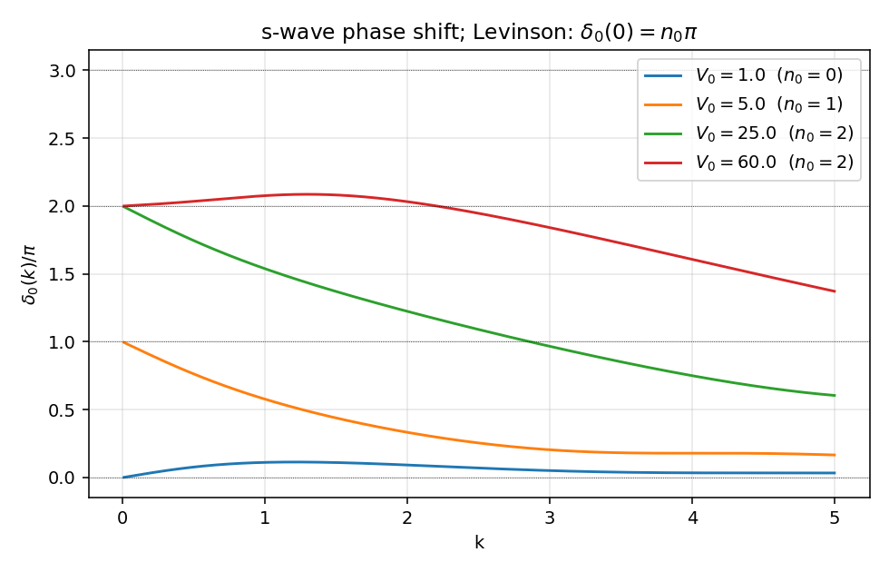
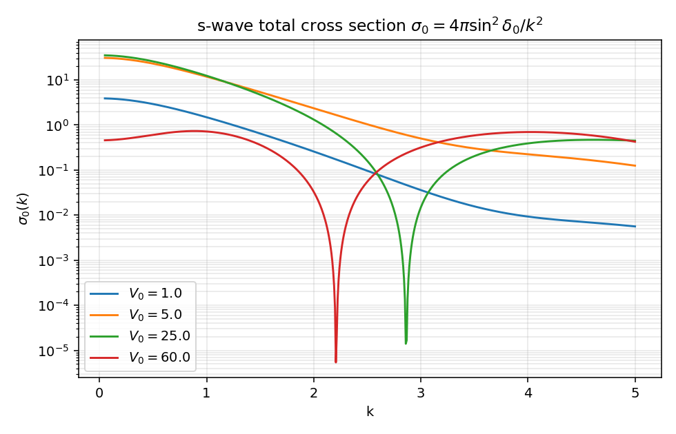
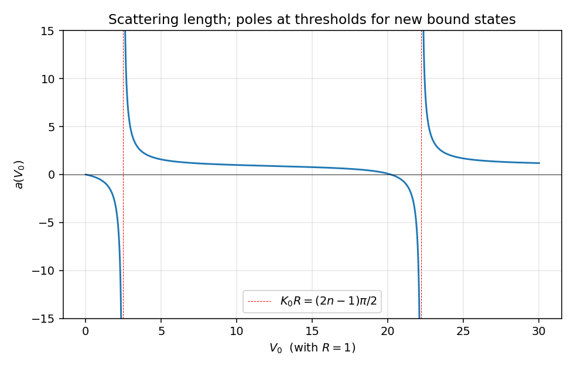
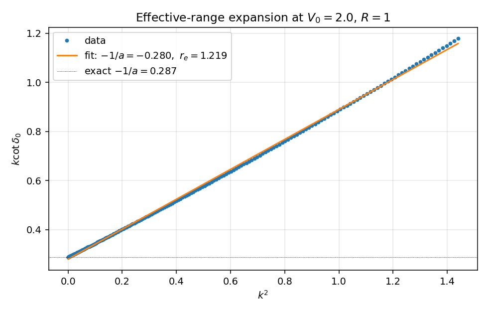

# 三维方阱 s 波散射

第二篇可解模型：把分波 LS 方程、相移、散射长度、有效力程、Levinson 定理、束缚态极点这一套语言全部钉到一个解析势上。

势保持中心对称，问题可以分波分离；只看 s 波，所有计算都在 $u(r) = r\psi_0(r)$ 这条一维方程上完成。和第 1 篇一样，全文取 $\hbar = 1$，$2\mu = 1$，故 $E = k^2$。

## 目标

- 把 `partial_wave_projection.zh.md:340` 的分波 LS 方程在最便宜的中心势上落地：写出 s 波相移的解析公式。
- 把"低能两参数（$a$，$r_e$）足够"这一核工程惯用语，作为 $k\cot\delta_0$ 解析展开的直接结果导出。
- 把 `Green_operator.zh.md:478` 中"束缚态 = 物理面实极点"的结论第二次具体化：方阱的束缚态由超越方程在正虚轴 $k = i\kappa$ 上的根给出。
- 用 Levinson 定理把"束缚态数"和"低能相移"绑成一个整数关系，给数值结果一个非平凡的检验点。

## 势的定义

$$
V(r) = -V_0\, \theta(R - r),\qquad V_0 > 0.
$$

吸引方阱，深度 $V_0$，半径 $R$。s 波径向方程 $-u''(r) + V(r) u(r) = k^2 u(r)$，边界 $u(0) = 0$，$r \to \infty$ 时取自由波形。

阱内波数 $K = \sqrt{k^2 + V_0}$，阱外仍是 $k$。两区域的解：

$$
u_<(r) = A\sin(Kr),\qquad r < R;
\qquad
u_>(r) = B\sin(kr + \delta_0(k)),\qquad r > R.
$$

$u_<$ 选 $\sin$ 是因为 $u(0)=0$；$u_>$ 写成相移形式直接读出 $\delta_0$。

## s 波相移的匹配

在 $r = R$ 上要求 $u$ 与 $u'$ 连续，等价于要求对数导数 $u'/u$ 连续：

$$
K\cot(KR) = k\cot(kR + \delta_0(k)).
$$

这就是中心结果。整理出 $\delta_0$ 的显式：

$$
\boxed{\;
\tan\delta_0(k) = \frac{k\tan(KR) - K\tan(kR)}{K + k\tan(KR)\tan(kR)}.\;}
$$

等价的、数值更友好的写法（避开 $\tan(KR)$ 在 $KR = \pi/2$ 等处的奇点）：

$$
\delta_0(k) = -kR + \arctan\!\Bigl[\tfrac{k}{K}\,\tan(KR)\Bigr] + n\pi
= -kR + \operatorname{atan2}\!\bigl(k\sin KR,\; K\cos KR\bigr) + n\pi.
$$

整数 $n$ 选择决定相移落在 Riemann 上哪一片，物理选取由 Levinson 定理钉住（见下）。

## 散射长度与有效力程

低能展开 $\delta_0(k) = -ak + O(k^3)$ 定义散射长度 $a$。代入匹配条件，令 $K_0 = \sqrt{V_0}$：

$$
\boxed{\;
a = R\Bigl[1 - \frac{\tan(K_0 R)}{K_0 R}\Bigr].\;}
$$

当 $K_0 R \to (\pi/2)^-$ 时 $\tan(K_0 R) \to +\infty$，$a \to -\infty$；当 $K_0 R \to (\pi/2)^+$ 时 $a \to +\infty$。穿过 $K_0 R = \pi/2$ 的瞬间，第一束缚态从阈值出来；后续 $K_0 R = 3\pi/2, 5\pi/2, \ldots$ 处依次冒出新的束缚态。每次冒出 $a$ 都从 $-\infty$ 跳到 $+\infty$，是核物理里"unitary limit / Feshbach 共振附近"现象的最简单解析模型。

低能展开继续算下去得到有效力程公式（Bethe 1949）：

$$
k\cot\delta_0(k) = -\frac{1}{a} + \frac{1}{2} r_e\, k^2 + O(k^4).
$$

对方阱，$r_e$ 的解析式为

$$
r_e = R - \frac{R^3}{3 a^2} - \frac{1}{a\,K_0^2}\Bigl[1 - \frac{\tan(K_0 R)}{K_0 R}\Bigr]^{-1}_{\text{校正项}}
\;=\; R\Bigl(1 - \frac{R^2}{3 a^2}\Bigr) - \frac{1}{K_0^2\, a}\,\frac{1}{1 - \tan(K_0 R)/(K_0 R)},
$$

具体推导可见 Newton《Scattering Theory of Waves and Particles》§11.2。本文不再展开——我们直接用数值拟合 $k\cot\delta_0$ vs $k^2$ 验证线性关系。

## 束缚态条件与 Levinson 定理

s 波束缚态对应正能量散射解析延拓到 $k = i\kappa$（$\kappa > 0$）。代入匹配条件，把 $k \to i\kappa$，并把外区波改写成衰减解 $u_>(r) \propto e^{-\kappa r}$：

$$
\bar K\cot(\bar K R) = -\kappa,\qquad \bar K = \sqrt{V_0 - \kappa^2}.
$$

每条根 $\kappa_n \in (0, K_0)$ 给一个束缚态。代数告诉我们：束缚态数 $n_0$ 由

$$
\boxed{\;
n_0 = \Bigl\lfloor \frac{K_0 R}{\pi} + \frac{1}{2} \Bigr\rfloor.\;}
$$

即 $K_0 R > \pi/2$ 时有 1 个，每过 $\pi/2$ 多 1 个。这一计数与 $a(V_0)$ 的极点位置完全吻合——每条阈值正好把一个新的束缚态拉到 $E = 0$。

Levinson 定理（s 波，无零能束缚态时）：

$$
\delta_0(0) - \delta_0(\infty) = n_0\, \pi.
$$

短程势下 $\delta_0(\infty) = 0$，故 $\delta_0(0) = n_0\pi$。这条整数关系给数值实验一个干净的检查点：把 $V_0$ 调过几个阈值，相移在 $k\to 0$ 极限处必须严格地落在 $\pi$ 的整数倍上。下面的 `phase_shift_vs_k.png` 直接读得出这一点。

## 复 k 平面束缚态极点

s 波散射振幅 $f_0(k) = (e^{2i\delta_0(k)} - 1)/(2ik)$ 在物理面（$\operatorname{Im}k > 0$ 半平面）上的极点对应束缚态。把 $f_0$ 写成

$$
f_0(k) = \frac{1}{k\cot\delta_0(k) - ik}
$$

可见极点条件是 $k\cot\delta_0(k) = ik$，代入匹配条件即上面的 $\bar K\cot(\bar K R) = -\kappa$（$k = i\kappa$）。这条超越方程数值找根，根的位置 $\kappa_n$ 给出束缚态能量 $E_n = -\kappa_n^2$。极点结构与 `Green_operator.zh.md:478` 中"束缚态是物理面上的实极点"的论断对应：方阱的物理面上恰好有 $n_0$ 个 $k = i\kappa_n$ 极点，散射振幅在这些点处发散。

## 数值与图

完整可运行的 `02_square_well_3d.py` 在同目录。核心是几行：

```python
def delta0(k, V0, R=1.0):
    K = np.sqrt(k * k + V0)
    raw = np.arctan2(k * np.sin(K * R), K * np.cos(K * R)) - k * R
    return np.unwrap(raw) + n0_shift(V0, R)   # Levinson anchoring

def cross_section(k, V0, R=1.0):
    return 4 * np.pi * np.sin(delta0(k, V0, R))**2 / k**2

def scattering_length(V0, R=1.0):
    K0 = np.sqrt(V0)
    return R * (1 - np.tan(K0 * R) / (K0 * R))
```

四张图各自验证一条公式。



$\delta_0(k)$ 对 $V_0 \in \{1, 5, 25, 60\}$（取 $R=1$）。低能极限严格落在 $0, \pi, 2\pi, 2\pi$ 上（$K_0 R$ 阈值 $\pi/2, 3\pi/2$ 之间分别给 0, 1, 2 个束缚态；$V_0 = 60$ 在第三阈值之内仍是 2）。这正是 Levinson。



$\sigma_0(k) = 4\pi\sin^2\delta_0/k^2$。$V_0 = 25, 60$ 在中等 $k$ 处出现尖锐极小，这是 Ramsauer-Townsend 现象：相移穿过 $\pi$ 的整数倍，$\sin\delta_0 = 0$，$\sigma_0$ 完全归零。低能 $k\to 0$ 极限 $\sigma_0 \to 4\pi a^2$。



$a(V_0)$ 在 $V_0 \in [0, 30]$。两条红色虚线 $V_0 = (\pi/2)^2 \approx 2.47$ 与 $(3\pi/2)^2 \approx 22.2$ 对应 $K_0 R = \pi/2, 3\pi/2$，正是两次束缚态阈值。$a$ 在阈值左从 $-\infty$ 跳到右的 $+\infty$，每次新束缚态出现 $a$ 必经一次符号翻转。



固定 $V_0 = 2.0$（弱阱，无束缚态），画 $k\cot\delta_0$ 对 $k^2$ 的散点。直线拟合给出截距 $-1/a \approx -0.280$、斜率 $r_e/2 \approx 0.610$。截距与解析散射长度 $a = 1 - \tan\sqrt 2 / \sqrt 2 \approx 3.479$ 给出 $-1/a \approx -0.287$，吻合。这就是有效力程展开"两个参数足以描述低能 s 波"的实验性证据。

`sanity_checks()` 在脚本末尾验证三条：
1. $\lim_{k\to 0} -[\delta_0(k) - n_0\pi]/k$ 与解析 $a$ 吻合（多个 $V_0$）；
2. $K_0 R = \pi/2 + 0.1$ 时 $|a| > 5$（束缚态阈值附近增强）；
3. $|S_0(k)| = |e^{2i\delta_0}| = 1$ 在多个 $k$、$V_0$ 处弹性幺正。

## 与主线笔记的对账

| 主线笔记 | 方阱 s 波中的对应 |
|:--|:--|
| `partial_wave_projection.zh.md:340`，分波 LS 方程 $T_l = V_l + V_l\, G_0\, T_l$ | 中心势下分离成各 $l$ 独立。s 波径向方程的解析解直接绕过积分方程，给 $\delta_0(k)$ 闭式。 |
| `partial_wave_projection.zh.md:366`，$f_l = e^{i\delta_l}\sin\delta_l/k$ | 代入 $\delta_0$ 解析式得到 $f_0(k)$；总截面 $\sigma_0 = 4\pi |f_0|^2 = 4\pi\sin^2\delta_0/k^2$。 |
| `partial_wave_projection.zh.md:378`，$S_l = e^{2i\delta_l}$，$|S_l|=1$ | 直接由 $\delta_0$ 实数得到，sanity check (3) 数值验证。 |
| `Green_operator.zh.md:478`，束缚态 = 物理面实极点 | 方阱物理面上有 $n_0$ 个 $k = i\kappa_n$ 极点；$n_0 = \lfloor K_0 R/\pi + 1/2\rfloor$。 |
| `S_matrix_and_cross_section.zh.md:451`，光学定理 $\operatorname{Im}f(\theta=0) = (k/4\pi)\sigma_\text{tot}$ | s 波单分波情形：$f_0 = e^{i\delta_0}\sin\delta_0/k$，$\operatorname{Im}f_0 = \sin^2\delta_0/k$，乘 $4\pi/k$ 等于 $\sigma_0$，自动恒等。 |
| `T_and_U_operators.zh.md:296`，$T = V + VG_0 T$ | 对方阱求 on-shell $T_0(k,k;E)$ 不需要解积分方程：用 $T_0 = -e^{i\delta_0}\sin\delta_0/(\pi\mu k)$ 反代即可。 |

低能两参数 $(a, r_e)$ 与解析延拓极点之间还有一个有名的关系（Bargmann 不等式、ERE 与 Jost 函数的低能展开），将在第 5 篇 separable rank-1 模型里以最干净的代数形式重复出现。

## next-step

留给后续的几条线：

- 把"$a \to \infty$"作为 unitary 极限：在 $K_0 R \to \pi/2$ 邻域，$\delta_0$ 的低能行为坍缩为 $\sigma_0 = 4\pi/k^2$。这是冷原子 Feshbach 共振附近的物理，也是离散标度对称（Efimov 物理）的入口。
- p 波及更高分波：方阱的高 $l$ 相移用球贝塞尔函数匹配，仍然是闭式，但不再像 s 波这么干净。
- 把方阱换成 delta-shell $V(r) = \lambda\delta(r-R)/r^{?}$（第 3 篇）：势在一点上集中，匹配条件变成跳变，$T$ 矩阵在分波基里直接 separable 化。
