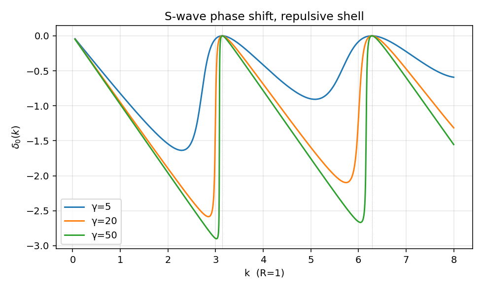
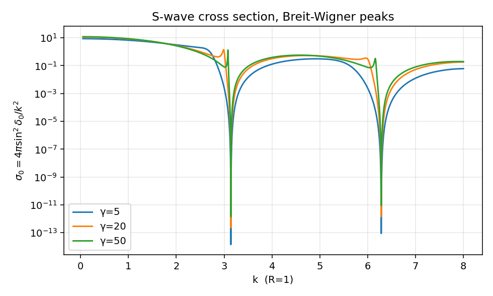
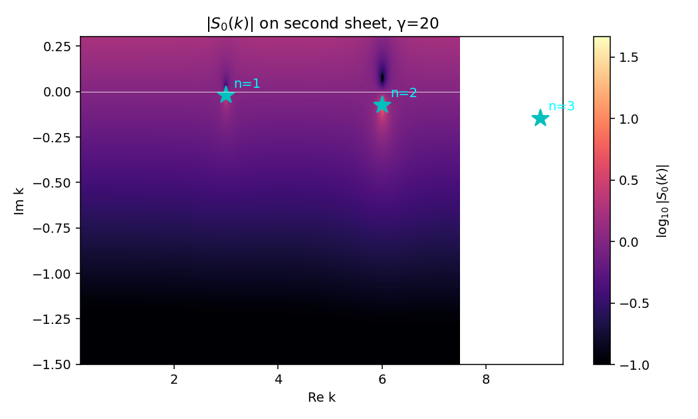
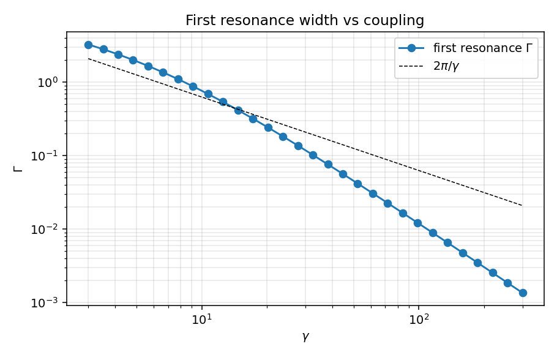

# 三维 delta 壳层势的散射与共振

上一篇一维 delta 势把 $S$ 矩阵、束缚态极点、$T$ 算符的最小骨架都写在了一行代数里，但那里没有共振——一维 delta 太"简单"，整张复 $k$ 平面只有一个极点。这一篇换成最小但能产生共振的三维势：一层无限薄的球面壳。它有什么好处？强排斥壳把内部空腔围成一个准盒子，盒子的束缚能级泄漏成共振；调节壳强度 $\gamma$，能直接看着 Breit-Wigner 峰从无到有，对应的复极点从远离实轴一步一步靠过来。这正是 `friedrichsModel.zh.md` 中"耦合 $g(E)$ 强而局部"图像的真实可解版本。

全文取 $\hbar = 1$，$2\mu = 1$，$E = k^2$。只看 s 波 ($l=0$)。

## 势的定义

$$
V(r) = \frac{\gamma}{R}\,\delta(r - R), \qquad \gamma \in \mathbb R,
$$

$\gamma$ 无量纲，$R$ 是壳层半径。$\gamma > 0$ 排斥，$\gamma < 0$ 吸引。约定 $\hbar=1, 2\mu=1$ 让势的系数化简为 $\gamma/R$（任何文献里见到的"$2\mu$"全部吸进 $\gamma$）。

s 波径向方程对 $u(r) = r\psi_0(r)$：

$$
-u''(r) + \frac{\gamma}{R}\,\delta(r-R)\,u(r) = k^2\, u(r), \qquad u(0) = 0.
$$

匹配条件由方程对 $r$ 在 $[R-\epsilon, R+\epsilon]$ 上积分得到：

- 连续性：$u(R^+) = u(R^-)$；
- 导数跳变：$u'(R^+) - u'(R^-) = (\gamma/R)\, u(R)$。

## s 波相移

内外区域写成

$$
u_<(r) = A\,\sin(kr), \qquad u_>(r) = B\,\sin(kr + \delta_0).
$$

代入两条匹配条件，从连续性 $B = A\sin(kR)/\sin(kR+\delta_0)$，把它代回跳变条件并整理：

$$
\sin(kR)\cos(kR+\delta_0) - \cos(kR)\sin(kR+\delta_0) = \frac{\gamma}{kR}\,\sin(kR)\sin(kR+\delta_0).
$$

左边 $=\sin(kR-(kR+\delta_0)) = -\sin\delta_0$，于是

$$
-\sin\delta_0 = \frac{\gamma}{kR}\,\sin(kR)\,\sin(kR+\delta_0).
$$

展开 $\sin(kR+\delta_0)$，两边除以 $\cos\delta_0$ 解出

$$
\boxed{\;\tan\delta_0(k) = -\,\frac{\gamma\,\sin^2(kR)}{kR + \gamma\,\sin(kR)\cos(kR)}.\;}
$$

等价地

$$
\cot\delta_0(k) = -\cot(kR) - \frac{kR}{\gamma\,\sin^2(kR)}.
$$

两条立刻可读出的极限：

- $\gamma \to 0$：$\tan\delta_0 \to 0$，相移消失，势消失。
- $\gamma \to \infty$：$\tan\delta_0 \to -\sin^2(kR)/[\sin(kR)\cos(kR)] = -\tan(kR)$，即 $\delta_0 \to -kR \pmod \pi$。这正是半径 $R$ 不可穿透硬球的 s 波相移——壳被打到无穷强就成了硬墙。

中间的有限 $\gamma$ 就是共振区域。

## 共振条件

注意 $\tan\delta_0$ 的分母 $kR + \gamma\sin(kR)\cos(kR) = kR + (\gamma/2)\sin(2kR)$。$\gamma$ 很大时，它在 $kR \approx n\pi$（$n=1,2,\dots$）附近近似为 $kR$（因为 $\sin(2n\pi)=0$），但 $\gamma$ 很大同时分子 $\gamma\sin^2(kR)$ 在 $kR$ 略偏离 $n\pi$ 时迅速膨胀，所以 $\tan\delta_0$ 在 $kR \approx n\pi$ 附近从大正到大负扫一遍——$\delta_0$ 经过 $\pi/2$，这就是 Breit-Wigner 共振的解析特征。

物理图像：$\gamma \to \infty$ 极限内部是硬墙盒子，s 波束缚能级精确地满足 $\sin(kR)=0$，即 $kR = n\pi$，$E_n = (n\pi/R)^2$。有限 $\gamma$ 时这些"束缚态"通过壳泄漏出去，变成有限寿命的共振，能量略偏移、获得宽度 $\Gamma$。这是 `Green_operator.zh.md:478` 里"束缚态是物理面上的实极点，共振是解析延拓后第二张面上的复极点"那条结论的具体实现。

## 复 k 平面上的极点

$S_0(k) = e^{2i\delta_0(k)} = (1+i\tan\delta_0)/(1-i\tan\delta_0)$。$S_0$ 的极点对应 $\tan\delta_0(k) = -i$，代入显式表达式得

$$
kR + \gamma\,\sin(kR)\cos(kR) + i\gamma\,\sin^2(kR) = 0.
$$

这是一个超越方程，需要数值求解。物理上对应衰变态的极点位于第二张 Riemann 面，复 $k$ 平面下半 ($\mathrm{Im}\,k < 0$)；用 $E = k^2$ 映回去就是 $E_R - i\Gamma/2$，与 `friedrichsModel.zh.md:551` 中的 $z_*$ 一一对应。

把极点写成 $k_n = k_n^{\rm R} + i k_n^{\rm I}$ ($k_n^{\rm I} < 0$)，能量

$$
E_n = (k_n^{\rm R})^2 - (k_n^{\rm I})^2 + 2i\,k_n^{\rm R}\,k_n^{\rm I} \equiv E_R - i\Gamma/2,
\qquad \Gamma = -4\,k_n^{\rm R}\,k_n^{\rm I} > 0.
$$

数值上（见下节脚本，$\gamma=20$，$R=1$）头三个共振的极点为

$$
\begin{aligned}
k_1 &= 2.9958 - 0.0205\,i, & E_1 &= 8.974 - 0.123\,i, & \Gamma_1 &\approx 0.246, \\
k_2 &= 6.0109 - 0.0744\,i, & E_2 &= 36.13 - 0.894\,i, & \Gamma_2 &\approx 1.788, \\
k_3 &= 9.0533 - 0.1457\,i, & E_3 &= 81.94 - 2.637\,i, & \Gamma_3 &\approx 5.275.
\end{aligned}
$$

实部精确地集中在 $kR \approx \pi, 2\pi, 3\pi$ 附近——硬球极限的能级位置；虚部小说明共振寿命长，越是低能宽度越窄。

## 截面

s 波贡献到弹性总截面

$$
\sigma_0(k) = \frac{4\pi}{k^2}\,\sin^2\delta_0(k),
$$

按 `partial_wave_projection.zh.md:378` 的 $S_l = e^{2i\delta_l}$ 直接给出。在共振附近，把 $\delta_0(E)$ 写成本底加 Breit-Wigner 部分

$$
\delta_0(E) \approx \delta_{\rm bg}(E) + \arctan\!\left(\frac{\Gamma/2}{E_R - E}\right),
$$

代入即得峰高 $4\pi/k_R^2$ 的 Breit-Wigner 形状。$\gamma$ 越大，$\Gamma$ 越小，峰越尖（图见下文）。

## 数值与图

完整脚本见 `03_delta_shell.py`。下面贴关键片段。

```python
def tan_delta0(k, gamma, R=1.0):
    s = np.sin(k * R); c = np.cos(k * R)
    return -gamma * s * s / (k * R + gamma * s * c)

def s_matrix(k, gamma, R=1.0):
    t = tan_delta0(k, gamma, R)
    return (1 + 1j * t) / (1 - 1j * t)

def newton_pole(k0, gamma, R=1.0, tol=1e-12, itmax=80):
    k = complex(k0)
    for _ in range(itmax):
        s = np.sin(k * R); c = np.cos(k * R)
        f = k * R + gamma * s * c + 1j * gamma * s * s
        df = R + gamma * R * (c * c - s * s) + 1j * gamma * 2 * s * c * R
        k -= f / df
        if abs(f) < tol: return k
    return k
```

第一张图：相移 $\delta_0(k)$ 对几个 $\gamma$。



$\gamma=5$ 时相移平缓上升；$\gamma=20$ 时在 $kR \approx \pi$ 附近出现明显的 $\pi$ 跳跃；$\gamma=50$ 时几乎是阶梯。每过一个 $n\pi$ 相移再增加一个 $\pi$，这是 Levinson 定理在共振版本下的体现：每一个准束缚态贡献 $\pi$ 相位。

第二张图：截面 $\sigma_0(k) = 4\pi\sin^2\delta_0/k^2$。



Breit-Wigner 峰直接坐在 $kR = n\pi$ 附近，峰高 $\sim 4\pi/(n\pi/R)^2$；$\gamma$ 越大峰越窄越尖。$\gamma=5$ 时基本看不见峰，$\gamma=50$ 时峰已经收成针。这就是把 Friedrichs 笔记里"耦合极限下极点靠近实轴"的图像具体化到一个解析势上。

第三张图：复 $k$ 平面上 $|S_0(k)|$ 的对数幅度，$\gamma=20$。



亮点（$|S_0|$ 大）正好落在 Newton 迭代找到的三个极点处，分别对应 $n=1,2,3$ 共振。极点全在下半平面，正符合物理面外延到第二张面后衰变态极点的位置。如果换 $\gamma<0$（吸引），极点会跑到正虚轴，对应束缚态——这与一维 delta 势的束缚态极点结构同源。

第四张图：第一共振宽度 $\Gamma_1$ 随 $\gamma$ 的变化（log-log）。



数据点几乎压在 $2\pi/\gamma$ 直线上：宽度反比于耦合，$\Gamma_1 \sim 2\pi/\gamma$。这条 scaling 和 Friedrichs 笔记里 $\Gamma(E) = 2\pi |g(E)|^2$ 的依赖结构是一致的——这里有效"耦合"$|g|^2$ 反比于势的"硬度"$\gamma$，因为壳越硬，准束缚态在内部停留越久（宽度越小）。极限 $\gamma \to \infty$ 极点掉到实轴，恢复硬球内部的真束缚态。

## sanity checks

`03_delta_shell.py` 的 `sanity_checks` 跑三件事：

1. 实 $k$ 上 $|S_0(k)| = 1$（弹性幺正性），随机 8 组 $(\gamma, k)$ 全通过；
2. $\gamma = 0$ 时 $\delta_0(k) = 0$；
3. $\gamma = 20$ 第一个共振极点 $k_1 \approx 2.996 - 0.021\,i$，实部偏离 $\pi$ 约 0.05（约 1.5%），虚部很小——硬球极限的小修正。

跑一次大概 1 秒，所有图写到 `assets/03_delta_shell/`。

## 与 Friedrichs 模型的对账

把这一篇的现象学逐条翻译回 `friedrichsModel.zh.md` 的语言：

| 本篇中的对象 | Friedrichs 笔记中的对应 |
|:--|:--|
| 强排斥壳 $\gamma \to \infty$ 内部硬球能级 $E_n = (n\pi/R)^2$ | 离散态 $E_d$（解耦极限） |
| 有限 $\gamma$ 下壳让内部态泄漏 | 耦合 $V$ 打开后 $|d\rangle$ 与连续谱混合 |
| 复 $k$ 极点 $k_n = k_n^{\rm R} + i k_n^{\rm I}$，$k_n^{\rm I} < 0$ | 第二张面极点 $z_* = E_R - i\Gamma/2$，`friedrichsModel.zh.md:551` |
| 宽度 $\Gamma_1 \sim 2\pi/\gamma$ | $\Gamma(E) = 2\pi |g(E)|^2$，`friedrichsModel.zh.md:486`：耦合越强，逃逸通道越快 |
| Breit-Wigner 截面峰 | $\rho(E) \propto \Gamma/[(E-E_R)^2 + \Gamma^2/4]$ 谱函数，`friedrichsModel.zh.md:558` |
| s 波 $S_0 = e^{2i\delta_0}$ | 分波幺正 $S_l = e^{2i\delta_l}$，`partial_wave_projection.zh.md:378` |

这里要稍微小心 $\gamma$ 与 $g(E)$ 的方向相反这个细节："强壳"$\gamma$ 大对应共振宽度 $\Gamma$ 小，而 Friedrichs 笔记里"强耦合"$|g|^2$ 大却让 $\Gamma$ 大。这一表观矛盾的根源是：delta 壳的 $\gamma$ 大不是"内外耦合大"，恰恰相反，是"内外耦合小"——壳越硬越难穿透，所以 Friedrichs 中起对应作用的有效耦合 $|g_{\rm eff}|^2 \sim 1/\gamma$。把这一对应记牢，下一篇 separable rank-1 笔记里 form factor 的角色才能直接接上。

## 与吸引情形 $\gamma < 0$ 的对照

$\gamma < 0$ 时 $\tan\delta_0$ 的分母可以为零但是分子也跟着变号，$\delta_0$ 单调（无急剧变号），不形成共振峰。低能极限给散射长度

$$
\lim_{k\to 0}\,k\cot\delta_0(k) = -\frac{1}{a_0}.
$$

代入显式表达式（用 $\sin(kR) \approx kR - (kR)^3/6$, $\cos(kR)\approx 1 - (kR)^2/2$）：

$$
\cot\delta_0 = -\cot(kR) - \frac{kR}{\gamma\sin^2(kR)}
\xrightarrow{k \to 0}
-\frac{1}{kR}\Big[1 + \frac{1}{\gamma}\Big] + O(kR),
$$

即 $k\cot\delta_0 \to -(1+1/\gamma)/R$，散射长度

$$
a_0 = \frac{R}{1 + 1/\gamma} = \frac{\gamma R}{\gamma + 1}.
$$

$\gamma \to -1^-$ 时 $a_0 \to \pm\infty$，对应于第一个 s 波束缚态恰好在零能阈出现（吸引足够强时正虚轴上有真极点）。$\gamma > 0$ 时 $a_0 \in (0, R)$，$\gamma \to \infty$ 时 $a_0 \to R$（硬球散射长度等于半径）。$\gamma < 0$ 但 $|\gamma|$ 小时 $a_0$ 是负的小数。这是 Levinson 关系在三维 s 波的最简单实例，吸引情形不会再展开——下一篇 Yukawa 势会把束缚态/散射长度部分讲细。

## next-step

- 高分波 $l \geq 1$：壳上的匹配条件不变，只需把 $\sin/\cos$ 替换成 $j_l/n_l$ Riccati-Bessel 函数，结果是  
  $\tan\delta_l = -\gamma\,\hat j_l(kR)^2 \,/\, [kR + \gamma\,\hat j_l(kR)\,\hat n_l(kR)]$（同一推导）。共振结构在 $l\geq 1$ 时由离心位垒和壳共同决定，宽度公式 $\Gamma \sim 1/\gamma$ 还要乘上一个 $kR$ 的幂次。
- 时间域：$\langle d|e^{-iHt}|d\rangle$ 早期指数衰减带 Breit-Wigner 残差，长时则被支割贡献接管；在这个模型上可以直接做傅里叶反变换数值验证。
- $T$ 矩阵的 separable 化：壳势 $V = (\gamma/R)\,\delta(r-R)$ 在径向上是 rank-1 的（form factor 是一个 $\delta$）。$\langle k'|T_0|k\rangle$ 和一维 delta 一样可以写成 $\tau(E)\,v(k')v(k)$，$v(k) = \sin(kR)/k$。这条结构是第 5 篇 separable rank-1 笔记的入口。
