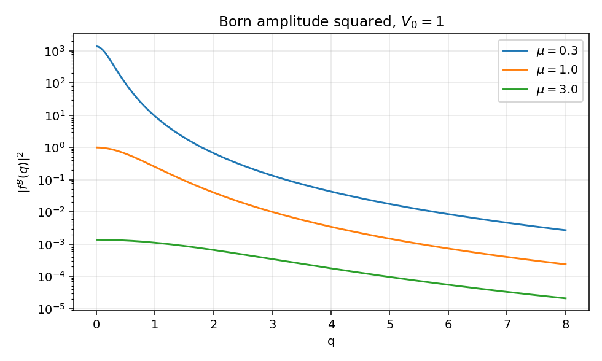
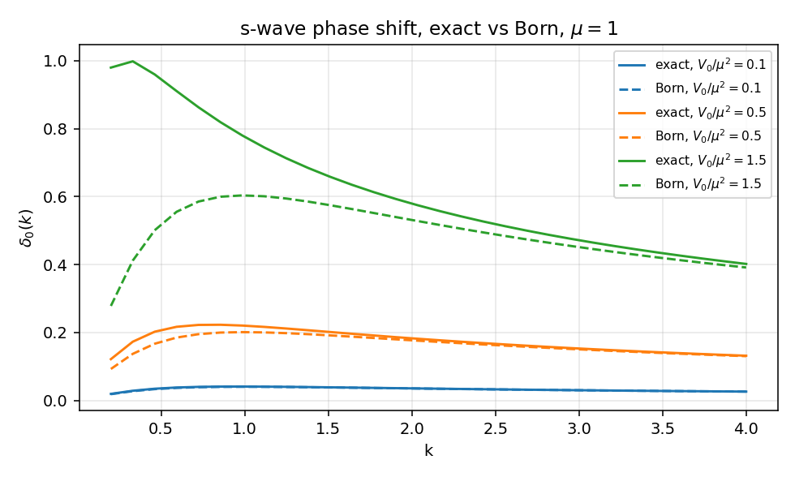
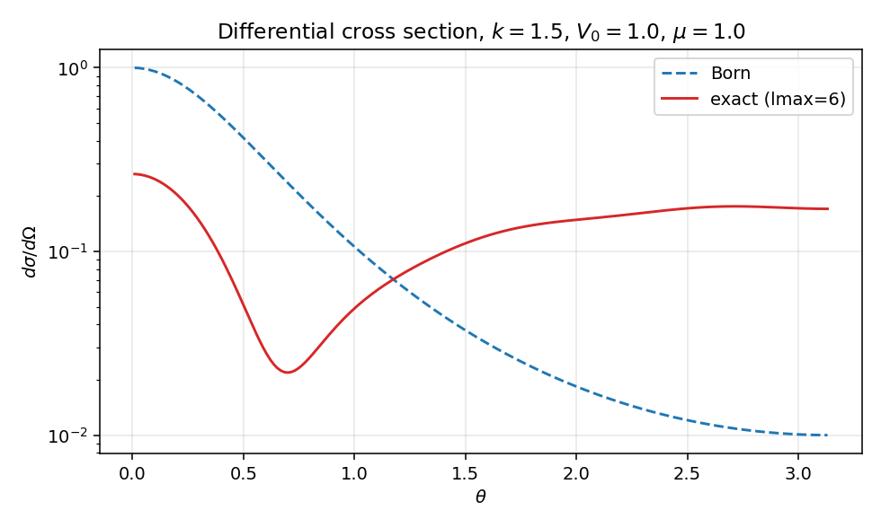
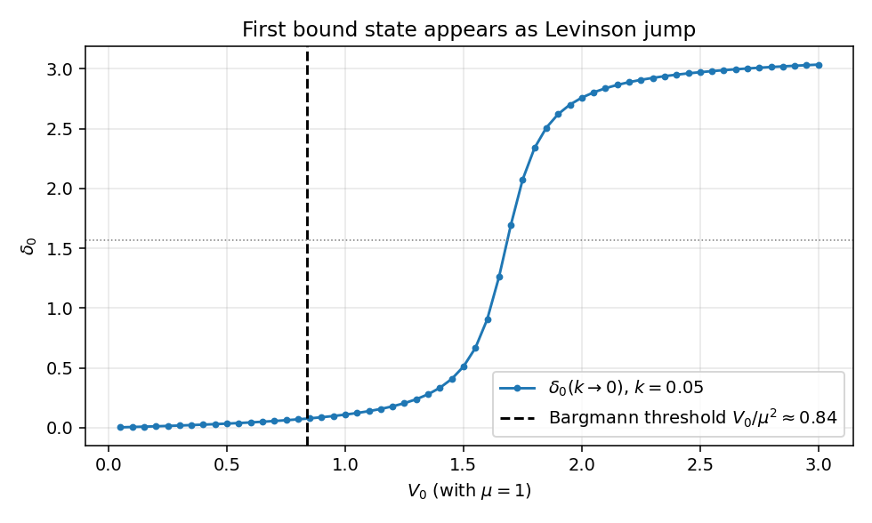

# Yukawa 势与 Born 近似

可解模型系列第 4 篇。前三篇（一维 delta、三维方阱、delta 壳）都是分段常势，匹配条件可以闭式解到底。Yukawa 势 $V(r) = -V_0\,e^{-\mu r}/(\mu r)$ 是第一个真正"光滑且有耦合常数"的例子：Born 振幅有干净的 Lorentzian 闭式，但精确相移只能数值算。这个张力正好让我们把 Born 近似的有效区、Born 级数的发散与束缚态阈值串成一条线。

全文取 $\hbar = 1$，$2m = 1$，能量 $E = k^2$。

## 目标

- 给主线笔记 `03_S_matrix_and_cross_section.zh.md` §6 中 Born 振幅 $f^B$ 一个最简洁的解析例子，对照 `04_T_and_U_operators.zh.md` 的 LS 一阶展开。
- 与精确分波解（Numerov 数值积分）的相移作并排对比，看出"耦合 $\to$ 1，Born 失效"的拐点。
- 把这个拐点连到 Newton/Bargmann 的束缚态判据：Born 级数发散、束缚态出现、Levinson 相移跳变 $\pi$，是同一件事。

## 势的定义与无量纲化

Yukawa 势写法：

$$
V(r) = -V_0\,\frac{e^{-\mu r}}{\mu r}, \qquad V_0, \mu > 0.
$$

参数 $\mu$ 是屏蔽长度的倒数，$V_0/\mu$ 控制深度。在 $\hbar = 2m = 1$ 单位下，$V_0$ 与 $\mu^2$ 同量纲（都是能量），所以唯一的无量纲耦合是 $V_0/\mu^2$。把长度按 $1/\mu$ 量纲化（$\rho = \mu r$）：

$$
\frac{1}{\mu^2}\,V(r) = -\,\frac{V_0/\mu^2}{\rho}\,e^{-\rho}.
$$

整套散射问题只依赖 $V_0/\mu^2$ 和 $k/\mu$ 两个无量纲量。下面所有图都设 $\mu = 1$，等价于把 $\mu$ 当作能量单位。

## Born 振幅闭式

按 `03_S_matrix_and_cross_section.zh.md:506` 的定义，Born 近似把入态 $\psi_\mathbf{k}^+$ 用自由平面波 $e^{i\mathbf k\cdot\mathbf r}$ 替代，振幅为

$$
f^B(\mathbf k_f \leftarrow \mathbf k)
= -\frac{m}{2\pi}\int d^3r\,e^{-i\mathbf q\cdot\mathbf r}\,V(r),
\qquad \mathbf q = \mathbf k_f - \mathbf k.
$$

在 $2m = 1$（$m = 1/2$）约定下系数变成 $-1/(4\pi)$。对球对称势，三维傅里叶积分先把角度积掉：

$$
\int d^3r\,e^{-i\mathbf q\cdot\mathbf r}\,V(r)
= \frac{4\pi}{q}\int_0^\infty dr\, r\sin(qr)\,V(r).
$$

代入 $V(r) = -V_0 e^{-\mu r}/(\mu r)$ 后只剩一维拉普拉斯型积分：

$$
\int_0^\infty dr\,e^{-\mu r}\sin(qr) = \frac{q}{q^2 + \mu^2}.
$$

整合所有系数：

$$
\boxed{\;f^B(q) = \frac{V_0/\mu}{q^2 + \mu^2}, \qquad q = 2k\sin(\theta/2).\;}
$$

这就是 Yukawa 在 Born 近似下的全部内容：一条 Lorentzian。它的关键性质有三：

- 与 $\theta$ 无关的部分纯粹由 $V_0/\mu$ 控制，是"前向散射强度"。
- 半宽度 $q \sim \mu$，对应空间尺度 $\sim 1/\mu$。短程势（$\mu$ 大）给出宽 Lorentzian、各向同性散射；长程势（$\mu$ 小）给出尖锐的前向峰。
- $\mu \to 0$ 极限退化为 Coulomb 振幅 $f^B \propto 1/q^2$，对应微分截面 $d\sigma/d\Omega \propto 1/q^4 \propto 1/\sin^4(\theta/2)$，正是 Rutherford 公式。完整的 Coulomb 长程修正（Sommerfeld 因子、库仑相移）属于另一条故事线，留给后续的 Coulomb 笔记。

下图是 $|f^B(q)|^2$ 对几个 $\mu$ 值的对数图。$\mu$ 越小，前向越尖锐，远端 $q \gg \mu$ 段都收敛到同一个 $V_0^2/(\mu^2 q^4)$ 包络。

## Born 级数何时收敛

Born 近似是 LS 方程

$$
T(E) = V + V\,G_0^{(+)}(E)\,T(E)
$$

的一阶截断。把它继续迭代得到 Born 级数 $T = V + VG_0V + VG_0VG_0V + \cdots$。这个几何级数是否收敛，由算子 $V G_0(E)$ 的谱半径决定。粗略判据是无量纲耦合 $V_0/\mu^2 \ll 1$：在能量集合上 $\|VG_0\| < 1$，级数绝对收敛。

更精细的指标是物理判据：当 $V$ 强到足够支撑一个束缚态时，$T(E)$ 在那个负能量上有极点，$1 - V G_0$ 算子不可逆，Born 级数在那条能量线附近一定发散。Bargmann 不等式给出 s 波束缚态数 $N_0$ 的上界：

$$
N_0 \le \int_0^\infty dr\,r\,|V(r)|.
$$

对 Yukawa 势 $\int_0^\infty dr\,r\,V_0 e^{-\mu r}/(\mu r) = V_0/\mu^2$，所以 $V_0/\mu^2 < 1$ 时一定无束缚态。这是必要条件，不一定紧。Yukawa 数值上的真实 s 波束缚态阈值大约在 $V_0/\mu^2 \approx 1.68$（见后面的扫描图），Bargmann 给出的 $0.84$ 上界是保守的。

把三件事并起来：

- Born 近似对相移的精度 $\sim$ 第二阶 Born 项 $\sim (V_0/\mu^2)^2$；
- Born 级数发散 $\Leftrightarrow$ $T(E)$ 在某个能量上有极点；
- 极点恰好对应束缚态。

下图是数值精确 s 波相移与 Born 公式的对照（$\mu = 1$ 固定，三个 $V_0$ 值）。$V_0 = 0.1$ 时两条线肉眼重合；$V_0 = 0.5$ 时小幅偏离；$V_0 = 1.5$ 时已经在 Bargmann 上界以内、但接近真实阈值，Born 严重低估相移。

s 波 Born 相移本身有闭式：从 `05_partial_wave_projection.zh.md:348` 出发把 $j_0(kr) = \sin(kr)/(kr)$ 代入

$$
\delta_l^B(k) = -k\int_0^\infty dr\,r^2\,V(r)\,[j_l(kr)]^2,
$$

s 波得到

$$
\delta_0^B(k) = -\frac{1}{k}\int_0^\infty dr\,V(r)\sin^2(kr)
= \frac{V_0}{4 k\mu}\,\ln\!\left(1 + \frac{4 k^2}{\mu^2}\right).
$$

弱耦合下这就是相移；强耦合下数值与公式拉开几十个百分点的差距。

## 微分截面：Born vs 全分波

把数值 $\delta_l$ 叠回散射振幅

$$
f(\theta) = \frac{1}{k}\sum_l (2l+1)\,e^{i\delta_l}\sin\delta_l\,P_l(\cos\theta),
$$

可以看到 Born 近似在中等耦合就开始失败的全貌。下图是 $V_0 = \mu = 1$、$k = 1.5$ 的一帧：Born 振幅幅度系统性偏高、且仍然单调，而 full partial-wave sum（截到 $l_{\max} = 6$）在 $\theta \approx 40^\circ$ 处出现一个 Born 看不见的浅极小，对应 $\delta_0$ 与 $\delta_1$ 干涉相消。

这个极小是非微扰的：它的位置依赖于多个分波相移之间的相对相位，是 Born 一阶振幅没有任何信息可以预测的。与第 2 篇方阱里的 Ramsauer-Townsend 极小是同源现象——Yukawa 这里耦合还不算非常强，但已经能定性看到。

## 屏蔽 Coulomb 极限

$\mu \to 0$ 时 $V(r) = -V_0/(\mu r) \cdot (1 - \mu r + \mu^2 r^2/2 - \cdots) \to -V_0/(\mu r)$。注意 $V_0/\mu$ 必须保持有限——把 $V_0/\mu \equiv Z\alpha$ 当作 Coulomb 强度。Born 振幅化为

$$
f^B(q) \xrightarrow{\mu \to 0} \frac{Z\alpha}{q^2},
\qquad
\frac{d\sigma}{d\Omega} = \frac{(Z\alpha)^2}{16 k^4 \sin^4(\theta/2)},
$$

这是 Rutherford 公式（在 $2m = 1$ 单位下）。形式上 Born 一阶给出了正确的 Coulomb 微分截面——这其实是一个著名巧合：纯 Coulomb 散射的精确振幅与 Born 振幅相差一个相位 $e^{i\sigma_l}$，模平方时相位掉了。但 Born 级数本身在 $\mu = 0$ 时发散（每一阶都有红外发散的对数），需要走 Rutherford 散射的专门处理（Coulomb 函数、Sommerfeld 参数）。本系列后续的 Coulomb 笔记会展开这一点；这里只指出有限 $\mu$ 起到了红外调节器的作用。

## 束缚态阈值与 Levinson 跳变

把 $V_0$ 从小扫到大、保持 $k = 0.05$（接近零能），看 $\delta_0$ 怎么变。Levinson 定理告诉我们 $\delta_0(k\to 0) - \delta_0(k\to \infty) = N_b\pi$，其中 $N_b$ 是 s 波束缚态数。$\delta_0(k\to\infty) \to 0$，所以低能极限里每出现一个新的束缚态，$\delta_0(0)$ 就跳一次 $\pi$。

数值结果：第一次跳变发生在 $V_0 \approx 1.68$，与 Yukawa s 波束缚态的标准阈值符合。Bargmann 不等式给出的 $V_0/\mu^2 \le 0.84$ 上界标在图上，是真实阈值的一半左右，明显保守——它只用到 $\int r\,|V|\,dr$，没看到 Yukawa 指数压制带来的额外有效宽度。

把这一段连到 Born 失效：

- $V_0/\mu^2 \ll 1$：Born 有效，$\delta_0 \approx \delta_0^B$，T 矩阵在物理面无极点。
- $V_0/\mu^2 \to 1.68^-$：精确相移已经远离 Born，T 矩阵在物理面接近虚轴的极点逼近实轴；Born 级数收敛半径耗尽。
- $V_0/\mu^2 = 1.68$：极点撞上原点，$\delta_0(0)$ 跳 $\pi$，第一束缚态从连续谱里冒出来。
- $V_0/\mu^2 > 1.68$：极点离开原点上行到正虚轴的某个 $i\kappa$，束缚态稳定存在。

这是同一个 $T(E)$ 的解析结构在三个层面的同时表现：Born 级数收敛半径 = 物理面到第一极点的距离 = 第一束缚态的"诞生"位置。一维 delta 势里这条链条退化成代数方程；Yukawa 这里它仍然是同一条链条，只是要数值地求解。

## 与主线笔记的对账

| 主线 | Yukawa 中的对应 |
|:--|:--|
| `03_S_matrix_and_cross_section.zh.md:506`，$f^B = -\frac{m}{2\pi}\int e^{-i\mathbf q\cdot\mathbf r} V$ | $f^B(q) = (V_0/\mu)/(q^2 + \mu^2)$ |
| `04_T_and_U_operators.zh.md`，Born 级数 $T = V + VG_0V + \cdots$ | 收敛半径 $\sim V_0/\mu^2 < 1.68$ |
| `05_partial_wave_projection.zh.md:348`，$\delta_l^B = -k\int r^2 V j_l^2$ | $\delta_0^B = V_0/(4k\mu)\ln(1 + 4k^2/\mu^2)$ |
| `02_Green_operator.zh.md`，束缚态 = $T(E)$ 物理面实极点 | 首次极点在 $V_0/\mu^2 \approx 1.68$ |
| Levinson 定理（同上 `05_partial_wave_projection.zh.md`） | $\delta_0(0)$ 跳 $\pi$ 与束缚态出现同步 |

## next-step

留下的口子：

- 介质极点：在 $V_0/\mu^2$ 略低于阈值时，T 矩阵会在第二黎曼面的负实轴附近留下虚态（virtual state）极点。它影响低能 s 波散射长度但不是束缚态。这一现象与方阱的弱束缚极限同源。
- 二阶 Born：Yukawa 的二阶 Born 项 $\langle k_f|V G_0 V|k_i\rangle$ 仍然有闭式（dilogarithm），可以验证 Born 级数收敛半径的解析估计。
- Coulomb 极限的细节：Born 振幅在 $\mu = 0$ 给出对的截面但错的相位，对极化、干涉测量是关键。下一篇会处理。
