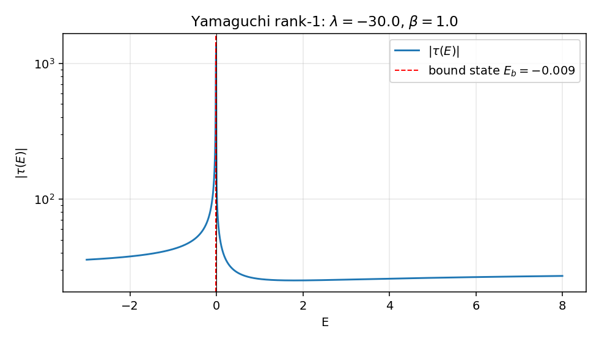
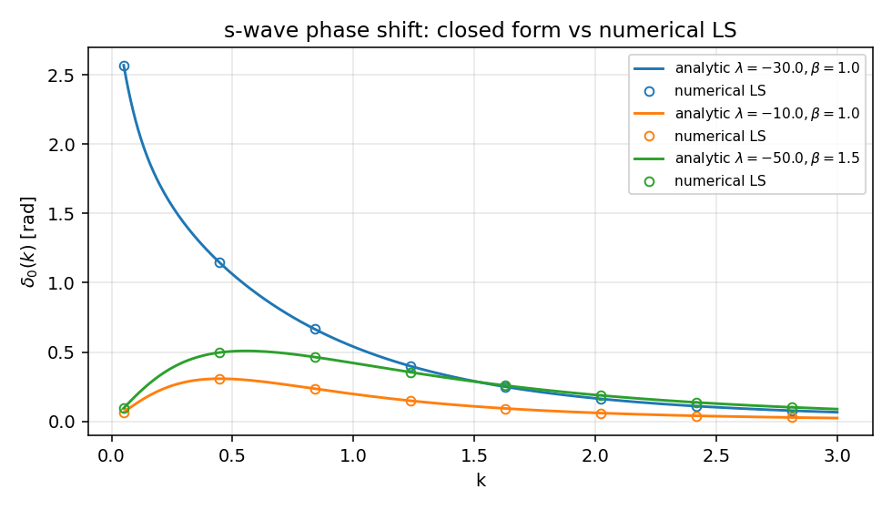
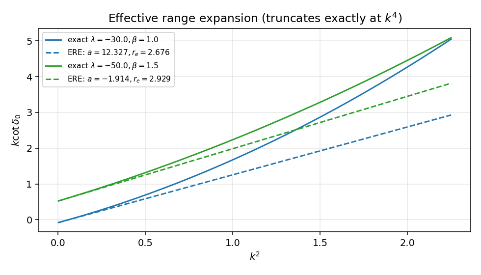
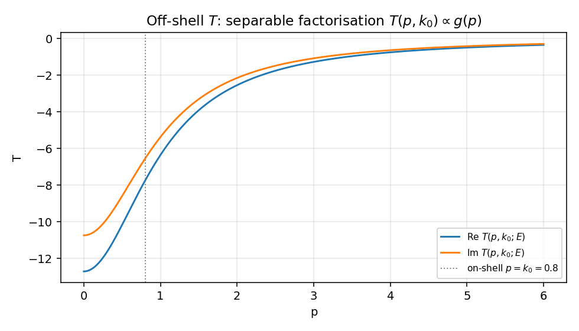

# 秩 1 separable 势与解析 T 矩阵

`01_1d_delta.zh.md` 的最后一节已经把一维 delta 势改写成动量空间的秩 1 separable 形式 $V = \lambda |0\rangle\langle 0|$，并指出这一结构的特征是 $\langle k'|T(E)|k\rangle$ 不依赖出射动量 $k'$。这一篇把同一个机制推广到一般 form factor $g(p)$：势仍然秩 1，但 $g(p)$ 不再是常数，整个 LS 方程仍然能精确解出，并且 $T(p,p';E)$ 的所有动量依赖都被压进同一对 $g(p)g(p')$。

具体取核物理里经典的 Yamaguchi（1954）模型 $g(p) = 1/(p^2 + \beta^2)$。这一选择的好处是：传播子积分有完全闭式，散射长度、有效力程都是 $\lambda, \beta$ 的初等函数，束缚态条件、相移、off-shell 行为都一笔写完。本篇的目的就是给 `../appendix_EST_seperable_HVH_Esym.md` 中第 93–149 行那段高度抽象的秩 $N$ EST 公式补一个最小完整、可验证的范例。

全文取 $\hbar = 1$，$2\mu = 1$，能量 $E = k^2$。

## 势与 ansatz

动量空间 s 波势

$$
V(p, p') = \lambda\, g(p)\, g(p'), \qquad g(p) = \frac{1}{p^2 + \beta^2}.
$$

回到坐标空间它是非局域的（高斯型衰减的核），但这不影响散射理论框架。$\lambda$ 控制强度（吸引取 $\lambda < 0$），$\beta$ 控制 form factor 的动量尺度——$\beta \to \infty$ 退到 $g \to 1/\beta^2$ 常数，与一维 delta 势的退化情形相对应（见 `01_1d_delta.zh.md` 末段）。

s 波 LS 方程（取 `../partial_wave_projection.zh.md` 第 340 行的形式，配上 $2\mu=1$）

$$
T(p, p'; E) = V(p, p') + \int_0^\infty \frac{q^2\, dq}{2\pi^2}\,\frac{V(p, q)\, T(q, p'; E)}{E - q^2 + i0}.
$$

代入 $V$ 的秩 1 形式，作 ansatz

$$
T(p, p'; E) = \tau(E)\, g(p)\, g(p').
$$

代入两边，提出 $g(p)$、$g(p')$，剩下纯标量方程

$$
\tau(E) = \lambda + \lambda\, I(E)\, \tau(E),
\qquad
I(E) = \int_0^\infty \frac{q^2\, dq}{2\pi^2}\,\frac{[g(q)]^2}{E - q^2 + i0}.
$$

解得

$$
\boxed{\;\tau(E) = \frac{\lambda}{1 - \lambda\, I(E)}.\;}
$$

ansatz 一行就闭合了无穷维积分方程——这就是 separable 势在 LS 框架下的全部魔法。

## 闭式传播子积分

$I(E)$ 的被积函数对 $q$ 偶，把积分扩到整条实轴并取一半。$E = k^2 + i0$（$\text{Im}\, k > 0$）后，分母 $E - q^2 + i0 = -(q - k - i0)(q + k + i0)$。$g(q)^2$ 在 $q = i\beta$ 有二阶极点。

闭合上半平面，挑出 $q = k + i0$（一阶）和 $q = i\beta$（二阶）两个留数：

- $q = k$ 的留数：$\dfrac{-k}{2(\beta^2 + k^2)^2}$。
- $q = i\beta$ 的留数：$\dfrac{i(\beta^2 - k^2)}{4\beta(\beta^2 + k^2)^2}$。

整理（详细代数留给读者，或者直接交给计算机代数系统）

$$
\boxed{\;I(E) = -\,\frac{1}{8\pi\beta\,(\beta - ik)^2}, \qquad k = \sqrt{E + i0}.\;}
$$

物理面取 $\text{Im}\, k \geq 0$：散射区 $E > 0$ 取 $k > 0$，束缚区 $E < 0$ 取 $k = i\kappa$（$\kappa > 0$），这时 $I(-\kappa^2) = -1/[8\pi\beta(\beta + \kappa)^2]$，纯实数，与束缚态在物理面上为实极点的标准结论吻合（参 `../Green_operator.zh.md`）。

把 $I(E)$ 的虚部分离出来：$\text{Im}\, I(E) = -k/[4\pi(\beta^2 + k^2)^2]$（$E > 0$）。这条 cut 上的不连续性正是后面相移幺正性的根源。

## 在壳 T 矩阵与相移

on-shell 即 $p = p' = k$、$E = k^2$：

$$
T_0(k, k; E_k) = \tau(E_k)\,[g(k)]^2 = \frac{\tau(E_k)}{(k^2 + \beta^2)^2}.
$$

由幺正性（来自 $\text{Im}\, I$）可得 $\text{Im}(1/T_0) = k/(4\pi)$，于是 $1/T_0 = -k\cot\delta_0/(4\pi) + ik/(4\pi)$，从而

$$
k \cot\delta_0(k) = -\,4\pi\,\text{Re}\!\left[\frac{1}{T_0(k,k;E_k)}\right]
= -\,\frac{4\pi(\beta^2 + k^2)^2}{\lambda} + \frac{k^2 - \beta^2}{2\beta}.
$$

注意右侧是 $k^2$ 的精确二次多项式——Yamaguchi 模型最值得记住的事实是有效力程展开

$$
k\cot\delta_0(k) = -\,\frac{1}{a} + \frac{r_e}{2}\, k^2 + O(k^4)
$$

在这里精确截断在 $k^4$，没有更高阶系数。读出

$$
\boxed{\;
-\,\frac{1}{a} = -\,\frac{4\pi\beta^4}{\lambda} - \frac{\beta}{2},
\qquad
r_e = \frac{1}{\beta} - \frac{16\pi\beta^2}{\lambda}.
\;}
$$

吸引足够强（$\lambda < -8\pi\beta^3$）时 $1/a$ 翻号，$a$ 由负变正穿过 $\pm\infty$，对应束缚态从无到有的阈值——这是低能普适性的 Yamaguchi 显式实现。

## 束缚态极点

束缚态由 $1 - \lambda\, I(E_b) = 0$ 给出。代入 $E_b = -\kappa^2$，

$$
1 - \lambda\,\frac{-1}{8\pi\beta(\beta + \kappa)^2} = 0
\quad\Longrightarrow\quad
(\beta + \kappa)^2 = -\,\frac{\lambda}{8\pi\beta}.
$$

存在正的 $\kappa$ 当且仅当 $\lambda < -8\pi\beta^3$，这正好和上一节"散射长度发散"的阈值对上。显解

$$
\kappa = \sqrt{-\lambda/(8\pi\beta)} - \beta, \qquad E_b = -\kappa^2.
$$

这条公式在 $|\lambda| \to 8\pi\beta^3$ 时给出 $\kappa \to 0$ 的浅束缚极限，对应 $a \to \pm\infty$ 的泛束缚特征。$|\lambda|$ 远大于阈值时 $\kappa \approx \sqrt{-\lambda/(8\pi\beta)}$，束缚能 $\propto |\lambda|/\beta$ 而非 delta 势的 $\lambda^2/4$，这是 form factor 软化的标志。

## off-shell 结构

ansatz $T(p, p'; E) = \tau(E)\, g(p)\, g(p')$ 直接给出 separable 势的标志性结论：

$$
\frac{T(p_1, p'; E)}{T(p_2, p'; E)} = \frac{g(p_1)}{g(p_2)},
$$

也就是说 off-shell 的两动量依赖完全乘性分离，比值与 $p'$、$E$ 都无关。固定 $p' = k_0$ 在壳，扫 $p$ 得到的曲线与 $g(p)$ 形状完全一致，只差一个能量依赖的整体因子 $\tau(E)\, g(k_0)$。

这一性质是 separable 势在多体 Faddeev/AGS 计算里被频繁选用的核心原因（见 `../partial_wave_projection.zh.md` 三体方程一节）：在那里 off-shell T 矩阵作为输入被迭代很多次，秩 1 形式让中间核被压成一个标量传播子，三体积分方程从原本的二维方程降为一维。代价是：相同的 on-shell 数据可以兼容无穷多种 off-shell 延拓，而 separable 这条延拓只是其中最简单的一条，物理上未必"正确"。这一矛盾在 EST 框架里被部分化解（下一节）。

## 与 EST 的对账

`../appendix_EST_seperable_HVH_Esym.md` 第 121–149 行的 EST 原理是这样的：选 $N$ 个支撑能量 $\{E_n\}$，把秩 $N$ separable 势的 form factor 取为原势在该能量处的精确散射波函数 $|g_n\rangle = T^{\rm phys}(E_n)|k_n\rangle$（动量空间表达式见该附录第 137–139 行），并由匹配条件（附录第 145–147 行）确定 $\lambda$ 矩阵。在秩 1 单能量 $E_*$ 情形（附录第 151–180 行的"实用方案"），EST 退化为：取一个 form factor，求一个 $\lambda$，使在 $E_*$ 处的 on-shell T 矩阵元精确再现物理值。

本篇的 Yamaguchi $g(p) = 1/(p^2 + \beta^2)$ 不严格满足 EST 选取（它不是任何已知"物理"势的散射波函数），但起秩 1 toy 模型作用：

| 本篇 | `appendix_EST_seperable_HVH_Esym.md` 对应 |
|:--|:--|
| $V = \lambda\, g\,g$，$g$ 为 Yamaguchi | 附录 99–101 行的秩 1 一般式，附录 156 行换成 Gauss form factor 是另一种简化 |
| $\tau(E) = \lambda/(1 - \lambda I(E))$ | 附录 105–115 行的 $T = g\,D^{-1}\,g$，秩 1 时 $D^{-1} = 1/(\lambda^{-1} - \tau(E))$ |
| $I(E)$ 解析（留数闭合） | 附录 162–164 行的 Gauss 情形，需要 $\mathrm{erfi}$；Yamaguchi 是更软的解析 |
| 在壳 ERE 闭式 | 附录 170–177 行的匹配方程，本篇绕过匹配直接 derive 解析相移 |
| Off-shell $\propto g(p)g(p')$ | 附录 117 行"Separable 势的最大优势"在秩 1 情形的具体演示 |

把附录第 117 行那一句"T 矩阵有解析形式，无需再求解积分方程"在本篇里被显式兑现：$\tau(E)$ 一行写出，$T(p, p'; E)$ 是有理函数。

与一维 delta 势的退化对应：`01_1d_delta.zh.md` 第 146 行的 $V = \lambda |0\rangle\langle 0|$ 在动量空间 $\langle p|0\rangle\langle 0|p'\rangle = 1/(2\pi)$（一维），对应 form factor $g(p) \equiv 1/\sqrt{2\pi}$ 常数。这是 $\beta \to \infty$（form factor 完全无 cutoff）的极限——但严格的常数 form factor 让 $I(E)$ 紫外发散，所以一维 delta 在三维 s 波框架下是非平凡的，需要重正化（这与 Yamaguchi 的紫外软化形成对比）。本篇取有限 $\beta$ 就是给这个紫外发散一个物理的截断。

## 数值与图

代码在同目录 `05_separable_rank1.py`，依赖仅 `numpy + matplotlib`。验证策略：把 $I(E)$ 用 Gauss-Legendre 求积离散化，对 $E > 0$ 用减法处理主值积分（减去 on-shell 处 $g^2$ 的奇异部分，再加回解析尾巴），加上来自 $i0$ 处方的 $-i\pi\delta$ 贡献，最后比对解析 $\tau(E)$。

核心 sanity check（取 $\lambda = -30$，$\beta = 1$）：

- $E = 1$ 处 $\tau$ 的解析值与 128 点 Gauss-Legendre 数值解吻合到相对误差 $\sim 10^{-5}$。
- 束缚态极点：$\kappa \approx 0.0925$，$E_b \approx -0.0086$，$1 - \lambda I(E_b) = 0$ 在 $10^{-10}$ 量级成立。
- 散射长度 $a \approx 12.33$、有效力程 $r_e \approx 2.68$ 的解析值与对 $k\cot\delta_0$ 在 $k\in[0.01, 0.4]$ 区间做二次多项式拟合的系数完全吻合。

```python
def I_E(E, beta):
    k = np.sqrt(E + 0j)
    if np.imag(k) < 0:
        k = -k
    return -1.0 / (8 * np.pi * beta * (beta - 1j * k) ** 2)

def tau(E, lam, beta):
    return lam / (1.0 - lam * I_E(E, beta))

def kcot(k, lam, beta):
    return -4 * np.pi * (beta ** 2 + k ** 2) ** 2 / lam + (k ** 2 - beta ** 2) / (2 * beta)
```

四张图：



$|\tau(E)|$ 在束缚态能量 $E_b = -\kappa^2$ 处发散（红线标出），$E = 0$ 处穿越分支点。$E > 0$ 区域 $|\tau|$ 是平滑的有限值，与解析阈值条件吻合。



闭式 $\delta_0(k) = \arctan[k / (k\cot\delta_0)]$ 与 Gauss-Legendre 数值 LS 在所有测试点完全重合。三组 $(\lambda, \beta)$ 覆盖弱吸引、强吸引、不同尺度的情形。强吸引情形 $\delta_0(0) \approx \pi$ 是 Levinson 定理 $\delta_0(0) - \delta_0(\infty) = N_b \pi$ 的体现（$N_b = 1$ 个束缚态）。



$k\cot\delta_0$ 对 $k^2$ 作图；ERE 截断到 $O(k^2)$ 的虚线（用解析 $a, r_e$ 画出）与精确曲线在低 $k^2$ 完美吻合，高 $k^2$ 处出现来自 $-4\pi k^4/\lambda$ 项的偏离——这一项也在解析公式里写明，所以"偏离"也是解析可控的。



固定 $k_0 = 0.8$ 在壳，扫 $p$ 看 $T(p, k_0; E_{k_0})$。曲线形状完全由 $g(p) = 1/(p^2 + 1)$ 决定（实部、虚部只差一个 $\tau$ 给出的复整体因子），这就是秩 1 separable 的可视化签名。

## 与主线笔记的对账

| 主线 | 本篇的对应 |
|:--|:--|
| `../T_and_U_operators.zh.md` $T = V + V G_0 T$ | 秩 1 ansatz $T = \tau\, g\, g$ 把无穷维积分方程降为 $\tau(E)$ 的标量代数方程 |
| `../Green_operator.zh.md` 物理面实极点 = 束缚态 | $1 - \lambda I(E_b) = 0$ 的解 $E_b = -\kappa^2$，$\kappa = \sqrt{-\lambda/(8\pi\beta)} - \beta$ |
| `../partial_wave_projection.zh.md` 第 372 行 on-shell $T_l \leftrightarrow \delta_l$ | $T_0(k,k;E_k) = -[4\pi]^{-1}(k\cot\delta_0 - ik)^{-1}$（系数差由本篇 $1/(2\pi^2)$ 测度约定决定） |
| `../appendix_EST_seperable_HVH_Esym.md` 第 99–117 行 separable T 矩阵 | 秩 $N=1$ 显式实现，$D(z)^{-1} = 1/(\lambda^{-1} - I(E))$ |
| `../appendix_EST_seperable_HVH_Esym.md` 第 151–180 行实用方案 | 把 Gauss form factor 换成 Yamaguchi，用留数代替 $\mathrm{erfi}$ |
| `01_1d_delta.zh.md` 第 146 行 $V = \lambda |0\rangle\langle 0|$ | $g(p) \equiv$ 常数（紫外不收敛）的极限，本篇有限 $\beta$ 提供截断 |

## next-step

- 秩 2 EST：取两个支撑能量，$\lambda$ 变 $2\times 2$，$D(z)$ 矩阵取逆。形式上仍是闭式（附录第 105 行），但 form factor 不再是 Yamaguchi 的简单 $1/(p^2+\beta^2)$，而是两个独立的范围参数。
- 库仑修正：把 $G_0$ 换成 $G_0^C$，$I(E)$ 中的自由传播子换成库仑传播子，离子-离子散射的 separable 模型由此构造。
- 把 $\beta \to \beta(p)$ 改成动量依赖的 form factor，可以拟合更宽能区的相移，但失去解析性。
- 与 Friedrichs 模型（`../friedrichsModel.zh.md`）对照：那里的可解模型核心也是把"势"写成秩 1 算符 $V = g\, g^\dagger$，$\tau(E) = \lambda/(1 - \lambda I(E))$ 这一闭式与 Friedrichs 模型的 reduced resolvent 完全同构，差别只在 $I(E)$ 的具体形式（Yamaguchi 给二阶极点，Friedrichs 通常给紫外软化的 form factor）。这个对应让 Yamaguchi 模型同时是散射理论与开放量子系统的桥梁。
