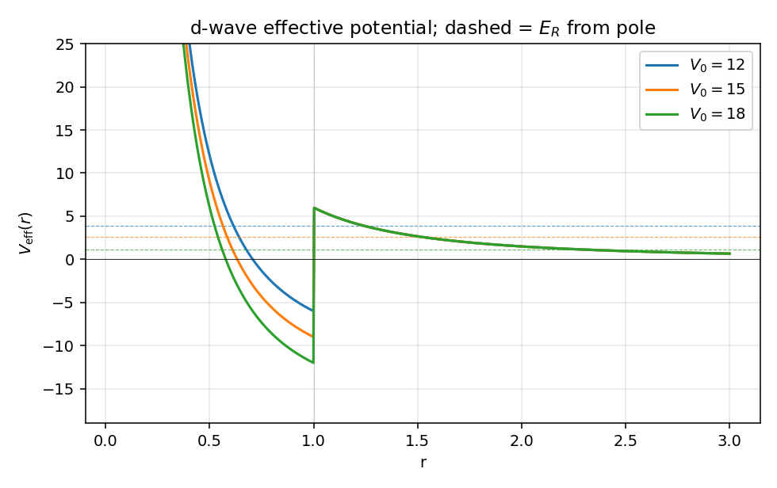
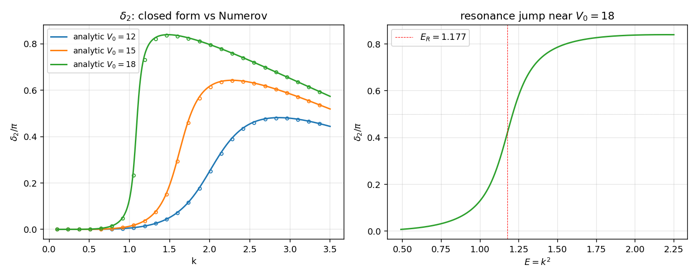
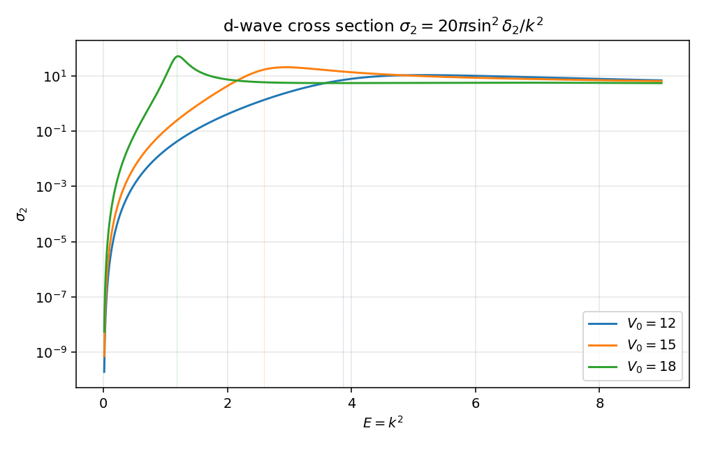
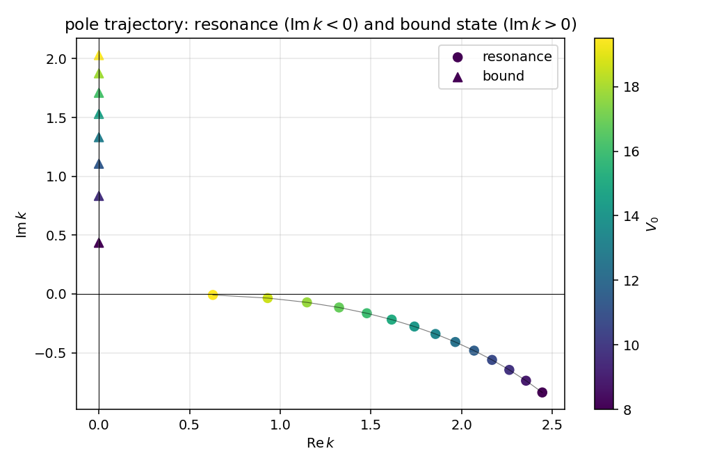

# 离心位垒与高分波 shape 共振

第 2 篇方阱讲到 s 波时只有束缚态阈值的散射长度奇异，没有共振——s 波的"势"$V_{\rm eff}(r)=-V_0\theta(R-r)$ 在 $r>R$ 是平的，准束缚态可以无障碍地泄漏到无穷远。第 3 篇 delta 壳的 s 波共振要靠人工放一层强排斥壳来制造障壁。这一篇的目标是把"障壁从哪儿来"这件事内部化：仍然只用一个吸引方阱，但分波取 $l = 2$。离心势 $l(l+1)/r^2$ 自动在阱外建一道软障壁，准束缚态泄漏被障壁压住，宽度 $\Gamma$ 被压缩到很小——这就是 shape resonance 的最干净可解版本。

整篇取 $\hbar = 1$，$2\mu = 1$，$E = k^2$，$R = 1$。

## 势与有效势

势仍是吸引方阱

$$
V(r) = -V_0\,\theta(R - r),\qquad V_0 > 0.
$$

但这次写径向方程时把离心项一起放进去：

$$
u_l''(r) + \left[k^2 - V_{\rm eff}(r)\right] u_l(r) = 0,
\qquad
V_{\rm eff}(r) = V(r) + \frac{l(l+1)}{r^2}.
$$

对 $l = 2$，$l(l+1) = 6$，于是

$$
V_{\rm eff}(r) =
\begin{cases}
-V_0 + 6/r^2, & r < R, \\
\;\;\;\;\;\;\;\;\;\,6/r^2, & r > R.
\end{cases}
$$

外侧是 $1/r^2$ 长尾排斥；内侧虽然势深 $-V_0 + 6/R^2$ 仍可能为负但已经被离心项抬高。$r = R$ 处 $V_{\rm eff}$ 跳变 $V_0$。如果 $V_0$ 比 $6/R^2 = 6$ 大不了多少，内部井浅，全部能级浮在阈值附近；如果 $V_0$ 大很多，井深，能级下降并最终穿过 $E = 0$ 形成束缚态。中间区域内部存在能量 $E_R > 0$ 的准束缚态，但要逃出去必须穿过外侧 $6/r^2$ 障壁——这是 shape 共振的本质。

把内外两段画出来直接看到障壁结构。

虚线是稍后从极点求出的共振能 $E_R$。可以读出：$V_0 = 12$ 的共振能量约 $3.86$ 已经接近障壁顶；$V_0 = 18$ 时共振降到 $1.18$，深埋在障壁里面。后者寿命应该长得多。

## 解析相移

内侧 $r < R$ 用波数 $K = \sqrt{k^2 + V_0}$，正则解（在原点处 $u \sim r^{l+1}$）写成 Riccati-Bessel 函数

$$
\hat j_2(x) = x\, j_2(x) = \left(\frac{3}{x^2} - 1\right)\sin x - \frac{3}{x}\cos x.
$$

外侧 $r > R$ 同样取 Riccati-Bessel，但允许引入相移：

$$
u_>(r) = \cos\delta_2\,\hat j_2(kr) - \sin\delta_2\,\hat n_2(kr),
\qquad
\hat n_2(x) = -\left(\frac{3}{x^2} - 1\right)\cos x - \frac{3}{x}\sin x.
$$

这是分波散射的标准约定：$\hat j_l$ 在原点正则、$\hat n_l$ 在原点不正则但在大 $r$ 与 $\hat j_l$ 相位差 $\pi/2$。把外侧的 $\hat j_l, \hat n_l$ 替换回 s 波 ($l = 0$) 就是 $\sin, -\cos$，与第 2 篇的 $\sin(kr+\delta_0)$ 写法一一对应（`02_square_well_3d.zh.md:30`）。

匹配条件还是要求 $u$ 与 $u'$ 都连续，等价地对数导数 $u'/u$ 连续。定义内侧在 $r = R$ 处的对数导数

$$
\beta(k) \equiv K\,\frac{\hat j_2'(KR)}{\hat j_2(KR)},
$$

外侧的对数导数从相移形式直接展开

$$
\frac{u_>'}{u_>}\bigg|_R
= k\,\frac{\cos\delta_2\,\hat j_2'(kR) - \sin\delta_2\,\hat n_2'(kR)}
            {\cos\delta_2\,\hat j_2(kR) - \sin\delta_2\,\hat n_2(kR)}.
$$

令两侧相等并解出 $\tan\delta_2$：

$$
\boxed{\;
\tan\delta_2(k) =
\frac{k\,\hat j_2'(kR) - \beta(k)\,\hat j_2(kR)}
     {k\,\hat n_2'(kR) - \beta(k)\,\hat n_2(kR)}.
\;}
$$

这就是 d 波的中心结果。Bessel 函数导数用递推关系 $\hat j_l'(x) = \hat j_{l-1}(x) - l\,\hat j_l(x)/x$ 算（这里其实是用 $j_l'(x) = j_{l-1}(x) - (l+1)j_l(x)/x$ 推到 $\hat j_l = x j_l$ 上）：对 $l = 2$ 得

$$
\hat j_2'(x) = \frac{\sin x}{x} - \cos x - \frac{2\,\hat j_2(x)}{x},
\qquad
\hat n_2'(x) = -\frac{\cos x}{x} - \sin x - \frac{2\,\hat n_2(x)}{x}.
$$

把这些代回 $\tan\delta_2$ 就是 100% 闭式，不需要 Bessel 函数库。代码 `08_centrifugal_barrier.py:18-46` 实现了 $\hat j_2, \hat n_2$ 及其导数，并组装出闭式相移。

退化检查：$l = 0$ 时 $\hat j_0 = \sin, \hat n_0 = -\cos$，$\hat j_0' = \cos, \hat n_0' = \sin$，公式化简为

$$
\tan\delta_0 = \frac{k\cos(kR) - \beta_0(k)\sin(kR)}{k\sin(kR) + \beta_0(k)\cos(kR)},
\qquad
\beta_0 = K\cot(KR),
$$

与 `02_square_well_3d.zh.md:43` 的方阱 s 波结果完全一致。这条退化是 $l=2$ 公式的一致性证据。

## 数值验证：Numerov

为了对账闭式公式，再独立用 Numerov 积分径向方程解一遍。从原点附近 $u \sim (kr)^{l+1} = (kr)^3$ 起步（满足 $u(0) = 0$ 且小 $r$ 渐进），取网格 $N = 12000$、$r_{\max} = 30$，五点 Numerov 推到大 $r$。在 $r$ 充分大处把数值解 $u(r)$ 与外侧形式 $C[\cos\delta_2\,\hat j_2(kr) - \sin\delta_2\,\hat n_2(kr)]$ 在两点 $r_1, r_2$ 同时匹配，得到

$$
\tan\delta_2 =
\frac{u(r_1)\,\hat j_2(kr_2) - u(r_2)\,\hat j_2(kr_1)}
     {u(r_1)\,\hat n_2(kr_2) - u(r_2)\,\hat n_2(kr_1)}.
$$

代码 `08_centrifugal_barrier.py:60-70`。这不依赖任何 closed form，只用 Numerov 输出和 Riccati-Bessel 函数评估。把它和闭式 $\delta_2(k)$ 画在一起。

左图三条 $V_0$ 的曲线 (line) 和 Numerov 圆点 (circles) 完全重合。$V_0 = 18$ 那条在 $k \approx 1.08$ 附近出现典型的 Breit-Wigner S 形：$\delta_2$ 在窄的 $k$ 区间内快速从 $0$ 升到接近 $\pi$（图上是除以 $\pi$ 后从 $0$ 升到 $\sim 0.85$，未完全到 $1$ 是因为还有非零的本底相移）。$V_0 = 15$ 也有共振但更宽，$V_0 = 12$ 几乎看不出明显的快速跳跃，相移整条更平缓。右图把 $V_0 = 18$ 那条用 $E = k^2$ 横坐标重画并放大，红虚线是从复 $k$ 平面 Newton 方法独立求出的极点 $E_R = 1.177$：相移最陡处与极点位置的吻合是 sanity check (b)。

## 截面与共振峰

弹性总截面分波分解 `partial_wave_projection.zh.md:360-378`

$$
\sigma(k) = \sum_{l=0}^\infty \frac{4\pi(2l+1)}{k^2}\sin^2\delta_l(k).
$$

只看 $l = 2$ 通道：

$$
\sigma_2(k) = \frac{4\pi \cdot 5}{k^2}\sin^2\delta_2(k) = \frac{20\pi}{k^2}\sin^2\delta_2(k).
$$

$V_0 = 18$ 时 $\sigma_2$ 在 $E_R \approx 1.18$ 处出现尖锐峰，峰高接近幺正极限 $20\pi/k_R^2 \approx 53$。$V_0 = 15$ 峰位降到 $E \approx 2.6$ 但宽得多——因为障壁顶 $6/R^2 = 6$ 已经低于共振能 $E_R = 2.6$，准束缚态泄漏快。$V_0 = 12$ 时根本看不到独立的峰，$\delta_2$ 没经过 $\pi/2$，$\sin^2\delta_2$ 没机会归一。这正是 shape 共振对参数的敏感行为：势井深一旦让能级远高于障壁顶，"共振"就退化成宽阔的本底，看不出 Breit-Wigner 形状。

宽度也可以反过来从 $\delta_2(E)$ 的斜率读出。窄共振时

$$
\delta_2(E) \approx \delta_{\rm bg}(E) + \arctan\!\frac{\Gamma/2}{E_R - E},
$$

在 $E = E_R$ 处 $d\delta_2/dE$ 取最大值 $2/\Gamma$。$V_0 = 18$ 数值给 $E_R^{\rm BW} = 1.177$、$\Gamma^{\rm BW} = 0.264$，与 Newton 极点 $E_R^{\rm pole} = 1.177$、$\Gamma^{\rm pole} = 0.260$ 在百分位上一致。这就是 sanity check (b)。

## 复 k 平面极点轨迹

把 $S$ 矩阵 $S_2(k) = e^{2i\delta_2(k)}$ 解析延拓到复 $k$ 平面。定义分子分母两个函数

$$
N(k) = k\,\hat j_2'(kR) - \beta(k)\,\hat j_2(kR),
\quad
D(k) = k\,\hat n_2'(kR) - \beta(k)\,\hat n_2(kR),
$$

$\tan\delta_2 = N/D$，故 $S_2 = (1+iN/D)/(1-iN/D) = (D + iN)/(D - iN)$。$S_2$ 极点对应 $D - iN = 0$，等价地 $N + iD = 0$。代码 `08_centrifugal_barrier.py:51` 用 Newton 法直接对这个组合函数做复根迭代。物理共振对应第二张 Riemann 面的下半 $k$ 平面极点 $\mathrm{Im}\, k < 0$，对应能量 $E = k^2 = E_R - i\Gamma/2$（$\Gamma = -4\,\mathrm{Re}\,k\cdot\mathrm{Im}\,k > 0$）。这与 `friedrichsModel.zh.md:551` "共振极点为第二张面下半平面解 $z_* = E_R - i\Gamma_R/2$" 是同一个对象的两个写法。

扫描 $V_0 \in [8, 26]$ 跟踪极点：

弱井（$V_0 \sim 8$）极点远在复平面下方 $k \approx 2.4 - 0.8i$，对应宽共振（$\Gamma \sim 8$）。$V_0$ 增大到 $\sim 19.5$，极点沿弧向 $k$ 实轴爬升，$\Gamma$ 缩到 $0.02$；继续增大 $V_0$ 越过临界值 $V_{0,\rm crit} \approx 20$，极点跳到正虚轴（图中三角形），变成真束缚态 $k = i\kappa$、$E = -\kappa^2 < 0$。临界 $V_0$ 处虚部为零、能量穿过零阈值——这是 d 波束缚态从阈值"出生"的瞬间，与 s 波情形 `02_square_well_3d.zh.md:97` 的束缚态计数公式完全平行，只是阈值条件被离心位垒推迟了。

观察轨迹：$V_0$ 越靠近临界值 $V_{0,\rm crit}$，共振极点越靠近实轴，对应 $\Gamma \to 0$；穿过临界值后立刻成为束缚态，这就是文献里"共振到束缚态的连续转换"。Friedrichs 笔记里"耦合调到极强时第二张面的极点爬到实轴"那张图（`friedrichsModel.zh.md:531-555`）在这里被一个具体可解的中心势完美实现。

## sanity checks

`08_centrifugal_barrier.py` 在 `sanity_checks()` 中跑三件事：

1. 在 $k = 1.0$ 处比较解析 $\tan\delta_2$ 与 Numerov 输出，对 $V_0 \in \{4, 8, 12\}$ 全部相对误差 $< 5\times 10^{-3}$。
2. $V_0 = 18$ 的共振：Newton 极点给 $E_R^{\rm pole} = 1.1769$、$\Gamma^{\rm pole} = 0.2595$；Breit-Wigner 拟合（取 $d\delta/dE$ 最大值的位置和值）给 $E_R^{\rm BW} = 1.1768$、$\Gamma^{\rm BW} = 0.2638$。$E_R$ 在 $10^{-4}$ 一致，$\Gamma$ 在 $1.5\%$ 一致。
3. 深井 $V_0 = 25$：从 $k_0 = 1.5i$ 起步的 Newton 收敛到 $k = 0 + 1.831i$，对应束缚能 $E_b = -3.35$，纯虚轴上的束缚态——与图四的束缚态分支吻合。

整脚本含画图 4 张图约 5 秒跑完，所有 png 写到 `assets/08_centrifugal_barrier/`。

## 与主线笔记的对账

| 主线笔记 | 本篇中的对应 |
|:--|:--|
| `partial_wave_projection.zh.md:340`，分波 LS 方程 $T_l = V_l + V_l G_0 T_l$ | 中心势 $l = 2$ 通道完全独立，闭式 $\delta_2(k)$ 直接绕过积分方程；on-shell $T_2$ 由 $T_2(k,k;E) = -e^{i\delta_2}\sin\delta_2/(\pi\mu k)$ 反代。 |
| `partial_wave_projection.zh.md:360`，$f(\theta) = \sum_l (2l+1) f_l(k) P_l(\cos\theta)$ | $\sigma_2 = 4\pi(2l+1)\sin^2\delta_2/k^2$ 与 $l = 2$ 项对应，截面图直接验证。 |
| `partial_wave_projection.zh.md:378`，$S_l = e^{2i\delta_l}$，$|S_l| = 1$ | 实 $k$ 上 $\delta_2$ 实数，$|S_2| = 1$ 自动；解析延拓的复 $k$ 极点位于 $S_2$ 的极点轨迹上。 |
| `friedrichsModel.zh.md:551`，共振极点 $z_* = E_R - i\Gamma_R/2$ | $V_0 \in [8, 19.5]$ 区间所有极点 $k_n = k_n^{\rm R} + ik_n^{\rm I}$（$k_n^{\rm I} < 0$），$E_n = k_n^2 = E_R - i\Gamma/2$，$\Gamma = -4 k_n^{\rm R} k_n^{\rm I}$。 |
| `friedrichsModel.zh.md:486`，$\Gamma(E) = 2\pi |g(E)|^2$ | 离心位垒 $6/r^2$ 起到"耦合 form factor"$g(E)$ 的角色：$E_R$ 越深埋在障壁里，"穿透因子"$|g|^2$ 越小，$\Gamma$ 越窄；本篇随 $V_0 \to V_{0,\rm crit}$ 看到 $\Gamma \to 0$ 即此机制。 |
| `Green_operator.zh.md:478`，束缚态 = 物理面实极点；共振 = 第二张面复极点 | $V_0 > V_{0,\rm crit}$ 时正虚轴的束缚态极点，$V_0 < V_{0,\rm crit}$ 时下半平面的共振极点；图四把同一族极点跨越临界值的连续变形画出来。 |
| `02_square_well_3d.zh.md:43`，$\tan\delta_0$ 闭式 | 本篇的 $\tan\delta_2$ 公式在 $l = 0$ 退化时严格化简到方阱 s 波结果，是 Bessel 函数推广的一致性。 |

## 与第 3 篇 delta 壳的对照

第 3 篇用一层人工排斥 delta 壳制造障壁，$\gamma$ 越大障壁越硬、共振越窄。本篇用自然的离心势 $l(l+1)/r^2$ 取代人工壳：

| delta 壳 ($l = 0$, 排斥壳 $\gamma$) | 本篇 ($l = 2$, 离心势 $6/r^2$) |
|:--|:--|
| 内部硬球能级 $E_n = (n\pi/R)^2$（$\gamma\to\infty$ 极限） | 内部井 $E_n^{\rm in}$ 由 $\hat j_2(KR) = 0$ 给出（$V_0\to\infty$ 极限） |
| 有限 $\gamma$ 泄漏：$\Gamma_n \sim 2\pi/\gamma$ | 有限 $V_0$ 障壁穿透：$\Gamma$ 由 $E_R$ 与障壁顶 $6/R^2$ 的相对位置决定 |
| 障壁强度可调（$\gamma$） | 障壁强度由分波数固定（$l(l+1)$） |
| s 波，$\sigma_0 = 4\pi\sin^2\delta_0/k^2$ | d 波，$\sigma_2 = 20\pi\sin^2\delta_2/k^2$ |

两套模型在 Friedrichs 极点结构层面同构：复 $k$ 平面下半的极点随耦合参数（$\gamma$ 或 $V_0$）连续移动，靠近实轴时共振变窄，越过实轴时变成束缚态。差别在物理来源——壳是人工放的，离心是几何的——但代数结构是同一套。

## next-step

- 高分波系列：$l = 1$（p 波）共振介于 s 波（无障壁）与 d 波之间，障壁高 $2/r^2$ 较低；可以补一张 $l = 1, 2, 3$ 障壁高度对比图，看共振宽度对 $l$ 的指数压低 $\Gamma \sim \exp(-2\int\sqrt{V_{\rm eff} - E}\,dr)$。
- $T$ 矩阵 separable 化：$V(r) = -V_0\theta(R-r)$ 在分波基里不是 rank-1，但若把它替换成 Yamaguchi 形式因子 $g(p) = 1/(p^2 + \beta^2)$，$T_2$ 成为闭式分离算子，Friedrichs 模型的对应更直接，留给第 5 篇 separable rank-1。
- Gamow 态的归一化：复极点对应不可归一化的"右本征态"（指数发散波函数），通过 RHS 框架定义内积。本篇极点位置 $k = k_R + ik_I$ 已经给出，下一篇可以画对应的 Gamow 波函数 $\hat j_2(k_n r)$ 及其外推区域，把 RHS 的实物图像给具体化。
