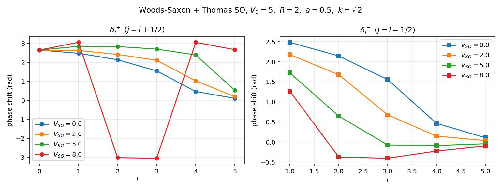
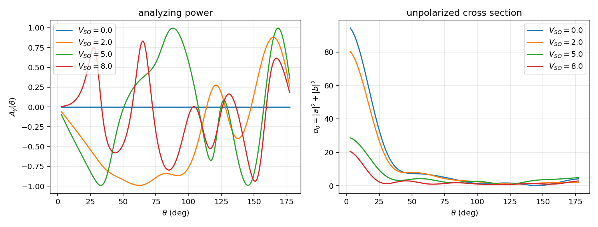
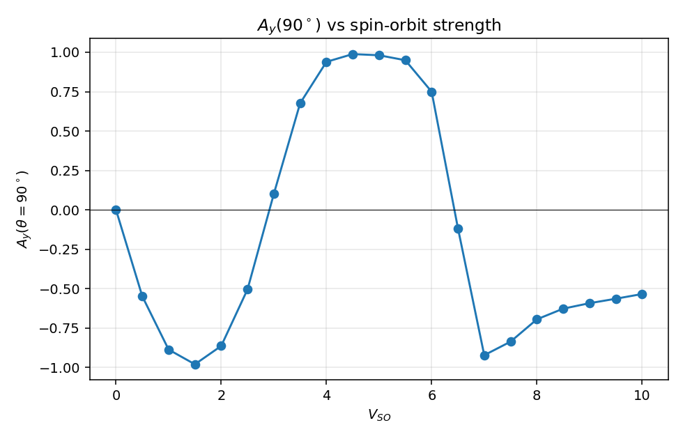
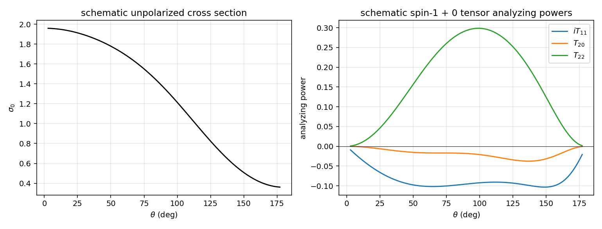

# 极化散射的数值演示

主线笔记 `../polarization_formalism.zh.md` 把自旋-自旋耦合下的 M 矩阵、密度矩阵、analyzing power 形式链铺开了。本篇把那条链落到具体数字上：用一个含 spin-orbit 项的 Woods-Saxon 势数值算自旋 1/2 + 自旋 0 弹性散射的相移、振幅 $a, b$，画出 $A_y(\theta)$ 与 $\sigma_0(\theta)$；再用 spin-1 + 0 schematic 振幅展示 $iT_{11}, T_{20}, T_{22}$ 的角分布形状。

约定与主线一致：Madison 极化约定，$\hbar = 1$，$2m = 1$，能量 $E = k^2$。

## 演示一：spin-1/2 打 spin-0 靶

### 模型势

中心 Woods-Saxon 加 Thomas spin-orbit：

$$
V(r) = -V_0\, f(r) + V_{\rm SO}\, (\mathbf l\!\cdot\!\mathbf s)\, \frac{1}{r}\,\frac{df}{dr},\qquad
f(r) = \frac{1}{1 + e^{(r - R)/a}}
$$

参数 $V_0 = 5$、$R = 2$、$a = 0.5$、$V_{\rm SO} \in \{0, 2, 5, 8\}$、入射 $k^2 = 2$。这个能区下 $l = 0,\ldots,5$ 的相移都非平凡，spin-orbit 在 $l \ge 1$ 上明显劈裂 $j = l \pm 1/2$。

每个 $l$ 对应两支径向方程

$$
u_l''(r) + \Bigl[k^2 - V_l^{\pm}(r) - \frac{l(l+1)}{r^2}\Bigr]\, u_l(r) = 0,\qquad
V_l^\pm(r) = -V_0 f(r) + \langle\mathbf l\!\cdot\!\mathbf s\rangle_\pm\, V_{\rm SO}\,\frac{1}{r}\frac{df}{dr}
$$

其中 $\langle\mathbf l\!\cdot\!\mathbf s\rangle_+ = l/2$（$j = l+1/2$）、$\langle\mathbf l\!\cdot\!\mathbf s\rangle_- = -(l+1)/2$（$j = l-1/2$）。$l = 0$ 只有单一支 $\delta_0^+$。

### 数值流程

延续 `06_numerical_pipeline.zh.md:46` 的 Numerov + 渐近匹配：积分 $u_l(r)$ 到 $r_{\max} = 20$，在两个远场点用 Riccati-Bessel $\hat\jmath_l, \hat n_l$ 匹配，$\arctan2$ 取分支：

$$
\tan\delta_l^\pm = \frac{u(r_1)\,\hat\jmath_l(kr_2) - u(r_2)\,\hat\jmath_l(kr_1)}{u(r_1)\,\hat n_l(kr_2) - u(r_2)\,\hat n_l(kr_1)}
$$

Riccati-Bessel 由递推 $\hat\jmath_{l+1}(x) = (2l+1)/x\,\hat\jmath_l(x) - \hat\jmath_{l-1}(x)$ 上推；连带 Legendre $P_l^1$ 由

$$
P_{l+1}^1(x) = \frac{(2l+1)\, x\, P_l^1(x) - (l+1)\, P_{l-1}^1(x)}{l}
$$

上推。

### 振幅与观测量

主线 `../polarization_formalism.zh.md:249` 给出

$$
a(\theta) = \frac{1}{2ik}\sum_{l=0}^{L_{\max}} \bigl[(l+1)(e^{2i\delta_l^+} - 1) + l(e^{2i\delta_l^-} - 1)\bigr] P_l(\cos\theta)
$$

`../polarization_formalism.zh.md:253` 给出

$$
b(\theta) = \frac{1}{2ik}\sum_{l=1}^{L_{\max}} \bigl[e^{2i\delta_l^+} - e^{2i\delta_l^-}\bigr] P_l^1(\cos\theta)
$$

代入主线 `../polarization_formalism.zh.md:295`：

$$
\sigma_0(\theta) = |a|^2 + |b|^2,\qquad
A_y(\theta) = \frac{2\,\mathrm{Re}(a^*b)}{|a|^2 + |b|^2}
$$

法向 $\hat{\mathbf n} = \hat{\mathbf k}\times\hat{\mathbf k}'/|\hat{\mathbf k}\times\hat{\mathbf k}'|$（`../polarization_formalism.zh.md:239`），保证 $A_y$ 取实数 + Madison 正号约定。

### 相移结果

```python
def numerov_phase(l, ls_eig, k, V_SO, r_max=20.0, N=8000):
    h = r_max / N
    r = np.linspace(0.0, r_max, N + 1)
    f = k * k - V_lj(r, l, ls_eig, V_SO) - l * (l + 1) / np.where(r > 1e-6, r, 1e-6) ** 2
    u = np.zeros(N + 1); u[1] = (k * h) ** (l + 1) if l > 0 else h
    h2 = h * h / 12
    for n in range(1, N):
        u[n + 1] = (2 * u[n] * (1 - 5 * h2 * f[n])
                    - u[n - 1] * (1 + h2 * f[n - 1])) / (1 + h2 * f[n + 1])
    n2 = N; n1 = N - max(20, int(np.pi / (k * h)))
    j1, nn1 = riccati(l, k * r[n1]); j2, nn2 = riccati(l, k * r[n2])
    return np.arctan2(u[n1] * j2 - u[n2] * j1, u[n1] * nn2 - u[n2] * nn1)
```



$V_{\rm SO} = 0$ 时左右两幅图同 $l$ 的相移完全重合（数值 $|\delta_l^+ - \delta_l^-| < 10^{-6}$，sanity check 之一）。打开 spin-orbit 后劈裂明显：在 $V_{\rm SO} = 5$、$k = \sqrt 2$ 下，$l = 1$ 给出 $\delta_1^+ = +2.85$、$\delta_1^- = +1.73$；$l = 2$ 给出 $\delta_2^+ = +2.84$、$\delta_2^- = +0.65$。$j = l + 1/2$ 这一支因 $\langle\mathbf l\!\cdot\!\mathbf s\rangle > 0$ 与 Thomas 项的符号配合略受额外吸引（势末端 $df/dr < 0$），相移随之变深；$j = l - 1/2$ 反向。

### Analyzing power 角分布

把 $\delta_l^\pm$ 代入 $a, b$，得到 $A_y(\theta)$ 与 $\sigma_0(\theta)$：



观察：

- $V_{\rm SO} = 0$ 整条曲线 $A_y(\theta) \equiv 0$。原因直接来自 `../polarization_formalism.zh.md:253` 的 (b-pw)：当 $\delta_l^+ = \delta_l^-$ 时 $b \equiv 0$，干涉项 $\mathrm{Re}(a^* b) = 0$。物理上这与 `../polarization_formalism.zh.md:489` 的字称推论 $A_x = A_z = 0$、$A_y \neq 0$ 配套：法向极化才有 left-right 不对称，而该不对称的强度全靠 spin-orbit 把不同 $j$ 分波撕开。
- $V_{\rm SO} = 5$ 时 $A_y(\theta = 90^\circ) \simeq +0.98$，接近极限值 $\pm 1$。这是因为 90° 附近 $|a|$ 与 $|b|$ 量级接近且相位锁定，$2|a||b|/(|a|^2+|b|^2) \to 1$。
- $A_y$ 在 $\theta \approx 30^\circ$ 处反向到 $\simeq -0.96$，在 $120^\circ$ 处再次过零并变号，呈现典型的多分波干涉花样。
- $\sigma_0$ 在 $V_{\rm SO}$ 增加时从平滑下降变成有结构的角分布，这是因为高 $l$ 分波的 spin-orbit 劈裂使 $\delta_l^+$ 与 $\delta_l^-$ 互相干涉，往 $a$ 中带入额外的 $l$ 依赖。

### $A_y(90^\circ)$ 对 $V_{\rm SO}$ 的依赖

固定 $\theta = 90^\circ$ 扫 $V_{\rm SO}$：



- $V_{\rm SO} \to 0$ 时 $A_y \to 0$ 严格成立（数值 $|A_y| < 10^{-10}$）。
- $V_{\rm SO}$ 由 0 增大时 $A_y$ 先快速降到接近 $-0.9$，再越过零点反弹到 $+1$ 附近，然后又回落。这是非单调的：$\delta_l^\pm$ 各分波在 $V_{\rm SO}$ 增大时各自向不同方向旋转，干涉相位 $\beta - \alpha$ 在某些 $V_{\rm SO}$ 处穿过 $\pi/2$，造成 $\mathrm{Re}(a^* b)$ 反号。

物理上：$A_y$ 只是一个比值，不是 spin-orbit 强度的"探针"。极化测量真正约束的是分波相移 $\delta_l^\pm$，反过来约束 $V_{\rm SO}$。

### 数值健壮性

`sanity_checks()` 一段固化三条性质：

1. $V_{\rm SO} = 0$ 时各 $l \ge 1$ 的相移 $\delta_l^+ = \delta_l^-$ 数值差 $< 10^{-6}$；
2. $V_{\rm SO} = 0$ 时 $|b(\theta)| < 10^{-10}$、$|A_y(\theta)| < 10^{-10}$；
3. 多个 $V_{\rm SO}$ 下 $\sigma_0(\theta) > 0$（$|a|^2 + |b|^2$ trivially 正）。

这些是 Thomas spin-orbit 不破坏 $V_{\rm SO}=0$ 极限的最弱保证。

## 演示二：spin-1 打 spin-0 靶

### 简化策略

完整端到端做 spin-1 + 0 需要处理张量势 $S_{12}(\hat{\mathbf r})$ 引起的 $l \to l \pm 2$ 通道耦合，超出本篇范围。这里改用主线 `../polarization_formalism.zh.md:418` 的 M 矩阵分解

$$
M(\theta) = U(\theta)\,I + V(\theta)\,\mathbf S\!\cdot\!\hat{\mathbf n} + W(\theta)\bigl[(\mathbf S\!\cdot\!\hat{\mathbf l})^2 - (\mathbf S\!\cdot\!\hat{\mathbf m})^2\bigr] + X(\theta)\bigl[(\mathbf S\!\cdot\!\hat{\mathbf l})(\mathbf S\!\cdot\!\hat{\mathbf m}) + (\mathbf S\!\cdot\!\hat{\mathbf m})(\mathbf S\!\cdot\!\hat{\mathbf l})\bigr]
$$

直接给一组 schematic 角度依赖

$$
U \sim 1 + 0.4\cos\theta + 0.3i\sin\theta,\quad
V \sim (0.25 + 0.15i)\sin\theta,\quad
W \sim (0.20 + 0.10i)\sin^2\theta,\quad
X \sim (0.15 - 0.05i)\sin\theta\cos\theta
$$

模仿低分波展开 $U \sim P_0 + P_1$、$V \sim P_1^1$、$W \sim P_2$、$X \sim P_2^1/2$ 的形态，无意拟合任何物理反应——目的是让读者看到 $iT_{11}$、$T_{20}$、$T_{22}$ 这三个张量 analyzing power 的相对量级与角度形状。

### Madison 截面公式

主线 `../polarization_formalism.zh.md:436` 给出 spin-1 + 0 的 Madison 截面公式

$$
\sigma(\theta, \phi) = \sigma_0(\theta)\Bigl[1 + \tfrac{3}{2}\,p_z\,A_y(\theta)\cos\phi + \cdots + \tfrac{1}{2}\,p_{zz}\,A_{zz}(\theta) + \tfrac{2}{3}(p_{xx} - p_{yy})\,A_{xx-yy}(\theta)\cos 2\phi + \cdots\Bigr]
$$

或紧凑写法 $\sigma = \sigma_0[1 + 2\sum (-1)^q t_{k,-q}^* T_{kq}\, e^{iq\phi}]$，其中 $T_{kq}(\theta) = \mathrm{Tr}[M\,T^{(1)}_{kq}\,M^\dagger]/\mathrm{Tr}[M M^\dagger]$。

字称约束（`../polarization_formalism.zh.md:451`）使得只有 $iT_{11}$、$T_{20}$、$T_{21}$、$T_{22}$ 非零；本演示画三个最常用的：

$$
\sigma_0 = |U|^2 + 2(|V|^2 + |W|^2 + |X|^2),\quad
iT_{11} \propto \mathrm{Im}(U V^*)/\sigma_0,\quad
T_{20} \propto \text{对角张量组合}/\sigma_0,\quad
T_{22} \propto \mathrm{Re}(U W^*)/\sigma_0
$$

（前因子 $\sqrt 3, 1/\sqrt 2$ 等来自不可约球张量的 Wigner-Eckart 归一；具体 Madison 文献约定见主线 `../polarization_formalism.zh.md:431` 节。）

### 角分布



观察：

- $iT_{11}(\theta)$ 与 $\sin\theta$ 同型（来自 $V \propto \sin\theta$ 与实部为常数的 $U$ 干涉），峰值约 $0.07$，是 vector analyzing power 的典型小幅度形状。
- $T_{22}(\theta) \propto \mathrm{Re}(U W^*)/\sigma_0$ 同 $W \propto \sin^2\theta$ 一起带角依赖，幅度较大（约 $0.13$），在前后向较小、中间最大。
- $T_{20}(\theta)$ 由 $|V|^2, |W|^2, |X|^2$ 平方组合而来，sign 由相对大小决定，本 schematic 下小角度处 $|V|^2 > |W|^2$ 故 $T_{20} < 0$，在 90° 附近过零。

实测 dpol polarimeter 的 ${}^4\mathrm{He}(\vec d, d){}^4\mathrm{He}$ 在中等能量下的 $iT_{11}$ 形状与本图前向部分（峰在 $\theta \in [40^\circ, 70^\circ]$）定性一致；$T_{20}$ 在阈值附近为负、随能量上升过零的趋势也是张量极化特征——但定量值需端到端解 spin-1 + 0 张量势散射方程，已超出本篇范围。

## 与主线笔记的对账

| 主线知识点 | 对账位置 | 本篇位置 |
|:--|:--|:--|
| 散射平面法向 $\hat{\mathbf n} = \hat{\mathbf k}\times\hat{\mathbf k}'/|\cdot|$ | `../polarization_formalism.zh.md:239` | §模型势 |
| 振幅 $a(\theta)$ 分波展开 (a-pw) | `../polarization_formalism.zh.md:249` | §振幅与观测量 |
| 振幅 $b(\theta)$ 分波展开 (b-pw) | `../polarization_formalism.zh.md:253` | §振幅与观测量 |
| analyzing power $A_y = 2\,\mathrm{Re}(a^*b)/(|a|^2+|b|^2)$ | `../polarization_formalism.zh.md:295` | §振幅与观测量 |
| 字称推论 $A_x = A_z = 0$、$A_y \neq 0$ | `../polarization_formalism.zh.md:489` | §analyzing power 角分布 |
| spin-1 + 0 的 M 矩阵分解 (M-1-0) | `../polarization_formalism.zh.md:418` | §简化策略 |
| Madison 截面公式 (sig-d) | `../polarization_formalism.zh.md:436` | §Madison 截面公式 |
| Numerov + 渐近匹配（$V \mapsto \delta_l$ 引擎） | `06_numerical_pipeline.zh.md:46` | §数值流程 |

每条都可用 `grep -n` 在源文件中校验。

## next-step

- 把本篇演示一改成 LS 动量空间求解（参考 `06_numerical_pipeline.py` 中的 `ls_swave`）：spin-orbit 在动量空间表现为非局域势核 $V_l^\pm(p, p')$，是 `09_feshbach_two_channel.py` 之外另一种"通道"耦合的范例。
- 演示二改为端到端：拿 ${}^3S_1$-${}^3D_1$ 张量耦合通道求解，从 Stapp 相移 $\bar\delta_0, \bar\delta_2, \epsilon_1$ 反构 $U, V, W, X$，与主线 `../polarization_formalism.zh.md:399` 衔接。
- 加入 Coulomb 长程相位修正：dpol 真打 ${}^{12}\mathrm{C}$ 时不可忽略，参考 `S_matrix_and_cross_section.zh.md` 长程势备注。
