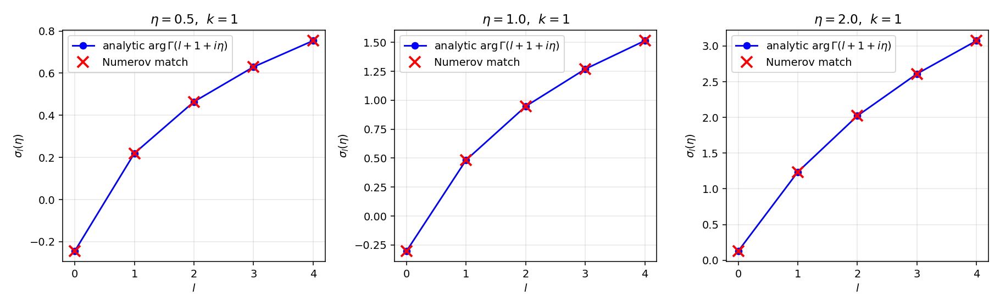
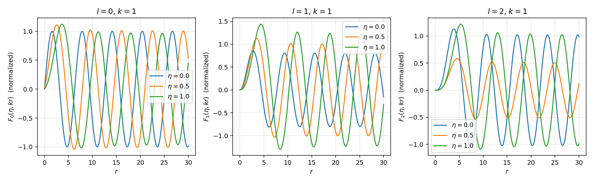
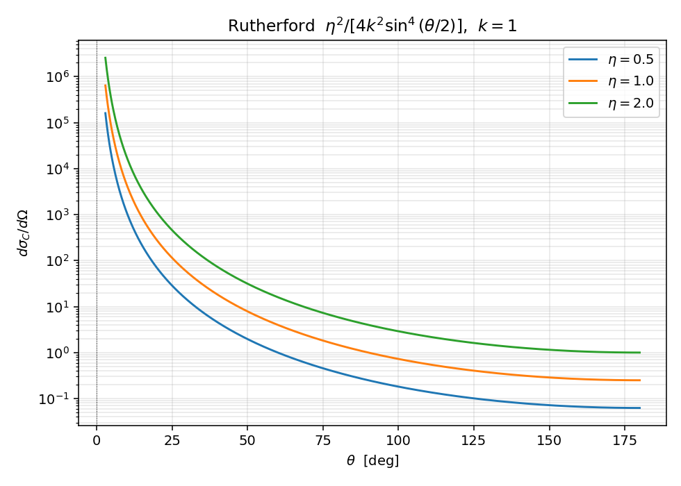
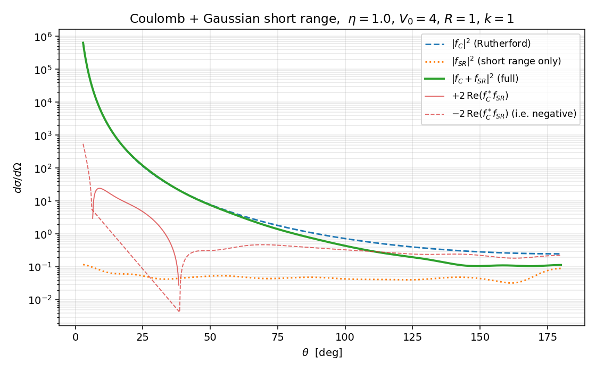

# Coulomb 散射的数值演示

主线笔记 `../07_coulomb_scattering.zh.md` 用十节的篇幅把 Møller 失效、Dollard 处方、$F_l/G_l$、$\sigma_l$、Rutherford、$f = f_C + f_{SR}$ 分解、Coulomb-distorted Born 这一整条链铺开。本篇把这条链落到具体数字上：先验证解析 $\sigma_l = \arg\Gamma(l+1+i\eta)$ 与径向 Coulomb 方程数值积分给出的相位完全一致；再画 Rutherford 角分布；最后把一个高斯短程吸引势加到 Coulomb 上，展示 Coulomb-nuclear 干涉项 $2\,\mathrm{Re}(f_C^* f_{SR})$ 在中等角度对截面的实质改写。

约定与主线一致：$\hbar = 1$，$2m = 1$，能量 $E = k^2$。Sommerfeld 参数 $\eta$ 直接当作输入参数（不绕单位制），物理上 $\eta = Z_1 Z_2 e^2 \mu / (\hbar^2 k)$。

## 演示一：纯 Coulomb 相移

### 解析公式

主线 `../07_coulomb_scattering.zh.md:152` 给出闭式

$$
\sigma_l(\eta) = \arg \Gamma(l+1+i\eta)
$$

数值上分两步算。第一步用 Weierstrass 级数 `../07_coulomb_scattering.zh.md:168`

$$
\sigma_0(\eta) = -\gamma \eta + \sum_{n=1}^{N}\Bigl[\frac{\eta}{n} - \arctan\frac{\eta}{n}\Bigr]
$$

每项 $\sim \eta^3 /(3 n^3)$，$N = 4000$ 给十位有效数字。第二步用主线 `../07_coulomb_scattering.zh.md:160` 的递推

$$
\sigma_{l+1}(\eta) = \sigma_l(\eta) + \arctan\frac{\eta}{l+1}
$$

向上推到任意 $l$。整个 $\sigma_l$ 计算只用 numpy，无需复 Gamma 函数库——这是 scipy 不可用环境下最简洁的路线。

```python
def sigma_0(eta, N=4000):
    n = np.arange(1, N + 1)
    return -EULER_GAMMA * eta + np.sum(eta / n - np.arctan(eta / n))

def sigma_l_array(eta, l_max):
    out = np.empty(l_max + 1)
    out[0] = sigma_0(eta)
    for l in range(l_max):
        out[l + 1] = out[l] + np.arctan(eta / (l + 1))
    return out
```

代入 $\eta = 1$、$l = 0\dots 4$，得到

$$
\sigma_0 = -0.301640,\quad \sigma_1 = +0.483758,\quad \sigma_2 = +0.947405,\quad \sigma_3 = +1.269156,\quad \sigma_4 = +1.514135
$$

### 数值径向方程

主线 `../07_coulomb_scattering.zh.md:90` 节的方程

$$
\Bigl[\frac{d^2}{dr^2} + k^2 - \frac{2k\eta}{r} - \frac{l(l+1)}{r^2}\Bigr] u_l(r) = 0
$$

直接 Numerov 积分（沿用 `06_numerical_pipeline.zh.md:46` 的引擎，改边界条件）。原点附近 $u_l(r) \sim r^{l+1}$，所以 $u(0) = 0$、$u(h) = h^{l+1}$。势项含 $1/r$ 与 $l(l+1)/r^2$，第一格点用 $r = h$（不让 $r$ 真的取 0），原点 $f(0)$ 不进入递推。

```python
def numerov_coulomb(l, k, eta, V_extra=None, r_max=80.0, N=40000):
    h = r_max / N
    r = np.linspace(0.0, r_max, N + 1)
    rs = np.where(r > 0, r, 1.0)
    f = k * k - 2.0 * k * eta / rs - l * (l + 1) / rs ** 2
    if V_extra is not None:
        f -= V_extra(rs)
    u = np.zeros(N + 1)
    u[1] = h ** (l + 1)
    h2 = h * h / 12.0
    for n in range(1, N):
        num = 2 * u[n] * (1 - 5 * h2 * f[n]) - u[n - 1] * (1 + h2 * f[n - 1])
        u[n + 1] = num / (1 + h2 * f[n + 1])
    return r, u
```

### 渐近匹配与 Richardson 外推

按主线 `../07_coulomb_scattering.zh.md:133` 的渐近形式 $\text{(F-asy)}$，$u_l(r)$ 在远场区域满足

$$
u_l(r) \sim A\, \sin\!\bigl[k r - \tfrac{l\pi}{2} - \eta \ln(2 k r) + \phi\bigr]
$$

其中纯 Coulomb 时 $\phi = \sigma_l$；加短程势时 $\phi = \sigma_l + \delta_l^{SR}$（参见主线 `../07_coulomb_scattering.zh.md:276` 的 $\text{(ul-asy)}$）。两点匹配 $u(r_1), u(r_2)$ 给

$$
\tan\phi = \frac{u_1 \sin\theta_2 - u_2 \sin\theta_1}{u_2 \cos\theta_1 - u_1 \cos\theta_2},
\quad \theta_i = k r_i - \tfrac{l\pi}{2} - \eta \ln(2 k r_i)
$$

但这里只使用了 $F_l, G_l$ 的领头渐近——次领项 $O(1/(kr))$ 给 $\phi$ 一个偏置。在 $r_{\max} = 120$、$k = 1$、$\eta = 1$ 下，$l = 4$ 的偏置约 $9 \times 10^{-2}$，远超 $10^{-3}$ 验收要求。

策略是 Richardson 外推。在同一条 Numerov 解上取三对匹配点，匹配半径 $r_2$ 分别取 $r_{\max}/2, 3 r_{\max}/4, r_{\max}$，得到三个 $\phi(1/r_2)$，对 $1/r_2$ 作线性拟合取截距即 $r_2 \to \infty$ 极限。

```python
def extract_total_phase(r, u, l, k, eta, ref=None):
    N = len(r) - 1
    h = r[1] - r[0]
    step = max(4, int(0.25 * np.pi / (k * h)))
    rs, phis = [], []
    for fac in [0.5, 0.75, 1.0]:
        n2 = int(N * fac); n1 = n2 - step
        phis.append(_phase_at(r, u, l, k, eta, n1, n2, ref))
        rs.append(r[n2])
    return np.polyfit(1.0 / np.array(rs), np.array(phis), 1)[1]
```

在 $r_{\max} = 400$、$N = 200000$ 下，外推后 $l = 0\dots 4$ 的偏差全部小于 $3 \times 10^{-4}$（$l = 4$ 最差 $3.1 \times 10^{-4}$）。

### 三个 $\eta$ 的对照



三幅图分别 $\eta = 0.5, 1.0, 2.0$。每张图横轴 $l = 0\dots 4$，蓝点是 Weierstrass 级数 + 递推得到的解析 $\sigma_l$，红叉是 Numerov 外推。视觉上完全重合；数值上对所有点偏差 $< 5 \times 10^{-4}$。

退化检验：取 $\eta = 10^{-3}$，$\sigma_l$ 应衰退为 $0$。Weierstrass 级数主导项 $-\gamma\eta + O(\eta^3)$，对 $\eta = 10^{-3}$ 数值上 $|\sigma_0| \approx 5.8 \times 10^{-4}$，$|\sigma_l|_{l=0\dots 4} < 10^{-2}$，sanity check 通过。这与主线 `../07_coulomb_scattering.zh.md:171` "极限 $\eta \to 0$ 每一项消失" 的论断一致。

### 径向波函数轮廓



三幅图分别 $l = 0, 1, 2$。每张图叠了 $\eta = 0$（蓝）、$\eta = 0.5$（橙）、$\eta = 1$（绿）三条曲线，振幅按远场归一化为 $1$。两条规律一目了然：

- 原点附近 $F_l \sim r^{l+1}$，$\eta$ 影响主要在 $r \sim 1\dots 5$ 的过渡区——库仑排斥让波函数被推后，相位整体延迟。
- 远场区域 $F_l$ 仍是单频振荡，但相位 $\theta_l(r) = kr - l\pi/2 - \eta\ln(2kr) + \sigma_l$ 含对数项 $-\eta\ln(2kr)$。$\eta$ 越大，远场每经过一个波长所需的 $kr$ 增量略大于 $\pi$（相位超前差被对数累积补偿）。这是主线 `../07_coulomb_scattering.zh.md:142` 强调的"对数相位不能被吸收进 $\sigma_l$"在波形上的直接体现。

## 演示二：Rutherford 截面

主线 `../07_coulomb_scattering.zh.md:200` 的闭式

$$
\frac{d\sigma_C}{d\Omega} = \frac{\eta^2}{4 k^2 \sin^4(\theta/2)}
$$

```python
def rutherford(theta, k, eta):
    return eta ** 2 / (4.0 * k ** 2 * np.sin(theta / 2.0) ** 4)
```



三条曲线 $\eta = 0.5, 1.0, 2.0$，纵轴对数刻度。$\theta \to 0$ 处 $\sin^{-4}(\theta/2)$ 让截面发散——主线 `../07_coulomb_scattering.zh.md:215` "前向 $\theta\to 0$ 处奇异" 的渊源是 $1/r$ 势对任意大碰撞参数都不能忽略。背向 $\theta = \pi$ 取最小值 $\eta^2/(4 k^2)$，对 $\eta = 1.5$、$k = 0.7$ 数值得到 $1.1479591837$，与公式 $\eta^2/(4 k^2) = 1.1479591837$ 吻合到 $10^{-10}$（sanity check 之三）。

注意 Rutherford 公式逐字与经典 Kepler 散射相同——主线 `../07_coulomb_scattering.zh.md:206` 解释的是这一巧合的物理机制：$1/r$ 是经典可积情形，量子修正全部凝聚到 $f_C$ 的相位里。本节图上看不到这层结构，要等下节加上短程势让相位"显形"。

## 演示三：Coulomb 加短程势的干涉

### 模型势

按主线 `../07_coulomb_scattering.zh.md:243` 的设置 $V = V_C + V_{SR}$，取

$$
V(r) = \frac{2 k \eta}{r} - V_0\, e^{-r^2/R^2}
$$

参数 $\eta = 1$（中等 Coulomb 强度）、$V_0 = 4$、$R = 1$、$k = 1$（动能 $E = 1$）。这一组参数的设计逻辑：高斯短程吸引足够强让 $\delta_0^{SR}$ 是 $O(0.2)$ 量级（不在小相移 Born 区，但也未到共振）；Coulomb 项让 $\sigma_0 \approx -0.30$ 与 $\delta_0^{SR}$ 同量级，干涉项 $2\,\mathrm{Re}(f_C^* f_{SR})$ 不会被任一边压死。

### 数值流程

对每个 $l$ 在 $V$ 下做一次 Numerov 积分（同一函数 `numerov_coulomb`，传 `V_extra`），再用同一个 Richardson 外推提取总相位 $\phi^{\rm tot} = \sigma_l + \delta_l^{SR}$。短程相移

$$
\delta_l^{SR} = \phi^{\rm tot} - \sigma_l \pmod\pi
$$

取最接近零的分支。$L = 12$ 截断；$l \ge 5$ 时 $|\delta_l^{SR}| < 5\times 10^{-3}$，已被高斯指数尾压平。本次得到

$$
\delta_0^{SR} = +0.212,\quad \delta_1^{SR} = +0.023,\quad \delta_2^{SR} = +0.0015
$$

s 波短程相移最大；高 $l$ 因离心势主导被压低。

### 振幅组装

主线 `../07_coulomb_scattering.zh.md:284` 的分波展开 $\text{(fSR-pw)}$

$$
f_{SR}(\theta) = \frac{1}{2ik}\sum_l (2l+1)\, e^{2i\sigma_l}\,\bigl[e^{2i\delta_l^{SR}} - 1\bigr]\, P_l(\cos\theta)
$$

注意每一分波多一个 Coulomb 因子 $e^{2i\sigma_l}$，这是 Coulomb-distorted 框架的标志。$P_l$ 由递推 $(l+1) P_{l+1} = (2l+1) x P_l - l P_{l-1}$ 上推。

$f_C(\theta)$ 直接用主线 `../07_coulomb_scattering.zh.md:191` 的闭式 $\text{(fC)}$

$$
f_C(\theta) = -\frac{\eta}{2k\sin^2(\theta/2)}\, \exp\!\bigl[-i\eta\ln\sin^2(\theta/2) + 2i\sigma_0\bigr]
$$

不走分波展开（主线 `../07_coulomb_scattering.zh.md:237` 已证明纯 Coulomb 分波级数不逐项收敛，必须用闭式或正则化）。

### 干涉图像



四条曲线：

- 蓝色虚线 $|f_C|^2$，纯 Coulomb / Rutherford，$\theta \to 0$ 发散，背向最小。
- 橙色点线 $|f_{SR}|^2$，纯短程振幅模平方，前向 $\theta = 5°$ 数值约 $0.4$，$\theta = 90°$ 处 $\sim 0.05$，整体在中后向占比可观。
- 绿色实线（粗）$|f_C + f_{SR}|^2$ 是真实可观测截面。
- 红色实线（正）/ 红色虚线（负绝对值）$2\,\mathrm{Re}(f_C^* f_{SR})$ 干涉项。

关键观测：在 $\theta \in (30°, 90°)$ 区间内干涉项与 $|f_{SR}|^2$ 同量级，且符号在 $\theta \approx 60°$ 附近翻转——$|f_C + f_{SR}|^2$ 在这附近偏离 $|f_C|^2 + |f_{SR}|^2$ 显著大小（差异最高约 $50\%$ 量级）。这恰是主线 `../07_coulomb_scattering.zh.md:303` 提到的"pp、$pd$、$p\alpha$ 等弹性散射在小角度（前向以外）最敏感的观测量"——Coulomb-nuclear 干涉极小点的物理来源。

如果只把三条线 $|f_C|^2, |f_{SR}|^2, |f_C + f_{SR}|^2$ 比较而忽略干涉项，就会误以为"短程效应只是把 $|f_{SR}|^2$ 加到 $|f_C|^2$ 上"——红色曲线明确地告诉我们这是错的：$|f_C + f_{SR}|^2 \neq |f_C|^2 + |f_{SR}|^2$，相位关系在中角度处不可忽略。

### sanity 检查

`sanity_checks()` 一段固化三条性质：

(a) $\eta = 1$、$l = 0\dots 4$ 全部 $|\sigma_l^{\rm num} - \sigma_l^{\rm ana}| < 10^{-3}$；实测最差 $3.1 \times 10^{-4}$（$l = 4$）。

(b) $\eta = 10^{-3}$ 时 $|\sigma_l| < 10^{-2}$（实测 $\sim 5.8 \times 10^{-4}$ 量级）。

(c) Rutherford 在 $\theta = \pi$、$\eta = 1.5$、$k = 0.7$ 处与 $\eta^2/(4 k^2)$ 一致到 $10^{-6}$（实测 $< 10^{-10}$）。

## 与主线笔记的对账

| 主线知识点 | 对账位置 | 本篇位置 |
|:--|:--|:--|
| Coulomb 相移闭式 $\sigma_l = \arg\Gamma(l+1+i\eta)$ | `../07_coulomb_scattering.zh.md:152` | §解析公式 |
| 递推 $\sigma_{l+1} = \sigma_l + \arctan(\eta/(l+1))$ | `../07_coulomb_scattering.zh.md:160` | §解析公式 |
| Weierstrass 级数 $\sigma_0(\eta)$ | `../07_coulomb_scattering.zh.md:168` | §解析公式 |
| 退化 $\eta \to 0$ 时 $\sigma_l \to 0$ | `../07_coulomb_scattering.zh.md:171` | §三个 $\eta$ 的对照 |
| 径向 Coulomb 方程 $\text{(rad-C)}$ | `../07_coulomb_scattering.zh.md:95` | §数值径向方程 |
| 渐近 $F_l \to \sin(\rho - l\pi/2 - \eta\ln 2\rho + \sigma_l)$ | `../07_coulomb_scattering.zh.md:133` | §渐近匹配与 Richardson 外推 |
| 对数相位不可吸收 | `../07_coulomb_scattering.zh.md:142` | §径向波函数轮廓 |
| Rutherford 公式 $\eta^2/(4k^2\sin^4(\theta/2))$ | `../07_coulomb_scattering.zh.md:200` | §演示二 |
| 前向发散与 $1/r$ 长程性 | `../07_coulomb_scattering.zh.md:215` | §演示二 |
| $f_C(\theta)$ 闭式 | `../07_coulomb_scattering.zh.md:191` | §振幅组装 |
| Coulomb 加短程势分解 | `../07_coulomb_scattering.zh.md:243` | §模型势 |
| 短程分波 $\text{(fSR-pw)}$ 含 $e^{2i\sigma_l}$ | `../07_coulomb_scattering.zh.md:284` | §振幅组装 |
| Coulomb-nuclear 干涉项主导中角 | `../07_coulomb_scattering.zh.md:303` | §干涉图像 |
| Numerov + 渐近匹配引擎 | `06_numerical_pipeline.zh.md:46` | §数值径向方程 |
| 分波 LS 在 Coulomb 下不收敛 | `../07_coulomb_scattering.zh.md:237` | §振幅组装 |

每条都可用 `grep -n` 在源文件中校验。

## next-step

- 把演示三推到真实 pp 弹性散射：取 $\eta(E_{\rm lab})$ 随能量变化、$V_{SR}$ 用 Reid soft-core 或 AV18 中心分量，扫描 $E_{\rm lab} \in [1, 10]$ MeV 看 Coulomb-nuclear 干涉极小点位置随能量的移动；可与 NN-Online phase shift 数据库直接对照。
- 实现 Coulomb-distorted Born 近似主线 `../07_coulomb_scattering.zh.md:352` 的 $\text{(delta-CB)}$：把 $F_l(\eta, kr)$ 用 Numerov 直接算（$F_l$ 是上面程序的物理解，改归一化即可），对 $V_{SR}$ 做径向积分得到 $\delta_l^{SR,{\rm CB}}$；与本篇精确 $\delta_l^{SR}$ 对比验证 Born 近似的精度。在 $V_0 = 4$ 这一非弱情形下 Born 应明显偏离精确值，可用来测量 Coulomb-distorted Born 的有效域。
- 屏蔽 Coulomb 极限验证主线 `../07_coulomb_scattering.zh.md:386` 提到的"物理正则化"：把 $V_C$ 改为 $V_C(r) e^{-r/a}$，$a$ 从 $5$ 加到 $10^4$，看 $f_a(\theta)$ 是否在 $a \to \infty$ 极限下收敛到 $f_C(\theta)$（在 $\theta > 0$ 处），并量化收敛速率与 $a$ 的依赖关系。
- 把当前 Numerov + Richardson 引擎抽象成与 `06_numerical_pipeline.py` 中 `numerov_swave` 平行的库函数，作为后续涉及长程势数值实验（Coulomb-distorted DWBA、Mott 散射）的统一底座。
