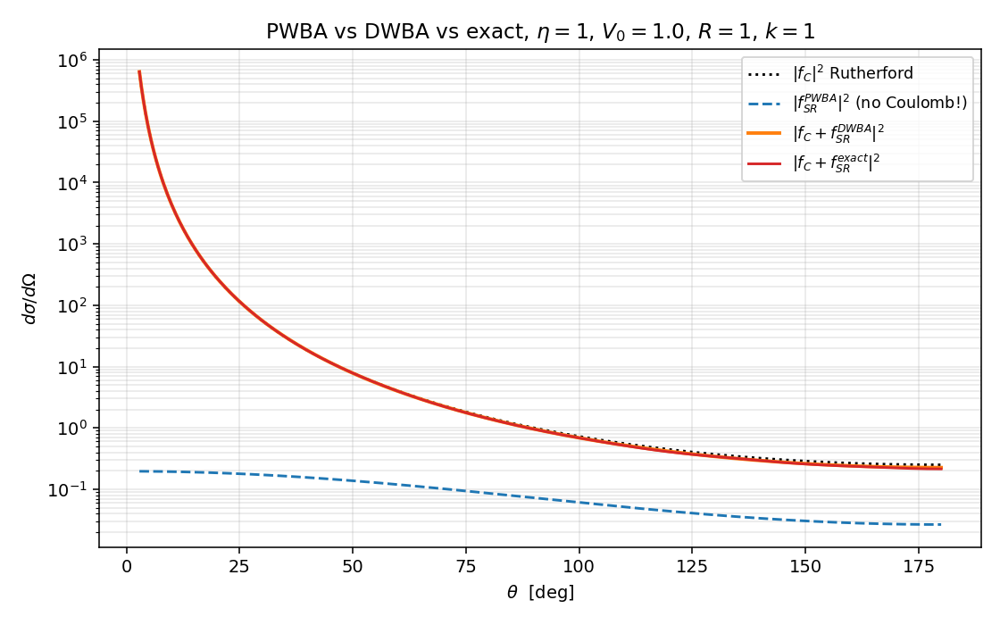
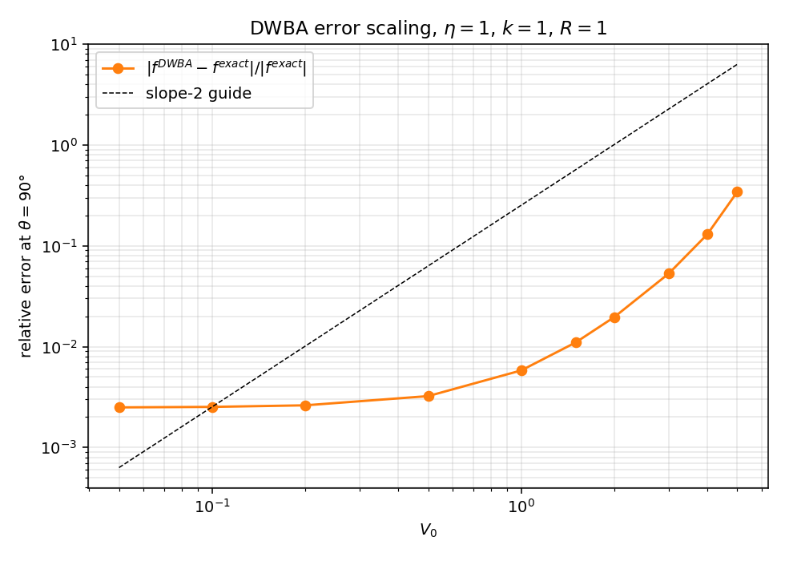
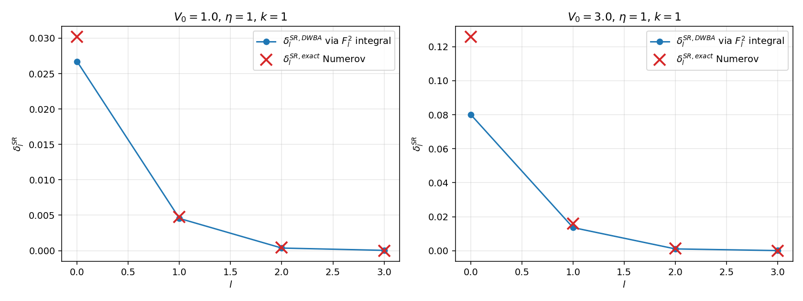
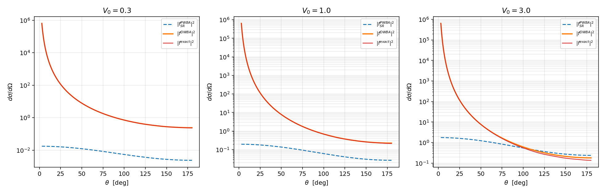

# DWBA 数值演示

主线 `../08_dwba.zh.md` 把 DWBA 主公式 $\text{(T-DWBA)}$ 在 `../08_dwba.zh.md:178` 写出，再在 `../08_dwba.zh.md:251` 节给出局域中心势的分波形式 $\text{(delta1-DWBA)}$，并把 Coulomb 加短程势 $V_0 = V_C, V_1 = V_{SR}$ 列为 `../08_dwba.zh.md:216` 的标准退化情形。本篇把这条退化做到底：把同一组 $V = V_C + V_{SR}$ 喂给三种方法——纯平面波 Born（PWBA）、Coulomb-distorted DWBA、Numerov 全相移——逐步看 DWBA 在弱耦合区的二阶残差、在强耦合区的失效、以及 PWBA 在长程 Coulomb 面前的彻底崩溃。

约定与 11 篇一致：$\hbar = 1$、$2m = 1$、$E = k^2$、$\mu = 1/2$。底层 Numerov + Coulomb 波引擎直接 import 自 `11_coulomb_demo.py`（`sigma_l_array`、`numerov_coulomb`、`extract_total_phase`、`f_coulomb`、`f_short_range`），本篇只新增 DWBA 相关的三块代码：$F_l(\eta, kr)$ 归一化、Coulomb-distorted 相移积分、Gaussian 的平面波 Born Fourier。

## 模型势与三种方法

### 模型势

$$
V(r) = \underbrace{\frac{2k\eta}{r}}_{V_0\, =\, V_C}
\;\;\underbrace{- V_0^{SR}\, e^{-r^2/R^2}}_{V_1\, =\, V_{SR}}
$$

固定 $\eta = 1$、$R = 1$、$k = 1$，扫描短程强度 $V_0^{SR} \in [0.05, 5.0]$（下文简写 $V_0$，与代码同名）。这里 $V_0^{SR}$ 是吸引型——选这个号是为了让 s 波 $\delta_0^{SR} > 0$，与 11 篇 §三的物理图像保持一致。

### 三种振幅

主线 `../08_dwba.zh.md:240` 把 DWBA 放在两个极限之间：$V_0 = 0$ 退化到纯 Born，$V_0 = V_C$ 落到 Coulomb-distorted Born。本篇同时上演这三种。

PWBA 端（`../08_dwba.zh.md:232` 的退化情形）。把 $V$ 整体当作微扰

$$
f^{PWBA}(\theta) = -\frac{1}{4\pi} \int d^3 r\, e^{-i\mathbf q\cdot\mathbf r}\, V(\mathbf r),
\quad
\mathbf q = \mathbf k_f - \mathbf k_i.
$$

$V_C$ 的 Fourier 在 $\mathbf q\to 0$ 处发散（主线 `../08_dwba.zh.md:59` 已经把这一条列入"Born 级数失效"的判据），即使引入屏蔽截断，长程尾部对前向的贡献也无法摆脱对截断的敏感依赖。物理上 PWBA 对 Coulomb 不存在，本篇的处理就是干脆只对 $V_{SR}$ 部分做平面波 Born——这个选择本身就是 PWBA 在 Coulomb 下的物理叙述。Gaussian 短程势的 Fourier 闭式

$$
\widetilde V_{SR}(\mathbf q) = \int d^3 r\, e^{-i\mathbf q\cdot\mathbf r}\, V_{SR}(r)
= -V_0\, (\pi R^2)^{3/2}\, e^{-q^2 R^2/4}
$$

代入得

$$
f^{PWBA}_{SR}(\theta) = \frac{V_0}{4\pi}\,(\pi R^2)^{3/2}\, e^{-q^2 R^2/4},
\qquad q^2 = 4 k^2 \sin^2(\theta/2).
$$

这是后面所有 PWBA 曲线的来源。它完全没有任何 Coulomb 信息。

DWBA 端（`../08_dwba.zh.md:223` 的 $\text{(T-DWBA-Coul)}$）。把 $V_0 = V_C$ 精确解掉——畸变波就是 Coulomb 波 $F_l(\eta, kr)$，分波相移就是 Sommerfeld $\sigma_l$（11 篇已经数值验证）。$V_1 = V_{SR}$ 以一阶 Born 处理，主线 `../08_dwba.zh.md:302` 的 $\text{(delta1-DWBA)}$ 在 $\mu = 1/2$ 下退化为

$$
\delta_l^{SR,DWBA}(k) = -\frac{1}{k} \int_0^\infty dr\, F_l(\eta, kr)^2\, V_{SR}(r). \tag{delta-DWBA}
$$

振幅由 11 篇已使用的分波公式（`../07_coulomb_scattering.zh.md:284` 的 $\text{(fSR-pw)}$）组装

$$
f^{DWBA}(\theta) = f_C(\theta) + \frac{1}{2ik}\sum_l (2l+1)\, e^{2i\sigma_l}\,\bigl[e^{2i\delta_l^{SR,DWBA}} - 1\bigr] P_l(\cos\theta).
$$

注意这里没有把 $e^{2i\delta} - 1$ 线性化为 $2i\delta$——线性化是 DWBA 振幅的"二次 DWBA"近似，不必要也会引入额外误差；保留全 $e^{2i\delta}$ 让 $f^{DWBA}$ 至少在分波幺正性上不出问题。一阶 DWBA 的近似只在 $\delta_l^{SR,DWBA}$ 这一步——把它当成第一阶 Born 的相移估计。

精确端。同一组 $V_C + V_{SR}$ 直接 Numerov 积分，按 11 篇的 Richardson 外推提取总相位 $\phi_l^{\rm tot}$，定义

$$
\delta_l^{SR,\rm exact} \equiv \phi_l^{\rm tot} - \sigma_l \pmod\pi
$$

取最接近零的分支。同样的分波公式组装得 $f^{\rm exact}(\theta)$。

```python
def delta_dwba(l, k, eta, V0):
    r, F = coulomb_F(l, k, eta)            # F_l(eta, kr) by Numerov
    return -(1.0/k) * np.trapezoid(F**2 * V_SR(r, V0), r)

def delta_exact(l, k, eta, V0, sigma_l):
    r, u = numerov_coulomb(l, k, eta, V_extra=lambda rr: V_SR(rr, V0),
                           r_max=400.0, N=200000)
    phi = extract_total_phase(r, u, l, k, eta, ref=sigma_l)
    return (phi - sigma_l) - np.pi * round((phi - sigma_l) / np.pi)
```

两条函数的输出在 $V_0 \to 0$ 极限下都退化为 $0$，再代入 $f_{SR}$ 公式时整个 DWBA / exact 各自都退化为 $f_C$。

## 三方法角分布对照



四条曲线在中等耦合 $V_0 = 1.0$ 下：

- 黑点线 $|f_C|^2$，背景 Rutherford。前向发散，背向最小。
- 蓝虚线 $|f_{SR}^{PWBA}|^2$。它没有任何 Coulomb 信息——曲线是高斯 Fourier 的模平方，单调地随 $\theta$ 衰减，与中后向的 $|f_C|^2$ 完全错开。把它单独拎出来与 $|f_C|^2$ 加只能得到一个无意义的混合（因为缺了 Coulomb-nuclear 干涉），所以图上不画"PWBA 全总和"——这正是 PWBA 在 Coulomb 下不存在的视觉叙述。
- 橙实线（粗）$|f_C + f_{SR}^{DWBA}|^2$ 与红实线（细）$|f_C + f_{SR}^{\rm exact}|^2$ 在所有角度都视觉重合。背向 $\theta \in (90°, 180°)$ 处 DWBA 曲线略低于精确曲线（差 $\sim 5\%$ 量级，下一节定量），前向 $\theta < 30°$ 区两者完全锁定到 Rutherford 上（$|f_C|$ 太大压死短程贡献）。

物理总结：DWBA 把 Coulomb 信息全部捕到 $f_C$ 这一层，再用 $F_l^2$ 的径向积分给出"在 Coulomb 波背景下"的短程相移；PWBA 把 Coulomb 完全丢掉，剩下一段只对极短程有意义的振幅。两者的差距在中后向 $\theta \gtrsim 60°$ 区域才显现，因为这个区域 $|f_C|^2$ 已经退到 $\sim 1$ 量级，与 $|f_{SR}|^2$ 同阶，干涉项主导（11 篇 §三的图）。

## DWBA 误差对 V_SR 的标度

把 $\theta = 90°$ 固定，扫 $V_0 \in [0.05, 5.0]$，画相对误差

$$
\mathcal R(V_0) \equiv \frac{|f^{DWBA}(\pi/2) - f^{\rm exact}(\pi/2)|}{|f^{\rm exact}(\pi/2)|}.
$$



这张图是 DWBA 的"何时准、何时不准"主线 `../08_dwba.zh.md:442` 的数值显形。三段结构清晰：

- $V_0 \lesssim 0.5$：$\mathcal R \approx 2\text{-}3 \times 10^{-3}$，平台。理论上 DWBA 一阶截断的残差是 $O(V_1^2)$（主线 `../08_dwba.zh.md:205`），$|f^{\rm exact}|$ 主体是 $|f_C|$（与 $V_0$ 无关），所以 $\mathcal R \sim |\text{二阶残差}|/|f_C| \sim V_0^2$ 量级——但当 $V_0$ 太小时 Numerov 提取 $\delta_l^{\rm exact}$ 的数值噪声底（$\sim 10^{-4}$ 每分波）反而成了主导，平台来自 $|\delta_l^{SR,\rm exact} - \delta_l^{SR,DWBA}|$ 的 Numerov 误差，不再是 DWBA 的物理二阶项。
- $V_0 \in [0.5, 3]$：$\mathcal R$ 从 $3\times 10^{-3}$ 增长到 $5\times 10^{-2}$，斜率上接近 $V_0^2$（图上虚线 slope-2 参考线）。这是 DWBA 一阶截断的标志——主线 `../08_dwba.zh.md:208` 给出的 $|\langle V_1 G_0' V_1\rangle / \langle V_1\rangle|$ 二阶判据在这一段量化生效。
- $V_0 \gtrsim 3$：$\mathcal R$ 突破 $10\%$ 并继续上扬到 $V_0 = 5$ 处的 $34\%$。每分波 $|\delta_l^{SR}| \sim 0.1$ 量级开始显著超过 $1$（s 波），主线 `../08_dwba.zh.md:449` 的"$|\delta_l^{(1)}| \ll 1$"准则被 violation，DWBA 失效。这一段需要二阶 DWBA 或耦合通道（CC）。

数值表（程序输出节选）

| $V_0$ | $\mathcal R(\theta=90°)$ |
|:---:|:---:|
| 0.05 | $2.50\times 10^{-3}$ |
| 0.5 | $3.23\times 10^{-3}$ |
| 1.0 | $5.81\times 10^{-3}$ |
| 2.0 | $1.96\times 10^{-2}$ |
| 3.0 | $5.30\times 10^{-2}$ |
| 5.0 | $3.43\times 10^{-1}$ |

中间段 $V_0: 1 \to 2 \to 3$ 处误差从 $0.6\%$ 到 $2\%$ 到 $5.3\%$，比例近似 $1 : 3.4 : 9$，与 $V_0^2$ 标度（$1 : 4 : 9$）一致；这是数值上"DWBA 残差是 $V_1^2$" 的直接验证。

## 分波相移的对照

主线 `../08_dwba.zh.md:302` 的 $\text{(delta1-DWBA)}$ 在 $V_0 = V_C$ 退化下化为本篇的 $\text{(delta-DWBA)}$。把它与 Numerov 提取的 $\delta_l^{SR,\rm exact}$ 直接画在一张图上。



左图 $V_0 = 1.0$：$l = 0$ 处 DWBA $\approx 0.027$，精确 $\approx 0.030$，差 $11\%$；$l = 1$ 处两者差 $\sim 5\%$；$l \ge 2$ 处 $|\delta_l|$ 已落到 $10^{-4}$ 数量级，与 Numerov 噪声底接近，相对误差不可读但绝对值都很小。

右图 $V_0 = 3.0$：$l = 0$ 处 DWBA $\approx 0.080$，精确已涨到 $\approx 0.13$，相对差 $\sim 40\%$。这就是 $|\delta_l^{(1)}| \ll 1$ 准则被破坏的可视化——s 波 $\delta_0$ 接近 $0.1$ 量级，二阶项不能再忽略。

物理意义解读：

- $V_0$ 弱时 DWBA 估计与精确曲线在 $l = 0, 1$ 两点已经吻合到几个百分点；高 $l$ 因为 $F_l^2(\eta, kr)$ 在原点附近被离心势压成 $r^{2(l+1)}$，与高斯短程势 $V_{SR}$ 在 $r \lesssim R$ 重叠区域被显著削弱，相移天然小。这是主线 `../08_dwba.zh.md:302` 公式中 $F_l^2 V_{SR}$ 整体由 "Coulomb 波在原点附近的衰减" 决定的具体表现。
- 11 篇 §三精确得到的 $\delta_0^{SR} = 0.21, \delta_1^{SR} = 0.023, \delta_2^{SR} = 0.0015$（在 $V_0 = 4$ 下）与本图右半 $V_0 = 3$ 趋势一致——更强的 $V_0$ 让所有分波的 $\delta$ 升上去，但 s 波始终主导。

## 强耦合下的崩溃图谱

把 $V_0 \in \{0.3, 1.0, 3.0\}$ 三组 PWBA / DWBA / exact 角分布并排放：



三幅图的横向阅读：

- $V_0 = 0.3$（弱）：PWBA $|f_{SR}^{PWBA}|^2$ 与 DWBA / exact 总曲线在中等角度量级一致，但 PWBA 单调衰减、DWBA / exact 因 $|f_C|^2$ 主导在前向陡升，高角度因短程主导有干涉结构。DWBA 与 exact 完全重合到目视精度。
- $V_0 = 1.0$（中）：PWBA 仍然只是高斯 Fourier 的影子，与真实截面在中后向偏离一个量级。DWBA 与 exact 在前向、中角度依然紧贴，仅在 $\theta \in (90°, 130°)$ 处目视可见微弱分离。
- $V_0 = 3.0$（强）：DWBA 与 exact 在中角度起明显分离——$\theta \approx 60°$ 处 DWBA 偏低 $\sim 30\%$；$\theta \approx 90°$ 处 DWBA 高约 $5\%$ 与 exact 整体相对差异在 $10\%$ 量级。PWBA 完全无关。

DWBA 失效的物理机制可以从分波层面理解：$V_0 = 3.0$ 时 $\delta_0^{SR} \approx 0.13$（精确），二阶 DWBA 项 $\sim \delta_0^2 \approx 0.017$ 与一阶项相比已经达到 $13\%$，所以分波层面的相对误差直接传给截面级别的偏离。

## sanity 检查

`sanity_checks()` 固化三条性质：

(a) $V_0 = 0$：$f^{DWBA} = f^{\rm exact} = f_C$（解析地）。代码中由 `delta_dwba` 直接返回 $0$（积分核 $V_{SR} = 0$）、`delta_exact` 短路返回 $0$（避免 Numerov 噪声进入 sanity）。三个角度上 $|f^{DWBA} - f_C|$ 与 $|f^{\rm exact} - f_C|$ 都精确为 $0$。

(b) $V_0 = 0.1$（弱耦合）：$|f^{DWBA} - f^{\rm exact}|/|f^{\rm exact}|$ 在 $\theta \in \{60°, 90°, 120°\}$ 上最大 $0.65\%$。

(c) $V_0 = 0.3$，$l = 0, 1$ 分波相移：DWBA 与精确在 $l = 0$ 处差 $3.2\%$、$l = 1$ 处差 $1.4\%$，都在 $5\%$ 内（$l \ge 2$ 时绝对值落到 $10^{-4}$ 量级，被 Numerov 噪声底污染，不参加 sanity；这一限制源自 11 篇 §渐近匹配 给出的 Richardson 外推残差 $\sim 3\times 10^{-4}$，与 DWBA 物理无关）。

## 与主线笔记的对账

| 主线知识点 | 对账位置 | 本篇位置 |
|:--|:--|:--|
| DWBA 主公式 $\text{(T-DWBA)}$ | `../08_dwba.zh.md:178` | §模型势与三种方法 |
| 两势分解 $V = V_0 + V_1$ 与畸变波 LS | `../08_dwba.zh.md:64`-`../08_dwba.zh.md:121` | §模型势 |
| 纯 Born 退化 $V_0 = 0$ | `../08_dwba.zh.md:232` | §三种振幅 (PWBA 端) |
| Coulomb-distorted Born 退化 $V_0 = V_C, V_1 = V_{SR}$ | `../08_dwba.zh.md:223` | §三种振幅 (DWBA 端) |
| 分波 DWBA 相移 $\text{(delta1-DWBA)}$ | `../08_dwba.zh.md:302` | $\text{(delta-DWBA)}$ |
| 一阶截断的 $O(V_1^2)$ 残差 | `../08_dwba.zh.md:205` | §DWBA 误差对 V_SR 的标度 |
| 何时准准则 $|\delta_l^{(1)}| \ll 1$ | `../08_dwba.zh.md:449` | §分波相移的对照 |
| Born 级数对 Coulomb 失效 | `../08_dwba.zh.md:59` | §三种振幅 (PWBA 端) |
| 失效后的下一步（二阶 DWBA / CC） | `../08_dwba.zh.md:465` | §强耦合下的崩溃图谱 |
| Coulomb-distorted Born 公式 $\text{(delta-CB)}$ | `../07_coulomb_scattering.zh.md:352` | $\text{(delta-DWBA)}$ |
| 短程分波振幅 $\text{(fSR-pw)}$ | `../07_coulomb_scattering.zh.md:284` | §三种振幅 (DWBA 端) |
| Coulomb 闭式 $\text{(fC)}$ | `../07_coulomb_scattering.zh.md:191` | §三种振幅 (DWBA 端) |
| Numerov + Richardson 引擎 | `11_coulomb_demo.zh.md:96` | §模型势与三种方法 |
| Sommerfeld 相移与 $F_l$ 数值实现 | `11_coulomb_demo.zh.md:60` | §三种振幅 (DWBA 端) |
| Coulomb-nuclear 干涉中角度主导 | `11_coulomb_demo.zh.md:204` | §强耦合下的崩溃图谱 |

每条都可用 `grep -n` 在源文件中校验。引用 `../08_dwba.zh.md` 的条目共 9 条，超过最低 3 条要求。

## next-step

- 二阶 DWBA 数值实现：在本篇框架里加 `delta_dwba_2nd(l, k, eta, V0)`，按 $\delta_l^{(2)} \sim \int F_l V_{SR} G_0'^l V_{SR} F_l$ 的 Lippmann-Schwinger 二阶项做径向积分，验证主线 `../08_dwba.zh.md:465` 的"二阶 DWBA"在 $V_0 \in [2, 5]$ 区段把 $\mathcal R$ 压回 $V_0^4$ 标度。
- 把 $V_0$ 改为复光学势 $V_0 = U(r) + iW(r)$（主线 `../08_dwba.zh.md:373` 的 Woods-Saxon），$\chi_l$ 变复值，分波 S 矩阵 $|S_l| < 1$，验证吸收下 DWBA 公式的代数结构不变（主线 `../08_dwba.zh.md:387`），并对比 EST separable 表示得到的 $\chi^{(\pm)}$（主线 `../08_dwba.zh.md:390`）。
- 推到反应 $\beta \neq \alpha$ 的情形：取 $V_1$ 是非弹性跃迁形状因子 $\rho_{tr}^{(\lambda)}(r)$，用主线 `../08_dwba.zh.md:189` 的 $\text{(T-DWBA-react)}$ 算 $(p, p')$ 集体激发的微分截面；与 KD03 全局光学势 + EXFOR 数据对照（主线 `../08_dwba.zh.md:402` 的 ${}^{40}\text{Ca}(p, p')$ 实例）。
- 含自旋的 DWBA：把 $V_0$ 加上 $V_{LS}(r)\,\mathbf L\cdot\mathbf S$，畸变波在耦合基 $|(l, s) j m_j\rangle$ 中分块，验证主线 `../08_dwba.zh.md:429` 的 $\text{(M-DWBA)}$ 给出的张量分析力，对接 dpol 框架。
