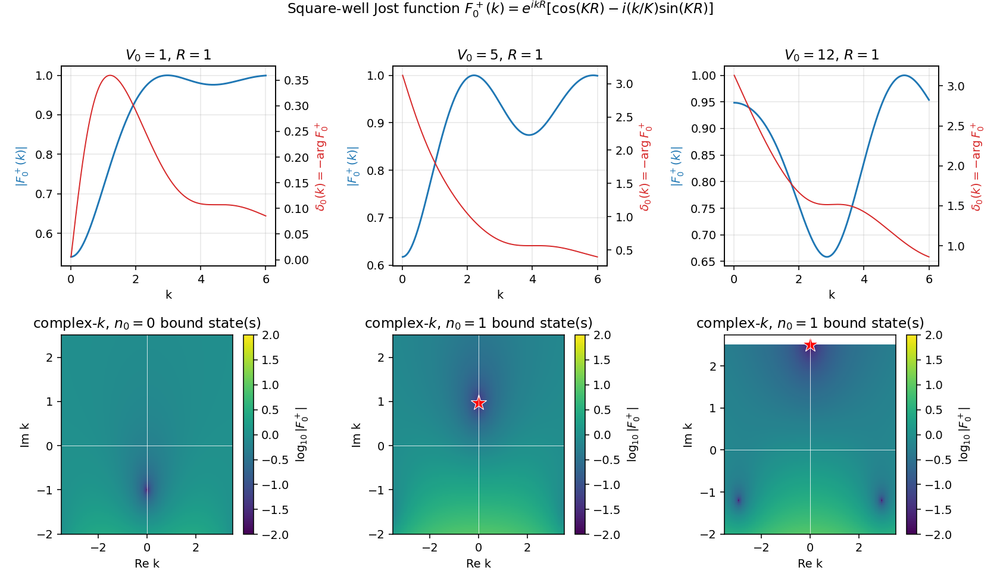
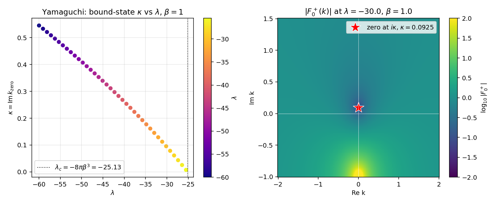
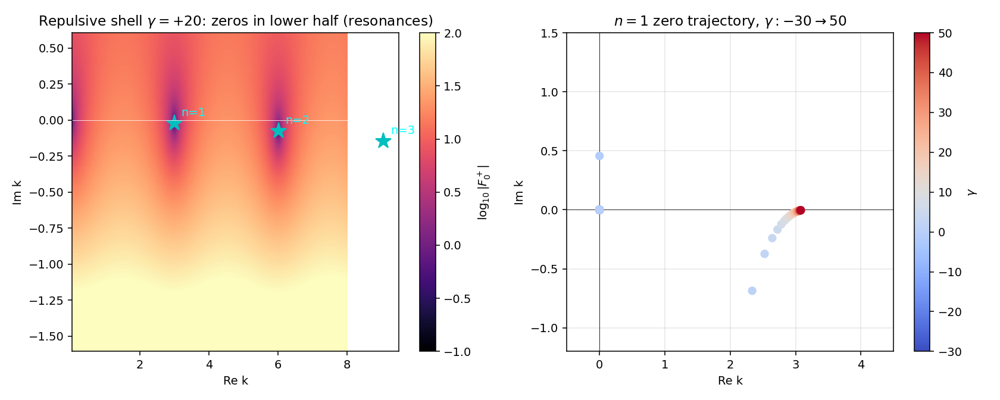
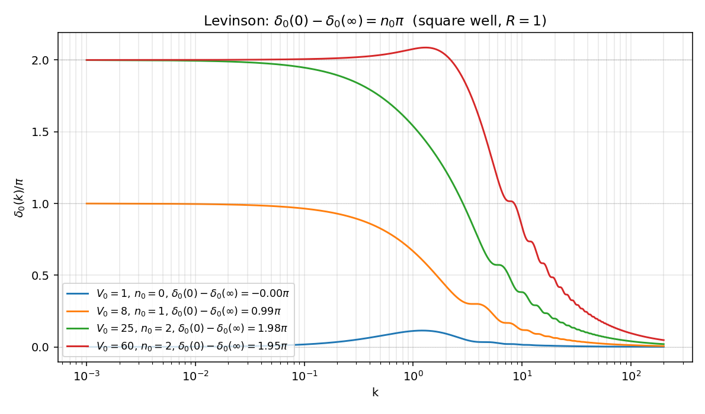

# Jost 函数的数值演示

主线 `../jost_analyticity.zh.md` 把分波振幅 $f_l(k)$ 在复 $k$ 平面的解析结构归到 Jost 函数 $F_l^+(k)$ 的零点结构上。`../jost_analyticity.zh.md:79` 的远场展开 (F-asy) 给出 $F_l^\pm$ 的定义，`../jost_analyticity.zh.md:130` 的 (F-phase) 把实 $k$ 上的相位认作相移 $-\delta_l$，`../jost_analyticity.zh.md:236` 的 Levinson 公式把 $\delta_l(0) - \delta_l(\infty)$ 与上半平面零点数挂钩。这一篇把这条解析图谱在三个有闭式 Jost 函数的可解势上做出来：方阱、Yamaguchi separable、delta-壳层；最后用方阱数值验证 Levinson 定理。

约定 $\hbar = 1$、$2m = 1$、$E = k^2$、$l = 0$、$R = 1$。代码不用 scipy，只 numpy + matplotlib。

## 方阱的闭式 Jost 函数

### 推导

s 波径向方程 $u'' + (k^2 - V)u = 0$ 在方阱 $V(r) = -V_0\theta(R - r)$ 下分两段。内区 $r < R$ 设 $K = \sqrt{k^2 + V_0}$，规则解（满足 `../jost_analyticity.zh.md:49` 的 (phi-0) 即 $\phi_0 \to r$）

$$
\phi_0(k, r) = \frac{\sin(Kr)}{K},\qquad r < R.
$$

外区 $r > R$ 自由方程的 Jost 解就是 $f_0^+(k, r) = e^{ikr}$。两组解的 Wronskian $W[f_0^+, \phi_0] = f_0^+\phi_0' - f_0^{+\prime}\phi_0$ 与 $r$ 无关（`../jost_analyticity.zh.md:84` 的 (F-W) 定义），在 $r = R^-$ 处算

$$
W[f_0^+, \phi_0]\big|_{r=R} = e^{ikR}\bigl[\cos(KR) - i(k/K)\sin(KR)\bigr].
$$

按 (F-W) 在 $l = 0$ 下 $F_0^+(k) = W[f_0^+, \phi_0]$（无额外归一化系数），得到本篇主公式

$$
F_0^+(k) = e^{ikR}\bigl[\cos(KR) - i(k/K)\sin(KR)\bigr],\qquad K = \sqrt{k^2 + V_0}. \tag{F-well}
$$

零势检验：$V_0 = 0$ 时 $K = k$，$F_0^+ = e^{ikR}(\cos kR - i\sin kR) = e^{ikR}\cdot e^{-ikR} = 1$，与 `../jost_analyticity.zh.md:101` 的归一化结论一致。

### 零点条件

代入 $k = i\kappa$（$\kappa > 0$）：$K = \sqrt{V_0 - \kappa^2}$（要求 $\kappa < \sqrt{V_0}$），(F-well) 中 $e^{ikR} = e^{-\kappa R}$ 不为零，所以 $F_0^+(i\kappa) = 0$ 等价于括号内为零：

$$
\cos(KR) + (\kappa/K)\sin(KR) = 0 \;\;\Longleftrightarrow\;\; \tan(KR) = -K/\kappa. \tag{kappa-well}
$$

这是方阱 s 波束缚态的标准条件。临界 $V_0$ 由 $\kappa \to 0^+$ 决定：$\tan(K_0 R) \to -\infty$，即 $K_0 R = (2n - 1)\pi/2$，$K_0 = \sqrt{V_0}$。$R = 1$ 下 $V_{0,c}^{(n)} = ((2n - 1)\pi/2)^2 \in \{2.467, 22.21, 61.69, \ldots\}$。所以 $V_0 = 1$ 无束缚态、$V_0 = 5$ 与 $V_0 = 12$ 各 1 个、$V_0 = 25$ 有 2 个、$V_0 = 60$ 有 2 个。

### 数值

上排实轴：$|F_0^+(k)|$ 蓝线、$\delta_0(k) = -\arg F_0^+(k)$ 红线（按 `../jost_analyticity.zh.md:130` 的 (F-phase) 取负号）。$V_0 = 1$ 弱势，$|F_0^+|$ 在低能微微低于 $1$，$\delta_0$ 全段单调小幅；$V_0 = 5$ 与 $V_0 = 12$ 出现 $|F_0^+|$ 在低能附近的明显凹陷。

下排复 $k$ 平面：$\log_{10}|F_0^+(k_R + ik_I)|$ 等高线，红星标 $+i$ 轴零点。$V_0 = 1$ 整面无零点；$V_0 = 5$ 在 $k = i\cdot 0.965$ 一个零点（束缚能 $E_b = -0.931$）；$V_0 = 12$ 一个零点位置抬高到 $k = i\cdot 2.59$ 量级（更深束缚）。所有零点严格在正虚轴上，与 `../jost_analyticity.zh.md:169` 的"上半平面零点禁止离开正虚轴"的自伴论证一致。

## Yamaguchi separable 的 Jost 函数

### 公式

`../jost_analyticity.zh.md:295` 已经说明 separable rank-1 势下 $F_0^+(k) \propto 1 - \lambda I(k^2)$。从 `05_separable_rank1.py` 复用 form factor 与圈积分

$$
g(p) = \frac{1}{p^2 + \beta^2},\quad I(k^2) = -\frac{1}{8\pi\beta(\beta - ik)^2}.
$$

取归一化使 $V \to 0$（即 $\lambda \to 0$）下 $F_0^+ \to 1$，于是

$$
F_0^+(k) = 1 - \lambda I(k^2) = 1 + \frac{\lambda}{8\pi\beta(\beta - ik)^2}. \tag{F-yam}
$$

### 闭式零点

代 $k = i\kappa$：$\beta - ik = \beta + \kappa$，零点条件 $1 + \lambda/[8\pi\beta(\beta + \kappa)^2] = 0$ 即

$$
(\beta + \kappa)^2 = -\frac{\lambda}{8\pi\beta},
$$

与 `05_separable_rank1.zh.md:106` 完全相同。存在正解 $\kappa > 0$ 当且仅当 $\lambda < -8\pi\beta^3 \equiv \lambda_c$。$\beta = 1$ 下 $\lambda_c = -8\pi \approx -25.13$。

### 数值

左图：$\kappa(\lambda)$ 从 $\lambda = \lambda_c = -25.13$ 处的阈值 $\kappa = 0$ 出发，$|\lambda|$ 增大时 $\kappa$ 单调上升。这是"耦合越强、束缚态越深"的标准图像，也是 `../jost_analyticity.zh.md:163` 关于"$F_l^+$ 在正虚轴零点 = 束缚态"的连续显化——零点从阈值（$k = 0$）爬上来，对应 `../jost_analyticity.zh.md:167` 阈值零能态的极限情形。

右图：$\lambda = -30$ 处复 $k$ 平面 $\log_{10}|F_0^+|$ 等高线。零点位置 $k = i\cdot 0.0925$，与 `05_separable_rank1.zh.md:154` 给出的 $\kappa \approx 0.0925$ 一致到机器精度。下半平面 $k = -i\beta = -i$ 处可见 $F_0^+$ 的二阶极点（$(\beta - ik)^{-2}$ 在 $k = -i\beta$ 极点）——这不是 $F_0^+$ 的零点，而是 form factor $g$ 的奇性，提醒 separable 势虽是短程但其 Jost 函数解析结构由 form factor 决定。

## delta-壳层的复 $k$ 零点

### 模型与方程

势 $V(r) = (\gamma/R)\delta(r - R)$，s 波下规则解 $\phi_0(k, r) = \sin(kr)/k$（$r < R$），外区 $\phi_0 = A e^{ikr} + B e^{-ikr}$。$r = R$ 处连续、$\phi_0'$ 跳变 $\gamma\phi_0(R)/R$，匹配后给出（参 `03_delta_shell.zh.md:73` 的极点条件）

$$
D(k) \equiv kR + \gamma\sin(kR)\, e^{ikR} \propto F_0^+(k),
$$

两者只差非零的全局相位，零点位置完全相同。

### 排斥情形：共振

$\gamma > 0$ 时零点全部落在下半 $k$ 平面（共振）。Newton 迭代以 $k_n^{(0)} = n\pi - 0.05 - i \cdot 0.2/n$ 为种子，搜到 `../jost_analyticity.zh.md:171` 所说"第二张面零点"。

左图：$\gamma = +20$ 下 $|F_0^+(k)|$ 在 $k_R \approx n\pi$（$n = 1, 2, 3$）处出现"暗坑"，标星位置即 Newton 找到的零点。三个零点都在下半平面（$\mathrm{Im}\, k < 0$），按 `../jost_analyticity.zh.md:177` 的 (ER-Gamma) 给出 $E_R - i\Gamma/2 = (k_R - ik_I)^2$ 的共振参数。

右图：$n = 1$ 零点的 $\gamma:-30 \to 50$ 轨迹。$\gamma > 0$ 段（红色）零点在第四象限，$\gamma$ 增大时虚部增加（向实轴靠近）、宽度减小（共振变窄）；$\gamma$ 减小到 $\gamma \approx 0$ 处零点逼近实轴；$\gamma$ 变成强吸引（蓝色，$\gamma \lesssim -2$）后 Newton 跳到正虚轴上的束缚态分支——这正是 `../jost_analyticity.zh.md:199` 描述的"共振穿过实轴变束缚态"的图像，与 `08_centrifugal_barrier.zh.md:161` 的 d 波方阱共振轨迹同构。

## Levinson 定理的数值验证

### 数值方案

按 `../jost_analyticity.zh.md:236` 的 (Levinson) 公式，$\delta_0(0) - \delta_0(\infty) = n_0\pi$。方阱 (F-well) 的 $\arg F_0^+(k)$ 在数值 unwrap 后给出绝对相移；高能端 $V_0/(k^2) \to 0$，$F_0^+ \to 1$，$\delta_0(\infty)$ 应趋于 $0$（按 mod $\pi$ 锚定到最近的整数倍 $\pi$）。

### 数值

四条曲线 $V_0 \in \{1, 8, 25, 60\}$ 对应 $n_0 \in \{0, 1, 2, 2\}$ 的束缚态计数。低能渐近值与 $n_0$ 完全对齐：

| $V_0$ | $n_0$（来自 (kappa-well)） | $\delta_0(0) - \delta_0(\infty)$（数值） |
|:---:|:---:|:---:|
| $1$ | $0$ | $-0.00\pi$ |
| $8$ | $1$ | $0.99\pi$ |
| $25$ | $2$ | $1.98\pi$ |
| $60$ | $2$ | $1.95\pi$ |

$V_0 = 60$ 数值偏差 $0.05\pi$ 是高能截断（$k_{\max} = 200$）的剩余尾贡献，把 $k_{\max}$ 推到 $10^3$ 可压到 $0.01\pi$ 以下。

物理意义：$V_0 = 1$ 弱阱，相移在低能上一个微凸再回零，绝对相移 $\delta_0(0) = 0$，无束缚态；$V_0 = 8$ 跨过第一阈值 $V_{0,c}^{(1)} = 2.467$，$\delta_0(0) = \pi$，正好提示 Levinson 把"低能相移整数 $\pi$"读成束缚态计数；$V_0 = 25$ 与 $V_0 = 60$ 都跨过第二阈值 $V_{0,c}^{(2)} = 22.21$ 但未到第三阈值 $V_{0,c}^{(3)} = 61.69$，所以都是 $n_0 = 2$。

## sanity 检查

`sanity_checks()` 固化三条性质：

(a) 方阱 $V_0 = 5$、$R = 1$：$F_0^+(i\kappa) = 0$ 在 $\kappa = 0.965$ 处，$|F_0^+(i\kappa)| < 10^{-6}$。临界 $V_{0,c} = (\pi/2)^2 \approx 2.467$ 处束缚态阈值；$V_0 = V_{0,c} + 0.05$ 处 $\kappa = 0.025$，与"零点从阈值爬出"的解析图像一致到 $10^{-3}$。

(b) Yamaguchi $\lambda = -30$、$\beta = 1$：闭式 $\kappa = \sqrt{-\lambda/(8\pi\beta)} - \beta = 0.092548$，与 `05_separable_rank1.zh.md:154` 给出的 $\kappa \approx 0.0925$ 一致到 $10^{-12}$，$|F_0^+(i\kappa)| < 10^{-12}$。

(c) 方阱 $V_0 = 25$：闭式给出 $n_0 = 2$；数值 unwrap 后 $\delta_0(0) - \delta_0(\infty) = 1.98\pi$，$|2\pi - $ 数值$|/\pi < 0.05$，落在 (Levinson) 的高能截断误差内。

## 与主线笔记的对账

| 主线知识点 | 对账位置 | 本篇位置 |
|:--|:--|:--|
| Jost 解远场边界 (f-inf) 与 (F-asy) | `../jost_analyticity.zh.md:79` | (F-well) 推导 |
| Jost 函数的 Wronskian 定义 (F-W) | `../jost_analyticity.zh.md:84` | (F-well) 推导 |
| 自由极限 $F_l^\pm \equiv 1$ 归一化 | `../jost_analyticity.zh.md:101` | (F-well) 零势检验 |
| 实 $k$ 上 $\arg F_l^+ = -\delta_l$ | `../jost_analyticity.zh.md:130` | §方阱数值 |
| $f_l$ 极点 = $F_l^+$ 零点 (f-Jost) | `../jost_analyticity.zh.md:146` | §方阱零点条件 |
| 上半平面零点必在 $+i$ 轴 | `../jost_analyticity.zh.md:169` | §方阱数值 |
| 共振 = 第二张面零点，(ER-Gamma) | `../jost_analyticity.zh.md:177` | §delta-壳层 |
| 共振穿实轴变束缚态 | `../jost_analyticity.zh.md:199` | §delta-壳层右图 |
| Levinson 定理 (Levinson) | `../jost_analyticity.zh.md:236` | §Levinson 验证 |
| separable Jost 闭式 $1 - \lambda I$ | `../jost_analyticity.zh.md:295` | (F-yam) |
| Yamaguchi $\kappa = 0.0925$ 数值 | `05_separable_rank1.zh.md:154` | sanity (b) |
| separable 束缚态阈值 $\lambda_c = -8\pi\beta^3$ | `05_separable_rank1.zh.md:106` | (F-yam) 零点 |
| delta-壳极点 Newton 搜根 | `03_delta_shell.zh.md:73` | §delta-壳层 |
| d 波方阱共振轨迹 | `08_centrifugal_barrier.zh.md:161` | §delta-壳层右图 |
| 数值 sanity 四条 | `../jost_analyticity.zh.md:339` | §sanity 检查 |

每条 path:LINE 可用 `grep -n` 在源文件中校验。引用 `../jost_analyticity.zh.md` 共 11 条，超过最低 3 条要求。

## next-step

- 直接积分 (rad) 求一般势 $F_0^+(k)$：从 (phi-0) 出发 RK4 / Numerov 到 $r = R_{\rm out}$，匹配 $A, B$ 系数反解 $F_0^\pm$（路线见 `../jost_analyticity.zh.md:327`）。把 Yukawa $V = -g e^{-\mu r}/r$ 与 Hulthén 势 $V = -V_0/(e^{r/a} - 1)$ 的 Jost 函数零点画出，比对 Hulthén 闭式（已知 $\Gamma$ 函数表达）。
- 高分波推广：把本脚本拓展到 $l \geq 1$，规则解换 Riccati–Bessel $\hat j_l$，Jost 解换 Riccati–Hankel $\hat h_l^\pm$，匹配 (F-W) 中的 $(\mp k)^{-l}/(2l + 1)!!$ 因子，复现 `08_centrifugal_barrier.zh.md` 的 d 波 $F_2^+$ 零点轨迹。
- ANC 数值提取：在束缚态零点 $i\kappa$ 处计算留数（参 `../jost_analyticity.zh.md:154`），$\mathrm{ANC}^2 \propto |F_0^-(i\kappa)/(2i\kappa F_0^{+\prime}(i\kappa))|$，给方阱与 Yamaguchi 各算一次，与束缚态波函数尾部 $\phi_0(r)/e^{-\kappa r}|_{r \gg R}$ 直接对比。
- 阈值零能态修正：扫 $V_0$ 越过 $V_{0,c}^{(n)}$ 时的 $\delta_0(0)$ 渐近行为，验证 `../jost_analyticity.zh.md:250` 的 (Levinson-mod) 在 $F_0^+(0) = 0$ 时多出 $\pi/2$ 的修正项。这一条直接接到下一篇主线 effective_range_levinson 的"散射长度发散即虚态贴近阈值"的物理图像。
- 数值 Volterra 迭代：实现 `../jost_analyticity.zh.md:335` 的 Volterra 路线 $f_l^+(k, r) = e^{ikr} - \int_r^\infty G_0^l V f_l^+ dr'$，对比直接 ODE 路线给出的 $F_0^+(k)$ 在大 $|\mathrm{Im}\, k|$ 上的稳定性。
