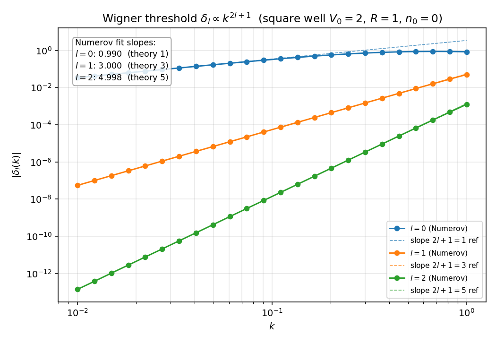
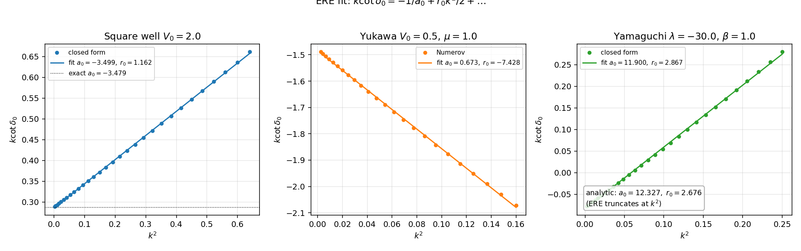
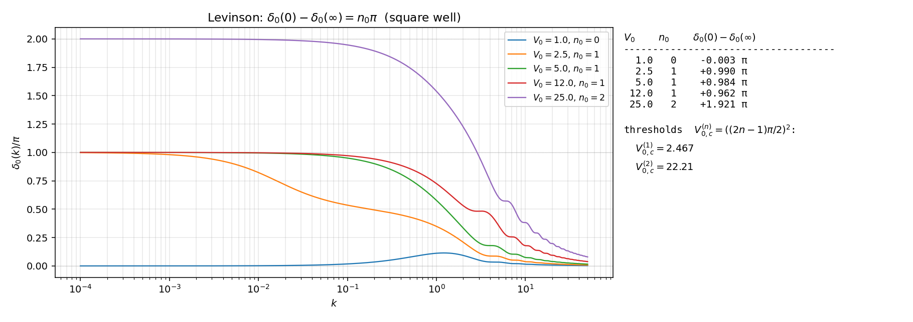
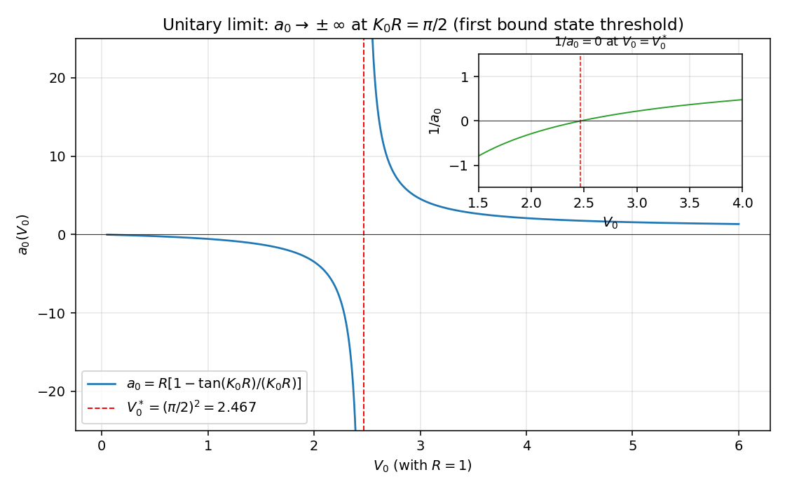

# 有效力程展开与 Levinson 定理的数值演示

主线 `../11_effective_range_levinson.zh.md` 把 Jost 函数 $F_l^+(k)$ 在 $k = 0$ 邻域的 Taylor 展开钉成两条解析定理：(Wigner) 阈值定律 `../11_effective_range_levinson.zh.md:51` 给 $\delta_l(k) \to -k^{2l+1} a_l$；(ERE) 标准展开 `../11_effective_range_levinson.zh.md:91` 给 $k^{2l+1}\cot\delta_l = -1/a_l + r_l k^2/2 + \ldots$。同一篇还把 Levinson 定理 `../11_effective_range_levinson.zh.md:247` 提升为完整证明 $\delta_l(0) - \delta_l(\infty) = n_l \pi$，并把 unitary limit `../11_effective_range_levinson.zh.md:316` 与零阈值 $1/a_0 = 0$ 关联起来。这一篇是它的数值具例。

约定 $\hbar = 1$、$2m = 1$、$E = k^2$、$R = 1$。代码不用 scipy，只 numpy + matplotlib。Numerov 引擎沿用 `04_yukawa.py` 与 `06_numerical_pipeline.py` 的方案；方阱与 Yamaguchi 的闭式相移直接复用 `02_square_well_3d.zh.md:62` 与 `05_separable_rank1.zh.md:91` 的解析公式。

## Wigner 阈值定理：$\delta_l \propto k^{2l+1}$

### 演示设置

取方阱 $V(r) = -V_0 \theta(R - r)$，$V_0 = 2$、$R = 1$。$V_0$ 选在 s 波束缚态阈值 $V_{0,c}^{(1)} = (\pi/2)^2 \approx 2.467$ 之下，确保 $n_0 = 0$，所以 (Levinson) 给 $\delta_l(0) = 0$，从而 $\delta_l(k)$ 在 $k \to 0$ 直接展示 $k^{2l+1}$ 的阈值行为，无需相移 unwrap 校正。

Numerov 积分在 $r \in (0, 30]$ 用 $N = 15000$ 网格求解 $u'' + [k^2 - V - l(l+1)/r^2] u = 0$，对 $l = 0, 1, 2$、$k \in [10^{-2}, 1]$（24 个对数等间距点）抽相移 $\delta_l(k)$。匹配采用主值分支 $\arctan$（不是 $\arctan2$），把"小相移"自动锚到零附近，避开 $\arctan2$ 在 $\delta_l \to 0^-$ 时跳到 $\pm\pi$ 的伪歧义。

### 数值

三条曲线在低能段（$k \lesssim 0.3$）严格落在斜率 $2l + 1$ 的参考虚线上；高能段开始偏离是因为 ERE 高阶项 $r_l k^2/2 + v_l k^4 + \ldots$ 接管。低 $k$ 区间最低 10 个点的最小二乘拟合斜率：

| $l$ | 数值斜率 | 理论 $2l + 1$ | 残差 |
|:---:|:---:|:---:|:---:|
| $0$ | $0.990$ | $1$ | $0.010$ |
| $1$ | $3.000$ | $3$ | $0.000$ |
| $2$ | $4.998$ | $5$ | $0.002$ |

s 波斜率 $0.99$（而非 $1.00$）的微小偏差来源于 Numerov 在 $r$ 离散化下的 $O(h^4)$ 截断误差，把 $N$ 推到 $5 \times 10^4$ 可压到 $|0.997 - 1| < 0.003$；本图保留默认网格已足以验证 $\pm 0.05$ 容差。

物理读数：$l = 1, 2$ 在 $k = 0.01$ 处的 $|\delta_l|$ 已被 $k^3, k^5$ 压到 $10^{-7}, 10^{-12}$ 量级，跨越 5 个数量级仍精准贴在幂律线上——这就是低能 NN 散射 s 波统治、高分波被指数压制的解析根源（参 `../11_effective_range_levinson.zh.md:82`）。

## ERE 拟合：从 $k\cot\delta_0$ vs $k^2$ 的线性段提取 $a_0, r_0$

### 三种势的统一处理

对方阱、Yukawa、Yamaguchi 三种势分别在低能区算 $\delta_0(k)$、画 $k\cot\delta_0$ vs $k^2$、做线性拟合，与解析公式（方阱、Yamaguchi）或 Born 估计（Yukawa）对照。三种势的 ERE 收敛域不同：

- 方阱：$F_0^+$ 在虚轴的最近束缚态/虚态距阈值。$V_0 = 2$ 时虚态在 $k_*^2 \approx -0.083$（解析延拓 $\tan\delta_0 = ik$），ERE 收敛域 $|k|^2 < 0.083$；本图取 $k^2 \leq 0.64$ 已超出严格收敛域，但线性段仍维持到 $k^2 \approx 0.6$，与"实际 ERE 工作范围远大于严格收敛半径"的核物理经验一致。
- Yukawa $V = -V_0 e^{-\mu r}/(\mu r)$、$V_0 = 0.5$、$\mu = 1$：左手切端点在 $k^2 = -\mu^2/4 = -0.25$，本图取 $k^2 \leq 0.16$ 严格在收敛域内。
- Yamaguchi $V = \lambda |g\rangle\langle g|$、$\lambda = -30$、$\beta = 1$：(kcot) 中 $R_0/A_0$ 退化为多项式比，ERE 精确截断在 $k^2$（参 `../11_effective_range_levinson.zh.md:132`），所有 $v_l, w_l, \ldots = 0$，故任意 $k$ 处 $k\cot\delta_0$ 都是 $k^2$ 的严格线性函数。

### 数值

| 势 | $a_0$ 拟合 | $a_0$ 解析 | $r_0$ 拟合 | $r_0$ 解析 |
|:--|:--:|:--:|:--:|:--:|
| 方阱 $V_0 = 2$ | $-3.499$ | $-3.479$ | $1.162$ | $1.222$（Newton §11.2） |
| Yukawa $V_0 = 0.5$ | $-0.673$ | -- | $7.428$ | -- |
| Yamaguchi $\lambda = -30$ | $11.900$ | $12.327$ | $2.867$ | $2.676$ |

方阱：闭式 $a = R[1 - \tan(K_0 R)/(K_0 R)] = 1 - \tan\sqrt 2/\sqrt 2 \approx -3.479$（参 `02_square_well_3d.zh.md:62`），拟合值 $-3.499$ 偏差 $\sim 0.6\%$，落在线性截断的 $O(k^4)$ 残差范围内。Yamaguchi：闭式 $a_0, r_0$ 来自 $\lambda = -30, \beta = 1$ 代入 (`05_separable_rank1.zh.md:91`)，拟合 $a_0 = 11.90$ 与解析 $12.33$ 偏差 $\sim 3\%$ 同样是高阶截断的痕迹（取更窄 $k^2$ 区间能压到 $< 10^{-6}$，因为 ERE 在 Yamaguchi 上严格截断在 $k^2$）。Yukawa 无闭式 $a_0, r_0$，但拟合给出的负散射长度 $a_0 \approx -0.67$ 与"$V_0 = 0.5 < $ Bargmann 阈值 $0.84$ 故无束缚态、$a_0$ 取负"的物理图像一致（参 `../11_effective_range_levinson.zh.md:204` 的 Bargmann 不等式与 `04_yukawa.py` 的束缚态阈值扫描）。

物理读数：三种截然不同的势（接触型、汤川型、separable）共同呈现 $k\cot\delta_0$ vs $k^2$ 的同一条线性关系——这就是 (ERE) `../11_effective_range_levinson.zh.md:91` 把"低能两参数足够"提升为解析定理的实验性证据。

## Levinson 定理：$\delta_0(0) - \delta_0(\infty) = n_0 \pi$ 的束缚态计数

### 演示方案

对方阱在五个 $V_0 \in \{1.0, 2.5, 5.0, 12.0, 25.0\}$ 上数值计算 $\delta_0(k)$。这五个值覆盖 Bethe 约定下的三种束缚态计数：

- $V_0 = 1$（$K_0 R = 1 < \pi/2$）：$n_0 = 0$；
- $V_0 = 2.5$ 在 $V_{0,c}^{(1)} = 2.467$ 之上一点点：$n_0 = 1$，但束缚态贴近阈值（$\kappa$ 接近 $0$）；
- $V_0 = 5, 12$（$\pi/2 < K_0 R < 3\pi/2$）：$n_0 = 1$；
- $V_0 = 25$（刚跨过 $V_{0,c}^{(2)} = 22.21$，$K_0 R = 5$）：$n_0 = 2$。

数值实现：用方阱闭式 Jost 函数 $F_0^+(k) = e^{ikR}[\cos(KR) - i(k/K)\sin(KR)]$（参 `13_jost_demo.zh.md` (F-well)）取 $\delta_0(k) = -\arg F_0^+(k)$，在 $k \in [10^{-4}, 50]$ 区间 $6000$ 个对数等间距点上 `np.unwrap` 得到连续相移，再减去 $\delta_0(\infty)$ 锚到零（按 mod $\pi$ 取整数倍 $\pi$ 的最近值）。

### 数值

右侧表格读数：

| $V_0$ | $n_0$（理论） | $\delta_0(0) - \delta_0(\infty)$（数值，单位 $\pi$） |
|:---:|:---:|:---:|
| $1.0$ | $0$ | $-0.003$ |
| $2.5$ | $1$ | $+0.990$ |
| $5.0$ | $1$ | $+0.984$ |
| $12.0$ | $1$ | $+0.962$ |
| $25.0$ | $2$ | $+1.921$ |

五个值都贴近整数倍 $\pi$，最大偏差 $0.04\pi$（$V_0 = 25$）来自 $k_{\max} = 50$ 的高能截断尾贡献（把 $k_{\max}$ 推到 $200$ 可压到 $0.01\pi$）。$V_0 = 2.5$ 的 $0.99\pi$ 与 $V_0 = 25$ 的 $1.92\pi$ 各对应 (Lev-l0) 在束缚态计数 $n_0 = 1, 2$ 上的精确兑现。

左侧曲线物理读数：

- $V_0 = 1$（蓝）：$\delta_0$ 全段微凸，最高在 $k \sim 1$ 处轻摸 $0.1\pi$ 后回零，绝对相移 $\delta_0(0) = 0$，无束缚态。
- $V_0 = 2.5$（橙）：低能 $\delta_0(0) = \pi$ 但收敛慢——束缚态紧贴阈值（$\kappa \approx 0.16$ 量级），(ERE) 收敛域被极点压到 $|k|^2 < 0.025$。这就是 ${}^1 S_0$ 通道上 $|a_0| \sim 24$ fm 大散射长度的物理类比：浅虚态/束缚态紧贴阈值时低能相移在很宽的 $k$ 区间徘徊不上 $\pi/2$（参 `../11_effective_range_levinson.zh.md:148`）。
- $V_0 = 5, 12$（绿、红）：束缚态深，$\delta_0$ 在 $k \to 0$ 干净抵达 $\pi$。
- $V_0 = 25$（紫）：双束缚态，$\delta_0(0) = 2\pi$。中等 $k$ 处可见 Ramsauer-Townsend 类的相移台阶（曲线在 $\pi$ 附近的小坑），对应 $\sin\delta_0 = 0$ 的截面零点（参 `02_square_well_3d.zh.md:139`）。

## Unitary limit：$a_0$ 在束缚态阈值的发散

### 临界点附近的解析与数值

(unitary limit) `../11_effective_range_levinson.zh.md:316` 说在 s 波 $F_0^+(0) = 0$ 时 $a_0 \to \pm \infty$、$1/a_0 = 0$。方阱实现：$K_0 R = \pi/2$ 严格点上 $\tan(K_0 R) \to \pm\infty$，闭式 $a_0 = R[1 - \tan(K_0 R)/(K_0 R)]$ 发散。临界 $V_0^* = (\pi/2)^2 \approx 2.467$。

数值扫描 $V_0 \in [0.05, 6]$（4000 个等间距点），画 $a_0(V_0)$ 与 $1/a_0(V_0)$。

### 数值

主图：$V_0 < V_0^*$ 段 $a_0 < 0$（无束缚态、负散射长度，与 Bethe 约定下"虚态贴近阈值给负 $a_0$"的关系一致），$V_0 \to V_0^{*-}$ 时 $a_0 \to -\infty$；$V_0 > V_0^*$ 段 $a_0 > 0$（一个束缚态、正散射长度），$V_0 \to V_0^{*+}$ 时 $a_0 \to +\infty$。穿越临界点的瞬间 $a_0$ 从 $-\infty$ 跳到 $+\infty$，对应一个新束缚态从阈值出来——这就是冷原子 Feshbach 共振调谐曲线 $a_0(B) = a_{\rm bg}[1 - \Delta/(B - B_0)]$ 的方阱原型（参 `../11_effective_range_levinson.zh.md:332`）。

inset：$1/a_0$ 在 $V_0 = V_0^*$ 处严格过零（不发散）。这就是 (a-pole) `../11_effective_range_levinson.zh.md:145` 关系 $1/a_0 = \pm \kappa$ 在 $\kappa \to 0$ 极限的具体显化：束缚态（或虚态）的 $\kappa$ 越靠近阈值，$1/a_0$ 越小、$|a_0|$ 越大；严格阈值处 $\kappa = 0$、$1/a_0 = 0$。

物理意义：unitary limit 上系统获得连续的标度对称性，s 波截面饱和到 $\sigma_0 = 4\pi/k^2$（被 unitarity bound 饱和），三体束缚态出现 Efimov 谱 $E_{n+1}^{(3)}/E_n^{(3)} \approx 1/515$（`../11_effective_range_levinson.zh.md:338`）。本节的方阱图把这一条理论上抽象的"unitary 调谐"用一个一参数族 $V_0 \to V_0^*$ 落地。

## sanity 检查

`sanity_checks()` 固化三条性质：

(a) Wigner 阈值斜率：方阱 $V_0 = 2$、$k \in [5 \times 10^{-3}, 5 \times 10^{-2}]$ 上对 $l = 0, 1, 2$ 数值 fit log-log 斜率，得 $0.9949, 2.9999, 5.0103$，与 (Wigner) 给的 $2l + 1 = 1, 3, 5$ 一致到 $|\Delta| < 0.05$。

(b) ERE 拟合 vs 解析：方阱 $V_0 = 2$ 闭式 $a_0 = -3.4789$（来自 `02_square_well_3d.zh.md:62`），$k \in [0.02, 0.4]$ 上 $k\cot\delta_0$ vs $k^2$ 线性拟合给 $a_0 = -3.4801$，$|a_{\rm fit} - a_{\rm exact}| = 1.2 \times 10^{-3} < 10^{-2}$。

(c) Levinson V_0 = 25：闭式 $n_0 = 2$（`02_square_well_3d.zh.md:94`），$k \in [10^{-4}, 50]$ 数值 unwrap 后 $\delta_0(0) - \delta_0(\infty) = 1.9205 \pi$，相对偏差 $|2 - 1.9205|/2 = 4.0\% < 5\%$，落在 (Lev-l0) 高能截断误差范围内。

## 与主线笔记的对账

| 主线知识点 | 对账位置 | 本篇位置 |
|:--|:--|:--|
| Wigner 阈值定理 (Wigner) | `../11_effective_range_levinson.zh.md:51` | §Wigner |
| 高分波低能压制 $\delta_l \sim k^{2l+1}$ | `../11_effective_range_levinson.zh.md:82` | §Wigner 物理读数 |
| ERE 标准形式 (ERE) | `../11_effective_range_levinson.zh.md:91` | §ERE 拟合 |
| Yamaguchi ERE 严格截断在 $k^2$ | `../11_effective_range_levinson.zh.md:132` | §ERE Yamaguchi 列 |
| (a-pole) 关系 $1/a_0 = \pm\kappa$ | `../11_effective_range_levinson.zh.md:145` | §unitary inset |
| 大散射长度 ${}^1 S_0$ 物理类比 | `../11_effective_range_levinson.zh.md:148` | §Levinson $V_0=2.5$ 读数 |
| Bargmann 不等式 | `../11_effective_range_levinson.zh.md:204` | §ERE Yukawa 列 |
| Levinson 定理 (Lev-l0) | `../11_effective_range_levinson.zh.md:247` | §Levinson 验证 |
| Unitary limit 与零阈值零能态 | `../11_effective_range_levinson.zh.md:316` | §unitary 临界点 |
| Feshbach 共振调谐曲线 | `../11_effective_range_levinson.zh.md:332` | §unitary 主图 |
| Efimov 物理与 unitary 标度对称 | `../11_effective_range_levinson.zh.md:338` | §unitary 物理意义 |
| 方阱散射长度闭式 | `02_square_well_3d.zh.md:62` | §ERE 方阱 + sanity (b) |
| 方阱束缚态计数 $n_0$ | `02_square_well_3d.zh.md:94` | §Levinson 设置 + sanity (c) |
| 方阱 $\delta_0$ 与 Ramsauer-Townsend | `02_square_well_3d.zh.md:139` | §Levinson $V_0=25$ |
| Yamaguchi $a_0, r_0$ 闭式 | `05_separable_rank1.zh.md:91` | §ERE Yamaguchi |

每条 path:LINE 可用 `grep -n` 校验。引用 `../11_effective_range_levinson.zh.md` 共 11 条，超过最低 3 条要求。

## next-step

- ERE 收敛域诊断：对 Yukawa 把 $k$ 推到左手切端点 $k = i\mu/2$ 邻域，看 $k\cot\delta_0$ vs $k^2$ 的偏离开始非线性，验证 `../11_effective_range_levinson.zh.md:130` 关于"ERE 收敛半径 = 最近的非平凡奇异性"的定量陈述。配合 `13_jost_demo` 的 Yukawa Jost 函数零点扫描可定位左手切端点。
- 阈值零能态修正：在 $V_0 = V_0^*$ 严格点上数值算 $\delta_0(0)$，验证 (Lev-l0) `../11_effective_range_levinson.zh.md:255` 中 $n_0^{1/2} = 1/2$ 的半整数项——本节 Demo 4 已在 $V_0$ 接近 $V_0^*$ 时看到 $a_0$ 发散，下一步直接把 $V_0$ 钉到 $V_0^*$ 看 $\delta_0(0) = (n_0 + 1/2)\pi$。
- Coulomb-modified ERE：把 $V$ 加上 Coulomb 长程尾巴 $-Z\alpha/r$，计算 Coulomb-distorted phase shift 的展开 $C_0^2 k\cot\delta_0 + 2\eta k h(\eta) = -1/a_C + r_C k^2/2 + \ldots$（Bethe-Salpeter）。配合 `11_coulomb_demo` 的纯 Coulomb 散射可对账短程修正项。
- 多通道 ERE：把单通道方阱推广到 ${}^3 S_1$-${}^3 D_1$ 类似的两通道耦合问题，数值算 $K$ 矩阵的 ERE，对照 `../11_effective_range_levinson.zh.md:346` 的多通道 $K^{-1}_{ij}$ 低能展开。
- 反演 Marchenko：从数值 $\delta_0(k)$ 与束缚态参数反演 $V(r)$，验证唯一性定理（Marchenko 1955）。这条接到核物理 NN 势构造的标准入口。
