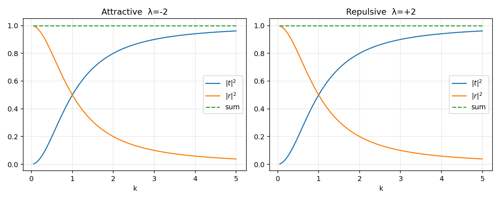
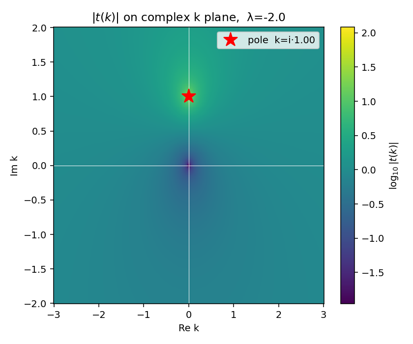
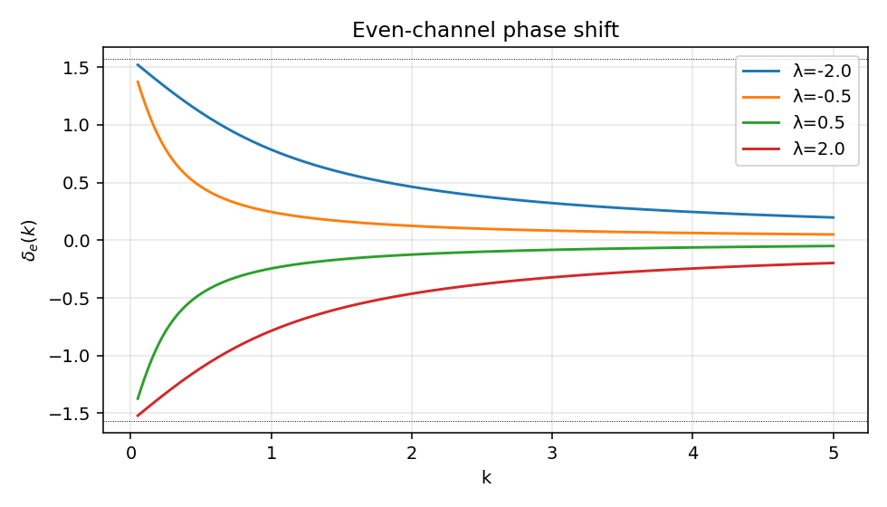

# 一维 delta 势

整个散射理论框架最少能写多少行？这一篇的目的就是回答这个问题：把已经在主线笔记里铺开的 Møller、$S$、$T$、resolvent 极点，全部压缩到一维 delta 势上，让每一个抽象对象都对应一行可手算的代数。

全文取 $\hbar = 1$，$2m = 1$，能量与波数的关系是 $E = k^2$。

## 目标

- 锚定 `S_matrix_and_cross_section.zh.md` 中 $S = \mathbf 1 + R$ 的拆分：在一维里 $R$ 对应反射振幅 $r$，$T$ 对应透射振幅 $t-1$ 的部分。
- 锚定 `Green_operator.zh.md` 中"束缚态 = $G(z)$ 在物理面上的实极点"的结论：这里束缚态由 $t(k)$ 在正虚轴上的极点直接给出。
- 给后续几篇可解模型提供一个最小骨架：势、匹配条件、S 矩阵元、极点、数值验证按这个顺序串起。

## 势的定义

$$
V(x) = \lambda\, \delta(x), \qquad \lambda \in \mathbb R.
$$

定态薛定谔方程

$$
-\psi''(x) + \lambda\, \delta(x)\, \psi(x) = E\, \psi(x), \qquad E = k^2.
$$

势只支撑在原点，所以 $x \neq 0$ 区域里波函数是自由波叠加。匹配条件来自把方程对 $x$ 在 $[-\epsilon, +\epsilon]$ 上积分，再令 $\epsilon \to 0^+$：

- 连续性：$\psi(0^+) = \psi(0^-)$。
- 导数跳变：

$$
\psi'(0^+) - \psi'(0^-) = \lambda\, \psi(0).
$$

吸引势对应 $\lambda < 0$，排斥势对应 $\lambda > 0$。

## 散射态与 S 矩阵

考虑从左入射的散射态：

$$
\psi_k(x) =
\begin{cases}
e^{ikx} + r(k)\, e^{-ikx}, & x < 0,\\
t(k)\, e^{ikx}, & x > 0.
\end{cases}
$$

代入两条匹配条件：

$$
1 + r = t,
\qquad
ik\, t - ik\,(1 - r) = \lambda\, t.
$$

消去 $r = t - 1$，得到

$$
2ik\, t - 2ik = \lambda\, t
\quad\Longrightarrow\quad
\boxed{\;t(k) = \frac{2ik}{2ik - \lambda}, \qquad r(k) = \frac{\lambda}{2ik - \lambda}.\;}
$$

直接验证幺正性：

$$
|t|^2 + |r|^2 = \frac{4k^2 + \lambda^2}{4k^2 + \lambda^2} = 1.
$$

由空间反演对称性 $V(-x) = V(x)$，从右入射给出同样的 $t$ 和 $r$。所以二维 $S$ 矩阵在通道基 $\{\text{从左入射}, \text{从右入射}\}$ 上写成

$$
S(k) =
\begin{pmatrix}
r(k) & t(k) \\
t(k) & r(k)
\end{pmatrix}.
$$

把它对角化到宇称基 $\{\text{偶}, \text{奇}\}$：

- 偶通道 $\psi_e \propto \cos(k|x| + \delta_e)$，$S_e = e^{2i\delta_e} = r + t$；
- 奇通道 $\psi_o \propto \sin(kx)$，在原点为零，$\delta$ 看不见，$S_o = 1$。

代入解析式：

$$
S_e(k) = r + t = \frac{2ik + \lambda}{2ik - \lambda} = -\,\frac{2k + i\lambda}{-2k + i\lambda}.
$$

整理可得 $\tan\delta_e(k) = -\,\lambda /(2k)$，即偶通道相移完全由耦合 $\lambda$ 与波数 $k$ 决定，奇通道相移恒为零。

## 解析延拓与束缚态极点

把 $t(k)$ 当作复 $k$ 平面上的函数。它的唯一极点在

$$
2ik - \lambda = 0
\quad\Longrightarrow\quad
k_* = -\,\frac{i\lambda}{2}.
$$

物理面上的束缚态对应正虚轴极点 $k = i\kappa$（$\kappa > 0$，使 $e^{ikx} = e^{-\kappa x}$ 在 $x \to +\infty$ 衰减）。读出条件：

$$
\kappa = -\,\frac{\lambda}{2}, \qquad \lambda < 0.
$$

束缚态能量

$$
E_b = -\,\kappa^2 = -\,\frac{\lambda^2}{4}.
$$

排斥势 $\lambda > 0$ 时极点跑到下半平面（非物理面），无束缚态。这与 `Green_operator.zh.md` 中"束缚态是物理面上的实极点"的结论一一对应：在一维 delta 势里，整张 $S$ 矩阵只有这一个极点，理论框架与具体例子完全合拍。

束缚态归一化波函数

$$
\psi_b(x) = \sqrt{\kappa}\, e^{-\kappa |x|}, \qquad
\int |\psi_b|^2\, dx = 1.
$$

留数也容易算：$t(k)$ 在 $k_* = i\kappa$ 处的留数为 $i\kappa$，与束缚态 wavefunction 的能壳投影系数完全匹配（这一对应在 Newton 的 Section 12.1.b 里写得最清楚）。

## 与 T 矩阵和 LS 方程的对账

按 `T_and_U_operators.zh.md` 的定义，$T(E)|\alpha\rangle = V|\psi_\alpha^{(+)}\rangle$。一维 delta 的 $V|\psi^{(+)}_k\rangle$ 完全集中在原点：

$$
V \psi_k^{(+)}(x) = \lambda\, \delta(x)\, \psi_k^{(+)}(0) = \lambda\, t(k)\, \delta(x).
$$

所以 on-shell $T$ 矩阵元（动量基）

$$
\langle k' | T(E_k) | k\rangle = \int dx\, e^{-ik'x}\, \lambda\, t(k)\, \delta(x) / (2\pi) = \frac{\lambda\, t(k)}{2\pi}.
$$

把 $t(k) = 2ik/(2ik - \lambda)$ 代入，得到

$$
\langle k' | T(E_k) | k\rangle = \frac{1}{2\pi}\,\frac{2ik\, \lambda}{2ik - \lambda}.
$$

这条式子里 $k'$ 不进右侧任何地方，是因为 separable 势（这里其实就是 rank-1 separable，$V = \lambda\, |0\rangle\langle 0|$）的 T 矩阵在动量空间天然不依赖于出射动量。这一结构在第 5 篇 separable rank-1 笔记里会推广为一般 form factor。

把这一结果与 LS 方程交叉检验：

$$
T(E) = V + V\, G_0^{(+)}(E)\, T(E)
$$

代入 $V = \lambda\, |0\rangle\langle 0|$，作 ansatz $T(E) = \tau(E)\, |0\rangle\langle 0|$，其中 $\tau(E)$ 是待定标量。LS 化为

$$
\tau = \lambda + \lambda\, G_0^{(+)}(0,0;E)\, \tau,
$$

其中

$$
G_0^{(+)}(0,0;E) = \int \frac{dq}{2\pi}\,\frac{1}{E - q^2 + i0} = -\,\frac{1}{2k}\, i = -\,\frac{i}{2k}.
$$

（一维自由格林函数取边界值的标准结果。）解得

$$
\tau(E) = \frac{\lambda}{1 + i\lambda/(2k)} = \frac{2ik\,\lambda}{2ik - \lambda}.
$$

恰好匹配上面的直接结果。这条小练习把 LS 方程的 separable 解结构在最简单情形下走通了一遍。

## 数值与图

下面给出 `1d_delta.py` 的关键片段（完整可运行版本在同目录）。它做四件事：

1. 解析地画 $|t(k)|^2$、$|r(k)|^2$ 与 $|t|^2 + |r|^2$ 验证幺正性。
2. 在复 $k$ 平面上扫描 $|t(k)|$，定位极点。
3. 对吸引势从能量域反推束缚态：$E_b = -\lambda^2/4$ 与极点位置 $k_* = -i\lambda/2$ 对照。
4. 偶通道相移 $\delta_e(k)$ 随 $k$ 的变化。

```python
import numpy as np
import matplotlib.pyplot as plt

def t_r(k, lam):
    """Transmission and reflection amplitudes for V(x)=lam*delta(x)."""
    denom = 2j * k - lam
    return 2j * k / denom, lam / denom

def phase_shift_even(k, lam):
    return np.arctan(-lam / (2 * k))

# Figure 1: |t|^2, |r|^2 vs k for attractive (lam=-2) and repulsive (lam=+2)
k = np.linspace(0.05, 5.0, 400)
fig, axes = plt.subplots(1, 2, figsize=(10, 4))
for ax, lam, title in zip(axes, [-2.0, +2.0], ['Attractive λ=-2', 'Repulsive λ=+2']):
    t, r = t_r(k, lam)
    ax.plot(k, np.abs(t)**2, label='|t|²')
    ax.plot(k, np.abs(r)**2, label='|r|²')
    ax.plot(k, np.abs(t)**2 + np.abs(r)**2, '--', label='sum')
    ax.set_xlabel('k'); ax.set_title(title); ax.legend()
plt.tight_layout(); plt.savefig('assets/1d_delta/transmission.png', dpi=140)
```



两图共同的事实：

- $|t|^2 \to 1$ 当 $k \to \infty$：高能下 delta 势相当于扰动可忽略；
- $|r|^2 \to 1$ 当 $k \to 0$：低能下完全反射，这是一维通用的现象（Wigner 阈值定理在一维退化为 $k^0$ 而非 $k^{2l+1}$）；
- 吸引和排斥的 $|t|$、$|r|$ 完全相同——这一点在三维就不成立，因为束缚态对相移在低能极限留下了 Levinson 印记。

```python
# Figure 2: |t(k)| on complex k plane to visualize bound-state pole
lam = -2.0
kr = np.linspace(-3, 3, 400)
ki = np.linspace(-2, 2, 300)
KR, KI = np.meshgrid(kr, ki)
K = KR + 1j * KI
T = 2j * K / (2j * K - lam)
plt.figure(figsize=(6, 5))
plt.pcolormesh(KR, KI, np.log10(np.abs(T) + 1e-3), shading='auto', cmap='viridis')
plt.colorbar(label='log10 |t(k)|')
plt.axhline(0, color='w', lw=0.5); plt.axvline(0, color='w', lw=0.5)
kappa = -lam / 2
plt.plot(0, kappa, 'r*', ms=15, label=f'pole k=i*{kappa:.2f}')
plt.xlabel('Re k'); plt.ylabel('Im k'); plt.legend()
plt.savefig('assets/1d_delta/pole.png', dpi=140)
```



亮点正落在 $k = i\kappa = i\,|\lambda|/2$ 上，与解析公式吻合。把 $\lambda$ 翻号，亮点会切到下半平面，对应非物理面，束缚态消失。

```python
# Figure 3: even-channel phase shift δ_e(k)
k = np.linspace(0.05, 5.0, 400)
for lam, c in zip([-2.0, -0.5, +0.5, +2.0], ['C0', 'C1', 'C2', 'C3']):
    plt.plot(k, phase_shift_even(k, lam), c, label=f'λ={lam}')
plt.xlabel('k'); plt.ylabel('δ_e(k)'); plt.legend()
plt.savefig('assets/1d_delta/phase_shift.png', dpi=140)
```



吸引势 $\delta_e \to \pi/2$ 当 $k \to 0$，正是束缚态存在的标志（一维版的 Levinson）；排斥势 $\delta_e \to -\pi/2$，无束缚态。两条曲线在 $k \to \infty$ 都回到零。

## 与主线笔记的对账

按主线笔记的结构倒推：

| 主线 | 一维 delta 中的对应 |
|:--|:--|
| `S_matrix_and_cross_section.zh.md:218`，$S = \Omega_-^\dagger \Omega_+$ | $S(k) = \begin{pmatrix} r & t \\ t & r \end{pmatrix}$，宇称基对角化 |
| 同上 §3，$S = \mathbf 1 + R$ 拆分 | $R(k) = \begin{pmatrix} r & t-1 \\ t-1 & r \end{pmatrix}$ |
| `Green_operator.zh.md:412`，束缚态是物理面实极点 | 极点 $k_* = -i\lambda/2$，$E_b = -\lambda^2/4$（仅吸引） |
| `T_and_U_operators.zh.md:353`，$T(E) = V + V G_0^{(+)} T$ | separable ansatz $T = \tau\,|0\rangle\langle 0|$，标量 $\tau(E) = 2ik\lambda/(2ik-\lambda)$ |
| `partial_wave_projection.zh.md:374`，$T_l(k,k;E) = -\,e^{i\delta_l}\sin\delta_l/(\pi\mu k)$ | 在偶通道：$\tau(E) \propto e^{i\delta_e}\sin\delta_e/k$（系数差由维度决定） |

奇通道相移恒为零这一点，对应于 $\delta$ 函数势在 $\psi(0) = 0$ 子空间上不起作用——本质上是势的 separable 秩为 1，奇通道完全在它的零空间里。

## next-step

留几个还没合上的口子，留给后面几篇或读者：

- 双 delta 势 $V = \lambda[\delta(x-a) + \delta(x+a)]$：会出现共振（透射峰不再单调），奇/偶通道都被激活，是从"无共振"到"窄共振"最小的过渡。
- 一维 delta 与三维 s 波的对应：用 $u_l(r) = r\psi_l(r)$ 代换，三维 s 波在 $r > 0$ 的方程与一维半线性方程在 $x > 0$ 一致，但边界条件 $u_l(0) = 0$ 比一维多一个约束。
- 时间域生存振幅：$\langle\psi_b | e^{-iHt}|\psi_b\rangle = e^{-iE_b t}$ 是纯指数（无衰减、无 cut 修正），因为是真正的束缚态。这与 `friedrichsModel.zh.md` 中的 Gamow 态形成对比——共振才有非平凡的 cut 贡献。
