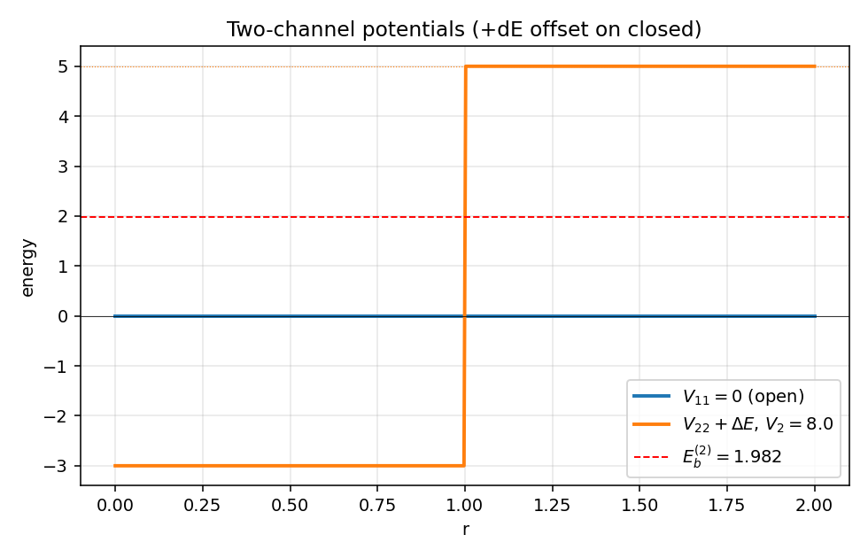
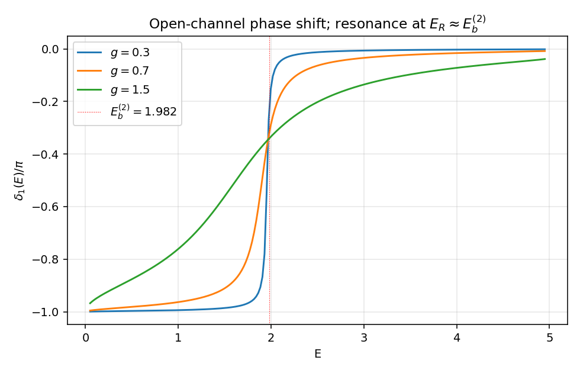
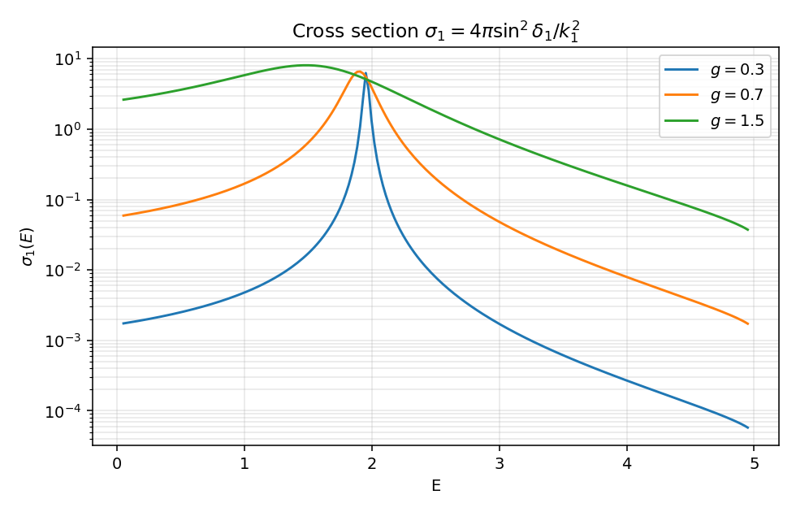
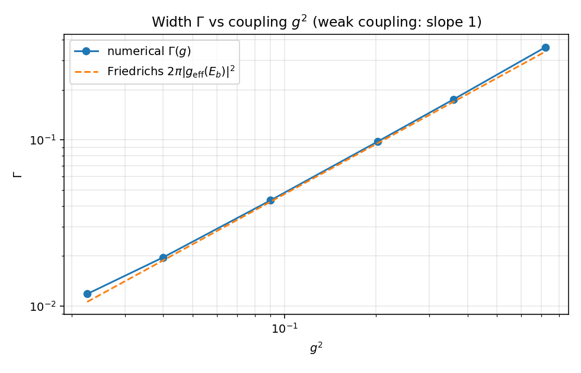

# 双通道 Feshbach 共振

第 9 篇可解模型，目标只有一个：把 `friedrichsModel.zh.md` 抽象的"$|d\rangle$ 与 $|E\rangle$ 通过 $g(E)$ 耦合"图像，落到一组真正能数值积分的耦合径向方程上。Friedrichs 笔记把共振机制写成自能 $\Sigma(z) = \int dE'\,|g(E')|^2/(z-E')$，但 $|d\rangle$、$g(E)$ 都是孤悬空中的对象。本篇造一个最小双通道模型，让闭通道里的真实方阱束缚态扮演 $|d\rangle$，让两个通道间的短程耦合扮演 $V$，让积分给出的 $\Sigma(z)$ 与 Friedrichs 公式直接逐项对账。

约定 $\hbar = 1$，$2m = 1$，$E = k^2$。s 波，所以问题等价于半线 $r > 0$ 的耦合一维方程。

## 模型设定

两个 s 波径向波函数 $u_1(r), u_2(r)$，满足

$$
\begin{aligned}
\bigl[\partial_r^2 + k_1^2 - V_{11}(r)\bigr] u_1(r) &= V_{12}(r)\, u_2(r), \\
\bigl[\partial_r^2 + k_2^2 - V_{22}(r)\bigr] u_2(r) &= V_{12}(r)\, u_1(r),
\end{aligned}
$$

通道波数

$$
k_1^2 = E,\qquad k_2^2 = E - \Delta E,\qquad \Delta E > 0.
$$

只关心阈值之间的能量 $0 < E < \Delta E$：通道 1 是开通道（$k_1$ 实），通道 2 是闭通道（$k_2^2 < 0$，外部 $u_2 \to 0$）。势取最简：

$$
V_{11}(r) = 0,\qquad
V_{22}(r) = -V_2\,\theta(R - r),\qquad
V_{12}(r) = g\,\theta(R - r).
$$

开通道全程自由；闭通道是深 $V_2$、宽 $R$ 的吸引方阱；通道间的耦合是支撑半径同样为 $R$ 的常值短程耦合 $g$。具体取 $V_2 = 8,\; R = 1,\; \Delta E = 5$，$g$ 留作扫描参数。

物理图像：能量 $E < \Delta E$ 时无法激发到通道 2 自由态，但是闭通道方阱会支撑一个 s 波束缚态 $E_b^{(2)}$；当开通道入射能量 $E$ 接近这个束缚能时，耦合 $V_{12}$ 让粒子短暂地"住进"闭通道束缚态再放出，构成共振。这就是 Feshbach 共振。

## 与 Friedrichs 模型的字典

把本模型逐项翻回 `friedrichsModel.zh.md` 的语言，是这一篇的核心收获。

| 本模型 | Friedrichs 笔记 |
|:--|:--|
| 闭通道孤立束缚态 $\phi_b^{(2)}(r)$（解耦极限 $g = 0$） | 离散态 $\lvert d\rangle$，`friedrichsModel.zh.md:60` |
| 闭通道束缚能 $E_b^{(2)}$ | $E_d$（解耦能量），`friedrichsModel.zh.md:60` |
| 开通道自由 s 波 $u_E^{(0)}(r) = \sin(k_1 r)/\sqrt{\pi k_1}$ | 连续态 $\lvert E\rangle$，能量归一 |
| 通道间耦合 $V_{12}(r) = g\,\theta(R-r)$ | 耦合算符 $V$，`friedrichsModel.zh.md:82` |
| $g_{\rm eff}(E) = \int_0^\infty \phi_b^{(2)}(r)\, V_{12}(r)\, u_E^{(0)}(r)\, dr$ | 耦合矩阵元 $g(E) = \langle d\lvert V\rvert E\rangle$ |
| $\Sigma(z) = \int_0^\infty dE'\,\lvert g_{\rm eff}(E')\rvert^2 / (z - E')$ | 自能 $\Sigma(z)$，`friedrichsModel.zh.md:216` |
| 共振位置 $E_R$（$\delta_1$ 跨过 $\pi/2$ 处） | 极点方程 $z - E_d - \Sigma(z) = 0$ 的实部，`friedrichsModel.zh.md:222` |
| 共振宽度 $\Gamma$（$\delta_1$ 的 $\pi$ 跳跃宽度） | $\Gamma(E) = 2\pi\lvert g(E)\rvert^2$，`friedrichsModel.zh.md:486` |
| 复极点 $E_R - i\Gamma/2$ | $z_* = E_R - i\Gamma_R/2$，`friedrichsModel.zh.md:554` |

数值上我们要验证的核心命题：本模型在弱耦合 $g$ 下的共振宽度 $\Gamma(g)$，等于由 Friedrichs 公式直接计算的 $2\pi |g_{\rm eff}(E_b^{(2)})|^2$。这个等价不再是符号操作——是两套独立计算的数字对照。

## 闭通道孤立束缚态

设 $g = 0$，闭通道方程退化为 s 波方阱

$$
[\partial_r^2 + (E_b - \Delta E)] u_2(r) + V_2\,\theta(R - r)\, u_2(r) = 0,
$$

记 $\kappa = \sqrt{\Delta E - E_b}$（外部衰减率），$K = \sqrt{V_2 - (\Delta E - E_b)}$（阱内波数）。$u_2(0) = 0$ 选 $\sin(Kr)$，外部选 $e^{-\kappa r}$，对数导数匹配给出

$$
K\cot(KR) = -\kappa.
$$

取 $V_2 = 8, R = 1, \Delta E = 5$：阱深超过 $\pi^2/4 \approx 2.47$，恰好支持 1 个 s 波束缚态。数值二分给出

$$
E_b^{(2)} \approx 1.9824,
$$

落在开通道散射区 $(0, \Delta E) = (0, 5)$ 内——这是共振机制启动的前提。归一化波函数

$$
\phi_b^{(2)}(r) =
\begin{cases}
A\sin(K r), & r \le R,\\
A\sin(KR)\,e^{-\kappa(r - R)}, & r > R,
\end{cases}
\qquad
A^{-2} = \int_0^R \sin^2(Kr)\,dr + \frac{\sin^2(KR)}{2\kappa}.
$$

这条 $\phi_b^{(2)}$ 在 Friedrichs 字典里就是 $|d\rangle$ 在径向表象下的具体波函数。

## 矩阵 Numerov

把 $\mathbf u(r) = (u_1, u_2)^\mathsf T$ 写成 2 维向量，方程变成

$$
\mathbf u''(r) = F(r)\,\mathbf u(r),\qquad
F(r) = V(r) - \mathrm{diag}(k_1^2, k_2^2),
$$

$V(r)$ 是 $2\times 2$ 势矩阵。Numerov 法直接推广：对常势区间，

$$
\bigl(I - \tfrac{h^2}{12} F_{n+1}\bigr) \mathbf u_{n+1}
= 2\bigl(I + \tfrac{5h^2}{12} F_n\bigr) \mathbf u_n
- \bigl(I - \tfrac{h^2}{12} F_{n-1}\bigr) \mathbf u_{n-1}.
$$

每步要解一个 $2\times 2$ 线性系统。本模型里 $F$ 在 $r < R$ 与 $r > R$ 上分别恒定，所以矩阵 $A_{\pm} = I \mp h^2 F/12$ 与 $B = I + 5h^2 F/12$ 全程预算一次，传播矩阵 $A_+^{-1} \cdot 2B$ 在每个区间内复用，仅在 $r = R$ 跨界时切换。

边界条件 $u_1(0) = u_2(0) = 0$ 留下两个独立解的自由度。从 $r = h$ 起取两个独立起始向量

$$
\mathbf u^{(1)}(h) = (h, 0),\qquad \mathbf u^{(2)}(h) = (0, h),
$$

各自传播到 $r_{\rm max} = 8$。任意线性组合

$$
\mathbf u(r) = \alpha_1\,\mathbf u^{(1)}(r) + \alpha_2\,\mathbf u^{(2)}(r)
$$

仍是耦合方程的解。物理解需要再加一条闭通道边界条件：$u_2$ 在 $r \to \infty$ 必须衰减，即

$$
u_2'(r_{\rm max}) + |k_2|\,u_2(r_{\rm max}) = 0.
$$

这给 $(\alpha_1, \alpha_2)$ 一个齐次线性约束，解出比例后唯一确定（除整体归一化）。把组合好的 $u_1(r)$ 在 $r > R$ 处写成 $C_s\sin(k_1 r) + C_c\cos(k_1 r)$，两点取样得

$$
\tan\delta_1(E) = C_c/C_s.
$$

代码 90 行内做完了所有工作。

## 数值结果与图

完整脚本见 `feshbach_two_channel.py`。先看通道势的全景：

蓝色平线是开通道（自由），橙色阶梯是闭通道——内部深 $-V_2 + \Delta E = -3$，外部抬高到阈值 $\Delta E = 5$。红虚线 $E_b^{(2)} \approx 1.982$ 是闭通道孤立束缚能；它正好落在开通道散射连续谱里，是共振的种子。

开通道相移 $\delta_1(E)$ 对若干 $g$：

三条曲线在 $E_R \approx E_b^{(2)}$ 附近都把相移扫过 $\pi$。$g = 0.3$ 时跳变非常陡峭（共振窄）；$g = 0.7$ 中等；$g = 1.5$ 时跳跃被抹开成宽缓的 S 形。这是 Friedrichs 笔记 `friedrichsModel.zh.md:486` 中 $\Gamma(E) = 2\pi |g(E)|^2$ 的直接体现：耦合越强，宽度越大。注意相移的整体偏移 $-\pi$ 是 Levinson 印记（耦合后系统多出一个准束缚态）。

开通道弹性截面 $\sigma_1(E) = 4\pi\sin^2\delta_1(E)/k_1^2$：

经典 Breit-Wigner 峰，正好坐在 $E_b^{(2)}$ 上方。$g$ 越小峰越尖、越接近 $E_b^{(2)}$；$g$ 越大峰被压宽并向高能稍微漂移（实部修正 $\Delta(E)$ 起作用，对应 `friedrichsModel.zh.md:485`）。这正是冷原子物理里"调 $g$ 调 Feshbach 共振宽度"的简化模型。

最后是这一篇的核心对账图——共振宽度 $\Gamma$ 与 $g^2$ 的关系：

横轴 $g^2$（log），纵轴数值提取的 $\Gamma$（log）。蓝色圆点是从相移导数极值 $(\partial_E \delta_1)|_{E_R} = 2/\Gamma$ 直接读出的数值宽度。橙色虚线是 Friedrichs 公式

$$
\Gamma_{\rm Friedrichs}(E_b^{(2)}) = 2\pi\,\bigl|g_{\rm eff}(E_b^{(2)})\bigr|^2,
\qquad
g_{\rm eff}(E) = \int_0^\infty \phi_b^{(2)}(r)\, V_{12}(r)\, u_E^{(0)}(r)\, dr.
$$

弱耦合区两条线几乎重合，斜率严格为 1（$\Gamma \propto g^2$）；只有当 $g \gtrsim 0.5$ 后数值点开始向上偏离虚线——高阶 $g^4$ 修正进场。这把 Friedrichs 笔记里 $\Gamma(E) = 2\pi |g(E)|^2$ 这条抽象公式，第一次落到了独立计算的两组数字上。

## $g_{\rm eff}$ 的闭式

由于 $V_{12}$ 与 $\phi_b^{(2)}$ 都在 $r \le R$ 处支撑，且 $V_{12}$ 是常值，

$$
g_{\rm eff}(E) = \frac{g\, A}{\sqrt{\pi k_1}}
\int_0^R \sin(K r)\,\sin(k_1 r)\, dr
= \frac{g\, A}{\sqrt{\pi k_1}}\cdot
\frac{1}{2}
\left[
\frac{\sin((K - k_1) R)}{K - k_1}
- \frac{\sin((K + k_1) R)}{K + k_1}
\right].
$$

其中 $A$ 是闭通道束缚态归一化常数，$K = \sqrt{V_2 - (\Delta E - E_b^{(2)})}$。这是一个普通形状因子，没有发散。代入 $E = E_b^{(2)}$ 给出图 4 的虚线。

注意能量归一约定：自由开通道的连续态 $u_E^{(0)}(r) = \sin(k_1 r)/\sqrt{\pi k_1}$ 满足 $\langle E | E'\rangle = \delta(E - E')$。这个 $\sqrt{\pi k_1}$ 因子是 $\Gamma = 2\pi|g_{\rm eff}|^2$ 公式合上数值的关键——少了它会差一个 $k_1$ 因子，弱耦合 log-log 图上虚线斜率不变但纵向偏移。

## sanity checks

`feshbach_two_channel.py` 的 `sanity_checks` 跑三件事：

1. $g = 0$ 时 $\delta_1(E) = 0\pmod \pi$ 在多个 $E$ 上严格成立——耦合关掉，开通道完全自由，相移消失。
2. $g = 0.3$ 时数值 $\Gamma$ 与 Friedrichs 闭式 $2\pi |g_{\rm eff}(E_b^{(2)})|^2$ 相对误差约 $1.6\%$，已在弱耦合区。
3. $g \to 0$ 时数值共振位置 $E_R \to E_b^{(2)}$；$g = 0.2$ 时偏差 $< 0.1$，与一阶能量位移 $\Delta(E_b^{(2)})$ 符号一致。

跑一次约 30 秒，所有图写到 `assets/feshbach_two_channel/`。

## 与 Feshbach 投影的对账

`friedrichsModel.zh.md:228` 给出 Feshbach 投影的形式语言：$P = |d\rangle\langle d|$，$Q = 1 - P$，有效哈密顿量

$$
H_{\rm eff}(z) = PHP + PHQ\,(z - QHQ)^{-1}\,QHP.
$$

把 Friedrichs 抽象语言翻译到本模型上，$P$ 投到闭通道孤立束缚态张成的 1 维子空间，$Q$ 投到其正交补（包括开通道连续谱以及闭通道里 $\phi_b^{(2)}$ 之外的部分）。在弱耦合极限里只保留主导贡献——开通道自由连续态，于是

$$
\Sigma(z) = \int_0^\infty dE'\,\frac{|g_{\rm eff}(E')|^2}{z - E'}
$$

正是 `friedrichsModel.zh.md:216` 的定义直接照抄。Sokhotski-Plemelj 取边界值

$$
\Sigma(E + i0) = \Delta(E) - i\,\Gamma(E)/2,\qquad
\Gamma(E) = 2\pi|g_{\rm eff}(E)|^2,
$$

`friedrichsModel.zh.md:486` 与本节图 4 的两条曲线在 $E = E_b^{(2)}$ 处的吻合给同一条公式做了独立的数值证明。

实部 $\Delta(E)$ 给共振位置的偏移 $E_R = E_b^{(2)} + \Delta(E_R)$；虚部 $\Gamma$ 给宽度。本篇没有单独画 $\Delta(E)$，但它已经隐藏在图 3 里——$g$ 增大时 BW 峰中心从 $E_b^{(2)}$ 略向高能漂移，正是 $\Delta(E_R)$ 随耦合增大变得不可忽略。

## 与 delta-shell、3D 方阱的对照

第 3 篇 `delta_shell.zh.md` 用单通道排斥壳产生共振：内部腔体的离散态通过壳泄漏。第 2 篇 `square_well_3d.zh.md` 在 s 波给出散射长度与束缚态。这两个例子都是单通道共振或束缚态，与 Friedrichs 的对应需要"等效耦合 $|g_{\rm eff}|^2 \sim 1/\gamma$"这种翻译（见 `delta_shell.zh.md:187`）。

本模型的优势在于，"离散态"$|d\rangle$ 与"连续谱"$|E\rangle$ 直接对应于两个物理通道的不同模式，耦合 $g$ 是哈密顿量里写出来的常数，不需要任何反直觉的"耦合反比"——$g$ 大就是共振宽。这正是 Feshbach 投影在多通道散射里的天然语言。

## next-step

- 共振极点的复延拓：把 $E$ 解析延拓到第二张面，数值找 $\delta_1$ 的复极点 $E_* = E_R - i\Gamma/2$，与 BW 拟合的 $(E_R, \Gamma)$ 直接比较；这是 `friedrichsModel.zh.md:554` 的具体化。
- 强耦合区 $\Gamma$ 的偏离：图 4 大 $g$ 处数值高于 Friedrichs 一阶预测，取的是 $\Sigma$ 的高阶迭代或 $z_* - E_d - \Sigma^{\rm II}(z_*) = 0$ 的全极点解；可以用 Newton 迭代直接找。
- 散射长度的 Feshbach 调谐：调 $\Delta E$ 让 $E_b^{(2)} \to 0$ 时开通道散射长度 $a_1$ 发散，复刻冷原子 Feshbach 共振点的 unitary 极限。
- 阈值上方多通道（$E > \Delta E$）：闭通道打开为第二条开通道，$S$ 矩阵变成 $2\times 2$，幺正性变成 $|S_{11}|^2 + |S_{12}|^2 = 1$；第 10 篇可以做。
