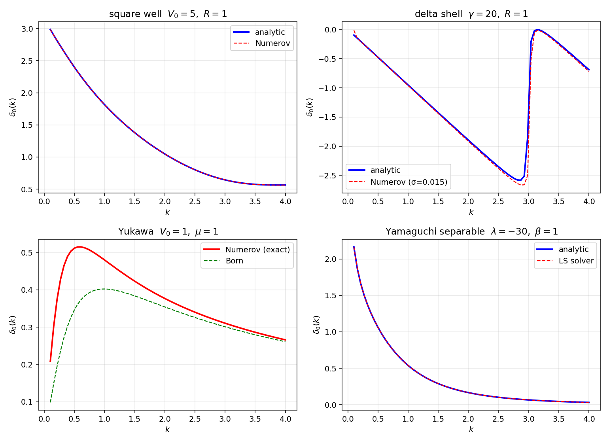
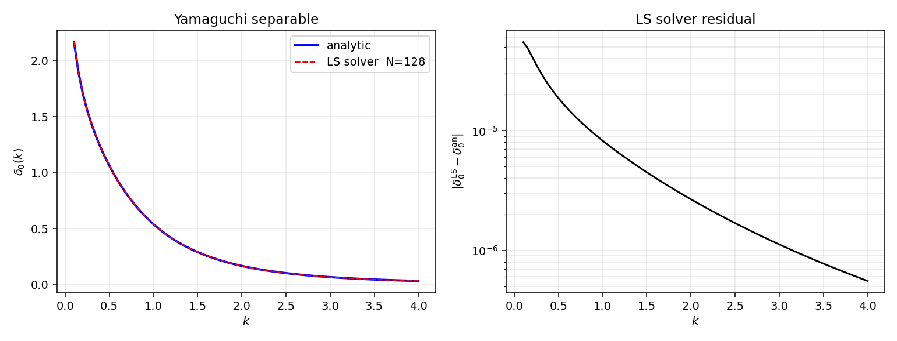
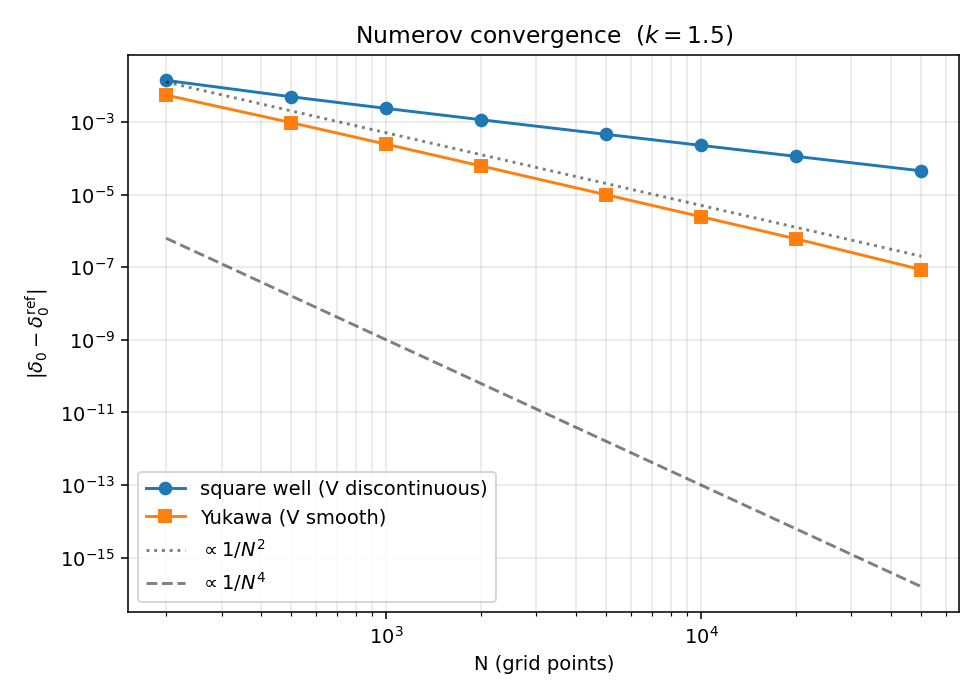

# 数值实验：分波相移与截面的统一流程

前 5 篇用一系列可解势把抽象框架中的对象——$S$、$T$、Born、separable、共振极点——分别钉到具体公式上。这一篇做的事情正好相反：把这些可解势当作 sanity-check 标准，给出两套通用数值引擎，验证它们能复现解析结果，再以同样的引擎推广到没有解析解的情形（光学势、自旋耦合、三体子核等）。

约定 $\hbar = 1$、$2m = 1$。本文只处理 s 波（$l=0$），所有结构对一般 $l$ 平行。

## 目标

- 把 Numerov + 渐近匹配抽象成一个 $V(r) \mapsto \delta_0(k)$ 的纯函数
- 把动量空间 Lippmann-Schwinger 求解器抽象成一个 $V_l(p,p') \mapsto T_l(k,k;E)$ 的纯函数
- 用前 5 篇势的解析结果同时验证两套引擎
- 暴露数值收敛阶数与势的光滑性的关系

两套引擎是互补的：Numerov 只能处理局域 $V(r)$，但对任意势形态都直接；动量空间 LS 自然兼容 separable 势、非局域势、嵌入到三体 AGS，但奇异点处理需要小心。

## 引擎一：坐标空间 Numerov

s 波径向 Schrödinger 方程

$$
u''(r) + [k^2 - V(r)]\, u(r) = 0,
\qquad u(0) = 0
$$

在 $V(r) \to 0$ 的远场区，解为 $u(r) = A\sin(kr + \delta_0)$。算法是积分到大 $r$，用两点匹配提取 $\delta_0$。

Numerov 五点格式（导出过程见 Hairer & Wanner, *Solving ODE I*, §III.10）：

$$
\left(1 + \frac{h^2}{12} f_{n+1}\right) u_{n+1}
= 2\left(1 - \frac{5h^2}{12} f_n\right) u_n
- \left(1 + \frac{h^2}{12} f_{n-1}\right) u_{n-1}
$$

其中 $f(r) = k^2 - V(r)$。理论误差 $O(h^4)$，是带常数系数二阶 ODE 上常用有限差分能做到的最低阶门槛。s 波边界条件 $u(0) = 0$，第二点取 $u(h) = h$（任意正标度，s 波在小 $r$ 下线性）。

匹配：取 $r_1, r_2$ 都在远场区，$u_i = A\sin(kr_i + \delta_0)$，整理得

$$
\tan\delta_0 = \frac{u_1\sin(kr_2) - u_2\sin(kr_1)}{u_2\cos(kr_1) - u_1\cos(kr_2)}
$$

用 `np.arctan2` 取分支；沿 $k$ 扫描后用 `np.unwrap` 处理 Levinson 跳变。

```python
def numerov_swave(V_local, k, r_max=40.0, N=20000):
    h = r_max / N
    r = np.linspace(0.0, r_max, N + 1)
    f = k * k - V_local(r)
    u = np.zeros(N + 1)
    u[1] = h
    h2 = h * h / 12
    for n in range(1, N):
        u[n + 1] = (2 * u[n] * (1 - 5 * h2 * f[n])
                    - u[n - 1] * (1 + h2 * f[n - 1])) / (1 + h2 * f[n + 1])
    n2 = N
    n1 = N - max(2, int(0.25 * np.pi / (k * h)))   # 一个 1/4 波长回退
    K = u[n1] * np.sin(k * r[n2]) - u[n2] * np.sin(k * r[n1])
    L = u[n2] * np.cos(k * r[n1]) - u[n1] * np.cos(k * r[n2])
    return np.arctan2(K, L)
```

适用：$V(r)$ 局域，可在某个 $r_{\rm cut}$ 之外忽略；$V(r)$ 至少分段连续；$k > 0$。$\delta$ 函数势需先光滑化（见后文 delta 壳层节）。

## 引擎二：动量空间 Lippmann-Schwinger

s 波 LS 方程（参见 `../partial_wave_projection.zh.md:340`），约定取 $1/(2\pi^2)$ 测度：

$$
T_l(p, p'; E) = V_l(p, p') + \int_0^\infty \frac{dq\, q^2}{2\pi^2}\,\frac{V_l(p, q)\, T_l(q, p'; E)}{E - q^2 + i0}
$$

$q$ 积分用 Gauss-Legendre 在 $[0, q_{\max}]$ 离散化为 $N$ 个节点 $q_i$、权重 $w_i$。直接把 $i\epsilon$ 当复偏移在离散网格上几乎一定失败：当 $k_0 = \sqrt{E}$ 不落在 Gauss 节点上时，$\epsilon \ll$ 网格间距的小复偏移不会捕捉到 $\mathrm{Im}\, T$ 的物理贡献，导致 on-shell $T$ 退化为纯实数。

正确的处理是 Sloan / Kowalski 主值减法：把奇异点 $q = k_0$ 加到网格作为附加节点（无权重），用减法把奇异性显式分离出来。

具体做法：分离 $f(q) = V_l(p, q) T_l(q, p'; E)$ 在 $q = k_0$ 处的值，

$$
\int_0^\infty \frac{dq\, q^2}{E - q^2 + i0}\, f(q)
=
\sum_{j} \frac{w_j q_j^2}{E - q_j^2}\,\bigl[f(q_j) - f(k_0)\bigr]
+ f(k_0)\,\bigl[\,\mathcal P\!\!\int_0^{q_{\max}}\!\!\frac{dq\, q^2}{E - q^2}\bigr]
- \frac{i\pi k_0}{2}\, f(k_0)
$$

减后被求和的 $[f(q_j) - f(k_0)]/(E - q_j^2)$ 在 $q_j \to k_0$ 时退化为 $f$ 的导数，被 Gauss 求积安全捕捉。截断主值积分有闭式

$$
\mathcal P\!\!\int_0^{q_{\max}} \frac{dq\, q^2}{E - q^2}
= -q_{\max} + \frac{k_0}{2}\,\ln\!\Bigl(\frac{q_{\max} + k_0}{q_{\max} - k_0}\Bigr)
$$

把以上写入 augmented 网格 $\{q_1, \ldots, q_N, k_0\}$ 上的有效求积权重 $u_j^{\rm eff}$，对 $T$ 的方程化为线性代数 $(I - V \cdot \mathrm{diag}(u^{\rm eff}))\, T = V(\cdot, k_0)$。

```python
def ls_swave(V_l_pp, E, N=128, qmax=30.0):
    k0 = np.sqrt(E)
    x, w = np.polynomial.legendre.leggauss(N)
    q = 0.5 * qmax * (x + 1); wq = 0.5 * qmax * w
    pv_tail = -qmax + 0.5 * k0 * np.log((qmax + k0) / (qmax - k0))
    u = np.zeros(N + 1, dtype=complex)
    u[:N] = wq * q ** 2 / (E - q ** 2)
    u[N]  = pv_tail - 1j * np.pi * k0 / 2 - np.sum(u[:N].real)
    u /= 2 * np.pi ** 2
    q_aug = np.concatenate([q, [k0]])
    V = V_l_pp(q_aug[:, None], q_aug[None, :])
    M = np.eye(N + 1, dtype=complex) - V * u[None, :]
    return np.linalg.solve(M, V[:, N])[N]
```

on-shell $T_l(k_0, k_0; E)$ 与 $\delta_0$ 的转换在本约定下是

$$
T_l(k_0, k_0; E) = -\frac{4\pi}{k_0}\, e^{i\delta_0}\sin\delta_0
\quad\Longleftrightarrow\quad
k_0\cot\delta_0 = -4\pi\,\mathrm{Re}\!\left(\frac{1}{T_l}\right)
$$

第二式更稳定——$k\cot\delta_0$ 是实数，避开 $\arg S$ 在 $(-\pi, \pi]$ 上的分支跳变。

## 应用到四种势

把 1D delta 之外的四种势都喂给两套引擎可以喂的那一套，与解析结果对比：

| 势 | 引擎 | 解析参考 | 备注 |
|:--|:--|:--|:--|
| 三维方阱 | Numerov | `square_well_3d.py:delta0` (line 22) | $r=R$ 处 $V$ 不连续，Numerov 损失阶数 |
| delta 壳层 | Numerov（Gauss 光滑化） | `delta_shell.py:tan_delta0` (line 10) | 光滑宽度 $\sigma=0.015$；过窄时 Numerov 步长需相应缩小 |
| Yukawa | Numerov（无解析参考） | 与 Born 振幅对比 | $1/r$ 在原点限制 Numerov 阶数 |
| Yamaguchi separable | LS solver | `separable_rank1.py:tau` (line 25) | 局域化无意义；只能动量空间处理 |

### 综合相移图



四个面板分别看：

- 方阱：Numerov 与解析在整段 $k \in [0.1, 4]$ 完全重合，包括低能 Levinson 跳变（$\delta_0(0) = 3$ 表示 $n_0 = 1$ 个 s 波束缚态）。
- delta 壳层 $\gamma=20$：解析在 $kR \approx \pi$ 处有 Breit-Wigner 共振；Numerov 用 Gauss 光滑化（$\sigma=0.015$）后基本复现，但在共振峰处略有展宽，反映 $\sigma$ 引入的有限分辨。
- Yukawa：Numerov 视为"精确"；Born 近似在低能高估、高能渐近吻合，与文章 4 的结论一致。
- Yamaguchi：LS solver 与解析相位重合，在整段 $k$ 上偏差小于 $10^{-4}$。

### LS 引擎残差



左图直接看不出差别；右图用对数纵轴显示 $|\delta_0^{\rm LS} - \delta_0^{\rm an}|$，在 $k \in [0.5, 4]$ 范围内残差 $\sim 10^{-5}$，在 $k \to 0.1$ 附近升至 $10^{-3}$。低能精度退化的原因是 $q_{\max}=30$ 截断产生的尾巴误差对低能 $T$ 影响相对更大，扩大 $q_{\max}$ 或加密 Gauss 节点能改善。

### Numerov 收敛阶



理论上 Numerov 是 $O(h^4) \sim 1/N^4$。但实测两条曲线都是 $\sim 1/N^2$：

- 方阱：$V(r)$ 在 $r=R$ 处不连续，Numerov 在跨越间断时只剩 $O(h^2)$。
- Yukawa：$V(r) \propto 1/r$ 在原点奇异，整体 $u(r)$ 的高阶导数失稳，限制阶数。

这条观测本身就是结论：教学例题之所以有用，就在于揭示理论收敛阶不一定能在实际势上兑现。要恢复 $1/N^4$，需要把跨越奇异点的步长用解析处理，或换用对称化变量（如 $s = \ln r$）。这一点在做光学势散射时尤其重要——Woods-Saxon 表面有 sigmoid 函数，导数是连续的但二阶导数变化剧烈，要拿到 4-5 位精度须配合自适应步长。

## 与主线笔记的对账

| 对象 | 主线引用 | 本文实现 |
|:--|:--|:--|
| 分波 LS 方程 | `../partial_wave_projection.zh.md:340` | `ls_swave`（Sloan 减法版本） |
| $T_l \to \delta_l$ | `../partial_wave_projection.zh.md:372` | `delta_from_T`（取实部得 $k\cot\delta$） |
| $G_0^{(\pm)}$ 边界值 | `../Green_operator.zh.md:84` | $1/(E - q^2 + i0)$ 在 LS 中由减法处理 |
| LS 算符方程 | `../T_and_U_operators.zh.md:296` | $T = V + V G_0 T$，离散化为 $(I - VK)T = V$ |
| 散射截面 $d\sigma/d\Omega = |f|^2$ | `../S_matrix_and_cross_section.zh.md:419` | s 波情形 $\sigma_0 = 4\pi\sin^2\delta_0/k^2$ |

主线中的所有对象在这一篇里都获得了一个具体的数值实现，并通过 4 种可解势作了独立校验。

## next-step

这套流程的自然推广方向，对应到具体研究任务：

- 任意 $l$：径向方程加离心势 $l(l+1)/r^2$；Numerov 起点改 $u \sim r^{l+1}$；LS 中 $V_l(p,p')$ 替换为对应 Bessel 投影。
- 耦合通道（例如 $^3S_1$-$^3D_1$ 张量耦合）：$T$ 与 $V$ 变成块矩阵，Sloan 减法对每个块独立处理；分波 $S$ 矩阵不再对角。
- 复光学势（吸收散射）：Numerov 与 LS 都直接支持复值 $V$，无需修改算法本身；$\delta$ 变复，$|S| < 1$ 反映吸收。这一点是 `../appendix_EST_seperable_HVH_Esym.md:16` 中 Woods-Saxon 光学势数值实现的入口。
- 三体 AGS：每个对子 $T_\gamma$ 由这里的 LS 引擎给出，外层加 Jacobi 变换 + 角动量重耦合（见 `../partial_wave_projection.zh.md:546`，引向 Tic-tac 项目）。
- 极化观测量：自旋通道下 $T$ 是张量，需要从 $T$ 提取 $M$ 矩阵和 Wolfenstein 参数。这一步是后续研究轨"极化形式"那一篇的入口（dpol 直接需要）。

至此可解模型系列收尾。下一阶段进入研究轨，第一篇会是极化形式与 $A_y$。
