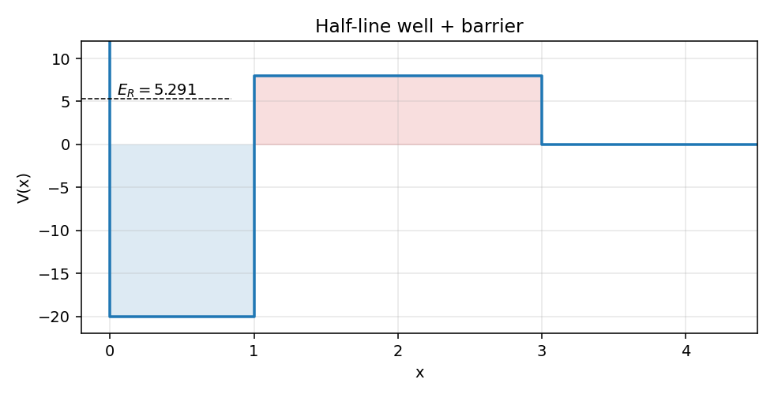
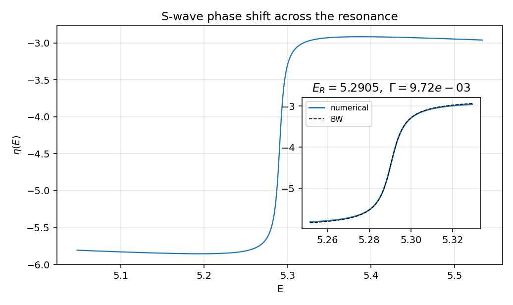
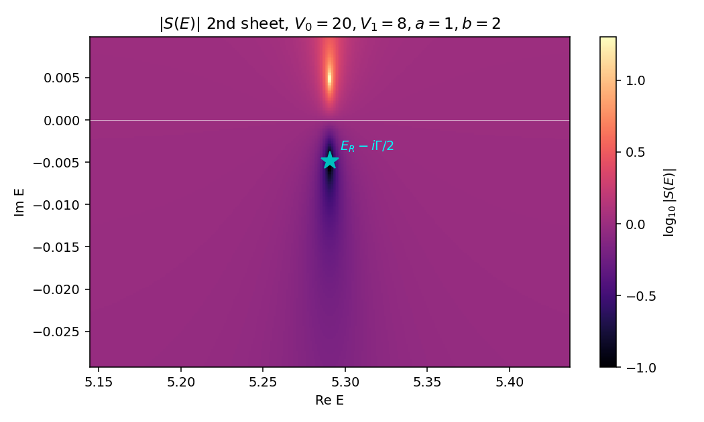
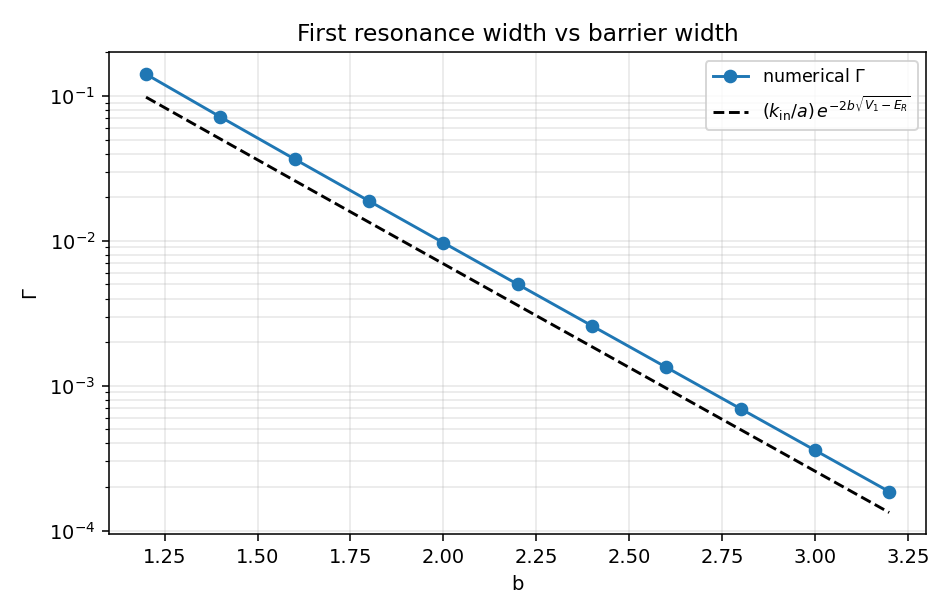

# 一维势阱加势垒：α 衰变图像

前一篇 delta 壳层把共振做到了三维，但壳是无限薄的——耦合 $\gamma$ 只有一个数。这一篇换最朴素的几何：左边一个有限深度的方阱关住粒子，右边一道矩形势垒挡住出口。粒子在阱里反复撞墙，每次撞到右墙都有一定概率穿透出去——这就是 Gamow 1928 年解释 α 衰变时画的图像。势垒越宽，穿透越难，寿命越长，复能量平面里的极点越靠近实轴。

全文取 $\hbar=1$，$2m=1$，$E=k^2$。半线 $x \geq 0$，原点设硬墙（也可以视为对称双阱的奇宇称投影）。

## 势的定义

$$
V(x)=\begin{cases}+\infty,& x<0,\\ -V_0,& 0<x<a,\\ +V_1,& a<x<a+b,\\ 0,& x>a+b,\end{cases}
$$

参数 $V_0=20,\,V_1=8,\,a=1,\,b=2$。$V_0$ 决定阱深与束缚密度；$V_1$ 与 $b$ 决定泄漏率。$V_1>E_R$ 时为亚阈共振，这是本篇的关注区。

定态薛定谔方程对 $u(x)=\psi(x)$（一维不需要 $u=r\psi$ 替换）

$$
-u''(x)+V(x)u(x)=E\,u(x),\qquad u(0)=0.
$$

三个区域里方程都是常系数线性二阶 ODE，只需在 $x=a$ 与 $x=a+b$ 处匹配 $u$ 与 $u'$。

## 三段式严格解

记 $q=\sqrt{V_0+E}$，$\kappa=\sqrt{V_1-E}$，$k=\sqrt{E}$。

- 阱内 $(0,a)$：$u_\text{I}(x)=A\sin(qx)$，已自动满足硬墙边界。
- 势垒中 $(a,a+b)$：$u_\text{II}(x)=B\,\mathrm e^{\kappa(x-a)}+C\,\mathrm e^{-\kappa(x-a)}$。
- 外侧 $(a+b,\infty)$：$u_\text{III}(x)=\sin(kx+\eta)$，$\eta(E)$ 是 s 波相移。

$x=a$ 处 $u$、$u'$ 连续给出 $B+C=A\sin(qa)$，$B-C=A\,(q/\kappa)\cos(qa)$。代入 $u_\text{II}$ 后在 $x=a+b$ 求对数导数 $L\equiv u'/u|_{a+b}$：

$$
L(E)=\frac{\kappa\sin(qa)\sinh(\kappa b)+q\cos(qa)\cosh(\kappa b)}{\sin(qa)\cosh(\kappa b)+(q/\kappa)\cos(qa)\sinh(\kappa b)}.
$$

外侧 $u_\text{III}$ 给出 $u'/u|_{a+b}=k\cot(k(a+b)+\eta)$。两者相等解出

$$
\boxed{\;\eta(E)=\arctan\!\frac{k}{L(E)}-k(a+b).\;}
$$

复能量延拓到第二张面时，写 $u_\text{III}$ 为入射加出射 $u_\text{III}\propto\mathrm e^{-ikx}-S(E)\,\mathrm e^{ikx}$，可整理出

$$
S(E)=-\,\mathrm e^{-2ik(a+b)}\,\frac{L(E)-ik}{L(E)+ik}.
$$

实 $E>0$ 时 $L$ 为实数，$|S|=1$，幺正性自动成立——与 `S_matrix_and_cross_section.zh.md:229` 中的 $S^\dagger S=\mathbf 1$ 在单通道半线情形完全一致。

## 共振条件

让 $E$ 走到下半复平面。S 矩阵的极点要求分母 $L(E)+ik=0$，即

$$
L(E)=-ik.
$$

约定 $k=\sqrt E$ 取上半面分支（物理面），共振极点位于第二张面下半面 $\mathrm{Im}\,E<0$。其实部 $E_R$ 是寿命中心位置，虚部按

$$
E_*=E_R-i\Gamma/2
$$

定义宽度 $\Gamma>0$。这一对极点结构在 `friedrichsModel.zh.md:551` 中被写成 $z_*-E_d-\Sigma^{\rm II}(z_*)=0$；本篇里 $L(E)+ik$ 起的就是 $z-E_d-\Sigma(z)$ 的角色。无穷不可穿透极限 $b\to\infty$ 时，$\sinh,\cosh$ 都趋于 $\frac12 \mathrm e^{\kappa b}$，分母里两项各取 $\frac12 e^{\kappa b}$ 后比值为 $\kappa$，得到 $L\to\kappa$，于是极点条件 $\kappa+ik=0$ 给纯虚 $k=i\kappa$，与硬阱内壁外指数衰减边界对应——亚阈共振退化成真束缚态。

## WKB 宽度

亚阈共振的物理内容可以写成 Gamow 公式：粒子在阱内以经典周期 $T_\text{cl}=2a/v_\text{in}$ 撞右墙，每次穿透概率 $T_\text{WKB}\approx \mathrm e^{-2\int_a^{a+b}\sqrt{V_1-E_R}\,\mathrm dx}=\mathrm e^{-2b\kappa_R}$。约定 $2m=1$ 给 $v_\text{in}=2k_\text{in}=2\sqrt{V_0+E_R}$，所以

$$
\Gamma_\text{WKB}\approx\frac{1}{T_\text{cl}}\,T_\text{WKB}=\frac{k_\text{in}}{a}\,\mathrm e^{-2b\sqrt{V_1-E_R}}.
$$

这里把次轮 WKB 前因子（$O(1)$ 的连接公式系数）丢掉，只保留指数与最简单的拍频 $k_\text{in}/a$。后面的数值对照会显示：在大 $b$ 极限下 $\Gamma_\text{num}/\Gamma_\text{WKB}$ 收敛到一个 $b$-无关的常数 $\approx 1.4$，正是被丢掉的 $O(1)$ 修正。指数依赖完全合拍，这就是 Gamow 计算 α 半衰期与原子核电荷数指数关系的本质。

## 数值与图

完整脚本见 `well_barrier_1d.py`。算法走三步：

- 在实轴扫 $L(E)$ 数值符号变化得到共振位置初值；
- 复 $E$ 平面阻尼 Newton 求 $L(E)+ik=0$ 的极点；
- 围绕极点拟合 Breit-Wigner 形式 $\eta(E)=\eta_\text{bg}+\arctan\!\bigl((E-E_R)/(\Gamma/2)\bigr)$，反提 $E_R$ 与 $\Gamma$。

数值结果（$V_0=20,\,V_1=8,\,a=1,\,b=2$）：

$$
E_R=5.29054,\qquad \Gamma=9.715\times 10^{-3},\qquad \tau=1/\Gamma\approx 103.
$$

宽度比共振能量小三个量级，这正是亚阈共振"长寿命"的标志。

```python
def log_deriv(E, b=B):
    q, kap = np.sqrt(V0 + E), np.sqrt(V1 - E)
    s, c = np.sin(q * A), np.cos(q * A)
    em2 = np.exp(-2 * kap * b)
    Cp, Cm = 0.5 * (1 + em2), 0.5 * (1 - em2)
    return (kap*s*Cm + q*c*Cp) / (s*Cp + (q*c/kap)*Cm)
```

势垒中 $\sinh(\kappa b)$ 与 $\cosh(\kappa b)$ 在大 $\kappa b$ 时各自溢出，但其比值有限。把公因子 $\mathrm e^{\kappa b}$ 显式抵消（用 $\mathrm e^{-2\kappa b}$ 表示）让函数在第二张面深处也保持稳定——这一点对扫描复 $E$ 平面至关重要。

第一张图：势的几何与共振能级。



阱（蓝）深 $V_0=20$，宽 $a=1$；势垒（红）高 $V_1=8$，宽 $b=2$。虚线标出共振 $E_R\approx 5.29$，正好嵌在势垒高度以下，是典型的亚阈准束缚态。

第二张图：相移 $\eta(E)$ 经过共振时的 $\pi$ 跳跃及其 BW 拟合。



外圈大尺度上看不到峰，因为宽度太窄（$\Gamma\sim 10^{-2}$）；放大插图里 $\eta$ 在 $\pm 8\Gamma/2$ 范围内走完一个 $\pi$，与 BW 解析曲线几乎完全重合。脚本里直接对 $\tan(\eta-\eta_\text{bg})$ 做线性最小二乘，反提的 $E_R$ 与 Newton 极点实部一致到 $10^{-5}$，$\Gamma$ 一致到 $10^{-3}$ 量级。

第三张图：复 $E$ 平面 $|S(E)|$ 等高线，标出 Newton 找到的极点。



极点正好位于 $E_R-i\Gamma/2$，即 BW 拟合给出的中心向下半平面的解析延拓。这一极点在物理面（上半平面 $\mathrm{Im}\,E>0$ 这一支）是缺席的，必须穿过实轴正半轴的连续谱支割延拓到第二张面，才能"看到"——`Green_operator.zh.md:468` 中"自伴 $H$ 的复极点只能位于第二张面"那条原理在这里有了像素级实例。

第四张图：第一共振宽度 $\Gamma$ 随势垒宽度 $b$ 的变化。



数值数据点与 WKB 直线在半对数图上几乎平行，比值 $\Gamma_\text{num}/\Gamma_\text{WKB}\approx 1.40$ 在 $b\in[2,3]$ 范围内稳定不变。这条曲线就是 Gamow 在原子核 α 衰变上发现的图像：寿命 $\tau=1/\Gamma\propto \exp(2b\sqrt{V_1-E_R})$，对原子核而言 $b$ 与 $V_1$ 由库仑势的高度与宽度决定，不同核素的 $\sqrt{V_1-E_R}$ 略有差异就让 $\log\tau$ 跨十几个量级——Geiger-Nuttall 规则的指数因子正是这里的 $\mathrm e^{-2b\kappa}$。

## sanity checks

`well_barrier_1d.py` 的 `sanity_checks` 跑三件事：

- 实 $E$ 上 $|S(E)|=1$（弹性幺正性），随机 6 组 $E$ 全通过，绝对误差 $<10^{-9}$；
- Newton 极点与 BW 拟合的 $E_R$ 一致到 $10^{-3}$，$\Gamma$ 相对误差 $<10^{-2}$；
- 数值 $\Gamma$ 与 WKB $\Gamma$ 在 $b>2$ 时比值在 $[0.5,2]$ 内（实测 $\approx 1.40$，被丢的 WKB 前因子是 $O(1)$ 的）。

跑一次约 1 秒，4 张 png 写到 `assets/well_barrier_1d/`。

## 与 Friedrichs 模型的对账

| 本篇中的对象 | Friedrichs 笔记中的对应 |
|:--|:--|
| 阱内准束缚能级（无穷势垒极限 $b\to\infty$ 是真束缚） | 离散态 $E_d$（解耦极限），见 `friedrichsModel.zh.md:24` |
| 极点条件 $L(E)+ik=0$ | $z-E_d-\Sigma^{\rm II}(z)=0$，见 `friedrichsModel.zh.md:551` |
| 第二张面下半面极点 $E_R-i\Gamma/2$ | $z_*=E_R-i\Gamma/2$（Gamow 态），见 `friedrichsModel.zh.md:580` |
| 宽度 $\Gamma\propto \mathrm e^{-2b\kappa}$ | $\Gamma(E)=2\pi|g(E)|^2$，有效耦合 $|g_\text{eff}|^2\propto \mathrm e^{-2b\kappa}$，见 `friedrichsModel.zh.md:486` |
| 解析结构：实轴上 $|S|=1$，复极点只在第二张面 | $G(z)$ 物理面无复极点；`Green_operator.zh.md:468` |
| 实轴幺正 $|S(E)|=1$ | $S^\dagger S=\mathbf 1$，`S_matrix_and_cross_section.zh.md:229` |

与 delta 壳层那一篇相比，这里的"耦合"由势垒高度与宽度联合控制：固定 $V_1$，让 $b$ 增大，等效地把 $|g_\text{eff}|^2$ 指数压低，把极点拉向实轴；这是 Friedrichs 模型耦合 $\to 0$ 极限在三维同样可见的同一现象的一维显式化。delta 壳层里"$\gamma$ 越大壳越硬"等效 $|g_\text{eff}|^2$ 越小，本篇里"$b$ 越大墙越厚"也是同一回事，只是在两套不同的可解模型里给出了同一指数律。

## next-step

- 多重共振：如果 $V_0$ 增大让阱内能容纳两个准束缚级（$(n\pi/a)^2-V_0$ 中 $n=1,2$ 都落在 $(0,V_1)$ 内），可以观察两条 BW 峰分别对应不同 $n$ 的内态，宽度按 $n$ 的奇偶性不同——奇宇称内态在 $a$ 处节点正好阻挡泄漏。
- 时间域生存振幅 $\langle\psi_R|\mathrm e^{-iHt}|\psi_R\rangle$：直接对 $E$ 做傅里叶反变换，预期早时近指数衰减 $\mathrm e^{-\Gamma t}$，长时被支割贡献的幂律接管，与 `friedrichsModel.zh.md:580` 节的 Gamow + cut 拆分一一对应。
- α 衰变常数：把 $V_0,V_1,a,b$ 换成原子核常数（$V_0\sim 30$ MeV, $V_1\sim 20$–$30$ MeV, $b\sim 10$ fm），代入本篇公式即可估出 $^{210}$Po 等重核 α 半衰期，与实验值在十数量级范围内吻合——Gamow-Condon-Gurney 1928 年的原始计算就建立在这个最简单的一维图像上。
