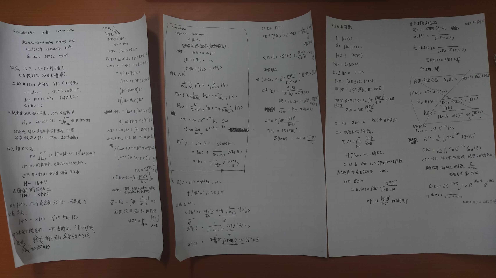

# Friedrichs 模型

关键词：friedrichs model, discrete-continuum coupling, scattering state, resonance pole, gamow state

注意笔记里最后只写$u_{pol}$, 还有$u_{cut}$的影响，因为算生存振幅只能在 x 轴上方积分。

原始路径只能在 x 轴上方积分，这是物理因果性决定的（薛定谔方程规定了时间的流向，导致 i 与 -i 的含义不一致）。

下压到第二张面后，只是为了便于计算，因为可以使用 Jordan 引理把路径闭合到下半平面，从而得到极点贡献。但这并不意味着物理上真的存在第二张面，因为我们只能在 x 轴上方积分。

所以

$$
u_{\rm up} = u_{\rm down} + \text{discrete}(\pm i),
$$

$u_{\rm down}$ 等于下半面的极点贡献。

* 有效哈密顿量 / 自能 $\Sigma(z)$
* 散射态 $|\Psi_E^{(\pm)}\rangle$（以及 $(S,T)$ 的共振分母）
* 共振极点 $z_* = E_R - i\Gamma/2$（Gamow 态）

---

## 0. 设定

### 0.1 空间分解

$$
\mathcal H = \mathbb C|d\rangle \oplus \mathcal H_c,
$$

$|d\rangle$ 为离散态，$\mathcal H_c$ 为连续谱子空间。

### 0.2 正交归一

设

$$
\langle d|d\rangle=1,\qquad \langle d|E\rangle=0,
$$

连续态满足

$$
\langle E|E'\rangle=\delta(E-E'),\qquad
\int dE\,|E\rangle\langle E| = I_c \quad(\text{在 }\mathcal H_c\text{ 上}).
$$

---

## 1. 哈密顿量

### 1.1 无耦合哈密顿量 $H_0$

$$
H_d = E_d |d\rangle\langle d|.
$$

$$
H_c = \int_{E_{\rm th}}^\infty dE\,E\,|E\rangle\langle E|.
$$

$$
H_0 = H_d + H_c.
$$

$$
H_0|d\rangle = E_d |d\rangle,\qquad H_0|E\rangle=E|E\rangle.
$$

---

### 1.2 打开耦合：加入相互作用 $V$

$$
V=\int_{E_{\rm th}}^\infty dE\;\Big(g(E)\,|d\rangle\langle E| + g^*(E)\,|E\rangle\langle d|\Big).
$$

$$
H = H_0 + V.
$$

---

## 2. 本征方程与自能方程

$$
H|\psi\rangle = z|\psi\rangle.
$$

### 2.1 一般态展开

$$
|\psi\rangle = \alpha |d\rangle + \int dE\,\phi(E)|E\rangle.
$$

### 2.2 计算 $H|\psi\rangle$

#### (a) 先算 $H_0|\psi\rangle$

$$
H_0|\psi\rangle = E_d\alpha |d\rangle + \int dE\, E\,\phi(E)|E\rangle.
$$

#### (b) 再算 $V|\psi\rangle$

* $V$ 作用在 $\alpha|d\rangle$ 上：

    $$
    V(\alpha|d\rangle) = \alpha\int dE\, g^*(E)\,|E\rangle\langle d|d\rangle
    = \alpha\int dE\, g^*(E)\,|E\rangle.
    $$

* $V$ 作用在 $\int \phi(E)|E\rangle\,dE$ 上：

    $$
    V\left(\int dE\,\phi(E)|E\rangle\right)
    = \int dE\,\phi(E)\int dE'\, g(E')\,|d\rangle\langle E'|E\rangle,
    $$

    用 $\langle E'|E\rangle=\delta(E'-E)$，得

    $$
    = \int dE\,\phi(E)\, g(E)\,|d\rangle.
    $$

$$
V|\psi\rangle
= \left(\int dE\, g(E)\phi(E)\right)|d\rangle
     + \int dE\, \alpha g^*(E)|E\rangle.
$$

#### (c) 合并

$$
\begin{aligned}
H|\psi\rangle &= 
\underbrace{\left(E_d\alpha+\int dE\,g(E)\phi(E)\right)}_{\text{离散分量}}|d\rangle \\
&\quad
+ \int dE\,\underbrace{\left(E\phi(E)+\alpha g^*(E)\right)}_{\text{连续分量}}|E\rangle.
\end{aligned}
$$

### 2.3 对比 $z|\psi\rangle$

$$
z|\psi\rangle = z\alpha|d\rangle + \int dE\, z\phi(E)|E\rangle.
$$

比较 $|d\rangle$ 与 $|E\rangle$ 分量：

#### (1) 离散分量方程

$$
E_d\alpha+\int dE\,g(E)\phi(E)= z\alpha
$$

即

$$
(E_d-z)\alpha+\int dE\,g(E)\phi(E)=0.
\tag{A}
$$

#### (2) 连续分量方程

$$
E\phi(E)+\alpha g^*(E)= z\phi(E)
$$

即

$$
(E-z)\phi(E)+\alpha g^*(E)=0.
\tag{B}
$$

### 2.4 消去 $\phi(E)$

$$
\phi(E)=\frac{-\alpha g^*(E)}{E-z}.
\tag{C}
$$

把 (C) 代回 (A)：

$$
(E_d-z)\alpha+\int dE\, g(E)\left(\frac{-\alpha g^*(E)}{E-z}\right)=0.
$$

$$
\alpha\left[(E_d-z)-\int dE\,\frac{|g(E)|^2}{E-z}\right]=0.
$$

非平凡解（$\alpha\neq 0$）要求

$$
(E_d-z)-\int dE\,\frac{|g(E)|^2}{E-z}=0.
$$

等价于

$$
z-E_d-\int dE\,\frac{|g(E)|^2}{z-E}=0.
$$

$$
\Sigma(z)\equiv\int_{E_{\rm th}}^\infty dE\,\frac{|g(E)|^2}{z-E},
$$

得到

$$
z-E_d-\Sigma(z)=0.
\tag{F}
$$

---

## 3. Feshbach 投影与 $\Sigma(z)$

### 3.1 定义投影

$$
P=|d\rangle\langle d|,\qquad Q=1-P.
$$

* $P\mathcal H$ 维数 = 1
* $Q\mathcal H$ 是连续谱子空间

### 3.2 从 $(H-z)|\psi\rangle=0$ 出发

写成

$$
(H-z)(P+Q)|\psi\rangle=0.
$$

分别左乘 $P$ 与 $Q$：

#### $P$ 方程

$$
(PHP-zP)P|\psi\rangle + PHQ\,Q|\psi\rangle=0.
\tag{P-eq}
$$

#### $Q$ 方程

$$
QHP\,P|\psi\rangle + (QHQ-zQ)\,Q|\psi\rangle=0.
\tag{Q-eq}
$$

由 (Q-eq) 解 $Q|\psi\rangle$：

$$
(QHQ-z)Q|\psi\rangle = -QHP\,P|\psi\rangle
$$

若 $(QHQ-z)^{-1}$ 存在，

$$
Q|\psi\rangle = -(QHQ-z)^{-1}QHP\,P|\psi\rangle.
\tag{Qsol}
$$

代回 (P-eq)：

$$
(PHP-z)P|\psi\rangle - PHQ(QHQ-z)^{-1}QHP\,P|\psi\rangle=0.
$$

即

$$
\Big[PHP + PHQ(z-QHQ)^{-1}QHP\Big]P|\psi\rangle = z P|\psi\rangle.
$$

得到 Feshbach 有效哈密顿量

$$
H_{\rm eff}(z)=PHP+PHQ(z-QHQ)^{-1}QHP.
$$

### 3.3 在 Friedrichs 模型中

* $PHP = E_d |d\rangle\langle d|$ 在 1 维空间上就是数 $E_d$；
* $QHQ$ 在 $|E\rangle$ 表象下就是乘法算符 $E$；
* $PHQ=\int dE\, g(E)|d\rangle\langle E|$；
* $QHP=\int dE\, g^*(E)|E\rangle\langle d|$。

$$
PHQ(z-QHQ)^{-1}QHP
= \int dE\,\frac{|g(E)|^2}{z-E}\; |d\rangle\langle d|.
$$

在 $P$ 空间（1 维）即:

$$
\Sigma(z)=\int dE\,\frac{|g(E)|^2}{z-E}.
$$

---

## 4. 散射态与边界值

### 4.1 Lippmann–Schwinger 方程

自由连续态 $|E\rangle$ 为 $H_0$ 本征态，散射态定义为

$$
|\Psi_E^{(\pm)}\rangle
= |E\rangle
+ \frac{1}{E-H_0\pm i0}V|\Psi_E^{(\pm)}\rangle.
\tag{LS}
$$

## 4.2 将 $|\Psi_E^{(\pm)}\rangle$ 展开

设

$$
|\Psi_E^{(\pm)}\rangle
= |E\rangle + a^{(\pm)}(E)|d\rangle + \int dE'\, b^{(\pm)}(E';E)|E'\rangle.
$$

只需离散分量

$$
a^{(\pm)}(E)=\langle d|\Psi_E^{(\pm)}\rangle.
$$

对 (LS) 左乘 $\langle d|$：

$$
\langle d|\Psi_E^{(\pm)}\rangle
= \langle d|E\rangle
+
\left\langle d\left|\frac{1}{E-H_0\pm i0}V\right|\Psi_E^{(\pm)}\right\rangle.
$$

$\langle d|E\rangle=0$。

$$
\langle d|\frac{1}{E-H_0\pm i0}
= \frac{1}{E-E_d\pm i0}\langle d|.
$$

$$
a^{(\pm)}(E)
= \frac{1}{E-E_d\pm i0}\;
\langle d|V|\Psi_E^{(\pm)}\rangle.
\tag{1}
$$

$$
\langle d|V
= \int dE'\, g(E')\langle E'|.
$$

$$
\langle d|V|\Psi_E^{(\pm)}\rangle
= \int dE'\, g(E')\,\langle E'|\Psi_E^{(\pm)}\rangle.
\tag{2}
$$

对 (LS) 左乘 $\langle E'|$：

$$
\langle E'|\Psi_E^{(\pm)}\rangle
= \delta(E'-E)
+
\frac{1}{E-E'\pm i0}\,\langle E'|V|\Psi_E^{(\pm)}\rangle.
\tag{3}
$$

$$
\langle E'|V = g^*(E')\langle d|.
$$

$$
\langle E'|V|\Psi_E^{(\pm)}\rangle
= g^*(E')\,a^{(\pm)}(E).
\tag{4}
$$

代回 (3)：

$$
\langle E'|\Psi_E^{(\pm)}\rangle
= \delta(E'-E)
+
\frac{g^*(E')}{E-E'\pm i0}\,a^{(\pm)}(E).
\tag{5}
$$

再代回 (2)：

$$
\begin{aligned}
\langle d|V|\Psi_E^{(\pm)}\rangle
&= \int dE'\, g(E')\delta(E'-E)
+ \int dE'\, g(E')\frac{g^*(E')}{E-E'\pm i0}\,a^{(\pm)}(E) \\
&= g(E)
+ \left[\int dE'\,\frac{|g(E')|^2}{E-E'\pm i0}\right] a^{(\pm)}(E).
\end{aligned}
\tag{6}
$$

将 (6) 代回 (1)：

$$
a^{(\pm)}(E)
= \frac{1}{E-E_d\pm i0}
\left(
g(E)
+
\left[\int dE'\,\frac{|g(E')|^2}{E-E'\pm i0}\right] a^{(\pm)}(E)
\right).
$$

整理得

$$
\left[
E-E_d\pm i0
- \int dE'\,\frac{|g(E')|^2}{E-E'\pm i0}
\right] a^{(\pm)}(E)
= g(E).
$$

定义边界自能

$$
\Sigma(E\pm i0)=\int dE'\,\frac{|g(E')|^2}{E\pm i0-E'}.
$$

$$
\frac{1}{E-E'\pm i0}=\frac{1}{E\pm i0-E'}.
$$

$$
a^{(\pm)}(E)=\frac{g(E)}{E-E_d-\Sigma(E\pm i0)}.
\tag{aE}
$$

---

## 4.3 $\Delta(E)$ 与 $\Gamma(E)$

用分布恒等式（Sokhotski–Plemelj）：

$$
\frac{1}{x\pm i0}=\mathcal P\frac{1}{x}\mp i\pi\delta(x).
$$

对

$$
\Sigma(E\pm i0)=\int dE'\,\frac{|g(E')|^2}{E-E'\pm i0}
$$

令 $x=E-E'$，

$$
\Sigma(E\pm i0)
= \mathcal P\int dE'\,\frac{|g(E')|^2}{E-E'}
\ \mp\ i\pi |g(E)|^2.
$$

定义

$$
\Delta(E)=\mathcal P\int dE'\,\frac{|g(E')|^2}{E-E'},\qquad
\Gamma(E)=2\pi |g(E)|^2.
$$

则

$$
\Sigma(E\pm i0)=\Delta(E)\mp i\Gamma(E)/2.
$$

于是分母为

$$
E-E_d-\Delta(E)\pm i\Gamma(E)/2.
$$

---

## 5. 极点、Gamow 态与 RHS

### 5.1 离散通道 resolvent 与极点方程

$$
G_d(z)\equiv \langle d|(z-H)^{-1}|d\rangle
=\frac{1}{z-E_d-\Sigma(z)}.
$$

极点方程

$$
z-E_d-\Sigma(z)=0
\tag{Pole}
$$

实轴边界值

$$
G_d(E\pm i0)=\frac{1}{E-E_d-\Sigma(E\pm i0)},
$$

且

$$
\Sigma(E\pm i0)=\Delta(E)\mp i\Gamma(E)/2.
$$

### 5.2 第二 Riemann 面与共振极点

$$
\Sigma(z)=\int_{E_{\rm th}}^\infty dE'\,\frac{|g(E')|^2}{z-E'}
$$

在 $[E_{\rm th},\infty)$ 有支割，$G_d(z)$ 对应两张 Riemann 面。

在割线上（$E>E_{\rm th}$）：

$$
\Sigma^{\rm I}(E+i0)-\Sigma^{\rm I}(E-i0)=-\,i\Gamma(E).
$$

在割线上可写为

$$
\Sigma^{\rm II}(E-i0)=\Sigma^{\rm I}(E+i0).
$$

共振极点为第二张面下半平面解

$$
z_*=E_R-\frac{i}{2}\Gamma_R,\qquad
z_*-E_d-\Sigma^{\rm II}(z_*)=0.
$$

### 5.3 谱函数与 Breit-Wigner 近似

谱函数

$$
A(E)\equiv -2\,\mathrm{Im}\,G_d(E+i0).
$$

代入

$$
G_d(E+i0)=\frac{1}{(E-E_d-\Delta(E))+i\Gamma(E)/2},
$$

得

$$
A(E)=\frac{\Gamma(E)}{(E-E_d-\Delta(E))^2+(\Gamma(E)/2)^2}.
$$

窄宽度近似下即 Breit-Wigner 峰形。

### 5.4 Gamow 态、指数衰减与支割修正

生存振幅

$$
u(t)\equiv \langle d|e^{-iHt}|d\rangle
=\frac{1}{2\pi i}\int_\gamma dz\,e^{-izt}G_d(z),\qquad t>0.
$$

闭合路径到下半平面：

$$
u(t)=u_{\rm pole}(t)+u_{\rm cut}(t).
$$

极点贡献（$z=z_*$ 留数）：

$$
u_{\rm pole}(t)=Z\,e^{-iz_* t}
=Z\,e^{-iE_R t}e^{-\Gamma_R t/2},
$$

其中

$$
Z=\left[1-\Sigma^{{\rm II}\,\prime}(z_*)\right]^{-1}.
$$

中间时间区间

$$
P(t)=|u(t)|^2\approx |Z|^2e^{-\Gamma_R t}.
$$

严格地

$$
u_{\rm cut}(t)\neq0,
$$

其控制短时偏离指数律与长时幂律尾（由阈值解析结构决定）。  
因此常在 Rigged Hilbert Space（RHS/Gelfand 三重）中处理：Gamow 矢量是广义本征矢量，不属于普通 Hilbert 空间的平方可积态。

---

## 6. 总结

* 模型：一个离散态 $|d\rangle$ 与连续谱 $|E\rangle$ 通过 $g(E)$ 耦合。
* 核心函数：$\Sigma(z)=\int dE\,|g(E)|^2/(z-E)$。
* 极点方程：$z-E_d-\Sigma(z)=0$。
* 散射边界值：$\Sigma(E\pm i0)=\Delta(E)\mp i\Gamma(E)/2$，$\Gamma(E)=2\pi|g(E)|^2$。
* 共振：第二张面极点 $z_*=E_R-i\Gamma_R/2$。
* 动力学：$u(t)=Z e^{-iz_*t}+u_{\rm cut}(t)$，指数衰减只是主导项而非全时精确律。

