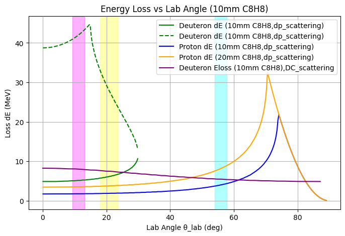

## Time resolution requirement

Harmonic number $h = 6$, SRC extraction radius $R_{ext} = 5.36\ \mathrm{m}$, beam kinetic energy $T_u = 190\ \mathrm{MeV}/u$.

The time interval between bunches $\Delta t$ is actually the period of the RF field $T_{RF}$, i.e.:
$$\Delta t = T_{RF} = \frac{1}{f_{RF}} = \frac{1}{h \times f_{rev}}$$

First, from $T_u = 190\ \mathrm{MeV}/u$ compute the relativistic factors (taking $m_u c^2 = 931.494\ \mathrm{MeV}$):
$$\gamma = 1 + \frac{T_u}{m_u c^2} = 1 + \frac{190}{931.494} = 1.20397$$
$$\beta = \sqrt{1 - \gamma^{-2}} = 0.55689$$
$$v = \beta c = 1.6695 \times 10^{8}\ \mathrm{m/s}$$

Then from the extraction radius $R_{ext} = 5.36\ \mathrm{m}$ obtain the orbit circumference and revolution frequency:
$$C = 2\pi R_{ext} = 33.678\ \mathrm{m}$$
$$f_{rev} = \frac{v}{C} = 4.9573\ \mathrm{MHz}$$

Hence the bucket frequency and bunch spacing:
$$f_{bucket} = h \times f_{rev} = 6 \times 4.9573\ \mathrm{MHz} = 29.7441\ \mathrm{MHz}$$
$$\Delta t = \frac{1}{f_{bucket}} \approx 33.62\ \mathrm{ns}$$

## Energy deposit

## Polarized Ion Source

https://accelconf.web.cern.ch/cyclotrons2016/papers/tub04.pdf

https://www.pasj.jp/web_publish/sast1993/26DL3.pdf