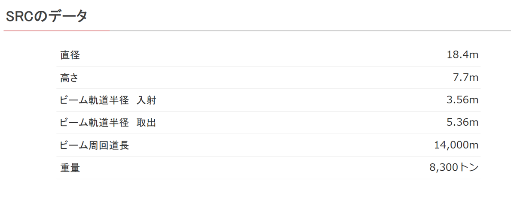
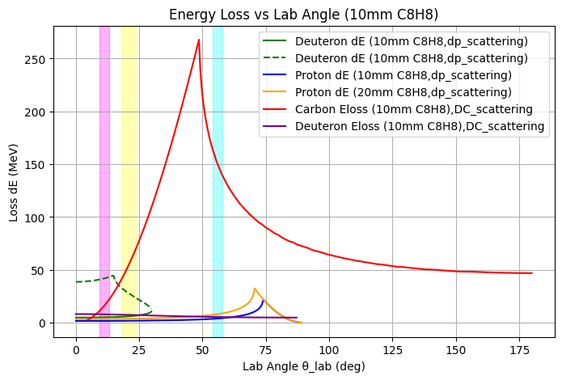

## Time resolution requirement

Harmonic number = 6

$180\ \mathrm{MeV}/u$, so $\beta \approx 0.5$

The time interval between bunches $\Delta t$ is actually the period of the RF field $T_{RF}$, i.e.:
    
 $$\Delta t = T_{RF} = \frac{1}{f_{RF}} = \frac{1}{h \times f_{rev}} = 58\ \mathrm{ns}$$

## Energy deposit

## Polarized Ion Source

https://accelconf.web.cern.ch/cyclotrons2016/papers/tub04.pdf

https://www.pasj.jp/web_publish/sast1993/26DL3.pdf