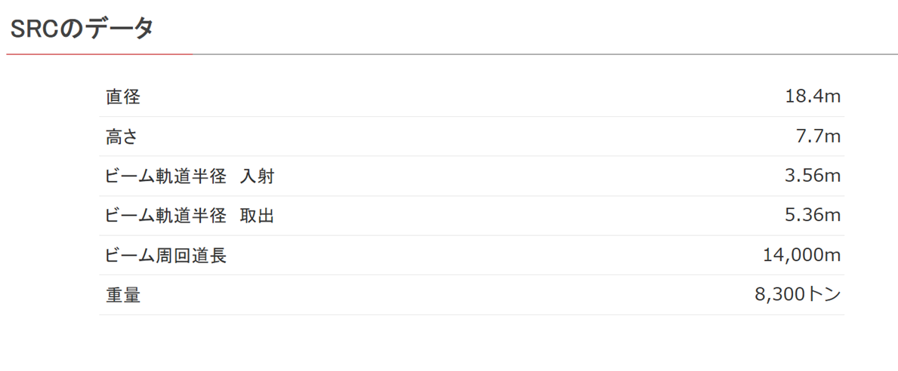
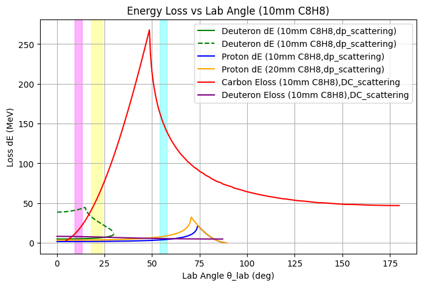
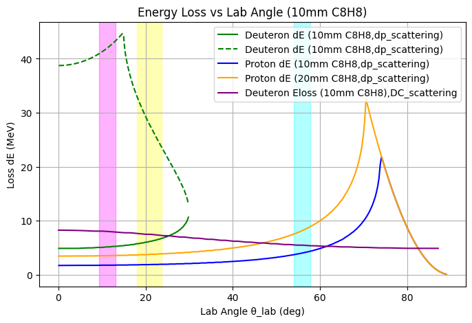

## Time resolution require

Harmonic number = 6

    束流包之间的间隔时间 $\Delta t$ 实际上是射频电场的周期 $T_{RF}$，即：
    $$\Delta t = T_{RF} = \frac{1}{f_{RF}} = \frac{1}{h \times f_{rev}}$$
    根据您提供的信息，谐波数 $h=6$。
    $$\Delta t = \frac{1}{6 \times 11.91 \times 10^3 \text{ Hz}} = \frac{1}{71.46 \times 10^3 \text{ Hz}} \approx 1.4 \times 10^{-5} \text{ s}$$
    换算成微秒为 14 $\mu$s。

## Energy deposit

