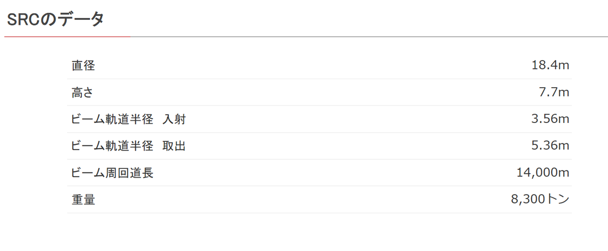
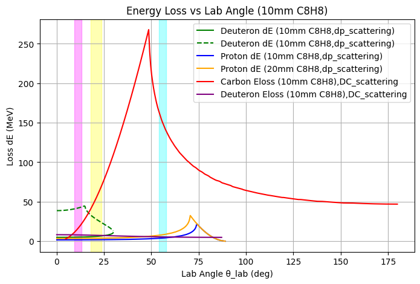

## Time resolution require

Harmonic number $h = 6$，SRC 导出轨道半径 $R_{ext} = 5.36\ \mathrm{m}$，束流动能 $T_u = 190\ \mathrm{MeV}/u$。

束流包之间的间隔时间 $\Delta t$ 实际上是射频电场的周期 $T_{RF}$，即：
$$\Delta t = T_{RF} = \frac{1}{f_{RF}} = \frac{1}{h \times f_{rev}}$$

先由 $T_u = 190\ \mathrm{MeV}/u$ 求相对论因子（取 $m_u c^2 = 931.494\ \mathrm{MeV}$）：
$$\gamma = 1 + \frac{T_u}{m_u c^2} = 1 + \frac{190}{931.494} = 1.20397$$
$$\beta = \sqrt{1 - \gamma^{-2}} = 0.55689$$
$$v = \beta c = 1.6695 \times 10^{8}\ \mathrm{m/s}$$

再由导出半径 $R_{ext} = 5.36\ \mathrm{m}$ 计算导出轨道圆周与回旋频率：
$$C = 2\pi R_{ext} = 33.678\ \mathrm{m}$$
$$f_{rev} = \frac{v}{C} = 4.9573\ \mathrm{MHz}$$

于是 bucket 频率与束团间隔为：
$$f_{bucket} = h \times f_{rev} = 6 \times 4.9573\ \mathrm{MHz} = 29.7441\ \mathrm{MHz}$$
$$\Delta t = \frac{1}{f_{bucket}} \approx 33.62\ \mathrm{ns}$$

## Energy deposit

![alt text](assets/my_polarimeter.en/image-1.png