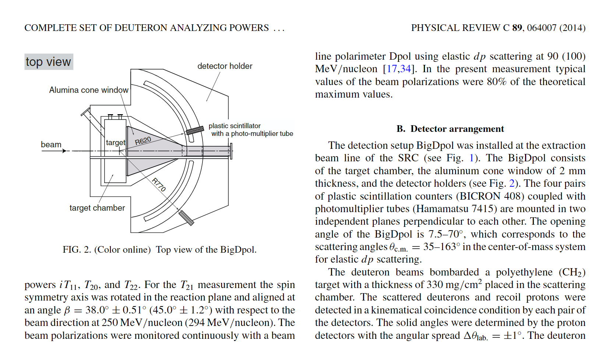

This page records polarimeters and closely related polarization-detection systems that are most relevant to the present project. The emphasis is on hadron, deuteron, proton, and neutron programs. When a hardware detail cannot be stably confirmed from public primary sources, I mark it as unconfirmed instead of treating it as settled fact.

## RIKEN RIBF

### dPol

- Role: a beam-line polarimeter on the IRC bypass beam-transport line, used to monitor polarized deuteron beams before injection into the SRC.
- Reaction: public accelerator and experiment-layout materials consistently describe it as using d-p elastic scattering; the 2017 layout slides explicitly state 90 MeV/nucleon.
- The publicly accessible information that I could verify is mostly limited to accelerator and layout slides; I did not find a detector note as detailed as the one available for BigDpol.
- Unconfirmed detail: some secondary notes associate H1161 / H1161GS with dPol, but I did not find a sufficiently stable primary public source for that assignment, so I do not present it here as established fact.

### Resources

- [Overview of RIKEN RIBF Facility (Sakurai, 2009)](https://www2.lbl.gov/nsd/conferences/juseipen2009/talks/Sakurai.pdf)
- [Plan of measurement of dp scattering at RIBF, RIKEN Accel. Prog. Rep. 42 (2009)](https://www.nishina.riken.jp/researcher/APR/Document/ProgressReport_vol_42.pdf)
- [Deuteron Analyzing Powers (Sekiguchi slides)](http://theor.jinr.ru/~spin2012/talks/s4/Sekiguchi.pdf)
- [Acceleration of Polarized Deuteron Beams with RIBF Cyclotrons (Cyclotrons'16)](https://proceedings.jacow.org/cyclotrons2016/papers/tub04.pdf)

### BigDpol

- Role: installed on the SRC extraction beam line for d-p elastic-scattering polarimetry in the 190-300 MeV/nucleon range.
- The clearest public detector note I found is in RIKEN Accel. Prog. Rep. 42: BigDpol consists of a target chamber, a 2 mm alumina cone window, and four symmetrically placed pairs of plastic scintillators.
- Scintillator: BC408.
- PMT: Hamamatsu H7415.
- Geometry: scattered deuterons and recoil protons are detected in kinematical coincidence in the left / right / up / down directions; the quoted opening angle is about 10°-70°. The sketch also shows approximate `R620` and `R770` radial labels, which are useful as indicative deuteron / proton arm distances.
- Target: polyethylene (CH2).

### Resources

- [Plan of measurement of dp scattering at RIBF, RIKEN Accel. Prog. Rep. 42 (2009)](https://www.nishina.riken.jp/researcher/APR/Document/ProgressReport_vol_42.pdf)
- [Complete set of deuteron analyzing powers for dp elastic scattering at 250 MeV/nucleon and three nucleon forces](https://doi.org/10.1051/epjconf/20100305024)
- [Acceleration of Polarized Deuteron Beams with RIBF Cyclotrons (Cyclotrons'16)](https://proceedings.jacow.org/cyclotrons2016/papers/tub04.pdf)
- [Hamamatsu H7415 product page](https://www.hamamatsu.com/eu/en/product/optical-sensors/pmt/pmt-assembly/head-on-type/H7415.html)

### KuJyaku

- Purpose: developed for d-p elastic-scattering and spin-correlation measurements with a polarized proton target, covering the cross-section minimum region at 100 MeV/n and 135 MeV/n.
- Azimuthal coverage: detector groups are arranged around the beam axis at 0°, 90°, 180°, and 270°.
- Magnetic field: the public thesis describes operation together with a triplet-DNP polarized proton target under a typical field of about 0.4 T.
- The thesis gives the following representative plastic detectors:

| detector | scintillator | size (mm^3) | PMT | distance from target (mm) |
| --- | --- | --- | --- | --- |
| Pl_p | BC-408 | 70×70×25 | H7195 | 1000 |
| Pl_d | BC-408 | 250×70×10 | H7195 | 950 |

### Resources

- [Developments Toward the Measurement of Spin Correlation Coefficients in d-p Elastic Scattering (Tohoku thesis PDF)](https://tohoku.repo.nii.ac.jp/record/2003966/files/250325-Saito-3575-1.pdf)
- [Few-Nucleon Scattering Experiments to Explore the Three-Nucleon Forces (PoS, CD2024)](https://pos.sissa.it/479/096/)
- [Hamamatsu H7195 product page](https://www.hamamatsu.com/eu/en/product/optical-sensors/pmt/pmt-assembly/head-on-type/H7195.html)

## JINR / Nuclotron / DSS

- DSS (Deuteron Spin Structure) is one of the core internal-target spin experiments in the Nuclotron / NICA program, using polarized deuteron and proton beams to study spin-dependent observables.
- The early Nuclotron ITS polarimeter is reasonably well documented in public notes: it was based on backward-angle d-p elastic scattering, with early proton and deuteron plastic counters of about 14×20×20 mm^3 and 20×20×20 mm^3, respectively, placed roughly 60 cm from the target.
- In later DSS papers and conference materials, the implementation usually appears as a segmented plastic-scintillator setup with PMT readout; if one only wants the currently cited readout hardware, H7416MOD appears repeatedly in several conference notes.
- One recent upgrade direction is to extend part of the plastic-counter readout from PMTs to SiPMs.

### Resources

- [Development of deuteron polarimeter at internal target station of Nuclotron](https://doi.org/10.1063/1.2750926)
- [Construction of Deuteron Polarimeter at Internal Target Station of Nuclotron (CNS annual report)](https://www.cns.s.u-tokyo.ac.jp/archive/annual/ann04.pdf)
- [DSS related dp elastic-scattering data summary (arXiv:1005.0525)](https://arxiv.org/pdf/1005.0525)
- [Plastic scintillators + H7416MOD conference paper (EPJ Web of Conferences)](https://www.epj-conferences.org/articles/epjconf/pdf/2019/06/epjconf_ayss18_04005.pdf)
- [SiPM upgrade study for DSS counters](https://link.springer.com/article/10.1134/S1547477123050710)
- [NICA newsletter note mentioning DSS polarimetry (No. 15, 2025)](https://lhep.jinr.ru/wp-content/uploads/2025/12/nica_No15.pdf)

## Forschungszentrum Julich / COSY

### EDDA

- EDDA was one of the early major hodoscopes at COSY, originally built for pp elastic-scattering excitation functions and spin-observable measurements.
- For a long period before and around the JEDI / EDM program, the EDDA plastic-scintillator system was also used as a beam polarimeter.
- In the present context, EDDA matters mainly as the direct predecessor of later COSY JEDI / JePo polarimetry.

### Resources

- [JEDI Polarimeter (JePo) installed in COSY (JARA / Julich)](https://www.jara.org/en/research/fame/news/detail/JEDI-Polarimeter-installed)
- [Older COSY polarimetry / EDDA conference paper](https://accelconf.web.cern.ch/p01/papers/rpph054.pdf)
- [COSY / EDDA overview note](https://www.bnl.gov/edm/review/files/pdf/estephenson_cosy_writeup.pdf)

### JEDI polarimeter / JePo

- JePo is a newly designed dedicated beam polarimeter for EDM searches, intended to replace EDDA.
- The public JARA description gives the core concept clearly: a modular calorimetric polarimeter based on LYSO modules of about 3×3×8 cm^3, coupled to large-area SiPM arrays.
- The detector has radial symmetry and is geometrically optimized for up-down and left-right asymmetry measurements.
- The JINST paper gives the full system description: 52 LYSO modules arranged in four symmetric blocks (up, down, left, right), with plastic scintillators in front for dE/dx particle identification.
- Main application: long-term, high-stability polarization monitoring for proton and deuteron EDM searches in the COSY ring.

### Resources

- [JEDI Polarimeter (JePo) installed in COSY (JARA / Julich)](https://www.jara.org/en/research/fame/news/detail/JEDI-Polarimeter-installed)
- [A new beam polarimeter at COSY to search for electric dipole moments of charged particles (GSI repository)](https://repository.gsi.de/record/237280)
- [JINST paper DOI: 10.1088/1748-0221/15/12/P12005](https://doi.org/10.1088/1748-0221/15/12/P12005)

## Jefferson Lab (cross-domain reference)

This section is kept mainly as a cross-check. JLab polarimetry is for electron beams rather than hadron beams, but its beamline instrumentation is documented very well and is useful when comparing dedicated polarimeters with related detector systems.

### Hall A Moller polarimeter

- Purpose: measurement of longitudinal electron-beam polarization.
- Principle: the electron beam hits a magnetically saturated thin iron foil, and the spectrometer system selects scattered Moller electron pairs in coincidence.
- The Hall A manual explicitly states a target field of about 3 T and electron-pair detection over `75° < theta_CM < 105°`.

### Resources

- [Hall A beamline overview](https://hallaweb.jlab.org/equipment/beamline.html)
- [Hall A Moller polarimeter manual](https://hallaweb.jlab.org/equipment/moller/OSP/20190219_moller_manual.pdf)

### BigHAND

- BigHAND is a large-area neutron detector, not a dedicated beam polarimeter.
- I keep it here only as an example of hardware that is often discussed alongside polarized-neutron and Hall A spin experiments.
- Public documentation describes it as a layered steel plus thick-plastic-scintillator-bar detector used for neutron detection and TOF-based discrimination.

### Resources

- [Hall A Annual Report 2006 (BigHAND detector description)](https://hallaweb.jlab.org/publications/AnnualReports/AnnualReport2006.pdf)
- [ESAD note mentioning BigHAND](https://hallaweb.jlab.org/experiment/E02-013/HallA-documentation/ESADrev1.pdf)

## Other relevant hadron polarimeters

### NPOL3 (RCNP, Osaka)

- NPOL3 is a high-resolution neutron polarimeter for polarization-transfer measurements.
- The standard configuration described in the NIMA paper is:
  - first two planes: 20 sets of one-dimensional position-sensitive plastic scintillators, each about 100×10×5 cm^3, covering 100×100 cm^2;
  - final plane: a 100×100×10 cm^3 two-dimensional position-sensitive liquid scintillator for double-scattered neutrons or recoil protons.
- The representative neutron energy is around 200 MeV, with a typical quoted energy resolution of about 300 keV.
- It is not a deuteron beam polarimeter, but it is a very useful reference system for hadron polarimetry and polarimeter optimization.

### Resources

- [Performance of the neutron polarimeter NPOL3 for high resolution measurements](https://doi.org/10.1016/j.nima.2005.03.151)
- [Tohoku summary page for the NPOL3 paper](https://tohoku.elsevierpure.com/en/publications/performance-of-the-neutron-polarimeter-npol3-for-high-resolution-)

## SiPM / PMT quick comparison

This final section keeps only the points that are most relevant for polarimeter design choices, rather than turning into a full device review.

| item | PMT | SiPM | practical note |
| --- | --- | --- | --- |
| gain | typically 10^6-10^7 | typically 10^5-10^7 | both can reach single-photon amplification |
| active area | very large single-channel area is possible | single die is smaller and often tiled into arrays | PMT still has an advantage for very large-area coverage |
| magnetic-field tolerance | sensitive | essentially immune | SiPM is more natural in compact or high-field layouts |
| operating voltage | high voltage, typically kV | low voltage, typically tens of V | SiPM simplifies power and safety |
| dark noise | generally lower per unit area | room-temperature DCR is higher | SiPM often needs temperature control and calibration |
| timing | ns class; MCP-PMT can be much better | tens to hundreds of ps are possible | both can serve TOF well, but through different design routes |

- If the experiment has ample space, weak magnetic fields, and a need for large single-channel coverage, PMTs remain the more direct option.
- If the experiment is compact, operates in magnetic fields, or needs fine segmentation at low voltage, SiPMs are often the cleaner choice.
- JePo uses SiPM readout, whereas BigDpol, KuJyaku, and traditional DSS-style systems mostly use plastic scintillators plus PMTs. That transition is itself a useful design trend to keep in mind.

### References

- [SiPM review (Phys. Med. Biol.)](https://iopscience.iop.org/article/10.1088/1361-6560/ab7b2d)
- [SiPM overview in PET instrumentation review (PMC)](https://pmc.ncbi.nlm.nih.gov/articles/PMC3368805/)
- [Hamamatsu H7415](https://www.hamamatsu.com/eu/en/product/optical-sensors/pmt/pmt-assembly/head-on-type/H7415.html)
- [Hamamatsu H7195](https://www.hamamatsu.com/eu/en/product/optical-sensors/pmt/pmt-assembly/head-on-type/H7195.html)
- [SiPM saturation / linearity discussion (Sensors)](https://www.mdpi.com/1424-8220/24/5/1671)
