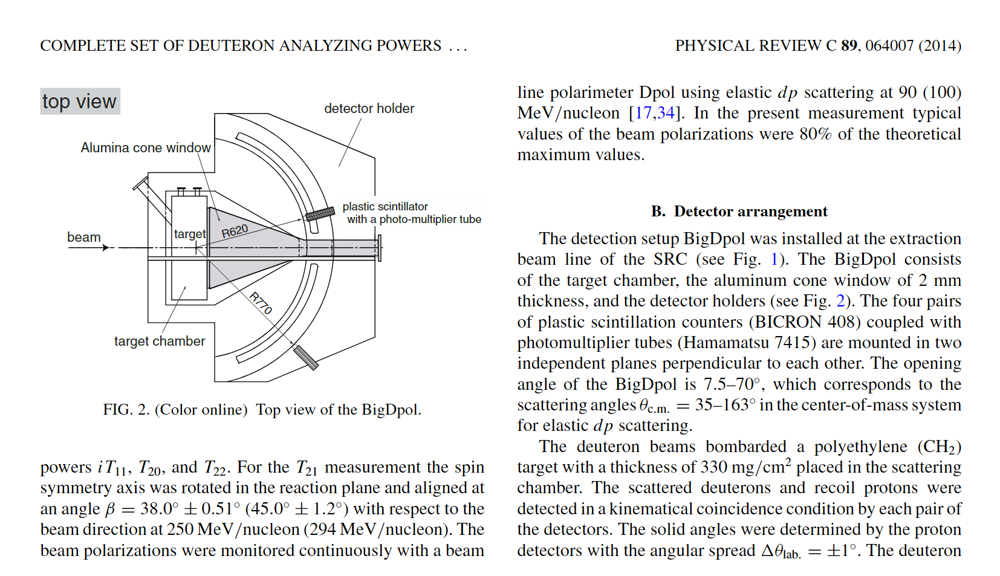

## dpol

### 探测器参数

- HOD1：9个水平分段塑料闪烁体，尺寸：1300 mm (宽) × 80 mm (高) × 10 mm (厚)
- HOD2：12个垂直分段塑料闪烁体，尺寸：900 mm (宽) × 100 mm (高) × 50 mm (厚)

### 光电探测器

- 主要型号：Hamamatsu H1161 PMT
    - 类型：绿光拓展型（green-extended type），H1161GS为变种型号，标准H1161 (R329) 也属此系列
    - 参考参数（CLAS EMC）：最小增益 1×10⁷

---

## bigdpol

### 探测器参数

闪烁体 BICRON 408

光电倍增管 (Hamamatsu 7415)

R: 氘核应该是620mm

R: 质子探测器应该是770mm

---

## KuJyaku

### 探测器参数

- 束流能量：100 MeV/n, 135 MeV/n
- Pl_p探测器：塑料闪烁体（BC-408），尺寸 70×70×25 mm³，距离靶1000 mm
- Pl_d探测器：塑料闪烁体（BC-408），尺寸 250×70×10 mm³，距离靶950 mm

| 探测器         | 闪烁体尺寸 (mm³)         | PMT型号           | 距靶距离 (mm) |
|----------------|-------------------------|-------------------|---------------|
| Pl_p           | 70×70×25                | Hamamatsu H7195   | 1000          |
| Pl_d           | 250×70×10               | Hamamatsu H7195   | 950           |

- 束流计数率：10⁷–10⁹ cps
- 相关参考：[原文PDF（tohoku.repo.nii.ac.jp）](https://tohoku.repo.nii.ac.jp/record/2003966/files/250325-Saito-3575-1.pdf)

### 光电探测器

- Hamamatsu H7195 PMT

---

## JINR DSS

| 探测器类型           | 宽度 (mm) | 高度 (mm) | 厚度 (mm) | 实验室角度 (°)                                 |
|----------------------|-----------|-----------|-----------|-----------------------------------------------|
| 质子探测器           | 20        | 40/60     | 20        | 21.3, 26.1, 30.9, 35.8, 40.8, 45.0, 50.8, 55.9 |
| 氘核探测器           | 24        | 40        | 10        | 20.1, 22.7, 25.6                              |
| 氘核探测器           | 50        | 40        | 10        | 29.3                                          |
| 准自由p–p探测器      | 50        | 60        | 10        | 44                                            |

### 探测器参数

- 质子探测器：宽20 mm，高40/60 mm，厚20 mm，距靶630 mm，实验室角度覆盖2°（约质心系4°）
- 氘核探测器：宽24 mm或50 mm，高40 mm，厚10 mm
- 准弹性p–p探测器（束流强度监测）：宽50 mm，高60 mm，厚10 mm

- 相关参考：[arxiv:1005.0525（arxiv.org）](https://arxiv.org/pdf/1005.0525)

### 光电探测器

- 主要型号：Hamamatsu H7416MOD PMT
    - 多份文献指出塑料闪烁计数器与H7416MOD PMT耦合
    - [会议论文PDF（epj-conferences.org）](https://www.epj-conferences.org/articles/epjconf/pdf/2019/06/epjconf_ayss18_04005.pdf)
    - H7416MOD数据手册未直接公开，可参考同系列H7415（直径33mm，内置R6427 PMT，双碱光阴极，硼硅酸盐玻璃窗，光谱范围300-650nm，峰值波长420nm，上升时间1.7ns，在-1500V下增益5.0×10⁶）[产品页（hamamatsu.com）](https://www.hamamatsu.com/eu/en/product/optical-sensors/pmt/pmt-assembly/head-on-type/H7415.html)
- SiPM升级尝试：[Springer论文（springer.com）](https://link.springer.com/article/10.1134/S1547477123050710)

---

## 德国 Forschungszentrum Jülich

### EDDA极化计

EDDA探测器被用于COSY加速过程中束流极化的在线测量，最初设计用于pp弹性散射的激发函数和自旋相关系数，后也用于氘核极化测量。EDDA为全覆盖型hodoscope，适合加速器内部靶实验中监测极化度变化。

- [会议论文PDF（accelconf.web.cern.ch）](https://accelconf.web.cern.ch/p01/papers/rpph054.pdf)
- [KEK会议论文（epaper.kek.jp）](https://epaper.kek.jp/e00/PAPERS/MOP4B19.pdf)
- [BNL报告PDF（bnl.gov）](https://www.bnl.gov/edm/review/files/pdf/estephenson_cosy_writeup.pdf)

### 基于LYSO的量能器型极化计 (用于EDM搜索)

COSY开发的新型量能器型极化计(全沉积)，采用LYSO晶体和SiPM，专为EDM实验设计，要求高效率和长期稳定性。

- 特性: 光输出高 (NaI(Tl)的75%)，衰减时间快 (40 ns)，密度高 (7.1g/cm³)
- 排列: 52个LYSO模块，4个对称块（上、下、左、右）
- 尺寸: 主体30×30×100 mm³，前端小角度15×30 mm² 。 （也有人说是30×30×80 mm³）
- 前置薄塑料闪烁体用于dE/dx粒子鉴别，组合成ΔE-E望远镜结构
- 采用SiPM

- [ResearchGate论文（researchgate.net）](https://www.researchgate.net/publication/344894223_A_New_Beam_Polarimeter_at_COSY_to_Search_for_Electric_Dipole_Moments_of_Charged_Particles)
- [arxiv:2010.13536（arxiv.org）](https://arxiv.org/abs/2010.13536)

LYSO读出: 硅光电倍增管 (SiPMs) [1](https://www.researchgate.net/publication/347344491_A_new_beam_polarimeter_at_COSY_to_search_for_electric_dipole_moments_of_charged_particles) 。Müller等人的JINST论文 [1](https://www.researchgate.net/publication/347344491_A_new_beam_polarimeter_at_COSY_to_search_for_electric_dipole_moments_of_charged_particles) 中引用了文献和关于SiPM的内容 [doi101088](https://doi.org/10.1088/1748-0221/15/12/P12005)
. [文献](https://iopscience.iop.org/article/10.1088/1748-0221/15/12/P12005) 提及在某些LYSO晶体测试中使用了Hamamatsu R1548-07 PMT（双通道读出，矩形窗口），但主要的极化计描述[ 1](https://www.researchgate.net/publication/347344491_A_new_beam_polarimeter_at_COSY_to_search_for_electric_dipole_moments_of_charged_particles) 强调最终设计采用SiPM

---

## Jefferson Lab (JLab)

JLab多个实验大厅采用塑料闪烁体和PMT，广泛用于极化靶和束流实验。

### Møller极化计 Hall A

- 采用磁饱和铁箔靶，散射电子对由铅/闪烁光纤量能器探测，光纤捆绑后连接到PMT
- 主要用于电子束极化测量

- [arxiv:2207.02150（arxiv.org）](https://arxiv.org/pdf/2207.02150)

### BigHAND

- Hall A超核研究相关，但无氘核极化计具体细节
- [JLab PAC34报告（jlab.org）](https://www.jlab.org/exp_prog/PACpage/PAC34/talks/PAC34_hallc.pdf)

---

## SiPM/PMT常见参数范围

### SiPM 关键参数

- **探测光子产额范围 (Dynamic Range)：** 由微单元总数决定，单光子到数千光子，高密度像素可达数十万微单元。
- **增益 (Gain)：** 典型范围 10⁵ 到 10⁷，依赖于过电压和温度。
- **光子探测效率 (PDE)：** 峰值PDE 40%-60%（可见光），VUV波段约15%，受波长、过电压、温度等影响。
- **暗计数率 (DCR)：** 室温下几十kHz/mm²到几MHz/mm²，低温下显著降低。
- **时间分辨率 (Time Resolution)：** 单光子几十到几百皮秒，多光子更优。
- **工作电压 (Operating Voltage)：** 20V-100V，实际工作时在击穿电压之上加几伏过电压。
- **其他参数：**
    - 恢复时间：几十到几百纳秒
    - 串扰、后脉冲、尺寸和封装、辐射硬度等

总结：SiPM具有高增益（10⁵−10⁷）、宽动态范围、良好PDE，具体型号选择需结合实验需求。常用厂商有滨松、安森美等。

| 参数             | SiPM（硅光电倍增器）                 | PMT（光电倍增管）                                 |                                                                                                                     |
| -------------- | ---------------------------- | ------------------------------------------ | ------------------------------------------------------------------------------------------------------------------- |
| **光探测效率（PDE）** | 20%–50%，部分型号在420 nm波长下可达49%  | 约25%–35%，例如Hamamatsu R12860在400 nm波长下为30%  |                                                                                                                     |
| **增益**         | 约10⁶，工作电压通常在20–70 V          | 约10⁶–10⁷，工作电压通常在1000–2000 V                |                                                                                                                     |
| **时间分辨率**      | 100–300 ps，适用于时间飞行（TOF）测量    | 约2–3 ns，例如R12860的单光子过渡时间扩展为2.86 ns         |                                                                                                                     |
| **暗计数率**       | 10⁵–10⁶ Hz/mm²（20°C）           | 约10³–10⁴ Hz，通常低于SiPM                       |  
| **抗磁场能力**      | 优异，不受磁场影响                    | 对磁场敏感，需在屏蔽环境中使用                            |  
| **尺寸与集成度**     | 小巧，易于集成，适合大规模阵列              | 体积较大，适用于大面积探测                              |  
|                    |                                   |                                              |  
| **参考资料**        |                                   |                                              |  
| [ScienceDirect][1] | [Wikipedia][2]                    | [IOPscience][3] [arXiv][4] [PMC][5]          |  

[1]: https://www.sciencedirect.com/science/article/abs/pii/S0168900219313968 "ScienceDirect: Hyper-Kamiokande多PMT系统"
[2]: https://en.wikipedia.org/wiki/Silicon_photomultiplier "Wikipedia: Silicon photomultiplier"
[3]: https://iopscience.iop.org/article/10.1088/1361-6560/ab7b2d "IOPscience: SiPM基础与应用"
[4]: https://arxiv.org/abs/1504.03174 "arXiv: 高量子效率大面积PMT评估"
[5]: https://pmc.ncbi.nlm.nih.gov/articles/PMC3368805/ "PMC: SiPM参数与PET性能研究"

| 性能/工作特性         | PMT (典型范围/说明)                                                                 | SiPM (典型范围/说明)                                                                                  | 影响/权衡                                                                                      |
|----------------------|------------------------------------------------------------------------------------|------------------------------------------------------------------------------------------------------|-----------------------------------------------------------------------------------------------|
| 峰值探测效率         | QE ~30-43% (双碱)，更高可达~46% (UBA)                                              | PDE >60% (NUV优化)                                                                                   | SiPM峰值PDE可能更高，但PMT可提供大单体面积。                                                  |
| 单位有效面积         | 非常大 (可达20英寸直径)                                                             | 较小 (通常 1×1 至 6×6 mm²)，可阵列拼接                                                               | PMT适合大范围均匀覆盖；SiPM适合高密度、细分复眼式探测。                                       |
| 增益                 | 10⁵−10⁷                                                                             | 10⁵−10⁷                                                                                              | 两者均可实现单光子探测。                                                                      |
| 暗噪声 (DCR或暗电流) | 暗电流 nA 至 pA (冷却后更低)                                                        | DCR kHz/mm² 至 MHz/mm² (室温)，冷却后显著降低；有相关噪声（串扰、后脉冲）                             | PMT单位面积暗噪声通常更低。SiPM的DCR和相关噪声是主要考量。                                    |
| 时间分辨率 (TTS/SPTR)| TTS 数百ps (常规)，几十ps (MCP-PMT)                                                 | SPTR <100 ps                                                                                         | 高性能SiPM和MCP-PMT时间性能优异。                                                             |
| 动态范围             | 宽，受阳极电流线性度限制                                                            | 受像素总数限制                                                                                       | 定义不同；PMT处理高瞬时电流，SiPM精确计数中等光子数。                                         |
| 工作电压             | 高电压 (kV)                                                                         | 低电压 (几十V)                                                                                       | SiPM电源系统更简单、安全、低成本。                                                            |
| 尺寸/紧凑性          | 体积大，真空管结构                                                                  | 体积小，固态器件                                                                                     | SiPM易于集成到紧凑空间。                                                                      |
| 磁场免疫性           | 高度敏感，需屏蔽                                                                     | 基本不受影响                                                                                          | SiPM可在强磁场中工作，无需笨重屏蔽。                                                          |
| 辐射耐受性 (总体趋势)| 窗材变暗是主要问题，石英窗较好；总体上可能更耐极高总剂量                            | DCR显著增加是主要问题；PDE也受影响；正在积极研发提高耐辐照性                                         | 具体取决于辐射类型、剂量率和总剂量；SiPM的DCR增加是高辐射区应用的主要瓶颈，但冷却可缓解。    |
| 每通道/单位面积成本  | 通常较高，特别是大面积或特殊型号；高压电源和屏蔽增加系统成本                        | 芯片本身成本较低，但大面积覆盖需大量拼接；读出电子学相对简单                                         | SiPM在许多情况下可降低系统总成本，尤其是在需要大量通道或在磁场中工作时。                      |

入射光子动态范围： 动态范围决定器件在低光和强光下的线性响应能力。PMT 的动态范围通常由其允许的最大输出电流决定，比如典型10英寸PMT（Hamamatsu R7081-02）在1500V时线性峰值输出电流可达约70 mA
[user-web.icecube.wisc.edu](https://user-web.icecube.wisc.edu/~kitamura/NK/PMT/031112%20R7081-02%20data%20sheet.pdf#:~:text=Late%20Pulsing%2025nsec,mA%20Value%20Parameter)
，对应峰值可处理数十亿光电子。相比之下，SiPM 的线性范围由微胞数决定：一个3×3 mm SiPM（数千个微胞）在激光脉冲下能线性响应的光子数约为像素总数的几十分之一，
[arxiv.org](https://arxiv.org/html/2407.17794v1#:~:text=The%20dynamic%20range%20of%20SiPMs,understand%20the%20saturation%20threshold%20by)
报道当入射光子数接近像素总数的70%时即出现非线性
[aptechnologies.co.uk](https://www.aptechnologies.co.uk/support/silicon-photomultipliers/linearity#:~:text=For%20relatively%20long%20pulses%2C%20say,photons%20also%20has%20an%20effect)
。典型而言，SiPM 数千到上万个微胞对应的线性光子数级别约为10^3–10^4，而PMT线性范围相当于可持续高达~10^10–10^11个光电子（取决于脉冲宽度和增益）
[user-web.icecube.wisc.edu](https://user-web.icecube.wisc.edu/~kitamura/NK/PMT/031112%20R7081-02%20data%20sheet.pdf#:~:text=Late%20Pulsing%2025nsec,mA%20Value%20Parameter)
[arxiv.org](https://arxiv.org/html/2407.17794v1#:~:text=The%20dynamic%20range%20of%20SiPMs,understand%20the%20saturation%20threshold%20by)
。由于PMT的输出电流极大，它在强光下更容易出现饱和（空间电荷效应），因此实验中常通过降低高压或并联多级读出等手段扩展线性区域
[arxiv.org](https://arxiv.org/html/2407.17794v1#:~:text=The%20dynamic%20range%20of%20SiPMs,understand%20the%20saturation%20threshold%20by)
；SiPM饱和则因所有微胞均被触发，此时可通过使用更大面积/更多微胞的SiPM或校正其非线性响应曲线来缓解[mdpi](https://www.mdpi.com/1424-8220/24/5/1671#:~:text=The%20finite%20number%20of%20pixels,variation%20in%20the%20operating%20voltage).