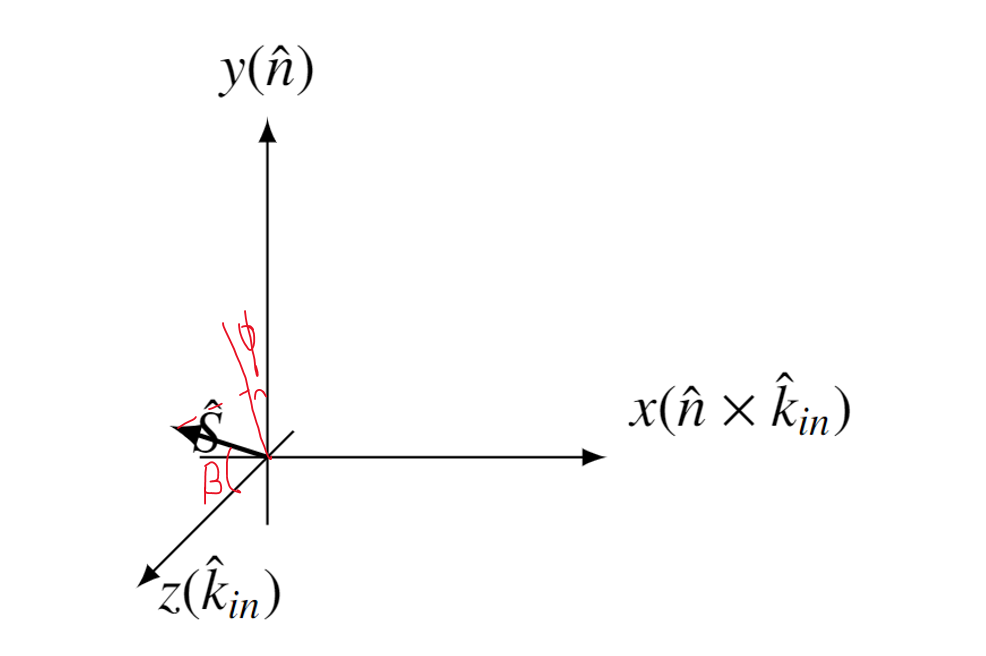

# To show some relation

## density matirx

$$
S_x = \frac{1}{\sqrt{2}} \begin{pmatrix} 0 & 1 & 0 \\ 1 & 0 & 1 \\ 0 & 1 & 0 \end{pmatrix}
$$

$$
S_y = \frac{1}{\sqrt{2}} \begin{pmatrix} 0 & -i & 0 \\ i & 0 & -i \\ 0 & i & 0 \end{pmatrix}
$$

$$
S_z = \begin{pmatrix} 1 & 0 & 0 \\ 0 & 0 & 0 \\ 0 & 0 & -1 \end{pmatrix}
$$

$$
\mathscr{P}_x = S_x =\begin{pmatrix} 0 & \frac{1}{\sqrt{2}} & 0 \\ \frac{1}{\sqrt{2}} & 0 & \frac{1}{\sqrt{2}} \\ 0 & \frac{1}{\sqrt{2}} & 0 \end{pmatrix}
$$

$$
\mathscr{P}_y = S_y =\begin{pmatrix} 0 & -\frac{i}{\sqrt{2}} & 0 \\ \frac{i}{\sqrt{2}} & 0 & -\frac{i}{\sqrt{2}} \\ 0 & \frac{i}{\sqrt{2}} & 0 \end{pmatrix}
$$

$$
\mathscr{P}_z = S_z =\begin{pmatrix} 1 & 0 & 0 \\ 0 & 0 & 0 \\ 0 & 0 & -1 \end{pmatrix}
$$

$$
\mathscr{P}_{xy} = 3 S_x \cdot S_y =\begin{pmatrix} \frac{3i}{2} & 0 & -\frac{3i}{2} \\ 0 & 0 & 0 \\ \frac{3i}{2} & 0 & -\frac{3i}{2} \end{pmatrix}
$$

$$
\mathscr{P}_{yx} = 3 S_y \cdot S_z= \begin{pmatrix} 0 & 0 & 0 \\ \frac{3i}{\sqrt{2}} & 0 & \frac{3i}{\sqrt{2}} \\ 0 & 0 & 0 \end{pmatrix}
$$

$$
\mathscr{P}_{xz} = 3 S_x \cdot S_z =\begin{pmatrix} 0 & 0 & 0 \\ \frac{3}{\sqrt{2}} & 0 & -\frac{3}{\sqrt{2}} \\ 0 & 0 & 0 \end{pmatrix}
$$

$$
\mathscr{P}_{xx} = 3 S_x \cdot S_x - 2 I= \begin{pmatrix} -\frac{1}{2} & 0 & \frac{3}{2} \\ 0 & 1 & 0 \\ \frac{3}{2} & 0 & -\frac{1}{2} \end{pmatrix}
$$

$$
\mathscr{P}_{yy} = 3 S_y \cdot S_y - 2 I =\begin{pmatrix} -\frac{1}{2} & 0 & -\frac{3}{2} \\ 0 & 1 & 0 \\ -\frac{3}{2} & 0 & -\frac{1}{2} \end{pmatrix}
$$

$$
\mathscr{P}_{zz} = 3 S_z \cdot S_z - 2 I= \begin{pmatrix} 1 & 0 & 0 \\ 0 & -2 & 0 \\ 0 & 0 & 1 \end{pmatrix}
$$

$$
\mathscr{P}_{xx} + \mathscr{P}_{yy} + \mathscr{P}_{zz} = \begin{pmatrix} 0 & 0 & 0 \\ 0 & 0 & 0 \\ 0 & 0 & 0 \end{pmatrix}
$$

## sperical operator and cartesian operator

不可约张量表示和直角基表示

不妨看看科大的PPT [这里](https://faculty.ustc.edu.cn/_tsf/00/03/jmiYVvRZVJve.ppt)

$$
\begin{aligned}
\tau_{00} & =I \quad(3 \times 3 \text { unit matrix }) \\
\tau_{1 \pm 1} & =\mp \frac{\sqrt{3}}{2}\left(\mathscr{P}_x \pm \mathrm{i} \mathscr{P}_y\right) \\
\tau_{10} & =\sqrt{\frac{3}{2}} \mathscr{P}_z \\
\tau_{2 \pm 2} & =\frac{1}{2 \sqrt{3}}\left(\mathscr{P}_{x x}-\mathscr{P}_{y y} \pm 2 \mathrm{i} \mathscr{P}_{x y}\right) \\
\tau_{2 \pm 1} & =\mp \frac{1}{\sqrt{3}}\left(\mathscr{P}_{x z} \pm \mathrm{i} \mathscr{P}_{y z}\right) \\
\tau_{20} & =\frac{1}{\sqrt{2}} \mathscr{P}_{z z}
\end{aligned}
$$

$$
\begin{aligned}
& \mathscr{P}_x=\frac{-1}{\sqrt{3}}\left(\tau_{11}-\tau_{1-1}\right) =-\frac{2}{\sqrt{3}} \operatorname{Im} \tau_{11} ,\\
 &\mathscr{P}_y=\frac{\mathrm{i}}{\sqrt{3}}\left(\tau_{11}+\tau_{1-1}\right) =-\frac{2}{\sqrt{3}} \operatorname{Re} \tau_{11} ,\\
& \mathscr{P}_z=\sqrt{\frac{2}{3}} \tau_{10} =\sqrt{\frac{2}{3}} \tau_{10} ,\\
 &\mathscr{P}_{x y}=\frac{-\mathrm{i} \sqrt{3}}{2}\left(\tau_{22}-\tau_{2-2}\right) =\sqrt{3} \operatorname{Im} \tau_{22} ,\\
& \mathscr{P}_{x z}=\frac{-\sqrt{3} }{2}\left(\tau_{21}-\tau_{2-1}\right) =-\sqrt{3 }  \operatorname{Re} \tau_{21} ,\\
 &\mathscr{P}_{y z}=\frac{\mathrm{i} \sqrt{ 3} }{2}\left(\tau_{21}+\tau_{2-1}\right) =-\sqrt{ 3}  \operatorname{Im} \tau_{21} ,\\
& \mathscr{P}_{x x}=\frac{\sqrt{3 } }{2}\left(\tau_{22}+\tau_{2-2}\right)-\frac{1}{\sqrt{2}} \tau_{20}=\sqrt{ 3} \operatorname{Re} \tau_{22}-\frac{1}{\sqrt{2}} \tau_{20} ,\\
& \mathscr{P}_{y y}=-\frac{\sqrt{ 3} }{2}\left(\tau_{22}+\tau_{2-2}\right)-\frac{1}{\sqrt{2}} \tau_{20}=-\sqrt{3} \operatorname{Re} \tau_{22}-\frac{1}{\sqrt{2}} \tau_{20} ,\\
& \mathscr{P}_{z z}=\sqrt{ 2}  \tau_{20} =\sqrt{2} \tau_{20} .
\end{aligned}
$$

$$
\begin{aligned}
& A_x=\frac{-1}{\sqrt{3}}\left(T_{11}-T_{1-1}\right) =-\frac{2}{\sqrt{3}} \operatorname{Im} T_{11} ,\\
 &A_y=\frac{\mathrm{i}}{\sqrt{3}}\left(T_{11}+T_{1-1}\right) =-\frac{2}{\sqrt{3}} \operatorname{Re} T_{11} ,\\
& A_z=\sqrt{\frac{2}{3}} T_{10} =\sqrt{\frac{2}{3}} T_{10} ,\\
 &A_{x y}=\frac{-\mathrm{i} \sqrt{3}}{2}\left(T_{22}-T_{2-2}\right) =\sqrt{3} \operatorname{Im} T_{22} ,\\
& A_{x z}=\frac{-\sqrt{3} }{2}\left(T_{21}-T_{2-1}\right) =-\sqrt{3 }  \operatorname{Re} T_{21} ,\\
 &A_{y z}=\frac{\mathrm{i} \sqrt{ 3} }{2}\left(T_{21}+T_{2-1}\right) =-\sqrt{ 3}  \operatorname{Im} T_{21} ,\\
& A_{x x}=\frac{\sqrt{3 } }{2}\left(T_{22}+T_{2-2}\right)-\frac{1}{\sqrt{2}} T_{20}=\sqrt{ 3} \operatorname{Re} T_{22}-\frac{1}{\sqrt{2}} T_{20} ,\\
& A_{y y}=-\frac{\sqrt{ 3} }{2}\left(T_{22}+T_{2-2}\right)-\frac{1}{\sqrt{2}} T_{20}=-\sqrt{3} \operatorname{Re} T_{22}-\frac{1}{\sqrt{2}} T_{20} ,\\
& A_{z z}=\sqrt{ 2}  T_{20} =\sqrt{2} T_{20} .
\end{aligned}
$$

$iT_{11} = \text{Re } iT_{11} = \frac{\text{Tr} M (\sqrt{3} \mathscr{P}_y / 2) M^\dagger}{\text{Tr} MM^\dagger} = \frac{\sqrt{3}}{2} A_y$

$T_{20} = \text{Re } T_{20} = \frac{\text{Tr} M (\mathscr{P}_{zz} / \sqrt{2}) M^\dagger}{\text{Tr} MM^\dagger} = \frac{1}{\sqrt{2}} A_{zz}$

$T_{21} = \text{Re } T_{21} = \frac{\text{Tr} M (-\mathscr{P}_{xz} / \sqrt{3}) M^\dagger}{\text{Tr} MM^\dagger} = -\frac{1}{\sqrt{3}} A_{xz}$

$T_{22} = \text{Re } T_{22} = \frac{\text{Tr} M ((\mathscr{P}_{xx} - \mathscr{P}_{yy}) / (2\sqrt{3})) M^\dagger}{\text{Tr} MM^\dagger} = \frac{1}{2\sqrt{3}} (A_{xx} - A_{yy})$

## projectail coordinate

coordinate transform.

极化理论中有许多坐标轴。

$\begin{pmatrix} P_x \\ P_y \\ P_z \end{pmatrix} = \begin{pmatrix} \cos \phi & -\sin \phi & 0 \\ \sin \phi & \cos \phi & 0 \\ 0 & 0 & 1 \end{pmatrix} \begin{pmatrix} P_{x'} \\ P_{y'} \\ P_{z'} \end{pmatrix}$ 

Polarization transfer and spin correlation experiments in nuclear physics 

which we write symbolically as

$\boldsymbol{p} = U\boldsymbol{p}'$. 

Because the analysing reaction is sensitive to $p_y$ only, the result of interest is

$P_y = P_{x'} \sin \phi + P_{y'} \cos \phi$.

The second-rank tensor, here denoted by $\boldsymbol{pp}$, transforms as

$\boldsymbol{pp} = U\boldsymbol{pp}'\tilde{U}$,

$P_{xx} = P_{x'x'} \cos^2 \phi - 2P_{x'y'} \sin \phi \cos \phi + P_{y'y'} \sin^2 \phi$

$P_{yy} = P_{x'x'} \sin^2 \phi + 2P_{x'y'} \sin \phi \cos \phi + P_{y'y'} \cos^2 \phi$

$P_{zz} = P_{z'z'}$

$P_{xy} = \frac{1}{2}(P_{x'x'} - P_{y'y'}) \sin 2\phi + P_{x'y'} \cos 2\phi$

$P_{xz} = P_{x'z'} \cos \phi - P_{y'z'} \sin \phi$

$P_{yz} = P_{x'z'} \sin \phi + P_{y'z'} \cos \phi$

## spin polarization axis

We can write the vector components of the beam polarization in the projectile helicity frame by resolving $\hat{S}$ into $x$, $y$ and $z$ components and multiplying by the

vector polarization magnitude, $p_z$:

$p_x = -p_z \sin \beta \sin \phi$
$p_y = p_z \sin \beta \cos \phi$
$p_z = p_z \cos \beta$. 

The polarization tensor in the X, Y, Z system is

$PP_{XYZ} = \begin{pmatrix} -\frac{1}{2} P_{zz} & 0 & 0 \\ 0 & -\frac{1}{2} P_{zz} & 0 \\ 0 & 0 & P_{zz} \end{pmatrix}$.

This may be rewritten as

$PP_{XYZ} = \frac{3}{2} P_{zz} \begin{pmatrix} 0 & 0 & 0 \\ 0 & 0 & 0 \\ 0 & 0 & 1 \end{pmatrix} - \frac{1}{2} P_{zz} \begin{pmatrix} 1 & 0 & 0 \\ 0 & 1 & 0 \\ 0 & 0 & 1 \end{pmatrix}$

so that

$PP_{xyz} = \frac{3}{2} P_{zz} U \begin{pmatrix} 0 & 0 & 0 \\ 0 & 0 & 0 \\ 0 & 0 & 1 \end{pmatrix} \tilde{U} - \frac{1}{2} P_{zz} \begin{pmatrix} 1 & 0 & 0 \\ 0 & 1 & 0 \\ 0 & 0 & 1 \end{pmatrix}$

where we have used the fact that $U\tilde{U} = I$.

Carrying out the indicated operations, we obtain

$P_{xx} = (\frac{3}{2} U_{xz} U_{xz} - \frac{1}{2}) P_{zz} = \frac{1}{2} (3 \sin^2 \beta \sin^2 \phi - 1) P_{zz}$

$P_{yy} = (\frac{3}{2} U_{yz} U_{yz} - \frac{1}{2}) P_{zz} = \frac{1}{2} (3 \sin^2 \beta \cos^2 \phi - 1) P_{zz}$

$P_{zz} = (\frac{3}{2} U_{zz} U_{zz} - \frac{1}{2}) P_{zz} = \frac{1}{2} (3 \cos^2 \beta - 1) P_{zz}$

$P_{xy} = U_{yx} U_{xz} P_{zz} = - \frac{3}{2} \sin^2 \beta \cos \phi \sin \phi P_{zz}$

$P_{yz} = U_{yz} U_{zz} P_{zz} = \sin \beta \cos \beta \cos \phi P_{zz}$

$P_{xz} = U_{xz} U_{zz} P_{zz} = - \sin \beta \cos \beta \sin \phi P_{zz}$

## cross section

$$
\begin{aligned}
I(\theta, \phi)=I_0(\theta)[1 & +\frac{3}{2}\left(p_{x^{\prime}} \sin \phi+p_{y^{\prime}} \cos \phi\right) A_y(\theta) \\
&+\frac{2}{3}\left(p_{x^{\prime} z^{\prime}} \cos \phi-p_{y^{\prime} z^{\prime}} \sin \phi\right) A_{x z}(\theta) \\
&+\frac{1}{6}\left\{\left(p_{x^{\prime} x^{\prime}}-p_{y^{\prime} y^{\prime}}\right) \cos 2 \phi-2 p_{x^{\prime} y^{\prime}} \sin 2 \phi\right\} \\
&\left\{A_{x x}(\theta)-A_{yy}(\theta)\right\} \\
& \left.+\frac{1}{2} p_{z^{\prime} z^{\prime}} A_{z z}(\theta)\right] .
\end{aligned}
$$

