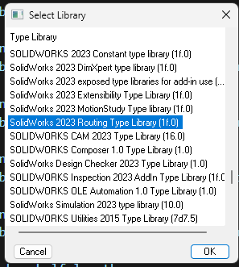
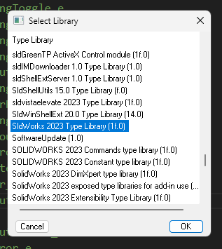

## 新手教程：如何运行控制 SolidWorks 的程序

### 前置条件

在开始之前，请确保您已经具备以下条件：
1. 安装了 SolidWorks 软件。
2. 安装了支持 VBA（Visual Basic for Applications）的环境，或者准备好使用其他编程语言（如 C# 或 Python）。
3. 基本的编程知识。

### 第一步：启用 SolidWorks API
SolidWorks 提供了强大的 API（应用程序接口），允许用户通过编程方式控制 SolidWorks。以下是启用 API 的步骤：
1. 打开 SolidWorks。
2. 确保在安装时选择了 API 支持模块。
3. 打开 SolidWorks 的帮助文档，查找 `API Help`，以便参考官方文档。

### 第二步：创建第一个 VBA 宏

1. 在 SolidWorks 中，点击菜单栏的 `工具 > 宏 > 新建`。
2. 保存宏文件（扩展名为 `.swp`）。
3. 在宏编辑器中输入以下代码：
    ```vba
    Dim swApp As Object
    Dim swModel As Object

    Sub main()
         Set swApp = Application.SldWorks
         Set swModel = swApp.ActiveDoc
         If swModel Is Nothing Then
              MsgBox "请先打开一个 SolidWorks 文件！"
         Else
              MsgBox "当前文件名: " & swModel.GetTitle
         End If
    End Sub
    ```
4. 保存并运行宏，观察弹出的消息框。

### 第三步：使用其他语言控制 SolidWorks

如果您更熟悉其他语言，可以通过 COM 接口控制 SolidWorks。例如，使用 Python：
1. 安装 `pywin32` 库：
    ```bash
    pip install pywin32
    ```
2. 编写以下代码：
    ```python
    import win32com.client

    def main():
         swApp = win32com.client.Dispatch("SldWorks.Application")
         swApp.Visible = True
         model = swApp.ActiveDoc
         if model is None:
              print("请先打开一个 SolidWorks 文件！")
         else:
              print(f"当前文件名: {model.GetTitle()}")

    if __name__ == "__main__":
         main()
    ```

如下代码所展示，这是一个绘制长方体的命令。


在 SolidWorks 的 API 中，所有尺寸参数都以「米（m）」为单位。

```python
import win32com.client
import os
import sys
import pythoncom
from win32com.client import pywintypes  # 添加此行

try:
    # 启动SolidWorks应用
    swApp = win32com.client.Dispatch("SldWorks.Application")
    swApp.Visible = True
    
    # 新建一个零件文档
    part = swApp.NewDocument(
        r"C:\Users\Public\Documents\SOLIDWORKS\SOLIDWORKS 2023\samples\tutorial\advdrawings\part.prtdot",
        0, 0.0, 0.0
    )
    
    if part is None:
        print("创建零件失败，请检查模板路径。")
        sys.exit(1)
    else:
        print("成功创建新零件！")
    
    # 获取激活文档
    model = swApp.ActiveDoc
    
    if model is None:
        print("未能获取激活的SolidWorks文档。请确保已成功创建零件。")
        sys.exit(1)
    
    # 选择前视基准面
    plane_name = "Front Plane"  # 英文版SolidWorks

    # 新建草图
    model.SketchManager.InsertSketch(True)
    print("已进入草图编辑模式。")
    
    # 绘制矩形
    model.SketchManager.CreateCenterRectangle(0, 0, 0, 0.05, 0.025, 0)
    print("已绘制矩形。")
    
    # 退出草图
    model.SketchManager.InsertSketch(True)
    print("已退出草图。")
    
    # 选择草图
    sketch_name = "Sketch1"  # 英文版SolidWorks
    # sketch_name = "草图1"   # 中文版SolidWorks
    
    # 拉伸草图
    featureMgr = model.FeatureManager
    feature = featureMgr.FeatureExtrusion2(
        True, False, False, 0, 0, 0.03, 0.0,
        False, False, False, False,
        0, 0, False, False, False, False,
        True, True, True, 0, 0, False
    )
    
    if feature is None:
        print("创建拉伸特征失败。")
    else:
        print("长方体已创建。")
except Exception as e:
    print(f"发生错误: {type(e).__name__} - {str(e)}")
```

待解决的问题，布尔值一直有些问题。发现了问题所在。 是由于python的数据类型和visual basic的并不一致。比如说visual basic的整数型数据0在python要用`arg1 = win32com.client.VARIANT(16387, 0)`来转化。


详见

[fancy argument](https://github.com/RoboMechMinds/SolidWorks-scripting-with-Python/blob/main/03%20Fancy%20arguments/03%20Fancy%20arguments.ipynb)

[note](https://github.com/RoboMechMinds/SolidWorks-scripting-with-Python/blob/main/04%20Start-Close%20SolidWorks%2C%20Create-Open-Save-Rebuild%20a%20document/04%20Start-Close%20SolidWorks%2C%20Create-Open-Save-Rebuild%20a%20document.ipynb) 

[youtube](https://www.youtube.com/watch?v=HQVsASdG0jo&ab_channel=RoboMechMinds)

对于我来说，运行`C:\Users\tbt\anaconda3\Lib\site-packages\win32com\client\makepy.py`处的代码

找到，就会出现如下代码，便能在6DD4B124-4733-4DFF-97A8-52F70924D514x0x31x0.py文件里找到。 该makepy生成了要用到的宏文件的定义

```
PS C:\workspace\D_Polarization\sw-api>  python -u "c:\Users\tbt\anaconda3\pkgs\pywin32-305-py310h2bbff1b_0\Lib\site-packages\win32com\client\makepy.py"
Generating to C:\Users\tbt\Nutstore\1\physics\nuclear\D_nuclear_experiment\.conda\lib\site-packages\win32com\gen_py\6DD4B124-4733-4DFF-97A8-52F70924D514x0x31x0.py
Building definitions from type library...
Generating...
Importing module
```

```
boolstatus_sketch = model.Extension.SelectByID2()
```

