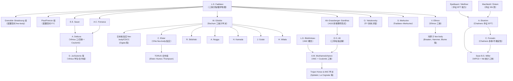

# faddeev 学术谱系图

```mermaid
graph TD
    %% 顶层：数学源头
    Faddeev["L.D. Faddeev<br/>（三体方程/数学物理）"]
    Efimov["V. Efimov<br/>（Efimov 三体）"]
    Merkuriev["S. Merkuriev<br/>（Faddeev–Merkuriev）"]
    Yakubovsky["O. Yakubovsky<br/>（FY 多体方程）"]

    Faddeev --> Efimov
    Faddeev --> Merkuriev
    Faddeev --> Yakubovsky

    %% AGS 线
    AGS["Alt–Grassberger–Sandhas<br/>（AGS 转移算符形式）"]
    Alt["E.O. Alt<br/>（三带电渐近解）"]

    Faddeev --> AGS
    AGS --> Alt

    %% Bochum 三核子线
    Gloeckle["W. Glöckle<br/>（Bochum 三核子学派）"]
    Witala["H. Witała"]
    Golak["J. Golak"]
    Kamada["H. Kamada"]
    Nogga["A. Nogga"]
    Skibinski["R. Skibiński"]

    Faddeev --> Gloeckle
    Gloeckle --> Witala
    Gloeckle --> Golak
    Gloeckle --> Kamada
    Gloeckle --> Nogga
    Gloeckle --> Skibinski

    %% Elster / TORUS 线
    Elster["C. Elster<br/>（Ohio few-body/反应）"]
    TORUS["TORUS 合作组<br/>(Elster–Nunes–Thompson)"]

    Gloeckle --> Elster
    Elster --> TORUS

    %% Fonseca–Sauer–Deltuva 线
    Fonseca["A.C. Fonseca"]
    Sauer["E.E. Sauer"]
    Deltuva["A. Deltuva<br/>（Vilnius 三/四体 + Coulomb）"]
    Jurciukonis["D. Jurčiukonis 等<br/>（Vilnius 学生/合作者）"]

    Faddeev --> Fonseca
    Faddeev --> Sauer
    Fonseca --> Deltuva
    Sauer --> Deltuva
    Deltuva --> Jurciukonis

    %% Blokhintsev–Mukhamedzhanov 线（ANC/Trojan Horse）
    Blokhintsev["L.D. Blokhintsev<br/>（ANC 概念）"]
    Mukha["A.M. Mukhamedzhanov<br/>（ANC + Coulomb 三体）"]
    THM["Trojan Horse & ANC 学派<br/>(Spitaleri, La Cognata 等)"]

    Blokhintsev --> Mukha
    Alt --> Mukha
    Mukha --> THM

    %% 手征 EFT → Chalmers → Miller
    Machleidt["Machleidt / Entem<br/>（手征 NN 势）"]
    Epelbaum["Epelbaum / Meißner<br/>（手征 EFT 核力）"]
    Ekstrom["A. Ekström<br/>（Chalmers 手征 EFT）"]
    Forssen["C. Forssén<br/>（Chalmers 多体/不确定性）"]
    Miller["Sean B.S. Miller<br/>（WPCD + Nd 统计三体）"]

    Machleidt --> Ekstrom
    Epelbaum --> Ekstrom
    Ekstrom --> Forssen
    Ekstrom --> Miller
    Forssen --> Miller

    %% 其他坐标空间 / 冷原子 / 日本支线（简略放在旁边）
    Pisa["Pisa/Firenze 组<br/>（配置空间 FY）"]
    Grenoble["Grenoble–Strasbourg 组<br/>（配置空间 few-body）"]
    Japan["日本核反应 few-body/CDCC<br/>(Ogata 等)"]
    Cold["冷原子 few-body<br/>(Braaten, Hammer, Blume 等)"]

    Faddeev --> Pisa
    Faddeev --> Grenoble
    Gloeckle --> Japan
    Efimov --> Cold
```