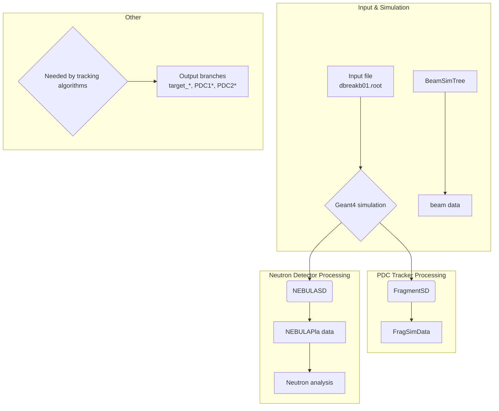

# PDC Drift Chamber Simulation Plan

## References and Tutorials

### Drift Chamber Principles
- [Drift Chamber tutorial (Chinese)](https://yznkxjs.xml-journal.net/cn/article/pdf/preview/10.7538/yzk.1981.15.01.0116.pdf)
- [Drift Chamber Tutorial (ICFA 2005)](https://indico.cern.ch/event/426015/contributions/1047606/attachments/906077/1278746/DriftChamber_ICFA2005.pdf)
- [Drift Chamber Principles (IOP)](https://iopscience.iop.org/article/10.1088/1742-6596/18/1/010/pdf)

### Geant4 Simulation
- [Geant4 Simulation Tutorial (Munich 2018)](https://indico.cern.ch/event/709670/contributions/3027829/attachments/1670306/2679293/Munich.pdf)

### PDC Detector Technical Documents
- [PDC detailed parameters and design](https://www.nishina.riken.jp/ribf/SAMURAI/image/Detector-PDC.pdf)
- [PDC CAD screenshots](https://indico2.riken.jp/event/2752/contributions/11231/attachments/7528/8801/04_EMIS2012_KobayashiT.pdf)

## PDC Specifications

### Design and Purpose

The PDC detector (Proton Drift Chamber) measures momenta of protons near projectile rapidity and is placed downstream of the SAMURAI magnet. To reduce the number of readout planes, PDC uses cathode readout for position information while the anode planes use Walenta-type drift chamber wires. An 8 mm drift distance reduces the number of anode wires. To handle multi-particle events, the cathode strips are arranged in three orientations: 0°, +45°, and -45°.

Note: PDC uses cathode readout. When ionization electrons drift toward the anode wires and cause avalanches, induced charges appear on nearby cathode strips. Reading these induced charges provides particle positions.

### Main Parameters

- Effective area: 1700 mm × 800 mm
- Anode wires: gold-tungsten/ rhenium alloy, 30 μm diameter, 16 mm spacing, 8 mm drift length
- Cathode wires: gold-aluminum alloy, 80 μm diameter, 3 mm spacing
- Anode-cathode gap: 8 mm
- Cathode strip width: 12 mm (every 4 cathode wires are grouped into one strip)
- HV scheme: positive high voltage on anode wires, slightly negative potential on field wires
- Layer configuration: Cathode (U) - Anode (V) - Cathode (X) - Anode (U) - Cathode (V)
- Operating gas: Ar + 25% i-C4H10 or Ar + 50% C2H6


*PDC structure diagram*


*PDC chamber structure. The X, U, V layers use wires (or strips) at different orientations to determine 2D hit positions. For example, X-layer wires are typically perpendicular to the X-axis to measure the X coordinate precisely.*

Anode wire (readout wire) illustration:


Code: https://github.com/tianbaiting/Dpol_smsimulator/blob/main/sim_deuteron/forunderstanding/plot_pdc_wires.py

### Readout Scheme and Development

- Initial scheme (tested): To reduce readout channels, a charge-division readout was tested where cathode strips were chained through resistors and every 8 strips were read out by one charge-sensitive preamplifier. A prototype chamber (600 mm × 480 mm) achieved ~1 mm (rms) position resolution with X-rays but could not correctly handle two-proton events.
- New scheme (in development): To address multi-particle events and improve resolution, a new readout circuit is being developed. Each cathode signal connects directly to a preamplifier, shaper, and sample-and-hold circuit, digitized on a front-end board (FEB). Position resolution is expected to improve by about 5×, requiring ~810 readout channels.

---

## Simulation Plan Overview

You need to build the PDC detector geometry yourself. Geant4 can simulate ionization processes in gas accurately. Our simplified approach:

1. Use Geant4 to simulate particles traversing the drift-chamber gas.
2. In a Geant4 user action (SteppingAction), record all ionization hits (energy deposits) with positions.
3. For each wire, build a Sensitive Detector region; use the nearest-wire distance as a proxy for drift time and the total deposited energy as amplitude.
4. This method simplifies "firing" to "ionization occurred nearby," ignoring electron drift time, diffusion, and avalanche gain.

## Limitations

- Ignores electron drift: Real ionization electrons drift along field lines and may avalanche in high-field regions. This method cannot simulate that process.
- Cannot model signal shapes and timing: Without drift times, precise timing and waveform information are not available.
- Cannot model gain: Geant4 does not simulate avalanches, so signal gain per “hit” is not available.

---

## Physical Model Summary

- Build PDC geometry and gas materials in Geant4.
- Particles (e.g., protons) ionize the gas and energy depositions are recorded.
- In SteppingAction, check if an ionization step is near an anode wire; use the nearest distance as drift time and deposited energy as signal amplitude.
- Ignore electron drift, avalanche gain, and signal shaping — simulate only spatial distribution and energy response.

## Geometry and Materials Construction

- Define the gas mixture, e.g., 75% Ar + 25% i-C4H10 at 1 atm.
- Build the chamber box using G4Box or G4Trap to represent the gas volume.
- Construct the wire array using G4Cylinder or G4Tubs for anode wires and place them at actual positions.

## Sensitive Detector Setup

- Set the gas volume as a Sensitive Detector (SD) and record energy deposition and position for each step in the SD.

## SteppingAction Implementation

- In UserSteppingAction, check whether the step is in the gas volume and handle recording accordingly.

## Data Output

- For each event, output all “fired” signals (store in a TTree/TClonesArray), including energy, position, nearest-wire index, drift distance, etc.

## Specific Code Implementation

Data flow diagram:


```mermaid
graph TD
    subgraph "Input & Simulation"
        A[Input file<br/>dbreakb01.root] --> B{Geant4 simulation};
        C[BeamSimTree] --> D[beam data];
    end

    subgraph "PDC Tracker Processing"
        E(FragmentSD) --> F[FragSimData];
    end

    subgraph "Neutron Detector Processing"
        I(NEBULASD) --> J[NEBULAPla data];
        J --> K[Neutron analysis];
    end

    subgraph "Other"
            G{Needed by tracking algorithms} --> H[Output branches<br/>target_*, PDC1*, PDC2*];
    end
    B --> E & I;
```

/home/tbt/workspace/dpol/smsimulator5.5/sim_deuteron/src/DeutDetectorConstruction.cc
```cpp
// Lines 232-234: place PDC1 in the world
G4ThreeVector pdc1_pos_lab{fPDC1Pos}; 
pdc1_pos_lab.rotateY(pdc_angle);  // coordinate transform
G4Transform3D pdc1_trans{pdc1_rm, pdc1_pos_lab};
new G4PVPlacement{pdc1_trans, pdc_log, "PDC1", expHall_log, false, 0};

// Lines 236-240: save to simulation parameters
frag_prm->fPDC1Position.SetXYZ(
    fPDC1Pos.x()/mm, 
    fPDC1Pos.y()/mm, 
    fPDC1Pos.z()/mm
);
```
Translate first, then rotate

PDC has 3 independent sensitive layers:

U layer: /PDC_U - tilted wire direction  
X layer: /PDC_X - vertical wire direction  
V layer: /PDC_V - tilted wire direction

// In DeutDetectorConstruction.cc setup
fPDCSD_U = new FragmentSD("/PDC_U");  // U-layer sensitive detector
fPDCSD_X = new FragmentSD("/PDC_X");  // X-layer sensitive detector  
fPDCSD_V = new FragmentSD("/PDC_V");  // V-layer sensitive detector

// Bind to corresponding logical volumes
fPDCConstruction->fLayerU->SetSensitiveDetector(fPDCSD_U);
fPDCConstruction->fLayerX->SetSensitiveDetector(fPDCSD_X);
fPDCConstruction->fLayerV->SetSensitiveDetector(fPDCSD_V);

FragmentSD working principle
Core method is ProcessHits():

```cpp
G4bool FragmentSD::ProcessHits(G4Step* aStep, G4TouchableHistory*)
{
    // 1. Get the data manager
    SimDataManager *sman = SimDataManager::GetSimDataManager();
    TClonesArray *SimDataArray = sman->FindSimDataArray("FragSimData");
    
    // 2. Extract step information
    G4StepPoint* preStepPoint = aStep->GetPreStepPoint();
    G4StepPoint* postStepPoint = aStep->GetPostStepPoint();
    
    // 3. Selection: only record primary particle and charged particles
    if(parentid == 0 && aStep->GetTrack()->GetDefinition()->GetPDGCharge() != 0.)
    {
        // 4. Create a TSimData object and fill fields
        TSimData* data = new TSimData();
        data->fTrackID = trackid;
        data->fDetectorName = detectorName;  // "U", "X", "V"
        data->fPrePosition = prePosition;
        data->fPostPosition = postPosition;
        data->fPreMomentum = preMomentum;
        // ... more physical quantities
    }
}
```

---

## Concrete PDC configuration in smsimulator5.5

All numbers below cite `libs/smg4lib/src/construction/` of `smsimulator5.5/`.

### Gas

- Mixture: **75% Ar + 25% i-C4H10** at 1 atm, built from `G4_Ar` + `G4_BUTANE` with molar volume 24.055 L/mol (`PDCConstruction.cc:32-42`). Material name `mat_PDC`.
- The anaroot docs also mention `Ar + 50% C2H6` as an alternative, but the Geant4 model defaults to Ar/iC4H10.

### Geometry of a single chamber

- Gas enclosure `PDCenc`: G4Box with half-extents `(1700/2, 800/2, 190/2) mm` → **1700 × 800 × 190 mm** (`PDCConstruction.cc:98-102`).
- U layer: G4Box `(840, 390, 4) mm` at local `(0, 0, -12) mm`, physvol `PDCSD_U` (`PDCConstruction.cc:105-108`).
- X layer: G4Box `(840, 390, 8) mm` at local `(0, 0, 0) mm`, physvol `PDCSD_X` (`PDCConstruction.cc:111-114`).
- V layer: G4Box `(840, 390, 8) mm` at local `(0, 0, +12) mm`, physvol `PDCSD_V` (`PDCConstruction.cc:117-120`).
- Layer order along local +z is **U → X → V**. All three are bulk gas — individual wires are not modelled in Geant4 geometry.

### Lab placement (PDC1 + PDC2)

Default (single-chamber) values (`PDCConstruction.cc:25-26`): `fPosition = (400, 0, 4100) mm`, `fAngle = 57°` (PDC1 at B = 1.3 T). The chamber is first rotated by `-fAngle` about Y, then placed via `G4PVPlacement` (`PDCConstruction.cc:78-81`).

For the dual-chamber configuration the positions come from macro commands (`DeutDetectorConstructionMessenger.cc:75-94`):

```bash
# configs/simulation/macros/export_ips_geometry_example.mac (lines 19-21)
/samurai/geometry/PDC/Angle 69 deg
/samurai/geometry/PDC/Position1 70 0 400 cm
/samurai/geometry/PDC/Position2 70 0 500 cm
```

GDML dump shows PDC1 at lab `(-3483.46, 0, 2086.98) mm`, PDC2 at `(-4417.04, 0, 2445.35) mm` after a 69° Y-rotation (`detector_geometry.gdml:870-876`).

### Sensitive-detector data flow

Three `FragmentSD` instances (`/PDC_U`, `/PDC_X`, `/PDC_V`) are bound to the U/X/V logical volumes (`DeutDetectorConstruction.cc:311-323`). `FragmentSD::ProcessHits` records only steps with `parentid == 0 && PDGCharge != 0` (primary charged particles) and pushes a `TSimData` into `TClonesArray "FragSimData"` (allocated by `FragSimDataInitializer.cc:17-31`).

Per-step fields stored:

| Field | Meaning | Unit |
|---|---|---|
| `fParentID, fTrackID, fStepNo` | Geant4 track IDs | int |
| `fZ, fA, fPDGCode, fParticleName` | Particle ID | — |
| `fDetectorName` | `GetVolume(1)` name → "U"/"X"/"V" | string |
| `fID` | `GetVolume(1)` copy number (distinguishes PDC1 vs PDC2) | int |
| `fModuleName` | innermost volume name | string |
| `fCharge, fMass` | — | e, MeV |
| `fPreMomentum, fPostMomentum` | TLorentzVector | MeV |
| `fPrePosition, fPostPosition` | 3-vector | mm |
| `fPreTime, fPostTime` | — | ns |
| `fEnergyDeposit` | step energy deposit | MeV |
| `fFlightLength` | distance to material entrance | mm |
| `fIsAccepted = kTRUE` | flag | bool |

> **Geant4 geometry ≠ real wire array.** The U/X/V volumes are bulk gas. Wires only appear at the analysis stage (`analysis_pdc_reco`) and inside the anaroot `SAMURAIPDC.xml` database. The simulator's `FragSimData` gives a 3D hit point; downstream code discretises it onto the real wire geometry to produce mock hits.

---

## Real PDC wire array (from anaroot SAMURAIPDC.xml)

The anaroot database describes the true PDC1+PDC2 wire layout (see [anaroot PDC reco doc](../anaroot/anaroot_pdc.md)):

| Layer | anodedir | id_plane | wirez (mm) | Notes |
|---|---|---|---|---|
| 0 | U | 81 | 40 | PDC1 plane 1 |
| 1 | X | 82 | 24 | PDC1 plane 2 |
| 2 | V | 83 | 8 | PDC1 plane 3 |
| 3 | U | 84 | -576 | PDC2 plane 1 |
| 4 | X | 85 | -592 | PDC2 plane 2 |
| 5 | V | 86 | -608 | PDC2 plane 3 |

- **136 wires per plane, pitch 12 mm**, `wirepos ∈ [-822, +822] mm`. V-layer wireid is reversed.
- All planes are on focal plane **F13**, `det = 37`. Total ≈ 816 wires (`SAMURAIPDC_fit.csv`).
- **PDC1 vs PDC2 are separated by ≈ 616 mm in z** (PDC1 mean z ≈ 24 mm, PDC2 mean z ≈ -592 mm).

CSV header:

```
ID, NAME, FPL, layer, id_plane, anodedir, wireid, wirepos, wirez, tzero_offset, det, geo, ch
```

> The simulator and anaroot must share a single wire geometry, otherwise the hit→track stage develops a systematic offset.

---

## End-to-end workflow

```bash
# 1. Build
cd /home/tian/workspace/dpol/smsimulator5.5
./build.sh

# 2. Run the dual-chamber simulation
bin/sim_deuteron configs/simulation/macros/export_ips_geometry_example.mac

# 3. PDC track + target-momentum reconstruction
bin/reconstruct_target_momentum --config configs/reconstruction/default.yaml
```

Visualise the PDC wire array:

```bash
python scripts/visualization/plot_pdc_wires.py
```

---

## References (local PDFs in `../refs/`)

- `Detector-PDC.pdf` — RIKEN SAMURAI official PDC datasheet
- `NEBULA_workshop_Kondo.pdf` — Kondo NEBULA workshop (full SAMURAI spectrometer layout)
