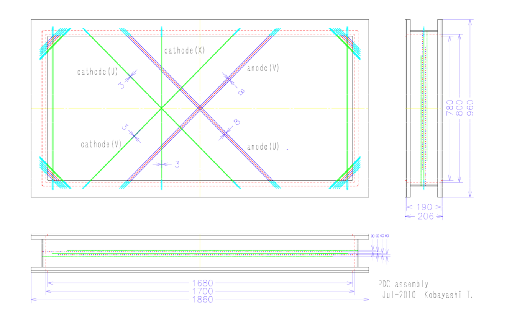
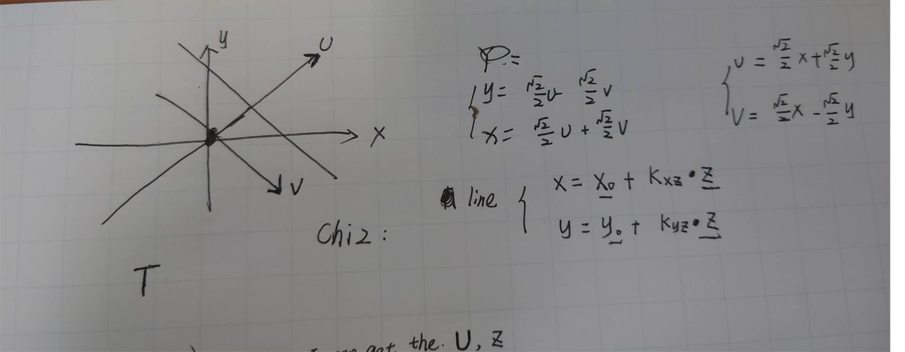
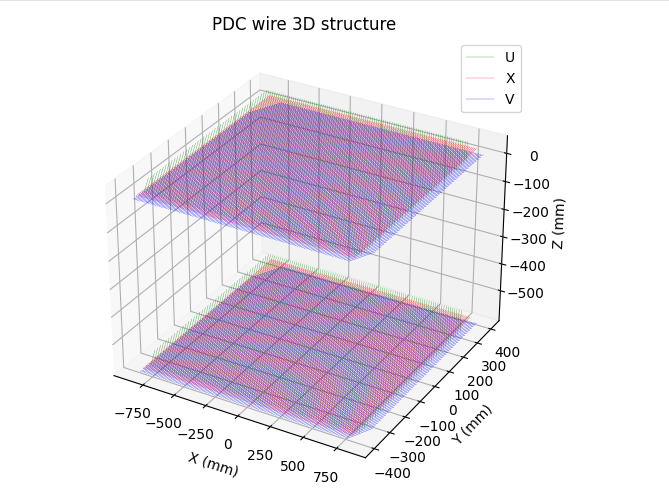
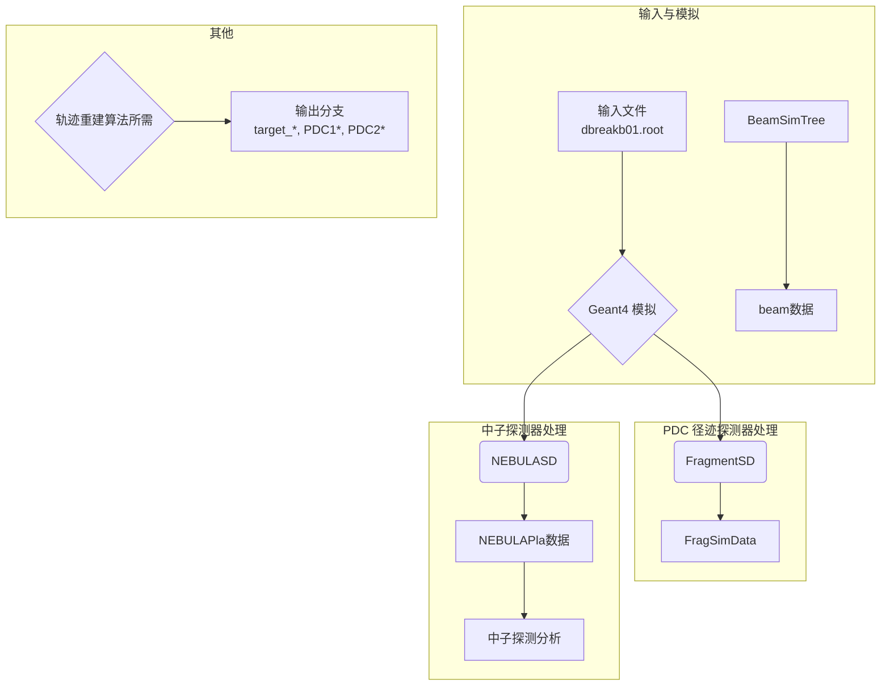

# PDC 漂移室模拟方案

## 参考资料与教学

### 漂移室原理
- [漂移室教学材料 (中文)](https://yznkxjs.xml-journal.net/cn/article/pdf/preview/10.7538/yzk.1981.15.01.0116.pdf)
- [Drift Chamber Tutorial (ICFA 2005)](https://indico.cern.ch/event/426015/contributions/1047606/attachments/906077/1278746/DriftChamber_ICFA2005.pdf)
- [Drift Chamber Principles (IOP)](https://iopscience.iop.org/article/10.1088/1742-6596/18/1/010/pdf)

### Geant4 模拟
- [Geant4 Simulation Tutorial (Munich 2018)](https://indico.cern.ch/event/709670/contributions/3027829/attachments/1670306/2679293/Munich.pdf)

### PDC 探测器技术文档
- [PDC 详细参数与设计说明](https://www.nishina.riken.jp/ribf/SAMURAI/image/Detector-PDC.pdf)
- [PDC CAD 截图](https://indico2.riken.jp/event/2752/contributions/11231/attachments/7528/8801/04_EMIS2012_KobayashiT.pdf)

## PDC 指标

### 设计与用途

PDC探测器（质子漂移室）用于测量与束流速度相近（projectile-rapidity）的质子的动量，放置在SAMURAI磁铁下游。为减少探测器平面数量，PDC采用阴极读出法获取位置信息，阳极平面使用Walenta型漂移室，8毫米漂移长度设计减少阳极线数量。为探测多粒子事件，阴极线采用三种方向：0度、+45度和-45度。

> 注：PDC采用阴极读出（cathode readout）。当电离产生的电子向阳极丝漂移并引发雪崩时，会在附近的阴极条上产生感应电荷，通过读取这些感应电荷来确定粒子的位置。

### 主要参数

- 有效面积：1700mm × 800mm
- 阳极线：金-钨/铼合金，30μm直径，间距16mm，漂移长度8mm
- 阴极线：金-铝合金，80μm直径，间距3mm
- 阳极-阴极间隙：8mm
- 阴极条宽度：12mm（每4根阴极线合并成一个条）
- 供电：阳极线施加正高压，势线施加轻微负高压
- 配置：阴极(U)-阳极(V)-阴极(X)-阳极(U)-阴极(V)
- 运行气体：Ar+25% i-C4H10 或 Ar+50% C2H6


*PDC结构示意图*


*PDC丝室结构。X, U, V 层通过不同方向的丝（或条）来确定粒子穿过的二维位置。例如，X 层的丝通常垂直于X轴，用于精确测量X坐标。*


阳极丝线（读出丝）示意图：


代码在https://github.com/tianbaiting/Dpol_smsimulator/blob/main/sim_deuteron/forunderstanding/plot_pdc_wires.py

### 读出方案与发展

- 初始方案（已测试）：为减少读出通道，曾测试电荷分割读出法，将阴极条通过电阻串联，每8个条通过一个电荷灵敏前置放大器读出。原型探测器（600mm × 480mm）对X射线取得1mm（rms）位置分辨率，但无法正确处理两个质子事件。
- 新方案（开发中）：为解决多粒子问题并提高分辨率，开发新读出电路。每个阴极信号直接连接到前置放大器、整形器和采样保持电路，在前端板（FEB）数字化。预计位置分辨率提升约5倍，需约810个读出通道。

---

## 模拟方案概述

需要自行构建 PDC 探测器。Geant4 能够精确模拟粒子与气体分子的电离过程。我们的替代方案如下：

1.  用 Geant4 模拟粒子穿过漂移室气体。
2.  在 Geant4 的用户动作类（SteppingAction）中，记录所有电离事件（能量沉积）的位置。
3.  在每根丝附近构建 Sensitive Detector，将最近漂移距离作为时间，总沉积能量作为幅度。
4.  该方法将“点火”简化为“附近发生了电离”，忽略了电子漂移时间、扩散和雪崩增益等复杂过程。

## 方法局限

- 忽略电子漂移：实际电离产生的电子会沿电场线漂移，而不是简单地朝最近的丝线移动。在高电场区，电子会产生雪崩，这是“点火”过程。此方法无法模拟这一点。
- 无法模拟信号形状和时间：未考虑漂移时间，无法得到信号的精确时间信息和波形。
- 无法模拟增益：Geant4 本身不模拟雪崩过程，无法得到每个“点火”事件的信号增益。

---

## 物理模型简述

- 用 Geant4 构建 PDC 漂移室几何和气体材料。
- 粒子（如质子）穿过气体时产生电离，能量沉积被记录。
- 在 SteppingAction 中，判断电离事件是否靠近某根丝（anode wire），将最近距离作为漂移时间，能量沉积作为信号幅度。
- 忽略电子漂移过程、雪崩增益和信号波形，仅模拟空间分布和能量响应。

## 几何与材料构建

- 定义气体混合物：如 75% Ar + 25% i-C4H10，1 atm。
- 构建漂移室盒体：用 G4Box 或 G4Trap 表示气体体积。
- 构建丝阵列：用 G4Cylinder 或 G4Tubs 表示阳极丝，按实际位置排布。

## 敏感体设置

- 将气体体积设置为 Sensitive Detector（SD），在 SD 中记录每一步的能量沉积和位置。

## SteppingAction 实现

- 在 UserSteppingAction 中，判断每一步是否发生在气体体积内。


## 数据输出

- 每个事件输出所有“点火”信号（可用 TTree/TClonesArray），包括能量、位置、最近丝编号、漂移距离等。

## 具体code实现


数据流向说明

根据模拟流程，数据的主要流向如下：




/home/tbt/workspace/dpol/smsimulator5.5/sim_deuteron/src/DeutDetectorConstruction.cc
```
// 第232-234行：PDC1物理放置
G4ThreeVector pdc1_pos_lab{fPDC1Pos}; 
pdc1_pos_lab.rotateY(pdc_angle);  // 坐标变换
G4Transform3D pdc1_trans{pdc1_rm, pdc1_pos_lab};
new G4PVPlacement{pdc1_trans, pdc_log, "PDC1", expHall_log, false, 0};

// 第236-240行：保存到模拟参数
frag_prm->fPDC1Position.SetXYZ(
    fPDC1Pos.x()/mm, 
    fPDC1Pos.y()/mm, 
    fPDC1Pos.z()/mm
);
```
先移动，然后再旋转


PDC有3个独立的敏感层：

U层： /PDC_U - 倾斜丝线方向
X层： /PDC_X - 垂直丝线方向
V层： /PDC_V - 倾斜丝线方向

// 在DeutDetectorConstruction.cc中的设置
fPDCSD_U = new FragmentSD("/PDC_U");  // U层敏感探测器
fPDCSD_X = new FragmentSD("/PDC_X");  // X层敏感探测器  
fPDCSD_V = new FragmentSD("/PDC_V");  // V层敏感探测器

// 绑定到对应的逻辑体积
fPDCConstruction->fLayerU->SetSensitiveDetector(fPDCSD_U);
fPDCConstruction->fLayerX->SetSensitiveDetector(fPDCSD_X);
fPDCConstruction->fLayerV->SetSensitiveDetector(fPDCSD_V);

FragmentSD工作原理
核心方法是 ProcessHits()：

```
G4bool FragmentSD::ProcessHits(G4Step* aStep, G4TouchableHistory*)
{
    // 1. 获取数据管理器
    SimDataManager *sman = SimDataManager::GetSimDataManager();
    TClonesArray *SimDataArray = sman->FindSimDataArray("FragSimData");
    
    // 2. 提取步进信息
    G4StepPoint* preStepPoint = aStep->GetPreStepPoint();
    G4StepPoint* postStepPoint = aStep->GetPostStepPoint();
    
    // 3. 筛选条件：只记录主粒子且带电粒子
    if(parentid == 0 && aStep->GetTrack()->GetDefinition()->GetPDGCharge() != 0.)
    {
        // 4. 创建TSimData对象并填入数据
        TSimData* data = new TSimData();
        data->fTrackID = trackid;
        data->fDetectorName = detectorName;  // "U", "X", "V"
        data->fPrePosition = prePosition;
        data->fPostPosition = postPosition;
        data->fPreMomentum = preMomentum;
        // ... 更多物理量
    }
}
```

---

## smsimulator5.5 中的 PDC 具体配置 (源码精确数值)

以下数值与文件:行号一一对应，来自 `libs/smg4lib/src/construction/`。

### 气体材料

- 气体混合物：**75% Ar + 25% i-C4H10**，1 atm，由 `G4_Ar` 与 `G4_BUTANE` 按摩尔体积 24.055 L/mol 配置，材料命名 `mat_PDC` (`PDCConstruction.cc:32-42`)。
- 注意：anaroot 文档中也提到可换 `Ar + 50% C2H6`，但 Geant4 模型默认使用 Ar/iC4H10。

### 几何

单个 PDC 室（`PDCenc`）：
- 整体气体盒：G4Box 半边长 `(1700/2, 800/2, 190/2) mm`，即 **1700 × 800 × 190 mm** (`PDCConstruction.cc:98-102`)。
- U 层灵敏体：G4Box `(840, 390, 4) mm`，本地坐标 `(0, 0, -12) mm`，物理体 `PDCSD_U` (`PDCConstruction.cc:105-108`)。
- X 层灵敏体：G4Box `(840, 390, 8) mm`，本地坐标 `(0, 0, 0) mm`，物理体 `PDCSD_X` (`PDCConstruction.cc:111-114`)。
- V 层灵敏体：G4Box `(840, 390, 8) mm`，本地坐标 `(0, 0, +12) mm`，物理体 `PDCSD_V` (`PDCConstruction.cc:117-120`)。
- **沿本地 +z 方向的层顺序：U → X → V**，三层皆为整体气体盒，丝不在几何中显式建模。

### 实验室坐标摆放 (双室 PDC1 + PDC2)

默认值（单室）在 `PDCConstruction.cc:25-26`：`fPosition = (400, 0, 4100) mm`，`fAngle = 57 deg`（PDC1 配置，B=1.3 T）；先按 `−fAngle` 绕 Y 轴旋转，再做 `G4PVPlacement` (`PDCConstruction.cc:78-81`)。

运行时双室位置由 macro 命令注入（`DeutDetectorConstructionMessenger.cc:75-94`，分发于 `DeutDetectorConstruction.cc:554-575`）：

```bash
# configs/simulation/macros/export_ips_geometry_example.mac (lines 19-21)
/samurai/geometry/PDC/Angle 69 deg
/samurai/geometry/PDC/Position1 70 0 400 cm
/samurai/geometry/PDC/Position2 70 0 500 cm
```

GDML dump 显示 PDC1 在实验室坐标 `(-3483.46, 0, 2086.98) mm`、PDC2 在 `(-4417.04, 0, 2445.35) mm`（绕 Y=69° 旋转，`configs/simulation/macros/detector_geometry.gdml:870-876`）。

### 灵敏体 (FragmentSD) 数据流

`FragmentSD` 实例 (`/PDC_U`, `/PDC_X`, `/PDC_V`) 在 `DeutDetectorConstruction.cc:311-323` 绑定到 U/X/V 逻辑体。`FragmentSD::ProcessHits` 筛选条件 `parentid == 0 && PDGCharge != 0`（仅主粒子带电）后，把每一步打成 `TSimData` 入 TClonesArray `FragSimData`（由 `FragSimDataInitializer.cc:17-31` 分配）。

每步记录字段：

| 字段 | 含义 | 单位/类型 |
|---|---|---|
| `fParentID, fTrackID, fStepNo` | Geant4 轨迹标识 | int |
| `fZ, fA, fPDGCode, fParticleName` | 粒子标识 | — |
| `fDetectorName` | `GetVolume(1)` 名 → "U"/"X"/"V" | string |
| `fID` | `GetVolume(1)` 拷贝号 (区分 PDC1/PDC2) | int |
| `fModuleName` | 最内层体名 | string |
| `fCharge, fMass` | — | e, MeV |
| `fPreMomentum/fPostMomentum` | TLorentzVector | MeV |
| `fPrePosition/fPostPosition` | 3-向量 | mm |
| `fPreTime/fPostTime` | — | ns |
| `fEnergyDeposit` | 步长能量沉积 | MeV |
| `fFlightLength` | 到材料入口距离 | mm |
| `fIsAccepted = kTRUE` | flag | bool |

> **Geant4 几何 ≠ 真实丝阵列**。这里的 U/X/V 是整体气体盒，"丝"概念出现在分析端 (`analysis_pdc_reco`) 与 anaroot `SAMURAIPDC.xml` 中。模拟生成的 `FragSimData` 直接给出 3D 击中点，后续在分析模块里按真实丝几何离散化得到模拟 hit。

---

## 真实硬件中的 PDC 丝阵列 (来自 anaroot SAMURAIPDC.xml)

数据库给出 PDC1+PDC2 实际丝排布（详见 [anaroot PDC 重建文档](../anaroot/anaroot_pdc.md)）：

| 层 | anodedir | id_plane | wirez (mm) | 备注 |
|---|---|---|---|---|
| 0 | U | 81 | 40 | PDC1 第 1 层 |
| 1 | X | 82 | 24 | PDC1 第 2 层 |
| 2 | V | 83 | 8 | PDC1 第 3 层 |
| 3 | U | 84 | -576 | PDC2 第 1 层 |
| 4 | X | 85 | -592 | PDC2 第 2 层 |
| 5 | V | 86 | -608 | PDC2 第 3 层 |

- 每层 **136 根丝**，间距 **12 mm**，wirepos 范围 `-822..+822 mm`；V 层 wire id 倒序排列。
- 所有丝标记焦面 **F13**，det=37；总丝数 ≈ 816（`SAMURAIPDC_fit.csv:1-817`）。
- **PDC1 与 PDC2 沿 z 方向间隔约 616 mm**（PDC1 中心 z≈24 mm，PDC2 中心 z≈-592 mm）。

> 注：`SAMURAIPDC_fit.csv` 列头为
> `ID, NAME, FPL, layer, id_plane, anodedir, wireid, wirepos, wirez, tzero_offset, det, geo, ch`
> 模拟与重建必须使用同一套丝几何，否则 hit→track 阶段会出现系统偏移。

---

## 端到端工作流

```bash
# 1. 构建
cd /home/tian/workspace/dpol/smsimulator5.5
./build.sh

# 2. 用包含 PDC1/PDC2 双室配置的 macro 运行模拟
bin/sim_deuteron configs/simulation/macros/export_ips_geometry_example.mac

# 3. PDC 径迹/动量重建
bin/reconstruct_target_momentum --config configs/reconstruction/default.yaml
```

可视化 PDC 丝阵列：

```bash
python scripts/visualization/plot_pdc_wires.py
```

---

## 参考资料（本地 PDF 已存）

- `../refs/Detector-PDC.pdf` — RIKEN SAMURAI 官方 PDC 详细参数
- `../refs/NEBULA_workshop_Kondo.pdf` — Kondo NEBULA workshop 报告（含 SAMURAI 全谱仪布局）