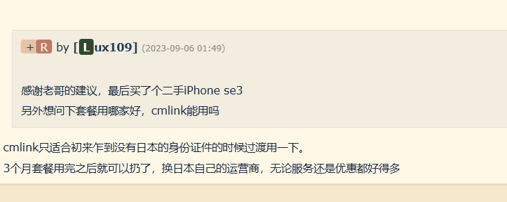
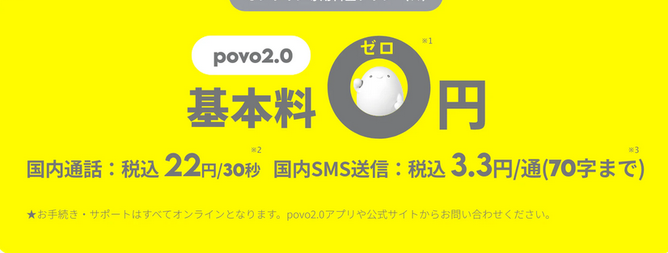

# 电话卡

## cmlink

cmlink 中国移动和日本合作办的.

## povo 电话卡

[povo官网](https://povo.jp/support/guide/sim/)

政策: 

0月租，无流量无电话，需买流量包，流量用完后128kb/s. 需每三个月买一次流量包否则就会被销号。

※1：【共通】
- 180日間以上有料トッピングの購入等がない場合、利用停止、契約解除となることがあります。
- 0円0GB時は、送受信最大128kbpsとなります。
- 同一名義で5回線（過去1年以内に、解約済、当社によりキャンセルした回線も含む）ご契約の場合、累計6回線目以降、3,850円／回線の契約事務手数料がかかります。

【データ専用の場合】
- 契約時に初回トッピング購入が必要です。

【通話＋データの場合】
- 国内通話：税込22円/30秒　衛星電話への通話など、一部通話料が異なる場合があります。詳細は[こちら](#)。また、他社が料金設定している電話番号へは指定の通話料がかかります。
- 国内SMS送信：税込3.3円/通(70字まで)　受信：無料　機種により最大全角670文字まで送信可能です。ただし、134文字までは2通分、それ以降は67文字ごとに1通分の送信料がかかります。

※2：衛星電話への通話など、一部通話料が異なる場合があります。詳細は[こちら](#)。また、他社が料金設定している電話番号へは指定の通話料がかかります。

※3：受信：無料。機種により最大全角670文字まで送信可能です。ただし、134文字までは2通分、それ以降は67文字ごとに1通分の送信料がかかります。

※auで利用していたキャリアメールを引き続きご利用いただくには、povo2.0に移行完了後、別途お申し込みが必要です。