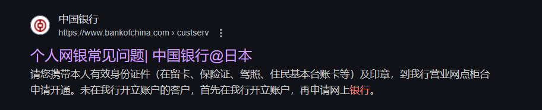

# 银行卡

## csc奖学金卡

在711便利店的atm可以免手续费。

## JCB银行卡

## 补办

### 线下办理

1.营业机构

①中国银行东京分行

〒107－0052　东京都港区赤坂3-4-1　中国银行大楼

TEL　03-3505-8818　 FAX　03-3505-8868

②中国银行大阪分行

〒550-0014 大阪市西区北堀江1-1-35 中国银行大楼

TEL　06-6539-3666　  FAX　06-6538-1177

③中国银行横滨分行

〒231－0023 横滨市中区大通5番地2 URBAN NET 横滨BUILDING 1层

TEL　045-663-2288　  FAX　045-663-8688

④中国银行名古屋分行

〒540－6117 名古屋市中区丸之内3-23-20樱通MID BUILDING1层

TEL　052-957-2388　  FAX　052-957-2366

⑤中国银行大手町分理处

〒100－0004 东京都千代田区大手町2丁目2番1号新大手BUILDING一层

TEL 03-3277-0288　　  FAX 03-3277-0289

2.营业时间： 星期一至星期五 9:00～15:00 （节假日除外）

### 线上补办csc银行卡

 搜索微信号，添加“中国银行公派留学卡挂失视频专用”

 添加好友成功，说明情况后按要求进行以下操作：手机银行搜索“卡片管理”➡️“预约换卡”并输入收卡地址，操作完成后发送截图，并提供银行卡号、收卡地址、邮编、电话

 国内制卡成功并寄出

 德国收卡，微信告知银行

### 希望你不会看到这个
[日本同时丢失所有证件攻略 - 住在栗子星球上 | 小红书 - 你的生活指南](https://www.xiaohongshu.com/discovery/item/679cacc30000000018010135)